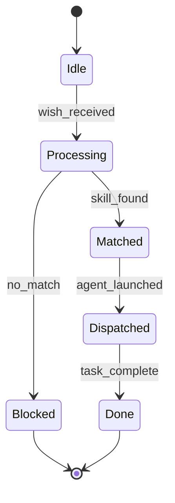

## Wish Entry

| wish_id | name | category | swarm | skill_pack_hint | confidence |
|---------|------|----------|-------|-----------------|------------|
| my-code-review | Code Review | quality | coder | coder+security | 0.90 |
| my-blog-post | Blog Post Writing | docs | writer | writer | 0.85 |
| my-docker-setup | Docker Setup | devops | coder | coder+devops | 0.88 |
