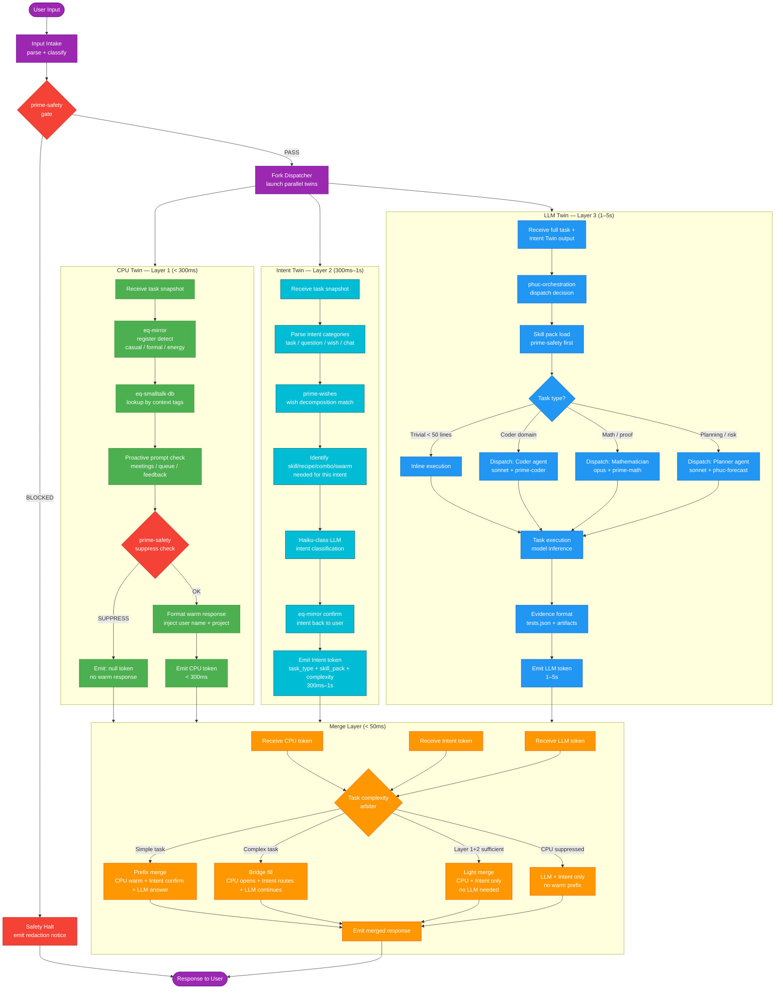

# CLI Triple-Twin Architecture

**Purpose:** Shows the full triple-twin CLI architecture where user input is forked into three parallel paths — a CPU Twin (Layer 1) for sub-300ms warm responses, an Intent Twin (Layer 2) for wish-matching and classification within 300ms-1s, and an LLM Twin (Layer 3) for full substantive execution — merged by a rule-based Merge Layer with prime-safety override authority.
**Inputs:** Raw user input text, session context, relationship level, task complexity classification, wish backlog
**Outputs:** Merged CLI response compositing warm acknowledgment (CPU Twin), intent confirmation (Intent Twin), and substantive answer (LLM Twin)
**Latency:** CPU Twin < 300ms; Intent Twin 300ms-1s; LLM Twin 1–5s; Merge Layer < 50ms; User-perceived < 500ms for simple tasks

---

## Notes

- The three twins execute in **true parallel** after the fork dispatcher fires. No twin blocks any other.
- `prime-safety` has two interception points: (1) at the global SAFETY_GATE before any fork, and (2) inside the CPU Twin at the suppress check. The global gate halts all three twins; the inner check suppresses only the warm response without stopping the Intent or LLM Twin.
- **Layer 2 (Intent Twin) is the key new layer** that separates the triple-twin from the double-twin. It handles intent classification and wish decomposition before the full LLM execution is needed, using a lightweight haiku-class model call. For simple conversational tasks, the response from Layer 1 + Layer 2 is sufficient — Layer 3 is not invoked.
- The Merge Layer uses a rule-based arbiter — no LLM inference occurs here. Rules are: task complexity score (from INTAKE classifier), whether CPU token is null, whether Intent Twin identified the task as fully handled by Layer 1+2, and whether the CPU warm text is redundant with the LLM answer opening.
- **Bridge fill mode**: the CPU Twin emits a partial opening sentence and the LLM Twin fills in the rest, giving the user a visible start within 300ms even for long tasks. The Intent Twin's confirmation is composited in between.
- **Light merge mode** (new in triple-twin): when the Intent Twin classifies the task as a simple wish match or recipe replay, the Merge Layer composes the CPU warm response plus the Intent confirmation only. The LLM Twin's output is either not awaited or used only as a background artifact.
- Evidence bundles (tests.json, artifacts) are only emitted by the LLM Twin path; CPU Twin and Intent Twin output are never treated as Lane A evidence.
- The Intent Twin's `task_type + skill_pack_needed + complexity_estimate` output is forwarded to the LLM Twin, allowing the LLM Twin to skip the full classification step and load the skill pack directly — reducing LLM Twin latency by approximately 100ms on the hot path.
