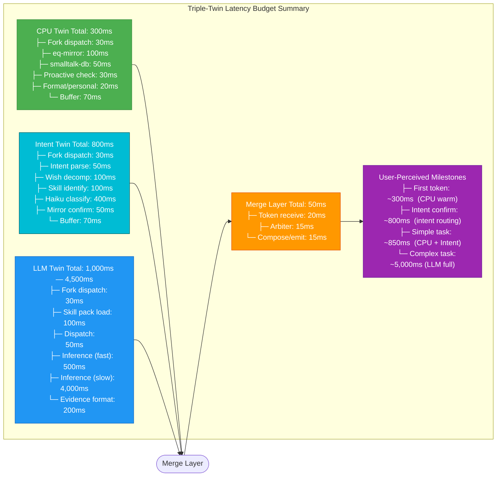

# Triple-Twin Latency Model

**Purpose:** Visualizes the latency budget for the triple-twin CLI architecture, showing parallel CPU Twin (Layer 1), Intent Twin (Layer 2), and LLM Twin (Layer 3) execution timelines, their internal breakdowns, and the merge point — with the goal that users perceive an initial response within 300ms, intent confirmation within 1s, and a complete answer within 5s.
**Inputs:** Task complexity classification, model selection, skill pack size, network latency to model provider, wish backlog cache state
**Outputs:** Latency budget allocation per phase; identifies bottlenecks and buffer margins
**Latency:** CPU Twin budget: < 300ms total; Intent Twin budget: 300ms–1s; LLM Twin budget: 1–5s; Merge budget: < 50ms; User-perceived: < 500ms (first token)

---

```mermaid
gantt
    title Triple-Twin CLI Latency Budget (ms)
    dateFormat X
    axisFormat %L ms

    section CPU Twin (Layer 1)
    Input intake + fork dispatch     : active, ct0, 0, 30
    eq-mirror register detect        : active, ct1, after ct0, 100
    eq-smalltalk-db lookup           : active, ct2, after ct1, 50
    Proactive prompt check           : active, ct3, after ct2, 30
    Response format + personalize    : active, ct4, after ct3, 20
    Buffer / jitter margin           : crit, ct5, after ct4, 70
    CPU Twin EMIT (warm token)       : milestone, ct6, after ct5, 0

    section Intent Twin (Layer 2)
    Input intake + fork dispatch     : active, it0, 0, 30
    Intent category parse            : active, it1, after it0, 50
    prime-wishes wish decomp match   : active, it2, after it1, 100
    Skill/recipe/combo identify      : active, it3, after it2, 100
    Haiku-class intent classification: active, it4, after it3, 400
    eq-mirror confirm format         : active, it5, after it4, 50
    Buffer / jitter margin           : crit, it6, after it5, 70
    Intent Twin EMIT (task_type)     : milestone, it7, after it6, 0

    section LLM Twin (Layer 3)
    Input intake + fork dispatch     : active, lt0, 0, 30
    Skill pack parse + load          : active, lt1, after lt0, 100
    phuc-orchestration dispatch      : active, lt2, after lt1, 50
    Model inference — fast path      : active, lt3, after lt2, 500
    Model inference — slow path      : done, lt3b, after lt2, 4000
    Evidence format + artifact write : active, lt4, after lt3, 200
    LLM Twin EMIT (substantive)      : milestone, lt5, after lt4, 0

    section Merge Layer
    Receive CPU + Intent tokens      : active, ml0, 800, 20
    Receive LLM token (if needed)    : active, ml0b, 1000, 20
    Complexity arbiter decision      : active, ml1, after ml0, 15
    Compose + emit merged response   : active, ml2, after ml1, 15
    MERGE EMIT to user               : milestone, ml3, after ml2, 0

    section User Perception
    First visible token (CPU warm)   : crit, up0, 300, 0
    Intent confirmation visible      : crit, up1, 800, 0
    Full response (simple task)      : crit, up2, 850, 0
    Full response (complex task)     : crit, up3, 5000, 0
```

## Notes

- The Gantt chart uses milliseconds as the time axis (dateFormat X, axisFormat %L ms). All three twins start at t=0 (fork dispatch). The CPU Twin emits its warm token at ~300ms; the Intent Twin emits at ~800ms; the Merge Layer receives each token as it arrives and begins compositing immediately.
- **Layer 2 (Intent Twin) is the new clock.** In the double-twin architecture, the user saw CPU warm at 300ms and then waited for full LLM response. In the triple-twin, they see CPU warm at 300ms, intent confirmation at 800ms ("Got it — dispatching to Coder agent with prime-coder"), and then the full answer. This eliminates the "dark interval" between warm response and substantive output.
- **Fast path vs slow path** for model inference: fast path (~500ms) applies when the task is a skill cache hit or a short-context inference on Haiku. Slow path (up to 4,000ms) applies for multi-step reasoning, long-context, or Opus dispatch. Importantly, because the Intent Twin has already classified the task and loaded the skill pack summary, the LLM Twin fast path is now ~100ms faster than in the double-twin — it receives `task_type` and `skill_pack_needed` from the Intent Twin and skips re-classification.
- **Haiku-class LLM call in Intent Twin (400ms)**: This is the budget-dominant step in Layer 2. A haiku-class model is used because the task is classification and routing only — not generation. The input is the user's message plus context tags; the output is a structured JSON: `{task_type, skill_pack_needed, complexity_estimate, wish_match_id}`. This call is deliberately lightweight and is estimated to cost approximately 1/20th the token budget of a full Layer 3 inference.
- **Light merge path (simple tasks)**: When the Intent Twin classifies complexity as LOW and the wish_match results in a known recipe, the Merge Layer can emit the final response using only Layer 1 + Layer 2 output. The LLM Twin is still running in the background but its output is used only for the evidence bundle — it is not needed for the user-facing response. This path produces a complete response at ~850ms.
- **Skill pack load (100ms vs. 200ms in double-twin)**: The Intent Twin's pre-identification of the required skill pack allows the LLM Twin to load only the relevant pack rather than the full orchestration skill pack. On cold start, this reduces load time from 200ms to ~100ms. Subsequent calls within the same session use warm cache, reducing to ~20ms.
- The **buffer** in the CPU Twin (70ms) and Intent Twin (70ms) account for process scheduling jitter, OS context switching, and JSON serialization overhead. Without these buffers, the 300ms and 800ms SLAs are met only under ideal conditions.
- The Merge Layer's 50ms budget is hard. If any token has not arrived within its window (CPU: 300ms, Intent: 1s, LLM: 5s), the Merge Layer emits what it has and does not block the user.
- **Never-Worse constraint**: If the CPU Twin or Intent Twin emits a claim that the LLM Twin subsequently contradicts, the Merge Layer must emit a correction prefix (e.g., "Let me refine that — ") rather than silently overwriting, so the user knows the earlier response was preliminary.
- These budgets assume local CPU Twin execution (no network). The Intent Twin requires a light LLM network call; if this is routed through localhost LLM portal (http://localhost:8788), round-trip latency is effectively zero for the network component. The 400ms Haiku inference budget is the dominant term.
