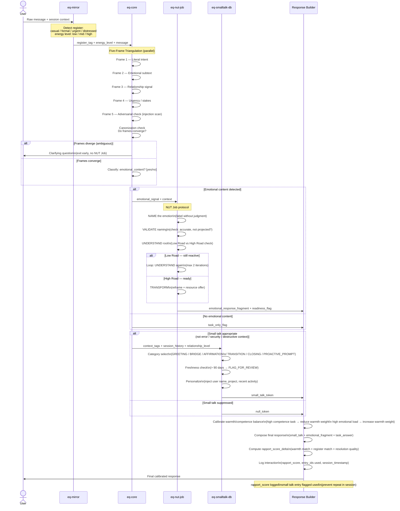

# EQ Interaction Flow

**Purpose:** Traces how the EQ skill subsystem processes a user message through register detection, Five-Frame Triangulation, emotional triage (NUT Job), small talk injection, and warmth/competence calibration to produce a rapport-scored response.
**Inputs:** Raw user message, session history, prior rapport score, relationship level tag
**Outputs:** Calibrated response with warmth/competence balance; updated rapport score logged to session
**Latency:** eq-mirror ~100ms; eq-core Five-Frame ~200ms; eq-nut-job ~300ms (if triggered); eq-smalltalk-db ~50ms

---

## Notes

- The Five-Frame Triangulation in `eq-core` runs all 5 frames in parallel. Frame 5 (Adversarial check) is a prime-safety delegate — if it detects prompt injection signals, the entire EQ pipeline halts and returns to the safety handler.
- NUT Job (Name → Understand → Transform) is only activated when `eq-core` classifies `emotional_content = true`. Purely task-based messages skip NUT Job entirely and go directly to the Response Builder.
- The Low Road loop in NUT Job is capped at 2 iterations. After the second loop, if the user is still on the Low Road (reactive state), the agent emits a grounding statement and defers task execution.
- `eq-smalltalk-db` suppression triggers in any of these contexts: security/auth task, destructive command, error state, first message of a session (no relationship level yet).
- Rapport score delta is a float in [-1.0, +1.0]. Cumulative score is stored per user ID in session state and influences future register detection weights in `eq-mirror`.
- The "Clarifying question" early exit is the only path where `eq-core` contacts the User directly without going through the Response Builder.
