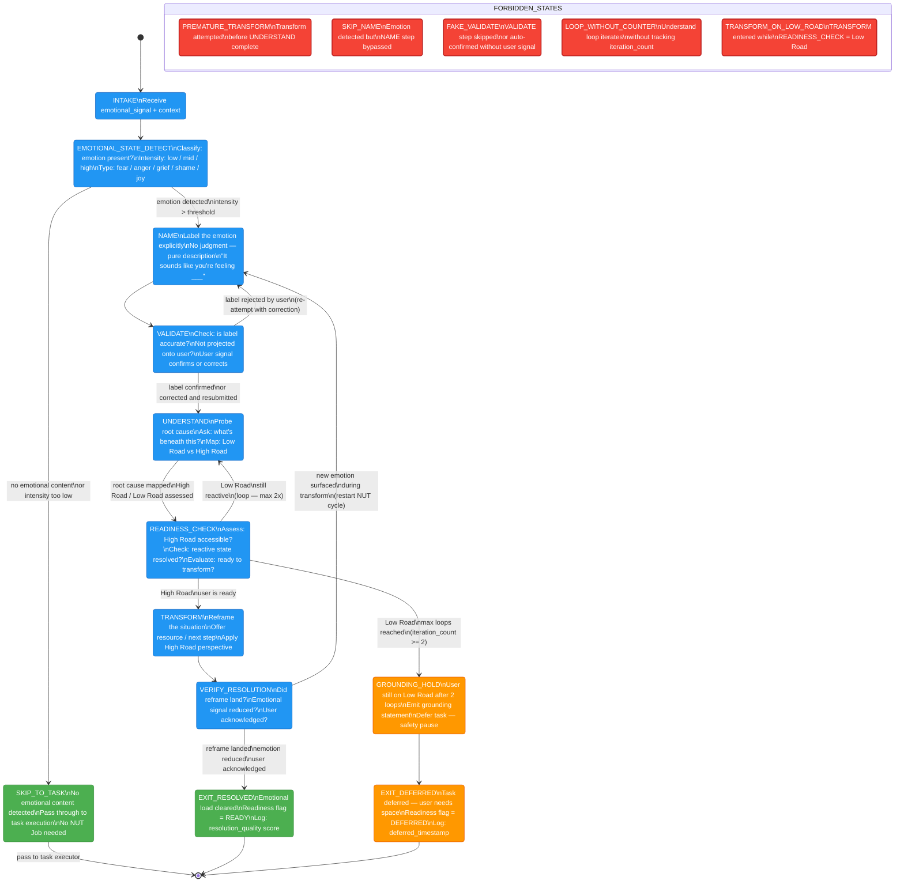

# EQ NUT Job FSM

**Purpose:** Detailed state machine for the NUT Job (Name → Understand → Transform) emotional processing protocol, showing all legal transitions, loop-back conditions, resolution paths, and forbidden states that must never be entered.
**Inputs:** emotional_signal from eq-core, session context, relationship level, prior rapport score
**Outputs:** emotional_response_fragment + readiness_flag (READY / DEFERRED); updated emotional state log
**Latency:** Full happy path (NAME → UNDERSTAND → TRANSFORM → EXIT_RESOLVED): ~300ms; loop iterations add ~150ms each

---

## Notes

- **Forbidden states are hard constraints** — any code path that reaches a forbidden state must immediately halt and emit a protocol violation log entry. These are not merely discouraged; they represent integrity failures.
- **PREMATURE_TRANSFORM**: The most common violation. Must never transform until UNDERSTAND has completed at least one full root-cause mapping.
- **SKIP_NAME**: Skipping the naming step leaves the emotion unlabeled, which makes VALIDATE and UNDERSTAND semantically undefined. The NUT Job without NAME is not NUT Job — it is projection.
- **FAKE_VALIDATE**: Auto-confirming the label without a user signal (e.g., "I'll assume I'm right") corrupts the entire downstream chain. VALIDATE requires at least one response token from the user path confirming or correcting the label.
- **LOOP_WITHOUT_COUNTER**: The UNDERSTAND → READINESS_CHECK → UNDERSTAND loop is bounded at 2 iterations. Without a counter, the FSM can spin indefinitely. The iteration_count field is mandatory state.
- **TRANSFORM_ON_LOW_ROAD**: Attempting to transform a user who is still in reactive (Low Road) state typically backfires — the reframe is rejected or causes escalation. The READINESS_CHECK gate exists precisely to prevent this.
- The "new emotion surfaced" transition from VERIFY_RESOLUTION back to NAME resets the NUT cycle with a fresh emotional signal. The iteration counter is also reset, since this is a genuinely new emotion.
- EXIT_DEFERRED does not mean the task is dropped. The task execution is queued and resumes after the user signals readiness (or at next session open).
