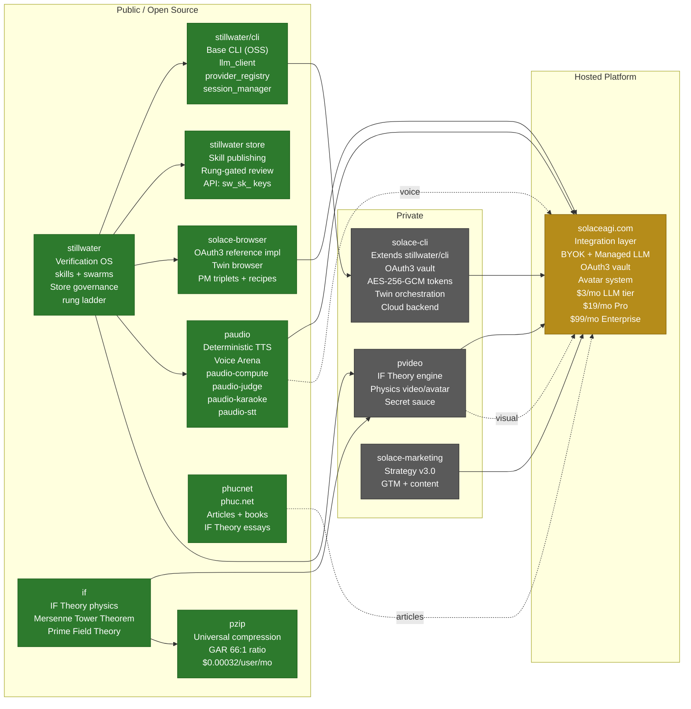
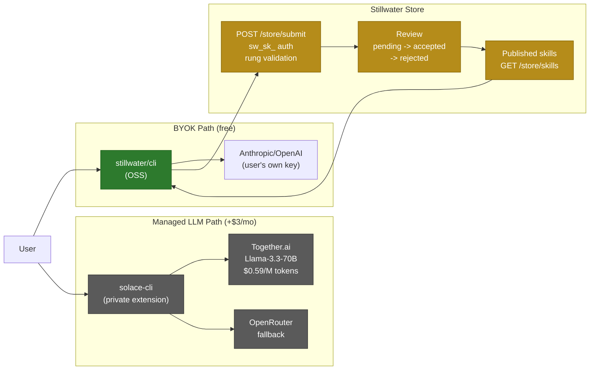

# 9-Project Ecosystem

The Phuc Ecosystem consists of 9 interdependent projects converging on
`solaceagi.com`. Stillwater is the central verification OS that all other
projects depend on for skill governance and evidence discipline.

### Data Flow Detail

## Source Files

- `/home/phuc/projects/stillwater/CLAUDE.md` — 9-project architecture description
- `/home/phuc/.claude/CLAUDE.md` — ecosystem hub memory, pricing tiers, project locations
- `store/auth.py` — `sw_sk_` key format, HMAC validation
- `admin/llm_portal.py` — LLM provider routing documentation
- `cli/src/stillwater/provider_registry.py` — Together.ai, OpenRouter, Anthropic, OpenAI providers

## Coverage

- All 9 projects in the ecosystem with OSS/private color coding
- Data flow from stillwater CLI through managed LLM providers
- Avatar system convergence: paudio (voice) + pvideo (visual) at solaceagi.com
- Stillwater Store submission and review lifecycle
- Pricing tiers: BYOK (free) vs managed LLM (+$3/mo) vs Pro ($19/mo)
- IF Theory as physics substrate flowing into pvideo and pzip
