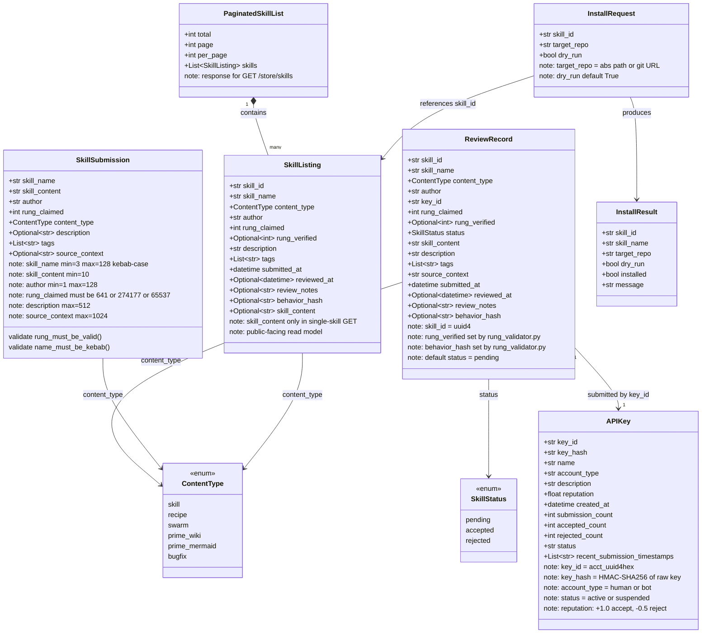
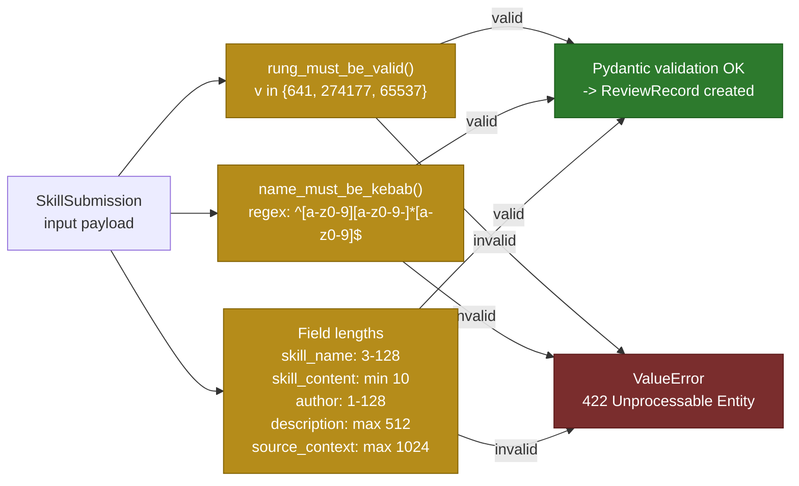

# Store Data Model

Pydantic models for the Stillwater Store API. All field names, types, and
constraints are taken directly from `store/models.py`.

## Validator Constraints

## Source Files

- `store/models.py` — all Pydantic model definitions (lines 1-197)

## Coverage

- All 8 Pydantic models: `APIKey`, `SkillSubmission`, `ReviewRecord`, `SkillListing`, `InstallRequest`, `InstallResult`, `PaginatedSkillList`, plus both enums
- All field names, types, and doc-comment constraints taken from actual source
- Relationships: `ReviewRecord` references `APIKey.key_id`; `PaginatedSkillList` aggregates `SkillListing`
- Validators: `rung_must_be_valid` (set `{641, 274177, 65537}`), `name_must_be_kebab` (regex)
- Field-length constraints from `Field(min_length=..., max_length=...)`
