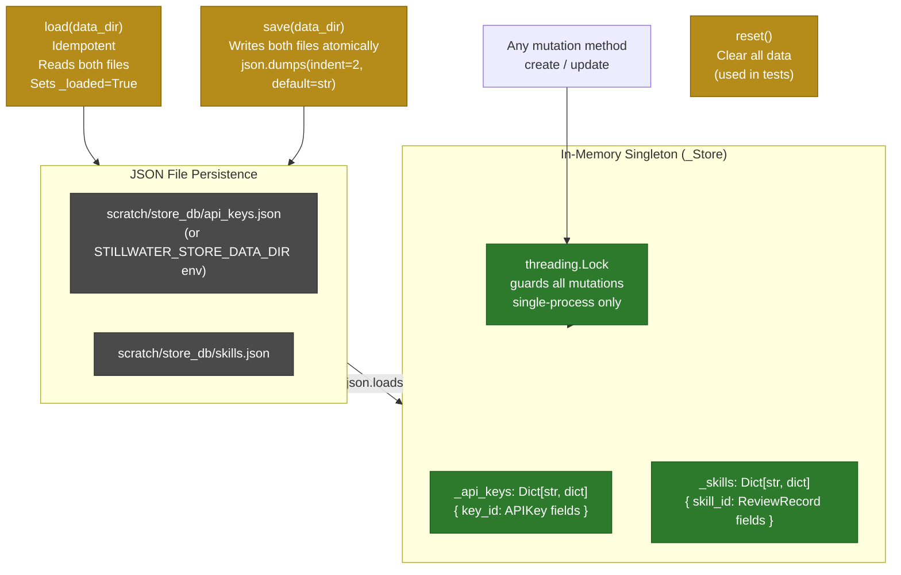
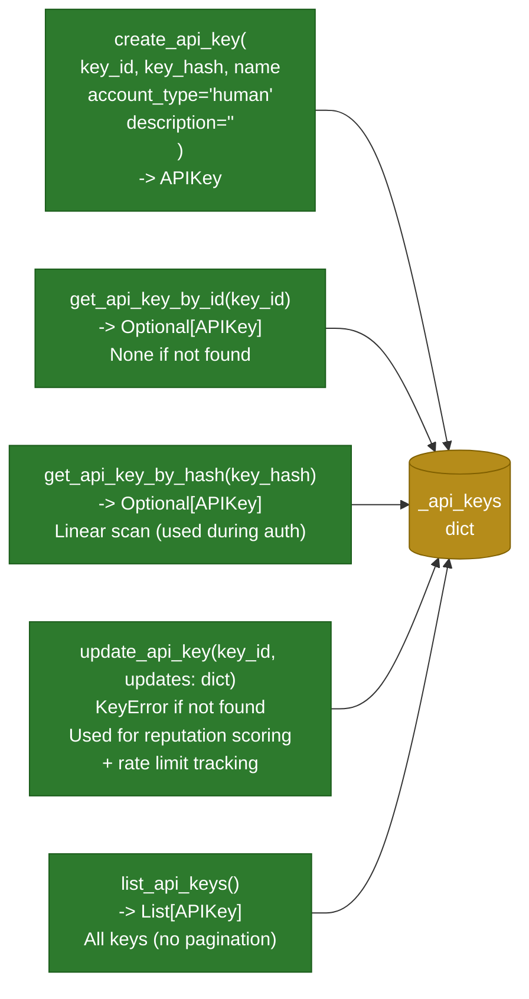
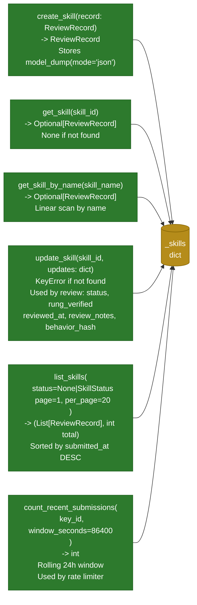
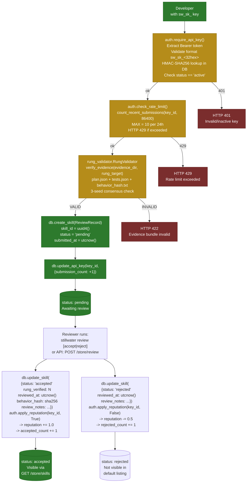

# Store CRUD Operations

CRUD and lifecycle flows for the Stillwater Store, based on `store/db.py`.
The store is a thread-safe in-memory singleton backed by JSON files.

## Persistence Architecture

## API Key CRUD

## Skill / Submission CRUD

## Submission Lifecycle

## Source Files

- `store/db.py` — `_Store` class, all CRUD methods, `load()`, `save()`, `reset()`
- `store/models.py` — `ReviewRecord`, `APIKey`, `SkillStatus`
- `store/auth.py` — `require_api_key()`, `check_rate_limit()`, `apply_reputation()`
- `store/rung_validator.py` — `RungValidator.verify_evidence()`

## Coverage

- In-memory singleton architecture with `threading.Lock` guard
- JSON file persistence paths and environment variable override
- All API key CRUD methods with signatures and return types
- All skill/submission CRUD methods including pagination and rolling-window count
- Full submission lifecycle: auth -> rate limit -> rung validation -> create -> review -> accept/reject
- Reputation delta values: +1.0 accept, -0.5 reject (from `auth.py`)
