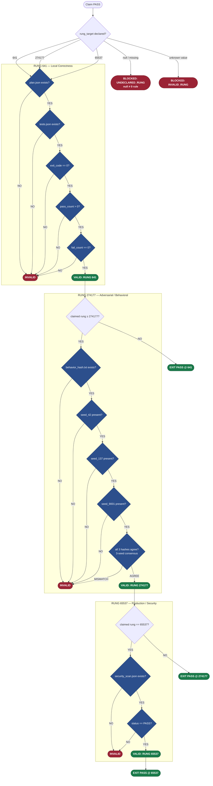
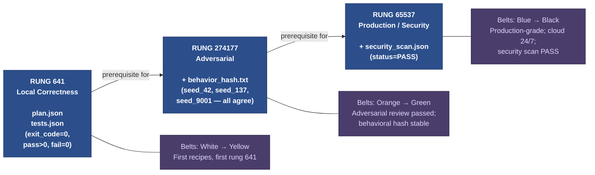
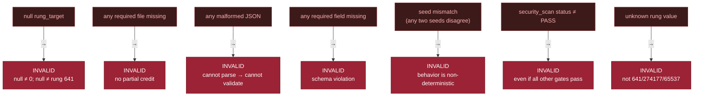

# Diagram 07 — Verification Ladder

The 3-tier rung system that gates all PASS claims in Stillwater. Every skill submission,
evidence bundle, and orchestration output is validated against exactly one rung. Rungs
are cumulative: each higher rung requires all evidence from the rungs below it.

Rung values are prime numbers chosen for uniqueness — they cannot arise accidentally
from arithmetic, preventing silent coercion bugs.

---

---

## Belt Mapping

---

## Fail-Closed Rules

---

## Source Files

- `/home/phuc/projects/stillwater/store/rung_validator.py` — `RungValidator` class, gate logic, `VALID_RUNGS`, `REQUIRED_EVIDENCE_FILES`, `verify_evidence()`, `verify_rung()`, `validate_bundle()`
- `/home/phuc/projects/stillwater/skills/phuc-orchestration.md` — §7 Verification Ladder (orchestration rungs)
- `/home/phuc/projects/stillwater/skills/prime-qa.md` — §G Verification Ladder (QA rungs)
- `/home/phuc/projects/stillwater/CLAUDE.md` — condensed rung defaults

## Coverage

- Full 3-tier rung ladder: 641, 274177, 65537
- Evidence required at each rung (plan.json, tests.json, behavior_hash.txt, security_scan.json)
- All fail-closed rules from `rung_validator.py` docstring
- Belt progression mapped to rung levels
- 3-seed consensus protocol (seed_42, seed_137, seed_9001)
- Null rung guard (null ≠ 0 rule enforced)
- String sentinels "VALID" / "INVALID" (not boolean) to prevent coercion bugs
