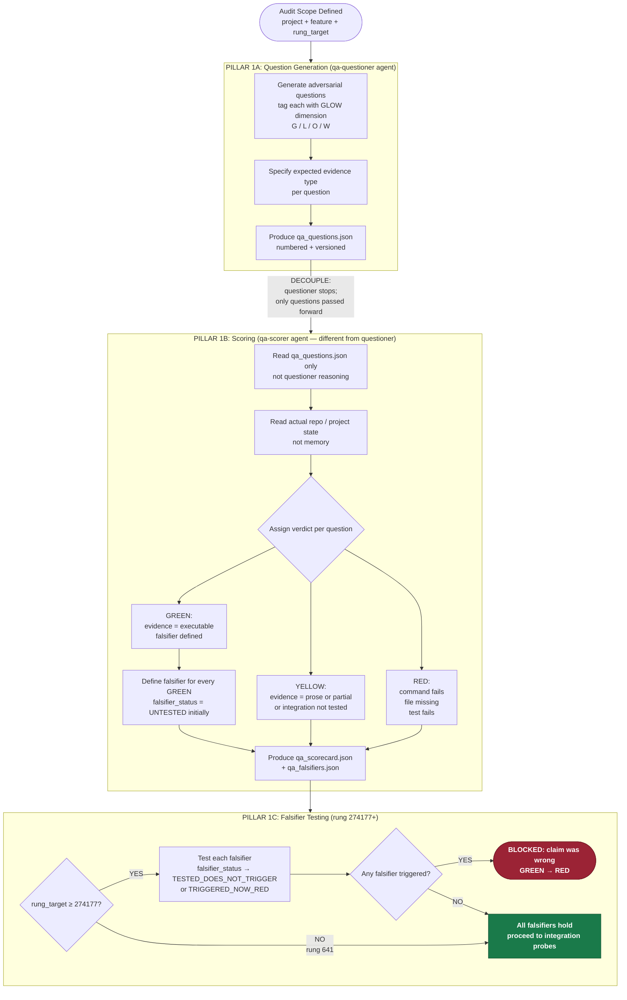
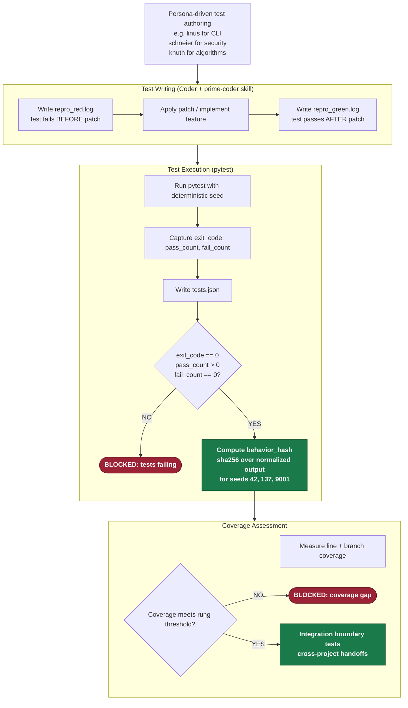
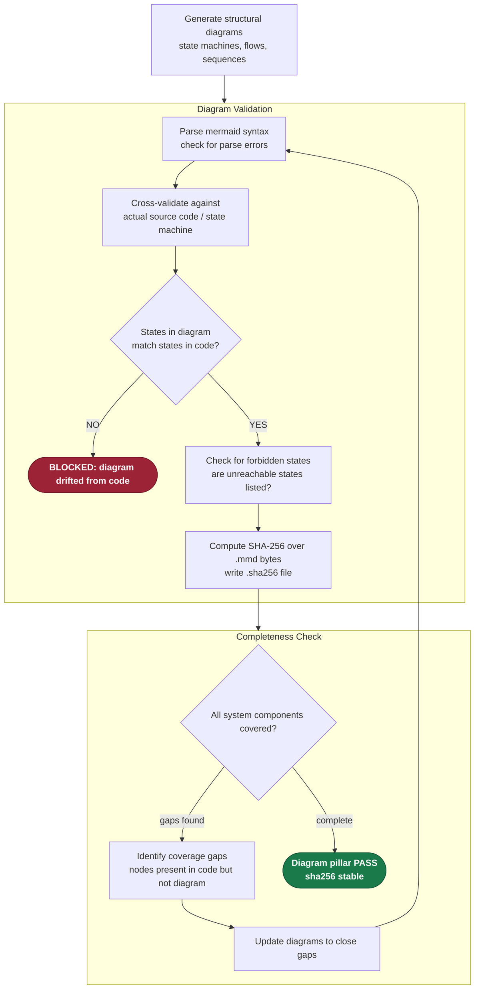
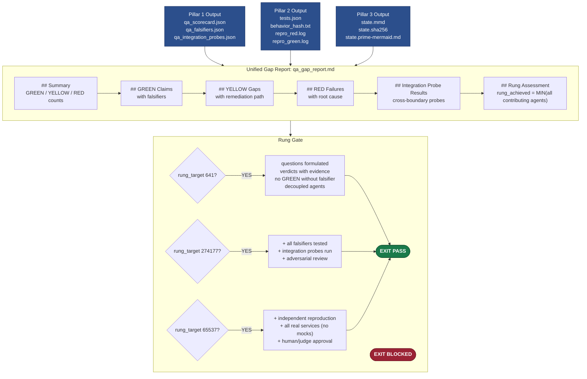

# Diagram 08 — QA Pipeline

The unified QA pipeline across all three pillars: Questions, Unit Tests, and Mermaid Diagrams.
Each pillar audits the system from a different angle. All three converge into a unified gap
report that determines rung achievement.

The decoupled verification principle (CoVe) is central: the agent that generates questions
must differ structurally from the agent that scores them. Self-confirmation bias is the primary
root cause of false GREEN verdicts.

---

## Pillar 1: Question-Based QA (CoVe Protocol)

---

## Pillar 2: Unit Test QA

---

## Pillar 3: Mermaid Diagram QA

---

## Unified Gap Report (All 3 Pillars Converge)

---

## Source Files

- `/home/phuc/projects/stillwater/skills/phuc-qa.md` — full QA skill: state machine, decoupled verification (CoVe), falsifier requirement, integration probes, evidence schema, GLOW taxonomy, ecosystem boundaries
- `/home/phuc/projects/stillwater/skills/prime-coder.md` — red-green gate, evidence bundle requirements
- `/home/phuc/projects/stillwater/skills/prime-mermaid.md` — diagram-as-code standard, canonical format, SHA-256 identity
- `/home/phuc/projects/stillwater/store/rung_validator.py` — rung validation logic

## Coverage

- All 3 QA pillars: Questions, Unit Tests, Mermaid Diagrams
- CoVe decoupling principle: qa-questioner and qa-scorer are structurally separate agents
- GLOW dimension tagging on questions (G/L/O/W)
- GREEN/YELLOW/RED verdict system with default-YELLOW rule
- Falsifier requirement: every GREEN claim must have a defined falsifier
- 3-seed behavior hash protocol (seeds 42, 137, 9001)
- Integration boundary probes (cross-project handoffs)
- Unified gap report structure (all sections enumerated)
- Rung requirements per tier
- Forbidden states: SELF_CONFIRMED_GREEN, MOCK_AS_EVIDENCE, PROSE_AS_PROOF, FALSIFIER_SKIPPED
