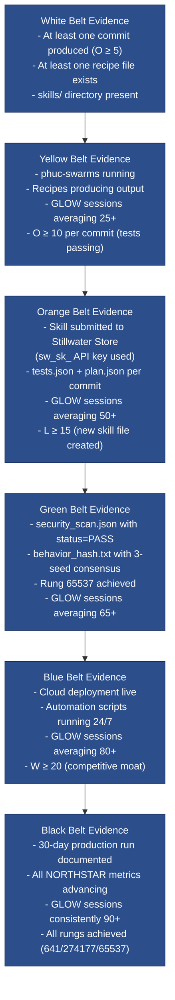
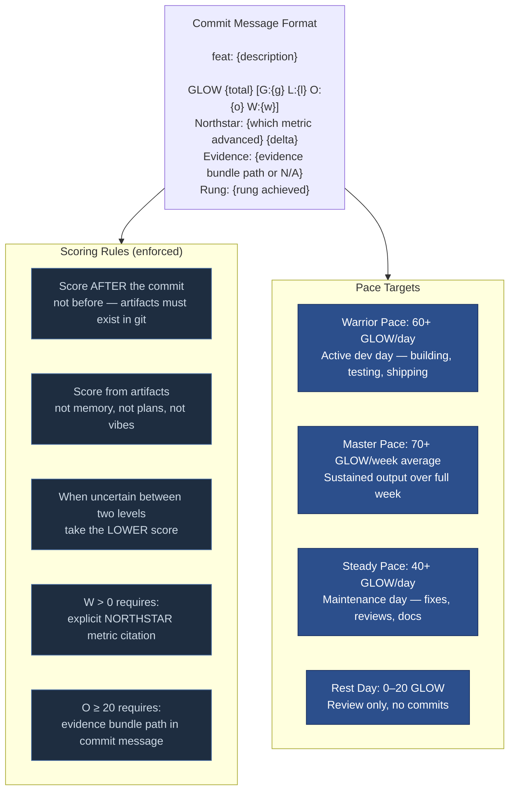
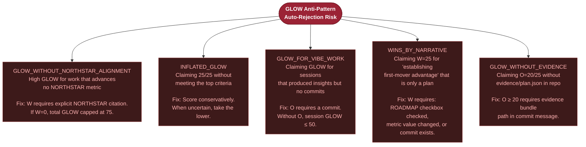

# Diagram 09 — GLOW Scoring System

GLOW is the gamification scoring system for roadmap-based development in Stillwater.
It measures four dimensions of a session or commit: Growth, Learning, Output, Wins.
Each dimension is scored 0–25, for a total of 0–100.

GLOW cannot be inflated: each component has strict criteria grounded in executable
artifacts, not prose or plans. "You cannot fake the kata. The form knows."

---

## GLOW Component Breakdown

```mermaid
flowchart TD
    SESSION([Session / Commit]) --> G_DIM & L_DIM & O_DIM & W_DIM

    subgraph G_DIM["G — Growth (0–25)\nNew capabilities added"]
        G25["25: Major new module/feature\nat rung 274177+ with tests + evidence bundle"]
        G20["20: Complete new feature\nat rung 641 with tests passing"]
        G15["15: Significant enhancement\nto existing feature with tests"]
        G10["10: New utility / helper /\nconfiguration option"]
        G5["5: Minor addition\nnew test, new constant, small method"]
        G0["0: No new capabilities added"]
        G25 --- G20 --- G15 --- G10 --- G5 --- G0
    end

    subgraph L_DIM["L — Learning (0–25)\nNew knowledge captured"]
        L25["25: New skill or paper published\nto Stillwater Store (rung 65537)"]
        L20["20: New skills/*.md or papers/*.md\ncreated and complete"]
        L15["15: Significant update to existing skill\nadds new section, new rules"]
        L10["10: New persona defined or\nrecipe captured in recipes/"]
        L5["5: Case study updated\nwith new lesson or postmortem"]
        L0["0: No new knowledge captured"]
        L25 --- L20 --- L15 --- L10 --- L5 --- L0
    end

    subgraph O_DIM["O — Output (0–25)\nMeasurable deliverables"]
        O25["25: Multiple files committed\nall tests passing\nevidence bundle complete (rung 274177+)"]
        O20["20: Files committed with\ntests.json + plan.json (rung 641)"]
        O15["15: Files committed\nsome tests passing, evidence partial"]
        O10["10: Single file committed\nwith passing tests"]
        O5["5: Commit produced\neven if small"]
        O0["0: No commit produced"]
        O25 --- O20 --- O15 --- O10 --- O5 --- O0
    end

    subgraph W_DIM["W — Wins (0–25)\nStrategic victories"]
        W25["25: First-mover advantage established\nnew integration nobody else has"]
        W20["20: Competitive moat deepened\nOAuth3 enforcement, evidence bundle, audit trail"]
        W15["15: NORTHSTAR metric measurably advanced\nrecipe hit rate +X%, stars +Y, rung upgraded"]
        W10["10: Phase completed in ROADMAP\ncheckbox checked"]
        W5["5: Sub-task completed\nthat unblocks another phase"]
        W0["0: No strategic progress"]
        W25 --- W20 --- W15 --- W10 --- W5 --- W0
    end

    G_DIM --> TOTAL
    L_DIM --> TOTAL
    O_DIM --> TOTAL
    W_DIM --> TOTAL

    TOTAL["GLOW Total = G + L + O + W\nRange: 0 – 100\nNo rounding up. No partial credit."]

    classDef dimNode fill:#2c4f8c,color:#fff,stroke:#1a3060,font-weight:bold
    classDef totalNode fill:#4a3d6b,color:#e0d4ff,stroke:#2e2345,font-weight:bold
    class G_DIM,L_DIM,O_DIM,W_DIM dimNode
    class TOTAL totalNode
```

---

## Belt Progression Map

```mermaid
stateDiagram-v2
    direction LR

    [*] --> White

    White : White Belt\nGLOW 0–20\nFirst recipes, first rung 641\nSessions averaging any GLOW
    Yellow : Yellow Belt\nGLOW 21–40\nFirst tasks delegated via phuc-swarms\nRecipes producing\nSessions averaging 25+ GLOW
    Orange : Orange Belt\nGLOW 41–60\nSkills published to Stillwater Store\nCommunity impact\nSessions averaging 50+ GLOW
    Green : Green Belt\nGLOW 61–80\nRung 65537 achieved\nProduction-grade verifiable work\nSessions averaging 65+ GLOW
    Blue : Blue Belt\nGLOW 81–90\nCloud execution 24/7\nAutomation running continuously\nSessions averaging 80+ GLOW
    Black : Black Belt\nGLOW 91–100\nModels = commodities\nSkills = capital. OAuth3 = law.\nSessions consistently at 90+

    White --> Yellow : total GLOW ≥ 21
    Yellow --> Orange : total GLOW ≥ 41\n+ first Store submission
    Orange --> Green : total GLOW ≥ 61\n+ rung 65537 achieved
    Green --> Blue : total GLOW ≥ 81\n+ 24/7 cloud execution
    Blue --> Black : total GLOW ≥ 91\n+ 30-day production run
```

---

## Evidence Requirements per Belt Level

---

## Commit Format Integration

---

## GLOW Anti-Patterns (Auto-Fail)

---

## Source Files

- `/home/phuc/projects/stillwater/skills/glow-score.md` — full GLOW specification: all component criteria, belt integration, session tracking, commit format, anti-patterns
- `/home/phuc/projects/stillwater/STORE.md` — GLOW score metadata for Store submissions, glow_score.json schema
- `/home/phuc/projects/stillwater/skills/prime-qa.md` — GLOW taxonomy applied to QA questions (G/L/O/W question types)

## Coverage

- All 4 GLOW dimensions (G, L, O, W) with all scoring tiers (0, 5, 10, 15, 20, 25)
- Belt progression: White through Black with threshold conditions and advancement criteria
- Evidence requirements per belt level
- Commit message format with GLOW breakdown
- Pace targets: warrior (60+), master (70+/week), steady (40+), rest (0–20)
- All 5 GLOW anti-patterns with fixes
- NORTHSTAR alignment rule (W > 0 requires metric citation)
- Conservative scoring rule ("when uncertain, take the lower")
- Artifact-grounded scoring (score after commit, not before)
