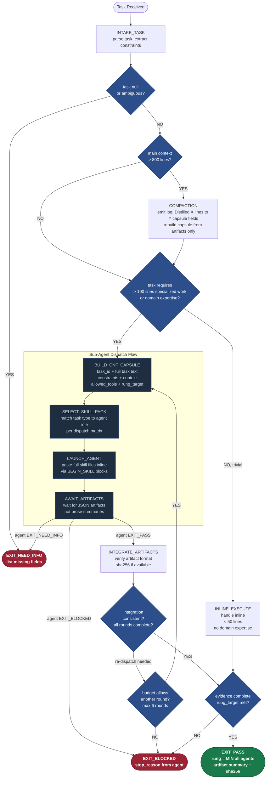

# Diagram 10 — Swarm Dispatch System

The phuc-orchestration dispatch system governs how the main session delegates work
to typed sub-agents. The main session stays lean (prime-safety + prime-coder +
phuc-orchestration). Sub-agents receive exactly the skills they need, pasted inline,
with a complete CNF capsule — never "as before" or "recall that".

The rung of the integrated output equals MIN(rung of all contributing sub-agents).
This is non-negotiable.

---

## Main Session State Machine

---

## Dispatch Matrix

```mermaid
flowchart TD
    TASK([Task Type]) --> DM

    subgraph DM["Dispatch Decision Matrix"]
        direction TB
        DM1["Bugfix / feature / refactor\n→ Coder Agent\nSkills: prime-safety + prime-coder\nModel: haiku (volume) | sonnet (complex) | opus (gate)\nRung default: 641\nArtifacts: PATCH_DIFF, tests.json, repro_red/green.log, plan.json"]
        DM2["Planning / premortem / risk\n→ Planner Agent\nSkills: prime-safety + phuc-forecast\nModel: sonnet\nRung default: 641\nArtifacts: FORECAST_MEMO.json, DECISION_RECORD.json"]
        DM3["Mathematical proof / exact computation\n→ Mathematician Agent\nSkills: prime-safety + prime-math\nModel: sonnet | opus (olympiad/proof)\nRung default: 274177\nArtifacts: PROOF.md, convergence.json, halting_certificate"]
        DM4["State machine / workflow graph\n→ Graph Designer Agent\nSkills: prime-safety + prime-mermaid\nModel: haiku | sonnet\nRung default: 641\nArtifacts: state.prime-mermaid.md, state.mmd, state.sha256"]
        DM5["Multi-agent swarm design\n→ Swarm Orchestrator Agent\nSkills: prime-safety + phuc-swarms + phuc-context\nModel: sonnet | opus\nRung default: 274177\nArtifacts: SWARM_PLAN.json, swarm-activity.log"]
        DM6["Technical paper / long-form\n→ Writer Agent\nSkills: prime-safety + software5.0-paradigm\nModel: sonnet\nRung default: 641\nArtifacts: DRAFT.md with typed claims [A/B/C]"]
        DM7["Adversarial review / verification\n→ Skeptic Agent\nSkills: prime-safety + prime-coder + phuc-forecast\nModel: sonnet | opus\nRung default: 274177\nArtifacts: SKEPTIC_VERDICT.json, falsifiers_list.md"]
        DM8["Workspace cleanup / archival\n→ Janitor Agent\nSkills: prime-safety + phuc-cleanup\nModel: haiku\nRung default: 641\nArtifacts: cleanup-scan.json, cleanup-apply.json"]
        DM9["Wish contract / backlog\n→ Wish Manager Agent\nSkills: prime-safety + prime-wishes + prime-mermaid\nModel: sonnet\nRung default: 641\nArtifacts: wish.{id}.md, state.mmd, belt_promotion_receipt.json"]
        DM10["Persona-enhanced coding\n→ Persona Coder Agent\nSkills: prime-safety + prime-coder + persona-engine\nModel: sonnet\nRung default: 641\nArtifacts: PATCH_DIFF, tests.json, glow_score.json"]
        DM11["Northstar path planning\n→ Northstar Navigator Agent\nSkills: prime-safety + phuc-forecast + northstar-reverse\nModel: sonnet\nRung default: 641\nArtifacts: REVERSE_MAP.json, CRITICAL_PATH.json, FORWARD_PLAN.json"]
        DM12["Context-heavy multi-turn\n→ Context Manager Agent\nSkills: prime-safety + phuc-context\nModel: sonnet\nRung default: 641\nArtifacts: context_capsule.json, compaction_log.txt"]
    end

    classDef dispatchNode fill:#1e2d40,color:#cdd9e5,stroke:#4a6fa5,text-align:left
    class DM1,DM2,DM3,DM4,DM5,DM6,DM7,DM8,DM9,DM10,DM11,DM12 dispatchNode
```

---

## CNF Capsule Injection Flow

```mermaid
flowchart TD
    MAIN_SESSION["Main Session\n(orchestrator)\nprime-safety + prime-coder\n+ phuc-orchestration"]

    MAIN_SESSION --> CNF_BUILD

    subgraph CNF_BUILD["CNF Capsule Construction"]
        CNF1["task_id: UNIQUE_ID"]
        CNF2["task_request: FULL TASK TEXT\n(no 'as discussed', 'as before', 'recall that')"]
        CNF3["northstar_metric_targeted: EXPLICIT"]
        CNF4["constraints: TIME / BUDGET / SCOPE / SAFETY"]
        CNF5["context: FULL CONTEXT\nrepo tree, error logs, failing tests, prior artifacts\n(no summaries — artifacts only)"]
        CNF6["allowed_tools: EXPLICIT ALLOWLIST"]
        CNF7["rung_target: 641 | 274177 | 65537"]
        CNF1 --- CNF2 --- CNF3 --- CNF4 --- CNF5 --- CNF6 --- CNF7
    end

    subgraph SKILL_PACK["Skill Pack (pasted inline)"]
        SP1["BEGIN_SKILL name=prime-safety\n[full content of skills/prime-safety.md]\nEND_SKILL"]
        SP2["BEGIN_SKILL name=domain-skill\n[full content of skills/domain-skill.md]\nEND_SKILL"]
        SP3["NORTHSTAR (project + ecosystem)"]
        SP4["Expected Artifacts (JSON schema)"]
        SP5["Stop Rules\n(EXIT_PASS / EXIT_BLOCKED / EXIT_NEED_INFO conditions)"]
        SP1 --> SP2 --> SP3 --> SP4 --> SP5
    end

    CNF_BUILD --> SUB_AGENT
    SKILL_PACK --> SUB_AGENT

    SUB_AGENT["Sub-Agent\n(domain expert)\nstarts fresh — no shared memory\nproduces artifacts (JSON/diff/log)"]

    SUB_AGENT --> ARTIFACT_RETURN

    subgraph ARTIFACT_RETURN["Artifact Return to Main Session"]
        AR1["JSON artifacts\n(tests.json, PATCH_DIFF, FORECAST_MEMO.json, etc.)"]
        AR2["verdict: PASS | BLOCKED | NEED_INFO"]
        AR3["stop_reason (if BLOCKED)"]
        AR4["rung achieved (min gate for integration)"]
        AR1 --- AR2 --- AR3 --- AR4
    end

    ARTIFACT_RETURN --> MAIN_SESSION

    subgraph RUNG_CALC["Integration Rung Calculation"]
        RC1["rung_integrated = MIN(rung of all sub-agents)"]
        RC2["This is non-negotiable.\nSlowest agent sets the floor."]
        RC1 --- RC2
    end

    ARTIFACT_RETURN --> RUNG_CALC

    classDef mainNode fill:#4a3d6b,color:#e0d4ff,stroke:#2e2345,font-weight:bold
    classDef subNode fill:#2c4f8c,color:#fff,stroke:#1a3060
    classDef rungNode fill:#1a7a4a,color:#fff,stroke:#0f4f2f
    class MAIN_SESSION mainNode
    class SUB_AGENT subNode
    class RUNG_CALC rungNode
```

---

## Forbidden States

```mermaid
flowchart TD
    FS_ROOT(["Forbidden States\n(hard — recovery required)"]) --> FS1 & FS2 & FS3 & FS4 & FS5 & FS6 & FS7 & FS8

    FS1["INLINE_DEEP_WORK\nMain session coding/math/proof > 100 lines\nRecovery: dispatch to appropriate agent"]
    FS2["SKILL_LESS_DISPATCH\nSub-agent launched without full skill content\nRecovery: rebuild prompt with BEGIN_SKILL blocks"]
    FS3["FORGOTTEN_CAPSULE\nSub-agent prompt has 'earlier', 'as before', 'recall that'\nRecovery: rebuild capsule from scratch"]
    FS4["SUMMARY_AS_EVIDENCE\nAgent prose used as Lane A evidence\nRecovery: require artifact (tests.json, PATCH_DIFF)"]
    FS5["CONTEXT_ACCUMULATION\nMain context > 800 lines without COMPACTION log\nRecovery: emit COMPACTION log, rebuild capsule"]
    FS6["UNDECLARED_RUNG\nSub-agent launched without rung_target\nRecovery: add rung_target; default 641 if not promotion"]
    FS7["CROSS_LANE_UPGRADE\nAgent forecast used to claim PASS\nRecovery: require artifact; downgrade to NEED_INFO"]
    FS8["PRIME_SAFETY_MISSING_FROM_PACK\nSkill pack built without prime-safety as first skill\nRecovery: add prime-safety as first BEGIN_SKILL block"]

    classDef fsNode fill:#3d1a1a,color:#ffb3b3,stroke:#7a2020
    classDef rootNode fill:#9b2335,color:#fff,stroke:#6b1520,font-weight:bold
    class FS1,FS2,FS3,FS4,FS5,FS6,FS7,FS8 fsNode
    class FS_ROOT rootNode
```

---

## Source Files

- `/home/phuc/projects/stillwater/skills/phuc-orchestration.md` — full dispatch skill: state machine (§6), dispatch matrix (§2), skill packs (§3), CNF capsule template (§4), anti-rot protocol (§5), verification ladder (§7), forbidden states
- `/home/phuc/projects/stillwater/CLAUDE.md` — condensed orchestration rules loaded into main session

## Coverage

- Main session state machine: all 17 states from INIT to EXIT_PASS/EXIT_BLOCKED/EXIT_NEED_INFO
- Full dispatch matrix: all 12 agent roles with skill packs, models, rung defaults, and artifact types
- CNF capsule: all 7 required fields, no-history-reference rule
- Skill pack injection: BEGIN_SKILL block format, prime-safety-always-first rule
- Artifact return flow and rung integration (MIN rule)
- Compaction trigger (> 800 lines) and log format
- All 8 forbidden states with recovery actions
- Max dispatch rounds (6) as bounded loop
- Inline execute path for trivial tasks (< 50 lines)
