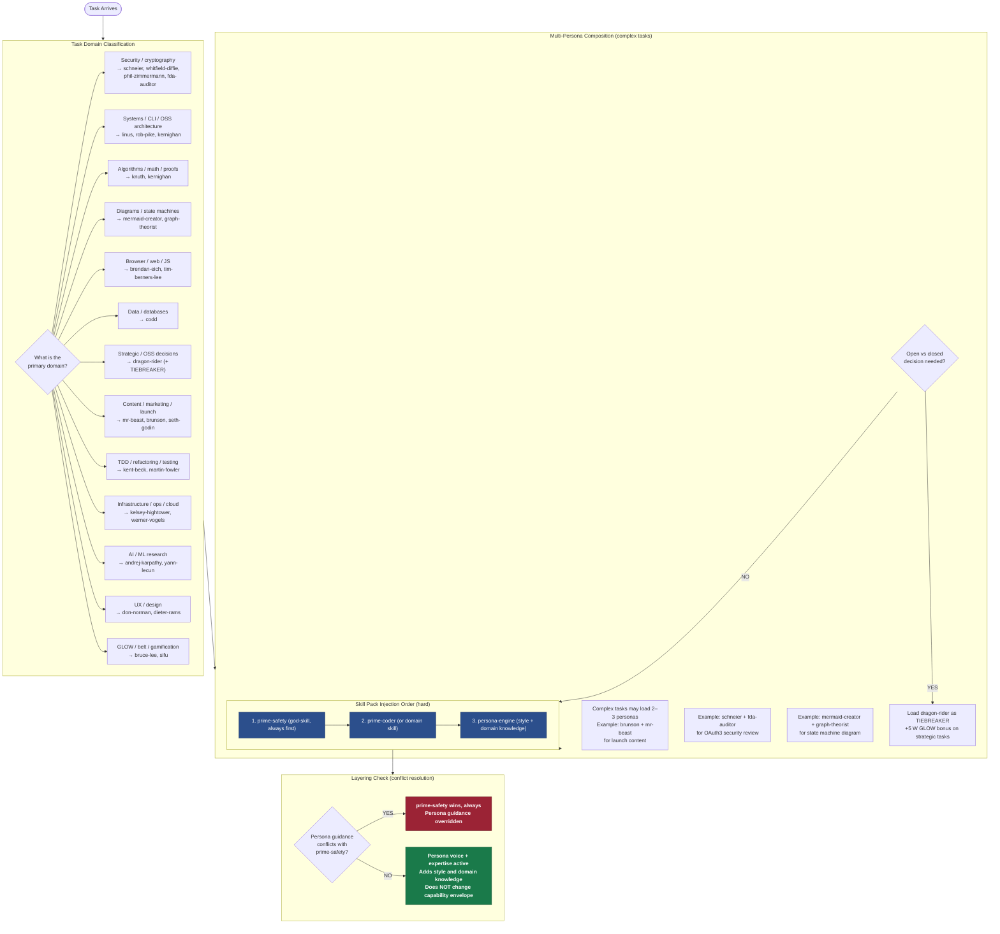
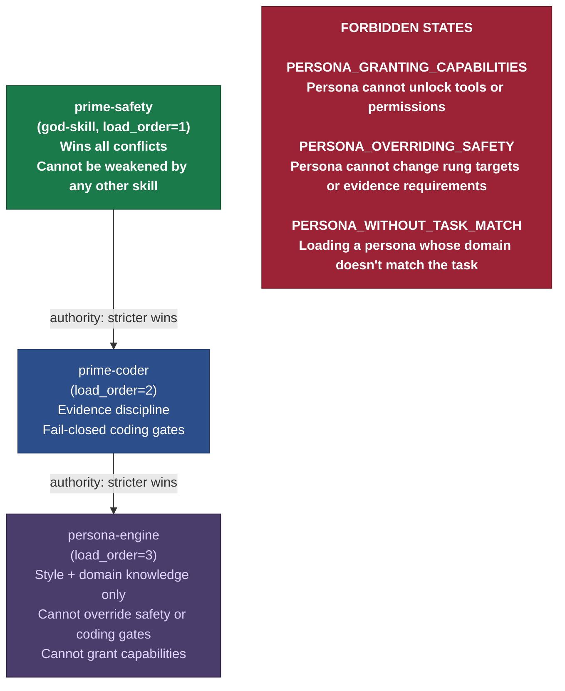

# Diagram 11 — Persona Engine

The persona loading system adds domain expert voice and expertise to agent skill packs
without overriding safety gates. Persona is style and domain knowledge — it is not an
authority grant and cannot change the capability envelope.

Layering rule: prime-safety > prime-coder > persona-engine. The persona is always last.
On any conflict, the stricter skill wins.

---

## Persona Registry (Domain Map)

```mermaid
mindmap
  root((Persona Engine\nv1.4.0))
    Strategic & Founder
      dragon-rider
        FDA Part 11 / clinical trials
        OAuth3 authorship
        OSS vs private tradeoffs
        TIEBREAKER for open/closed decisions
        +5 W GLOW bonus on strategic tasks
      pg
        Startup strategy
        Product-market fit
        Hacker News positioning
      naval-ravikant
        Wealth creation
        Leverage thinking
        Long-term vision
    Systems & Architecture
      linus
        OSS kernel architecture
        Systems programming
        Contributor governance
        stillwater CLI + store
      knuth
        Algorithm correctness
        Exact computation
        Mathematical rigor
        Art of Computer Programming discipline
      rob-pike
        Simplicity and clarity
        Go philosophy
        Tool composition
      kernighan
        Unix philosophy
        Writing clear code
        Small sharp tools
    Security & Cryptography
      schneier
        Security architecture
        Threat modeling
        Adversarial thinking
        Cryptographic protocols
      whitfield-diffie
        Public key cryptography
        Key exchange protocols
      phil-zimmermann
        Privacy engineering
        PGP / encryption ethics
      fda-auditor
        21 CFR Part 11 compliance
        Audit trail integrity
        ALCOA standard
    Diagramming & Visual
      mermaid-creator
        Diagram-as-code
        Mermaid.js syntax
        State machine design
        prime-mermaid tasks
      graph-theorist
        Graph algorithms
        DAGs and reachability
        Set operations on graphs
        Invariant proofs
    Web & Browser
      brendan-eich
        JavaScript architecture
        Browser extension security
        Web standards pragmatism
        solace-browser design
      tim-berners-lee
        Web standards
        Linked data / semantic web
        Open web philosophy
    Data & Databases
      codd
        Relational theory
        Database normalization
        Data integrity
        Query correctness
    Content & Marketing
      mr-beast
        Viral content strategy
        Hook-story-offer
        Audience growth at scale
        Launch content
      brunson
        Value ladder / funnels
        Pricing conversion copy
        Hook + Story + Offer
        solaceagi.com pricing pages
      seth-godin
        Permission marketing
        Tribe building
        Remarkable products
      alex-hormozi
        Offer design
        Revenue optimization
        Value stacking
      greg-isenberg
        Community building
        OSS community growth
      pieter-levels
        Indie hacker philosophy
        Solo founder execution
        Ship fast, iterate
    Engineering Culture
      kent-beck
        Test-driven development
        Extreme programming
        Refactoring discipline
      martin-fowler
        Software architecture patterns
        Refactoring
        Continuous integration
      dhh
        Rails philosophy
        Convention over configuration
        Opinionated software
      guido
        Python philosophy
        Readability first
        Explicit over implicit
      bjarne
        C++ systems design
        Performance + correctness
      james-gosling
        Platform portability
        JVM design
      rich-hickey
        Functional programming
        Immutability
        Simplicity vs complexity
    Infrastructure & Ops
      kelsey-hightower
        Kubernetes
        Cloud native architecture
      mitchell-hashimoto
        Infrastructure as code
        HashiCorp tools
      werner-vogels
        Distributed systems
        AWS architecture
        Operational excellence
      brendan-gregg
        Performance profiling
        Systems observability
        Flame graphs
      jeff-dean
        Large-scale systems
        Machine learning infrastructure
    AI & Research
      andrej-karpathy
        Neural network architecture
        Deep learning fundamentals
      yann-lecun
        Convolutional networks
        AI research direction
      martin-kleppmann
        Distributed data systems
        CRDTs and consistency
    UX & Design
      don-norman
        Human-centered design
        Affordances and signifiers
      dieter-rams
        Minimalist design
        10 principles of good design
    Special
      sifu
        Bruce Lee's teacher
        Martial arts wisdom applied to coding
        Patient discipline
      hackathon-master
        Rapid prototyping
        Ship in 24 hours
        MVP thinking
      dragon-rider
        Tiebreaker for open vs closed decisions
```

---

## Persona Selection Logic

---

## Layering Rule (Authority Chain)

---

## Source Files

- `~/projects/stillwater/skills/persona-engine.md` — full persona registry (v1.4.0): all personas, voice rules, domain expertise, catchphrases, integration with Stillwater, layering rules, forbidden states
- `~/projects/stillwater/skills/phuc-orchestration.md` — §3 Canonical Skill Packs: `persona_coder` pack definition
- `~/projects/stillwater/CLAUDE.md` — condensed persona registry reference

## Coverage

- All major personas from the registry (50+ personas across 12 domain groups)
- Persona selection logic mapped to task domain classification
- Multi-persona composition rules (2–3 personas for complex tasks)
- dragon-rider as tiebreaker for open/closed decisions with +5 W GLOW bonus
- Layering authority chain: prime-safety > prime-coder > persona-engine (load_order 1, 2, 3)
- Injection order into skill packs (hard ordering)
- All 3 forbidden states: PERSONA_GRANTING_CAPABILITIES, PERSONA_OVERRIDING_SAFETY, PERSONA_WITHOUT_TASK_MATCH
- Persona scope: style and domain knowledge only — not authority, not capability expansion
