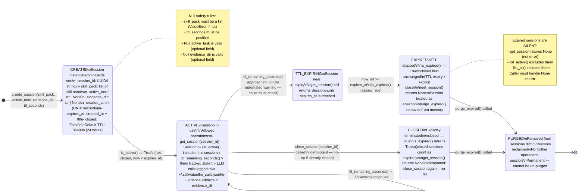
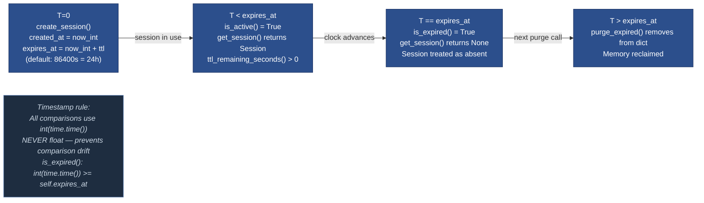
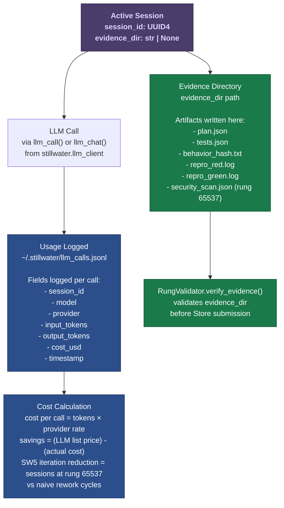

# Diagram 13 — Session Management

Session lifecycle for Stillwater's in-memory session manager. Sessions are ephemeral
(not persisted across process restarts). Each session tracks: skill pack loaded,
active task, evidence directory, and TTL-based expiry.

Sessions are identified by UUID4. All session state uses int timestamps (never float)
to prevent comparison bugs. The null safety rule applies: get_session on unknown ID
returns None (not an error), close_session on unknown ID is a no-op.

---

## Session State Diagram



---

## Session Manager API Flow

```mermaid
flowchart TD
    CALLER([Caller\nphuc-swarm run\nor CLI session])

    CALLER --> CREATE

    subgraph CREATE["create_session()"]
        CR1["Validate skill_pack is a list\n(raises ValueError if not)"]
        CR2["Validate ttl_seconds > 0\n(raises ValueError if ≤ 0)"]
        CR3["Generate UUID4 session_id"]
        CR4["Set created_at = int(time.time())"]
        CR5["Set expires_at = created_at + ttl"]
        CR6["Acquire lock → store in _sessions"]
        CR7["Return Session object"]
        CR1 --> CR2 --> CR3 --> CR4 --> CR5 --> CR6 --> CR7
    end

    CALLER --> GET

    subgraph GET["get_session(session_id)"]
        GE1["Acquire lock → lookup in _sessions"]
        GE2{Found in dict?}
        GE3["Return None\n(unknown ID = absent)"]
        GE4{is_expired()?}
        GE5["Return None\n(expired = absent)"]
        GE6["Return Session\n(active and valid)"]
        GE2 -- NO --> GE3
        GE2 -- YES --> GE4
        GE4 -- YES --> GE5
        GE4 -- NO --> GE6
    end

    CALLER --> CLOSE

    subgraph CLOSE["close_session(session_id)"]
        CL1["Acquire lock → lookup in _sessions"]
        CL2{Found?}
        CL3["No-op\n(idempotent)"]
        CL4["Set session.closed = True\n(mark as terminated)"]
        CL2 -- NO --> CL3
        CL2 -- YES --> CL4
    end

    CALLER --> LIST

    subgraph LIST["list_active() / list_all()"]
        LA1["Acquire lock → snapshot _sessions.values()"]
        LA2["list_active(): filter is_active() == True\nsorted by created_at ascending"]
        LA3["list_all(): include expired and closed\nsorted by created_at ascending"]
        LA4["Never raises — returns [] if empty"]
        LA1 --> LA2 & LA3 --> LA4
    end

    CALLER --> PURGE

    subgraph PURGE["purge_expired()"]
        PU1["Acquire lock → find all is_expired() sessions"]
        PU2["Delete from _sessions dict"]
        PU3["Return count of removed sessions"]
        PU1 --> PU2 --> PU3
    end

    classDef nullSafe fill:#1a7a4a,color:#fff,stroke:#0f4f2f
    classDef errorPath fill:#9b2335,color:#fff,stroke:#6b1520
    class GE3,GE5,CL3 nullSafe
    class CR1,CR2 errorPath
```

---

## TTL Timeline



---

## Usage Tracking Integration



---

## Source Files

- `/home/phuc/projects/stillwater/cli/src/stillwater/session_manager.py` — full `SessionManager` class: `Session` dataclass, `create_session()`, `get_session()`, `close_session()`, `list_active()`, `list_all()`, `purge_expired()`, `session_count()`
- `/home/phuc/projects/stillwater/admin/session_manager.py` — admin variant
- `/home/phuc/projects/stillwater/store/rung_validator.py` — `RungValidator.verify_evidence()` used with session's evidence_dir

## Coverage

- All 6 session states: CREATED, ACTIVE, TTL_EXPIRING, EXPIRED, CLOSED, PURGED
- Full `SessionManager` API: create, get, close, list_active, list_all, purge_expired, session_count
- Null safety rules: get_session returns None (not error), close_session is idempotent
- TTL timeline with int timestamp enforcement (never float)
- Thread-safety: single lock (`threading.Lock`) on all mutations
- Session fields: session_id (UUID4), skill_pack, active_task, evidence_dir, created_at, expires_at, closed
- Default TTL: 86400 seconds (24 hours)
- Usage tracking integration with `~/.stillwater/llm_calls.jsonl`
- Evidence directory relationship to RungValidator
- `is_expired()` checks both `closed` flag and TTL: closed sessions count as expired
