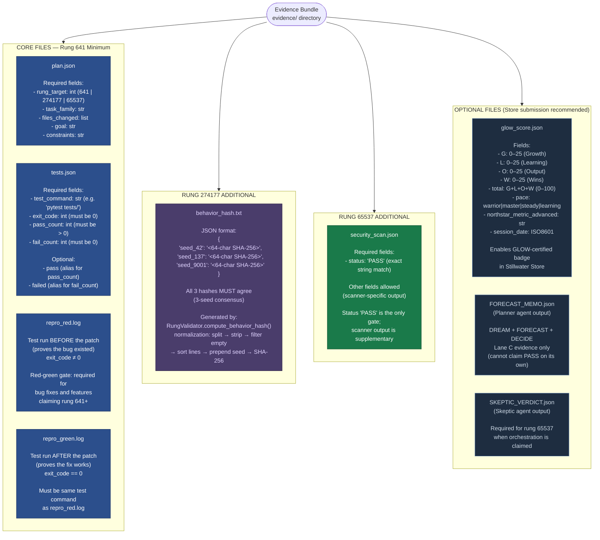
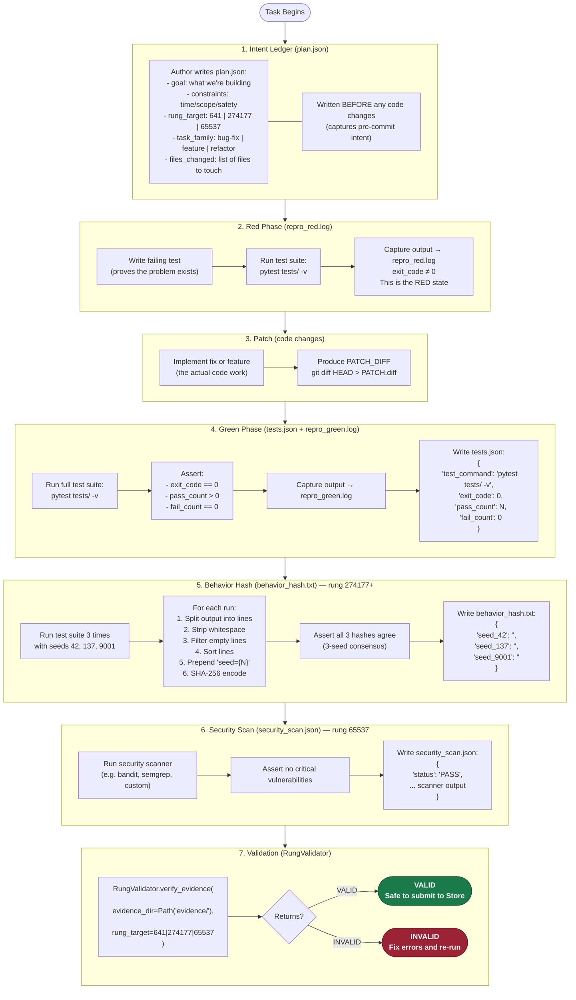
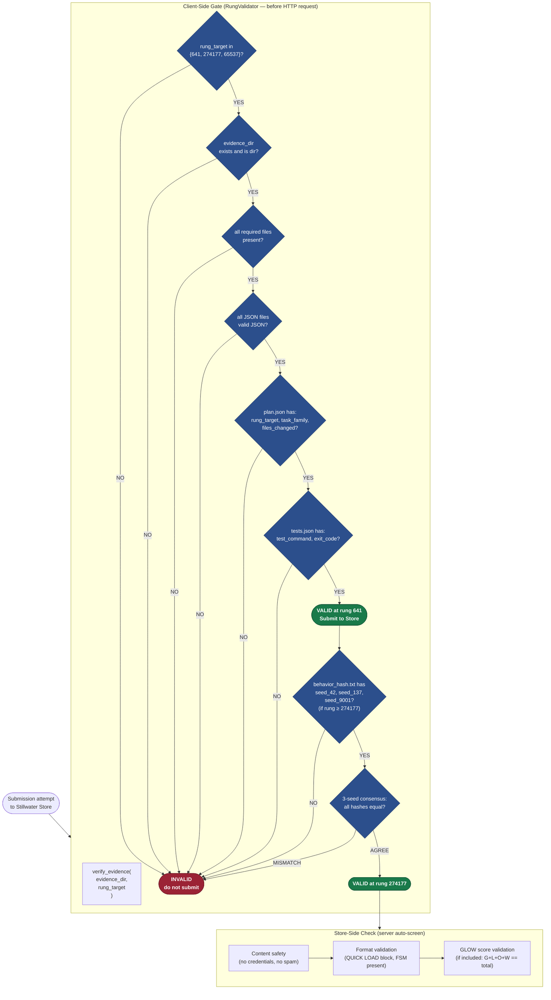
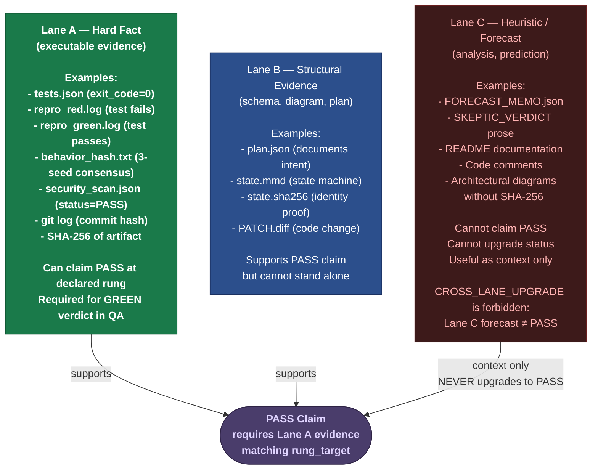

# Diagram 14 — Evidence Bundle

The evidence bundle is the ground truth for all PASS claims in Stillwater. It is
an artifact-first system: evidence is produced during development, not assembled
afterward. The bundle is cumulative — each higher rung requires all files from
lower rungs plus additional evidence.

"PASS only with executable evidence — not forecasts, not prose confidence."

---

## Evidence Bundle Structure

---

## How Evidence Is Produced During Development

---

## Evidence Verification Flow (RungValidator)

---

## Evidence Lane Classification

---

## Source Files

- `/home/phuc/projects/stillwater/store/rung_validator.py` — `RungValidator`: all gate logic, `REQUIRED_EVIDENCE_FILES`, `PLAN_REQUIRED_FIELDS`, `TESTS_REQUIRED_FIELDS`, `BEHAVIOR_REQUIRED_SEEDS`, `compute_behavior_hash()`, `verify_evidence()`, `verify_rung()`, `validate_bundle()`
- `/home/phuc/projects/stillwater/skills/prime-coder.md` — evidence bundle requirements, red-green gate, Lane A/B/C classification
- `/home/phuc/projects/stillwater/skills/prime-qa.md` — evidence schema per pillar (qa_questions.json, qa_scorecard.json, qa_falsifiers.json, qa_gap_report.md)
- `/home/phuc/projects/stillwater/skills/glow-score.md` — glow_score.json schema and when O ≥ 20 requires evidence bundle path
- `/home/phuc/projects/stillwater/STORE.md` — glow_score.json schema for Store submissions

## Coverage

- All required evidence files per rung tier (plan.json, tests.json, repro_red/green.log, behavior_hash.txt, security_scan.json)
- All required JSON fields from `rung_validator.py`: `PLAN_REQUIRED_FIELDS`, `TESTS_REQUIRED_FIELDS`, `BEHAVIOR_REQUIRED_SEEDS`
- `compute_behavior_hash()` normalization algorithm (split, strip, filter, sort, prepend seed, SHA-256)
- 3-seed consensus protocol and fail-closed rule (seed mismatch → INVALID)
- Evidence production sequence during development (intent → red → patch → green → hash → scan → validate)
- `RungValidator` gate sequence (8 gates, all fail-closed)
- Lane A/B/C classification: what can claim PASS vs what is context only
- CROSS_LANE_UPGRADE forbidden state (Lane C forecast cannot claim PASS)
- Optional files: glow_score.json (Store badge), FORECAST_MEMO.json, SKEPTIC_VERDICT.json
- String sentinels "VALID"/"INVALID" (not boolean) to prevent coercion bugs
