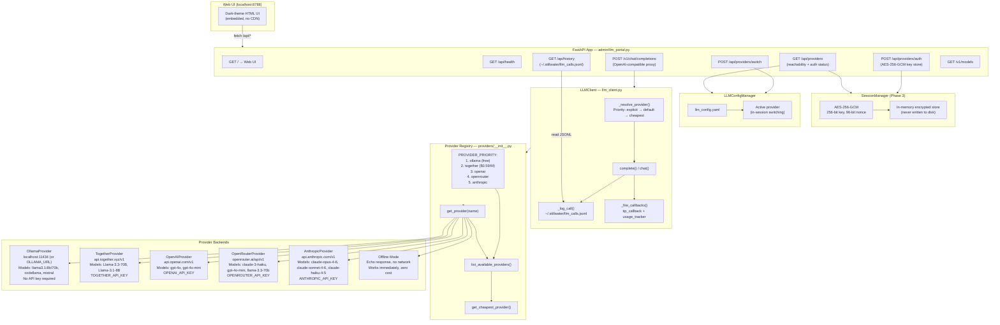
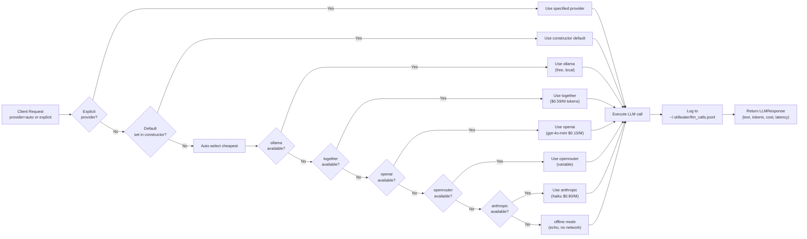
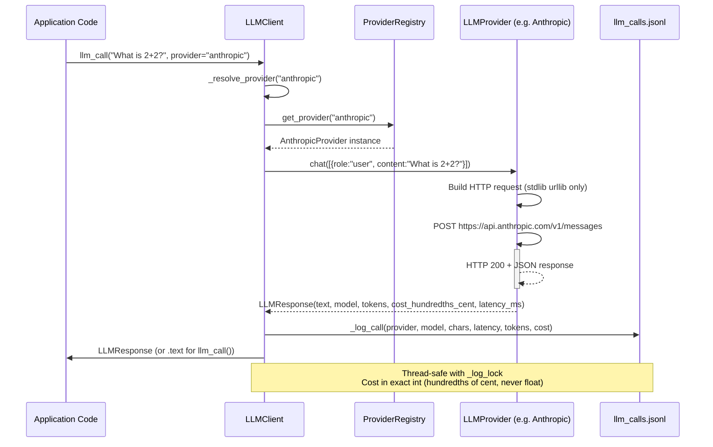
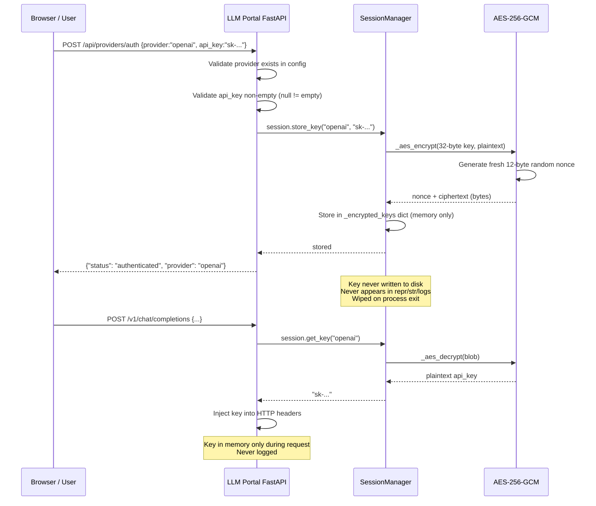
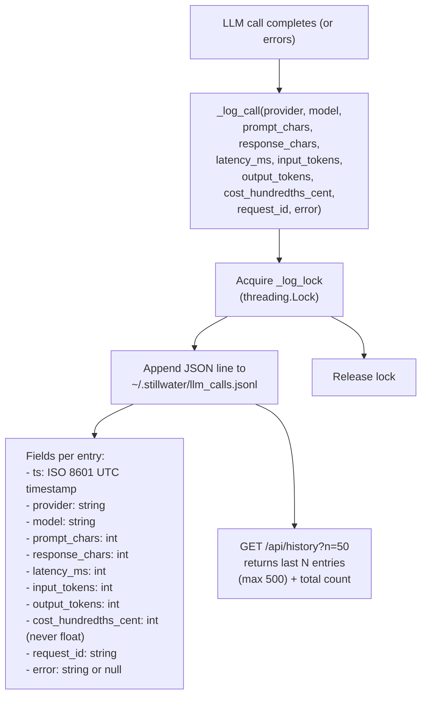

# Diagram 15: LLM Portal Architecture

**Description:** The Stillwater LLM Portal (`admin/llm_portal.py`) is a FastAPI-based web application running on `localhost:8788`. It exposes an OpenAI-compatible proxy interface for all configured LLM providers and includes a dark-theme web UI for interactive testing. The universal LLM client (`cli/src/stillwater/llm_client.py`) abstracts all provider differences behind a single API.

---

## Architecture Overview

---

## Provider Selection and Fallback Chain

---

## Call Sequence: Client to Provider

---

## API Key Security Flow (Phase 3)

---

## Call Logging Structure

---

## Source Files

- `admin/llm_portal.py` — FastAPI app, routes, session manager, HTML UI
- `admin/session_manager.py` — AES-256-GCM in-memory key storage
- `cli/src/stillwater/llm_client.py` — Universal LLMClient, llm_call, llm_chat, _log_call
- `cli/src/stillwater/provider_registry.py` — High-level PROVIDERS dict, routing table
- `cli/src/stillwater/providers/__init__.py` — Provider class registry, PROVIDER_PRIORITY, list_available_providers
- `cli/src/stillwater/providers/anthropic_provider.py` — Anthropic backend
- `cli/src/stillwater/providers/openai_provider.py` — OpenAI backend
- `cli/src/stillwater/providers/together_provider.py` — Together.ai backend
- `cli/src/stillwater/providers/openrouter_provider.py` — OpenRouter backend
- `cli/src/stillwater/providers/ollama_provider.py` — Local Ollama backend

---

## Coverage

- All 5 provider backends (anthropic, openai, together, openrouter, ollama) + offline mode
- Provider priority/fallback chain (cheapest-first auto-selection)
- All 8 HTTP routes on the LLM Portal (GET /, /api/health, /api/providers, GET /v1/models; POST /api/providers/switch, /api/providers/auth, /api/history, /v1/chat/completions)
- Phase 3 AES-256-GCM session key storage (memory-only, never persisted)
- Call logging to `~/.stillwater/llm_calls.jsonl` (thread-safe, exact int cost arithmetic)
- Provider resolution priority: explicit > constructor default > auto (cheapest available)
- LLMClient v1.x backward compatibility (llm_call, llm_chat, .call())
- Cost tracking in hundredths of a cent (int arithmetic, never float)
