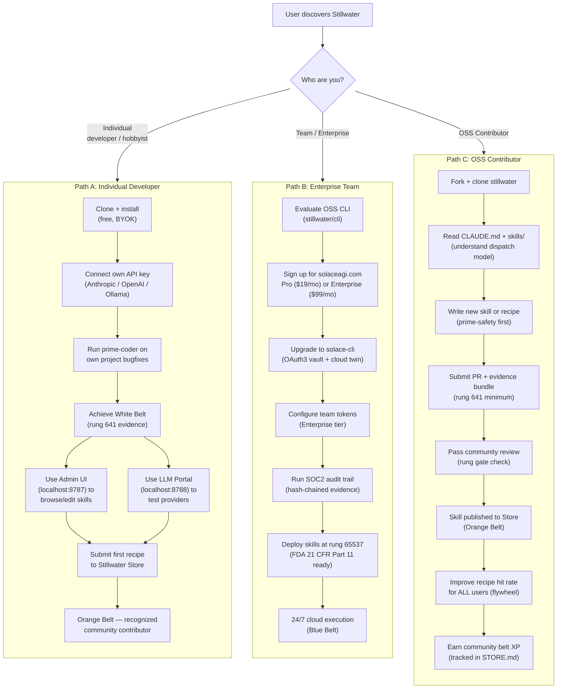
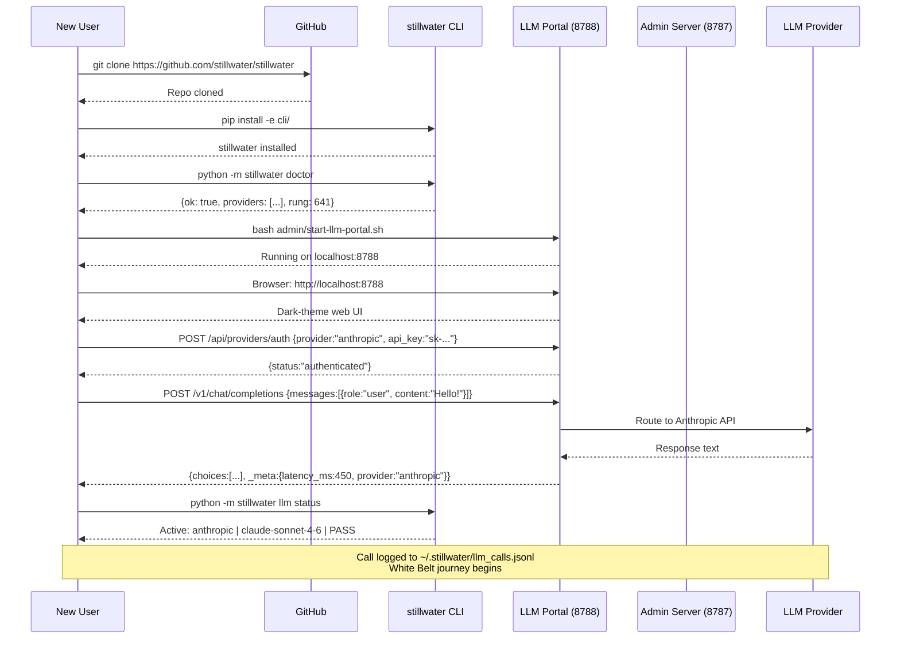
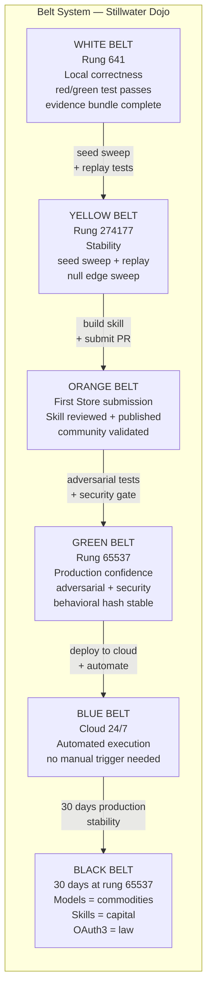
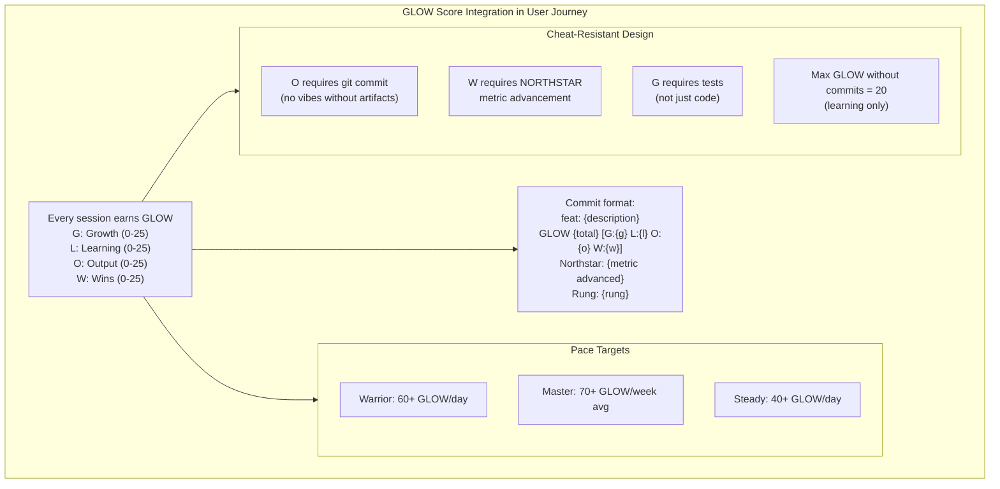

# Diagram 18: Complete User Journey — Discovery to Black Belt

**Description:** The complete user journey from initial discovery of Stillwater through installation, first skill execution, first evidence bundle, skill store submission, and belt progression to Black Belt. Shows three distinct user paths: hobbyist/individual developer, enterprise/team, and community contributor.

---

## Full Journey Overview

```mermaid
flowchart TD
    subgraph DISCOVERY["Discovery"]
        D1["GitHub browse\n(search: AI verification)"]
        D2["Hacker News post\n('AI without evidence is malpractice')"]
        D3["LinkedIn article\n(Phuc Truong / Stillwater Dispatch)"]
        D4["Word of mouth\n(colleague shares)"]
        D5["phuc.net article\n(SEO / organic search)"]
    end

    subgraph INSTALL["Installation"]
        I1["Clone repo:\ngit clone stillwater"]
        I2["Install CLI:\npip install -e cli/"]
        I3["Run doctor:\npython -m stillwater doctor"]
        I4["Configure LLM:\npython -m stillwater llm status"]
        I5["Set API key or\nstart Ollama locally"]
    end

    subgraph FIRST_SKILL["First Skill Run"]
        F1["Browse skills/\n(prime-safety, prime-coder, etc.)"]
        F2["Run with LLM:\nllm_call('ping', provider='ollama')"]
        F3["See call logged to\n~/.stillwater/llm_calls.jsonl"]
        F4["Run a recipe\n(skills/prime-coder.md)"]
        F5["See evidence output:\ntests.json + plan.json"]
    end

    subgraph WHITE["White Belt — Rung 641"]
        W1["Write a failing test (red)"]
        W2["Apply patch"]
        W3["Test passes (green)"]
        W4["Evidence bundle:\nrepro_red.log + repro_green.log\ntests.json + plan.json"]
        W5["WHITE BELT EARNED\nLocal correctness verified"]
    end

    subgraph YELLOW["Yellow Belt — Rung 274177"]
        Y1["Run seed sweep\n(multiple random seeds)"]
        Y2["Run replay test\n(same input → same output)"]
        Y3["Run null edge sweep\n(null inputs handled correctly)"]
        Y4["YELLOW BELT EARNED\nStability verified"]
    end

    subgraph ORANGE["Orange Belt — Store Submission"]
        O1["Develop skill or recipe\nwith evidence at rung 641+"]
        O2["Submit to Stillwater Store\n(PR + evidence bundle)"]
        O3["Community review\n(rung gate validation)"]
        O4["Skill published to Store"]
        O5["ORANGE BELT EARNED\nFirst skill in Stillwater Store"]
    end

    subgraph GREEN["Green Belt — Rung 65537"]
        G1["Add adversarial tests"]
        G2["Pass security gate\n(prime-safety audit)"]
        G3["Behavioral hash stable\n(hash.json committed)"]
        G4["GREEN BELT EARNED\nProduction confidence"]
    end

    subgraph BLUE["Blue Belt — Cloud 24/7"]
        B1["Deploy skill to\nsolaceagi.com cloud"]
        B2["Automated execution\n24/7 (no manual trigger)"]
        B3["BLUE BELT EARNED\nCloud execution running"]
    end

    subgraph BLACK["Black Belt"]
        BK1["Production task running\nat rung 65537 for 30 days"]
        BK2["Models = commodities\nSkills = capital\nOAuth3 = law"]
        BK3["BLACK BELT EARNED"]
    end

    DISCOVERY --> INSTALL
    INSTALL --> FIRST_SKILL
    FIRST_SKILL --> WHITE
    WHITE --> YELLOW
    YELLOW --> ORANGE
    ORANGE --> GREEN
    GREEN --> BLUE
    BLUE --> BLACK
```

---

## Three User Paths

---

## Discovery to Installation Sequence

---

## Belt Progression Milestones

---

## GLOW Score Along the Journey

---

## Source Files

- `NORTHSTAR.md` — Belt system, GLOW score, user journey milestones
- `ROADMAP.md` — Phased build plan (audit → OAuth3 → Store → 65537)
- `admin/server.py` — Admin UI entry point (localhost:8787)
- `admin/llm_portal.py` — LLM Portal entry point (localhost:8788)
- `cli/src/stillwater/__main__.py` — CLI entry point (doctor, llm status)
- `STORE.md` — Stillwater Store policy and belt XP tracking

---

## Coverage

- Full journey: Discovery → Installation → First Skill → White Belt → Black Belt
- Three distinct user paths: hobbyist (BYOK free), enterprise (Pro/Enterprise tiers), OSS contributor
- Belt criteria for all 6 belts (White through Black) with exact rung requirements
- Discovery channels: GitHub, HN, LinkedIn, phuc.net, word of mouth
- Installation sequence with CLI commands
- GLOW score integration (gamification per session)
- Belt XP cheat-resistant design (artifacts required, not prose confidence)
- Community flywheel: contributor skills improve hit rate for all users
