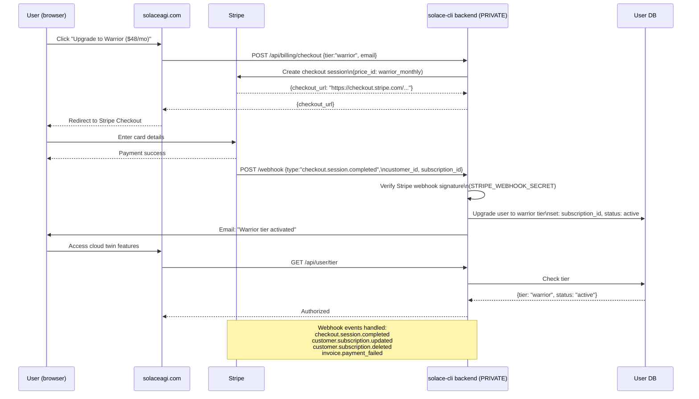
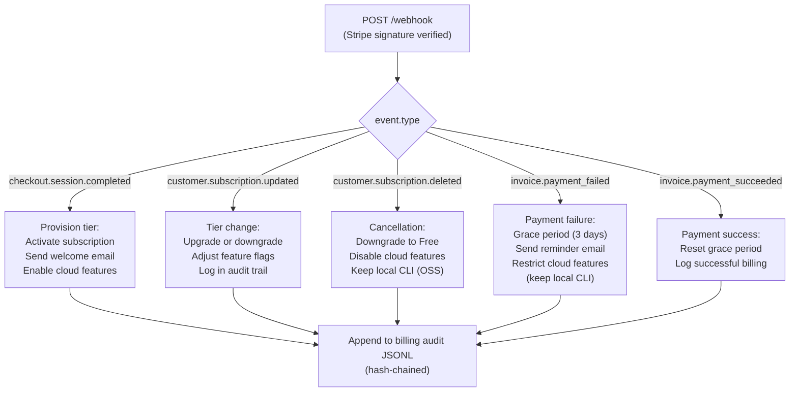
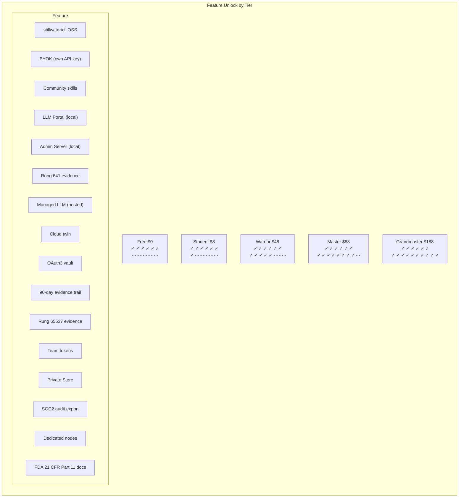

# Diagram 21: Platform Pricing and Billing Flow

**Description:** solaceagi.com operates a 4-tier pricing model (Free → Student → Warrior → Master → Grandmaster) plus an additive Managed LLM option ($3/mo). Billing is handled via Stripe with webhook event processing. The pricing architecture is designed for zero day-one infrastructure cost: Free tier = OSS + BYOK, paid tiers = proxy passthrough to Together.ai/OpenRouter with 20% markup. Each tier unlocks specific features.

---

## Tier Comparison

```mermaid
flowchart TD
    subgraph FREE["Free — $0/mo"]
        F_DESC["Registration: social media post\n(no credit card, no tip required)\nTarget: early adopters, students, hobbyists"]
        F_FEATURES["Features:\n- stillwater/cli OSS client\n- BYOK (Anthropic/OpenAI/Llama)\n- Community skills from Stillwater Store\n- LLM Portal (localhost:8788)\n- Admin Server (localhost:8787)\n- Rung 641 evidence bundles"]
        F_LLM["LLM: Bring Your Own Key\nUser's own API costs\nStillwater = $0 COGS on LLM"]
    end

    subgraph MANAGED["Managed LLM Add-on — +$3/mo"]
        ML_DESC["Add-on for any tier\n(not standalone)"]
        ML_FEATURES["Features:\n- Hosted LLM (no API key needed)\n- Together.ai/OpenRouter passthrough\n- Primary: Llama 3.3 70B ($0.59/M tokens)\n- Fallback: OpenRouter (Claude, GPT-4, Mixtral)\n- ~6,000 tasks/mo at 70% recipe hit rate"]
        ML_ECONOMICS["Economics:\n20% markup on actual LLM token cost\nPrimary: $0.59/M → ~$0.71/M charged\n~$3/mo flat at average usage\nStillwater gross margin: 20% on LLM proxy"]
    end

    subgraph PRO["Pro — $19/mo (Warrior equivalent)"]
        P_DESC["Target: serious individual developers\nteams, freelancers with client work"]
        P_FEATURES["Includes Managed LLM (+$3/mo value)\n- Cloud twin (solace-browser + solace-cli)\n- OAuth3 vault (AES-256-GCM, cloud-backed)\n- 90-day evidence trail (tamper-evident)\n- All community skills\n- Rung 65537 evidence bundles"]
        P_ECONOMICS["Economics at Pro:\nRecipe hit rate 70% → COGS $5.75/user/mo\n(Haiku at $0.001/task, 6,000 tasks)\n70% gross margin at $19/mo"]
    end

    subgraph ENTERPRISE["Enterprise — $99/mo (Master equivalent)"]
        E_DESC["Target: teams, regulated industries,\nstartups with compliance requirements"]
        E_FEATURES["All Pro features, plus:\n- SOC2 audit trail export\n- Team tokens (multiple agents per org)\n- Private Stillwater Store (internal skills)\n- Dedicated nodes (no shared queue)\n- FDA 21 CFR Part 11 alignment docs\n- Priority support"]
    end

    FREE --> MANAGED
    FREE --> PRO
    PRO --> ENTERPRISE

    style FREE fill:#1a3a1a,stroke:#3fb950
    style MANAGED fill:#1a2a3a,stroke:#58a6ff
    style PRO fill:#2a1a3a,stroke:#a371f7
    style ENTERPRISE fill:#3a1a1a,stroke:#f85149
```

---

## Billing Products (Stripe)

```mermaid
flowchart LR
    subgraph STRIPE_PRODUCTS["Stripe Product Catalog"]
        direction TB
        S1["Student — $8/mo\nEntry-level paid tier\nManaged LLM included\n+ basic cloud features"]
        S2["Warrior — $48/mo\nPro equivalent\nFull cloud twin + OAuth3\n+ 90-day evidence"]
        S3["Master — $88/mo\nEnterprise lite\nTeam tokens + private store\n+ SOC2 audit"]
        S4["Grandmaster — $188/mo\nFull enterprise\nDedicated nodes + FDA docs\n+ priority support"]
    end

    subgraph PRICE_MAP["Tier Mapping"]
        direction TB
        PM1["Free ($0) → OSS only, no Stripe"]
        PM2["Student ($8) → 1,000 tasks/mo\nManaged LLM passthrough"]
        PM3["Warrior ($48) → 6,000 tasks/mo\nCloud twin + OAuth3 vault"]
        PM4["Master ($88) → Team (5 seats)\nPrivate store + SOC2"]
        PM5["Grandmaster ($188) → Team (20 seats)\nDedicated + FDA + SLA"]
    end

    STRIPE_PRODUCTS --> PRICE_MAP
```

---

## Stripe Checkout Flow

---

## Webhook Event Handling

---

## Economics Model

```mermaid
flowchart TD
    subgraph BYOK_ECON["BYOK Path Economics (Free tier)"]
        BK1["User brings own API key"]
        BK2["Recipe hit rate 70%"]
        BK3["70% of tasks: Haiku at $0.001/task\n(recipe replay — near zero)"]
        BK4["30% of tasks: full LLM call\n(user's API key, not Stillwater's cost)"]
        BK5["Stillwater COGS: $0 on LLM\nRevenue: $0 (free tier)"]
        BK1 --> BK2 --> BK3 & BK4 --> BK5
    end

    subgraph MANAGED_ECON["Managed LLM Economics (+$3/mo)"]
        ML1["User pays +$3/mo managed LLM"]
        ML2["Stillwater proxies Together.ai\n(Llama 3.3 70B at $0.59/M tokens)"]
        ML3["~6,000 tasks/mo at 70% hit rate\n= 1,800 full LLM calls"]
        ML4["Avg 1,800 tokens/call = 3.24M tokens\nat $0.59/M = $1.91 actual cost"]
        ML5["Charged: $3/mo (20% markup)\nGross margin: $1.09/user/mo on LLM"]
        ML1 --> ML2 --> ML3 --> ML4 --> ML5
    end

    subgraph PRO_ECON["Pro Tier Economics ($19/mo)"]
        PR1["$19/mo flat rate"]
        PR2["Includes Managed LLM ($3 value)\n+ Cloud twin + OAuth3 vault\n+ 90-day evidence"]
        PR3["COGS at 70% hit rate:\n$5.75/user/mo (Haiku + Together.ai)"]
        PR4["Gross margin: $13.25/user/mo\n= 70% gross margin"]
        PR1 --> PR2 --> PR3 --> PR4
    end

    subgraph DAY_ONE["Day-One Infrastructure"]
        D1["Day 1: proxy Together.ai/OpenRouter\nZero GPU infra\nZero ML ops"]
        D2["Primary: Llama 3.3 70B\n($0.59/M tokens, Together.ai)"]
        D3["Fallback: OpenRouter\n(broader model selection)"]
        D4["Self-host option:\ndeploy solace-cli + twin\n$0/mo infra for power users"]
        D1 --> D2 & D3 & D4
    end
```

---

## Feature Unlock Matrix

---

## Source Files

- `NORTHSTAR.md` — Pricing tiers (Free, Managed LLM, Pro, Enterprise), economic model
- `/home/phuc/.claude/CLAUDE.md` — Pricing tiers: Student/Warrior/Master/Grandmaster Stripe products
- `case-studies/solaceagi.md` — Refactor + rebuild plan for solaceagi.com
- `ROADMAP.md` — Phase 3: billing integration (Stripe)

---

## Coverage

- All 5 pricing tiers: Free ($0), Student ($8), Warrior ($48), Master ($88), Grandmaster ($188)
- Managed LLM add-on (+$3/mo) as separate additive product
- Feature unlock matrix per tier (16 features)
- Stripe checkout flow: session creation → payment → webhook → provisioning
- All 5 Stripe webhook events and their handling
- Economics model: BYOK COGS $0, Managed LLM 20% markup, Pro 70% gross margin
- Day-one infrastructure: zero GPU, proxy Together.ai/OpenRouter
- Self-host option for power users
