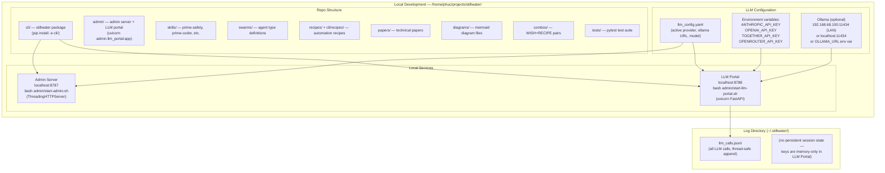
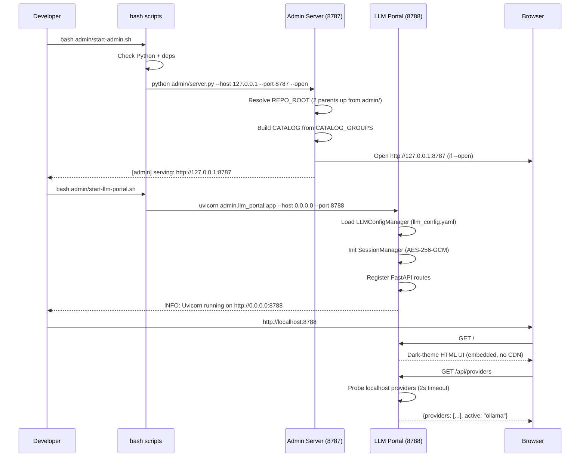
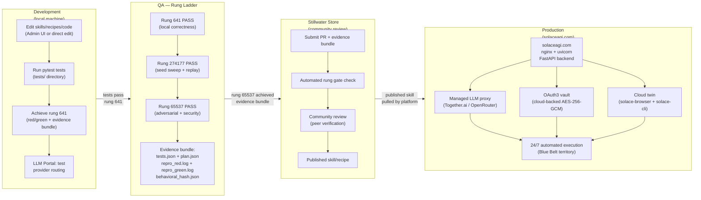
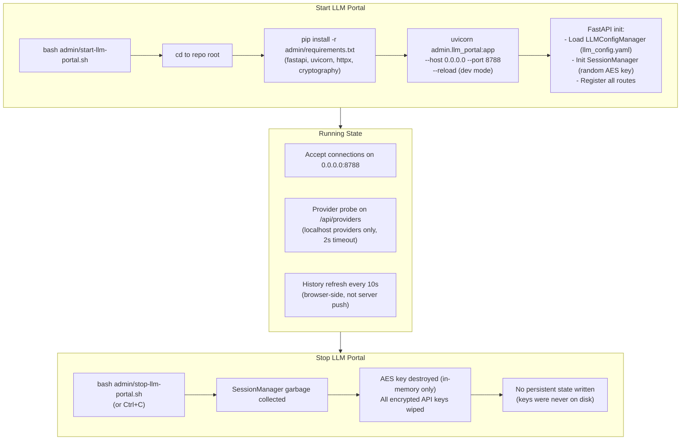

# Diagram 22: Deployment Architecture

**Description:** Stillwater has three deployment surfaces: local development (the OSS repo), local admin services (Admin Server on 8787 and LLM Portal on 8788), and the hosted solaceagi.com platform (nginx + uvicorn + FastAPI). The Admin Server and LLM Portal are designed for localhost-only use; solaceagi.com is the production cloud deployment. This diagram covers all three surfaces, the development → QA → production pipeline, and how the 9-project ecosystem integrates at deployment time.

---

## Local Development Setup

---

## Admin Services Startup Sequence

---

## Development → QA → Production Pipeline

---

## solaceagi.com Deployment Architecture

```mermaid
flowchart TD
    subgraph INTERNET["Internet"]
        USERS["Users\n(browser, CLI, API clients)"]
    end

    subgraph CLOUD["solaceagi.com Cloud"]
        NGINX["nginx\n- TLS termination (Let's Encrypt)\n- Static file serving\n- Reverse proxy to uvicorn"]

        subgraph UVICORN["uvicorn (FastAPI)"]
            API_BACKEND["FastAPI backend (solace-cli PRIVATE)\n- Auth + tier check\n- Managed LLM proxy\n- OAuth3 vault API\n- Cloud twin orchestration"]
        end

        subgraph LLM_PROXY["Managed LLM Proxy"]
            TOGETHER_PROXY["Together.ai proxy\n(Llama 3.3 70B, $0.59/M)"]
            OPENROUTER_PROXY["OpenRouter fallback\n(Claude, GPT-4, Mixtral)"]
        end

        subgraph TWIN_SVC["Cloud Twin Service"]
            SOLACE_BROWSER["solace-browser instance\n(per-user cloud twin)"]
            OAUTH3_VAULT["OAuth3 vault\n(cloud-backed, AES-256-GCM)"]
        end

        subgraph DB_LAYER["Persistence"]
            USER_DB["User DB\n(tier, subscription, email)"]
            EVIDENCE_DB["Evidence store\n(90-day audit trail, hash-chained)"]
            CALL_LOG["LLM call log\n(per-user, cost tracking)"]
        end

        subgraph STRIPE_INT["Billing"]
            STRIPE_WEBHOOK["Stripe webhook handler\n(/webhook endpoint)"]
            STRIPE_CHECKOUT["Stripe checkout sessions"]
        end
    end

    subgraph OSS_CLI["User Local (OSS)"]
        SW_CLI["stillwater/cli\n(pip install, free)"]
        LOCAL_PORTAL["LLM Portal\n(localhost:8788)"]
        LOCAL_ADMIN["Admin Server\n(localhost:8787)"]
    end

    USERS -->|"HTTPS"| NGINX
    NGINX --> UVICORN
    API_BACKEND --> LLM_PROXY & TWIN_SVC & DB_LAYER & STRIPE_INT
    OSS_CLI <-->|"optional cloud sync\n(Pro/Enterprise tier)"| API_BACKEND

    style NGINX fill:#1a2a3a,stroke:#58a6ff
    style UVICORN fill:#1a3a2a,stroke:#3fb950
    style LLM_PROXY fill:#2a1a3a,stroke:#a371f7
```

---

## Multi-Project Deployment Integration

```mermaid
flowchart TD
    subgraph STILLWATER_DEPLOY["stillwater (OSS)\nDeployed: everywhere (local + cloud)"]
        SW1["stillwater/cli → pip install\n(any developer machine)"]
        SW2["Admin Server → localhost:8787"]
        SW3["LLM Portal → localhost:8788"]
        SW4["Skill Store → GitHub + stillwater community"]
    end

    subgraph SOLACE_BROWSER_DEPLOY["solace-browser (OSS)\nDeployed: developer machines + solaceagi.com cloud"]
        SB1["Local: python -m solace_browser\n(developer machine)"]
        SB2["Cloud: per-user twin instance\n(solaceagi.com Pro tier)"]
        SB3["OAuth3 consent UI\n(embedded in browser)"]
    end

    subgraph PAUDIO_DEPLOY["paudio (OSS)\nDeployed: community volunteer compute"]
        PA1["paudio-compute: CPU-only nodes\n(volunteer network, deterministic)"]
        PA2["paudio API: solaceagi.com/api/v1/tts\n(hosted endpoint)"]
        PA3["Voice Arena: gamified evaluation\n(community judgment)"]
    end

    subgraph SOLACEAGI_DEPLOY["solaceagi.com (PAID)\nDeployed: cloud (nginx + uvicorn)"]
        SAG1["API backend (solace-cli PRIVATE)"]
        SAG2["LLM proxy (Together.ai + OpenRouter)"]
        SAG3["Avatar: paudio (voice) + pvideo (visual)"]
        SAG4["OAuth3 cloud vault"]
        SAG5["Stillwater evidence store (90 days)"]
    end

    subgraph PVIDEO_DEPLOY["pvideo (PRIVATE)\nDeployed: solaceagi.com only"]
        PV1["IF Theory physics engine\n(secret sauce)"]
        PV2["Avatar visual system\n(Phase 1: cartoon Q2 2026)"]
    end

    SW1 & SB1 -->|"skills + evidence"| SAG1
    PA2 --> SAG3
    PV2 --> SAG3
    SAG1 --> STILLWATER_DEPLOY

    style PVIDEO_DEPLOY fill:#2a1a1a,stroke:#f85149
    style SOLACEAGI_DEPLOY fill:#1a2a3a,stroke:#58a6ff
```

---

## LLM Portal Startup and Shutdown

---

## Source Files

- `admin/server.py` — ThreadingHTTPServer, startup, REPO_ROOT resolution, --host/--port
- `admin/llm_portal.py` — FastAPI app, uvicorn entry point, SessionManager init
- `admin/start-admin.sh` — Admin server startup script
- `admin/start-llm-portal.sh` — LLM Portal startup script
- `admin/stop-llm-portal.sh` — LLM Portal stop script
- `admin/llm-portal-status.sh` — LLM Portal status check
- `admin/requirements.txt` — FastAPI, uvicorn, httpx, cryptography dependencies
- `admin/session_manager.py` — AES-256-GCM session key storage (memory-only)
- `/home/phuc/.claude/CLAUDE.md` — LLM Portal URL, provider list, solaceagi.com deployment

---

## Coverage

- Local development setup: repo structure, service startup, LLM config
- Admin Server (8787): ThreadingHTTPServer, startup, REPO_ROOT resolution
- LLM Portal (8788): uvicorn FastAPI, startup/shutdown, session key lifecycle
- Admin service startup sequence (step-by-step with commands)
- Development → QA → Production pipeline with rung gates
- solaceagi.com cloud deployment: nginx + uvicorn + FastAPI + LLM proxy + vault
- Multi-project deployment: how stillwater, solace-browser, paudio, pvideo converge at solaceagi.com
- LLM Portal startup/shutdown: AES key lifecycle (created at start, wiped at stop)
- Avatar system deployment phases (Q2-Q4 2026)
