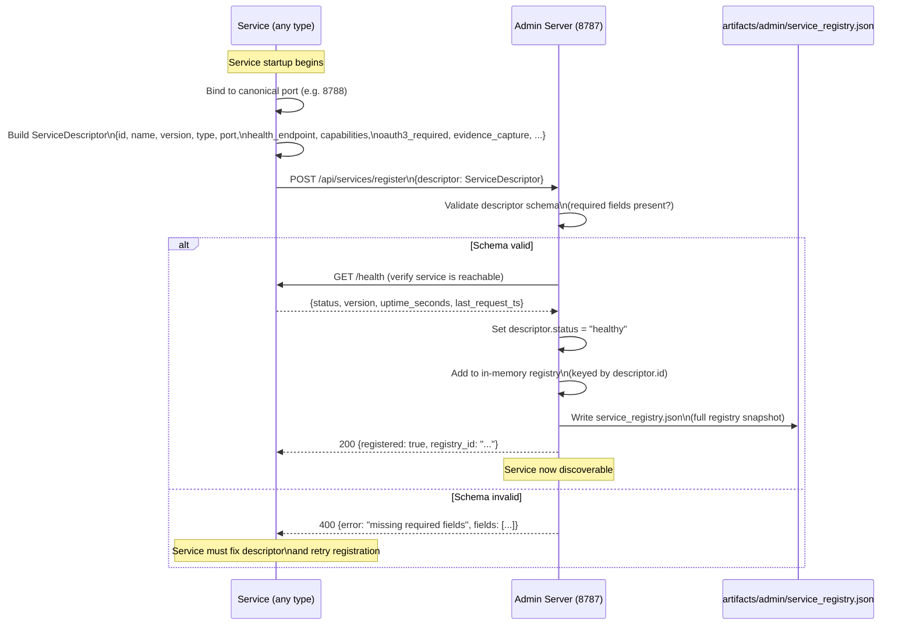

# Diagram 23: Service Registry Architecture

**Description:** The Admin Server (localhost:8787) is the mandatory discovery gateway for all Stillwater services. It maintains a service registry — a live, persisted map of every running service and its health status. Services register themselves on startup. The admin server auto-discovers services by probing canonical ports on startup. A health polling loop updates each service's status every 30 seconds. The registry is persisted to `artifacts/admin/service_registry.json` on every change.

---

## ServiceDescriptor Model (All Fields)

```mermaid
classDiagram
    class ServiceDescriptor {
        +String id
        +String name
        +String version
        +String service_type
        +int port
        +String host
        +String health_endpoint
        +String openapi_spec_url
        +List~String~ capabilities
        +bool oauth3_required
        +List~String~ oauth3_scopes
        +String evidence_capture
        +String status
        +String started_at
        +String last_health_check
        +int pid
    }

    note for ServiceDescriptor "id: unique stable identifier\n  e.g. 'llm-portal'\nservice_type: llm|recipe|evidence|oauth3|cpu|browser\nport: canonical (8787–9222)\nevidence_capture: never|on-error|always\nstatus: starting|healthy|degraded|stopped"
```

---

## Canonical Port Assignments

```mermaid
flowchart TD
    subgraph PORT_MAP["Canonical Service Port Map"]
        direction TB
        P8787["8787 — Admin Server\nService registry + gateway\nservice_type: admin"]
        P8788["8788 — LLM Portal\nMulti-provider LLM routing\nservice_type: llm"]
        P8789["8789 — Recipe Engine\nRecipe execution + replay\nservice_type: recipe"]
        P8790["8790 — Evidence Pipeline\nHash-chained capture + export\nservice_type: evidence"]
        P8791["8791 — OAuth3 Authority\nToken issuance + validation\nservice_type: oauth3"]
        P8792["8792 — CPU Service\nDeterministic computation\nservice_type: cpu"]
        P9222["9222 — Browser\nChrome DevTools Protocol\nservice_type: browser"]
    end

    note["Port range: 8787–9222\nAll localhost-only by default\nTunnel required for external exposure"]

    P8787 --- note
```

---

## Service Registration Flow (Service → Admin)

---

## Auto-Discovery Flow (Admin Probes Known Ports)

```mermaid
flowchart TD
    TRIGGER["Admin Server starts\nOR auto-discovery interval fires\n(every 60 seconds)"]

    TRIGGER --> PORT_LOOP["For each port in [8788, 8789, 8790, 8791, 8792, 9222]"]

    PORT_LOOP --> CHECK_REGISTRY{"Port already\nin registry?"}
    CHECK_REGISTRY -->|"Yes — skip"| NEXT_PORT["Next port"]
    CHECK_REGISTRY -->|"No — probe"| HEALTH_PROBE["GET http://127.0.0.1:{port}/health\n(timeout: 2s)"]

    HEALTH_PROBE --> PROBE_RESULT{"Response?"}
    PROBE_RESULT -->|"Timeout / connection refused"| NO_SERVICE["Port not in use\nor service not ready"]
    NO_SERVICE --> NEXT_PORT

    PROBE_RESULT -->|"200 OK with valid JSON"| VALIDATE["Validate response schema:\n{status, version, uptime_seconds,\nlast_request_ts}"]

    VALIDATE --> SCHEMA_CHECK{"Schema valid?"}
    SCHEMA_CHECK -->|"No — partial health response"| DEGRADED["Register with\nstatus = degraded\n(health-check-incomplete)"]
    SCHEMA_CHECK -->|"Yes"| GET_DESCRIPTOR["GET http://127.0.0.1:{port}/descriptor\n(fetch full ServiceDescriptor)"]

    GET_DESCRIPTOR --> DESCRIPTOR_RESULT{"Descriptor\nreturned?"}
    DESCRIPTOR_RESULT -->|"No /descriptor endpoint"| MINIMAL["Auto-build minimal descriptor:\n{id: 'unknown-{port}',\ntype: 'unknown', port: port}"]
    DESCRIPTOR_RESULT -->|"Yes"| REGISTER["Register with\nfull descriptor\nstatus = healthy"]

    DEGRADED --> PERSIST
    MINIMAL --> PERSIST
    REGISTER --> PERSIST

    PERSIST["Persist registry to\nartifacts/admin/service_registry.json"]
    PERSIST --> NEXT_PORT
```

---

## Health Check Polling Cycle

```mermaid
flowchart TD
    TIMER["Health poll timer fires\n(every 30 seconds)"]

    TIMER --> LOOP["For each service in registry"]

    LOOP --> HEALTH_GET["GET http://127.0.0.1:{service.port}/health\n(timeout: 5s)"]

    HEALTH_GET --> RESULT{"Response?"}

    RESULT -->|"200 OK — valid schema"| HEALTHY["Update descriptor:\nstatus = healthy\nlast_health_check = now()"]

    RESULT -->|"200 OK — invalid schema"| DEGRADED["Update descriptor:\nstatus = degraded\nnote: health-check-incomplete"]

    RESULT -->|"Non-200 response"| DEGRADED2["Update descriptor:\nstatus = degraded\nerror: HTTP {status_code}"]

    RESULT -->|"Timeout / connection refused"| CHECK_PID{"Check if PID\nstill running?"}

    CHECK_PID -->|"PID running — port unreachable"| DEGRADED3["status = degraded\nerror: port-unreachable"]

    CHECK_PID -->|"PID not running"| STOPPED["status = stopped\nKeep in registry\n(historical record)"]

    HEALTHY & DEGRADED & DEGRADED2 & DEGRADED3 & STOPPED --> PERSIST["Persist updated registry\nto service_registry.json\n(only on status change)"]

    PERSIST --> LOOP
```

---

## Registry Persistence: service_registry.json Schema

```mermaid
flowchart TD
    subgraph JSON_SCHEMA["artifacts/admin/service_registry.json"]
        direction TB
        ROOT["{"]
        META["meta: {\n  version: '1.0.0',\n  last_updated: ISO8601,\n  total_services: N,\n  healthy_count: N\n}"]
        SERVICES["services: {"]
        SERVICE_ENTRY["'{service.id}': {\n  id, name, version,\n  service_type, port, host,\n  health_endpoint, openapi_spec_url,\n  capabilities: [],\n  oauth3_required, oauth3_scopes: [],\n  evidence_capture,\n  status, started_at,\n  last_health_check, pid\n}"]
        CLOSE["}"]
        ROOT --> META & SERVICES
        SERVICES --> SERVICE_ENTRY
        SERVICE_ENTRY --> CLOSE
    end

    subgraph WRITE_POLICY["Write Policy"]
        W1["Write on: new service registered"]
        W2["Write on: service status changes\n(healthy → degraded → stopped)"]
        W3["Write on: admin shutdown\n(final snapshot)"]
        W4["Never: polling results without\nstatus change (reduces write churn)"]
    end

    subgraph READ_POLICY["Read Policy"]
        R1["Read on: admin startup\n(restore registry from last snapshot)"]
        R2["Read on: GET /api/services\n(serve from in-memory; JSON file is backup)"]
        R3["Conflict resolution on startup:\nin-memory = empty → read file\nin-memory = populated → ignore file"]
    end
```

---

## Registry API Endpoints (Admin Server Extensions)

```mermaid
flowchart TD
    subgraph REGISTRY_ENDPOINTS["Service Registry Endpoints — Admin Server (8787)"]
        direction TB

        subgraph GET_ENDPOINTS["GET Endpoints"]
            G1["GET /api/services\n→ Return full registry (all descriptors)\n   filtered by ?status=healthy|degraded|stopped\n   filtered by ?type=llm|recipe|evidence|..."]
            G2["GET /api/services/{service_id}\n→ Return single service descriptor\n   including health history (last 10 polls)"]
            G3["GET /api/services/health\n→ Aggregate health: {total, healthy, degraded, stopped}\n   Used by admin UI dashboard"]
        end

        subgraph POST_ENDPOINTS["POST Endpoints"]
            P1["POST /api/services/register\n{descriptor: ServiceDescriptor}\n→ Register or update service\n→ Trigger immediate health check\n→ Persist registry"]
            P2["POST /api/services/{service_id}/deregister\n→ Mark service as stopped\n→ Keep in registry (historical)\n→ Persist registry"]
            P3["POST /api/services/discover\n→ Trigger immediate auto-discovery scan\n→ Probe all canonical ports now\n→ Return newly discovered services"]
        end

        subgraph PROXY_ENDPOINT["Proxy Endpoint"]
            PR1["POST /api/proxy/{service_id}/{path}\n{...request body...}\n→ Validate OAuth3 token (if service requires)\n→ Forward request to service\n→ Capture to Evidence Pipeline (if enabled)\n→ Return response"]
        end
    end
```

---

## Admin UI: Service Registry Dashboard

```mermaid
flowchart TD
    subgraph DASHBOARD["Admin UI — localhost:8787 — Services Tab"]
        direction TB
        HEADER["SERVICE REGISTRY\nLast updated: {timestamp}\nAuto-refresh: 30s"]

        subgraph STATUS_ROW["Per-Service Status Row"]
            COL1["Service ID\n(clickable → detail view)"]
            COL2["Type\n(llm|recipe|evidence|oauth3|cpu|browser)"]
            COL3["Port"]
            COL4["Status\n🟢 healthy | 🟡 degraded | 🔴 stopped"]
            COL5["Uptime\n(from health check)"]
            COL6["Evidence\n(never|on-error|always)"]
            COL7["OAuth3\n(required|optional)"]
            COL8["Actions\n[Restart] [Deregister] [View Logs]"]
        end

        DISCOVER_BTN["[Discover Services]\n→ POST /api/services/discover"]
        REGISTER_BTN["[Register Manually]\n→ Opens descriptor form"]
    end
```

---

## Source Files

- `admin/server.py` — Admin Server (Phase 1 service; registry endpoints to be added in Phase 2)
- `admin/llm_portal.py` — LLM Portal (first service to self-register in Phase 2)
- `artifacts/admin/service_registry.json` — Registry persistence file (created by admin on first registration)
- `papers/54-webservice-first-architecture.md` — Full architectural narrative

---

## Coverage

- ServiceDescriptor model: all 15 fields with types and semantics
- Canonical port assignments: 7 services (8787–9222)
- Service registration flow: startup → descriptor build → POST /register → health verify → persist
- Auto-discovery: admin probes all canonical ports on startup and on 60s interval
- Health check polling: 30s cycle, status transitions (healthy → degraded → stopped)
- Registry persistence: service_registry.json schema, write policy (on status change), read policy (on startup)
- Registry API: 3 GET + 3 POST endpoints + 1 proxy endpoint
- Admin UI dashboard: per-service status row with all columns
- Degraded vs stopped distinction (PID check)
- Schema validation for health check responses
