# Diagram 25: Service Types — Endpoints, Flows, and Evidence

**Description:** Each of the seven Stillwater services has a canonical port, a defined endpoint set, a request/response contract, evidence capture behavior, and OAuth3 scope requirements. This diagram catalogs every service in detail: what it does, what it exposes, how requests flow through it, where evidence is captured, and what OAuth3 scopes govern access.

---

## Service Type Overview

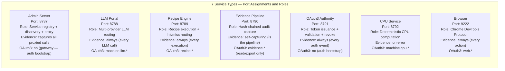

---

## Service 1: Admin Server (8787)

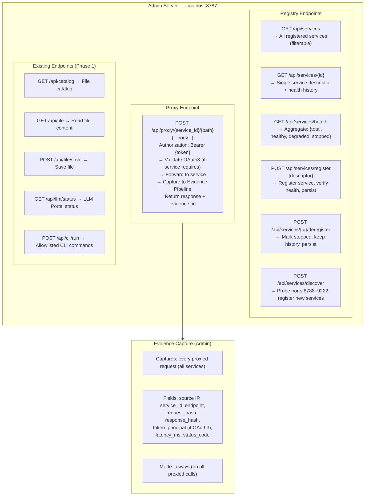

---

## Service 2: LLM Portal (8788)

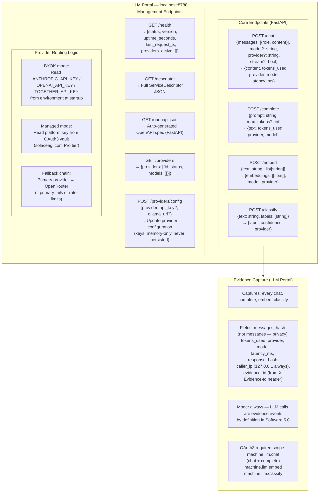

---

## Service 3: Recipe Engine (8789)

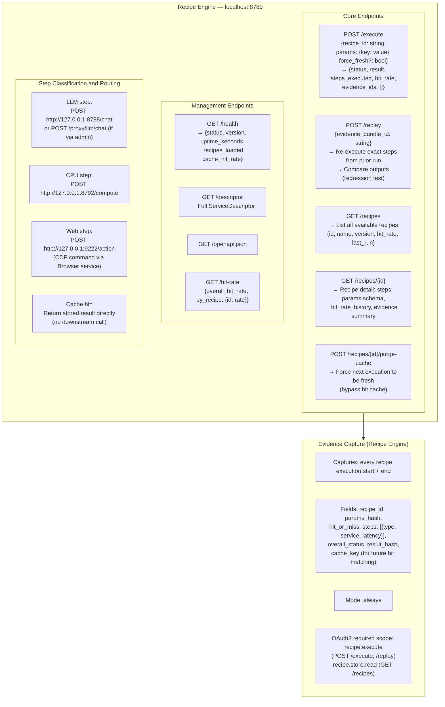

---

## Service 4: Evidence Pipeline (8790)

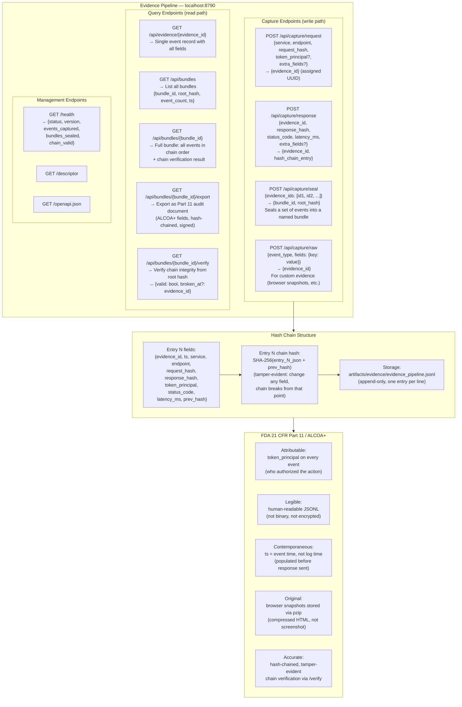

---

## Service 5: OAuth3 Authority (8791)

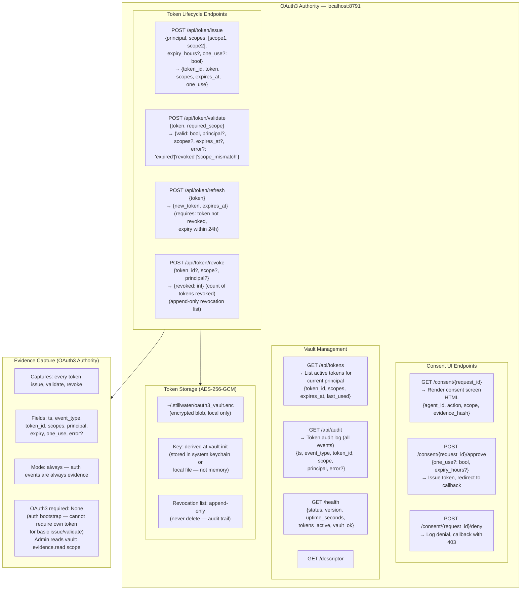

---

## Service 6: CPU Service (8792)

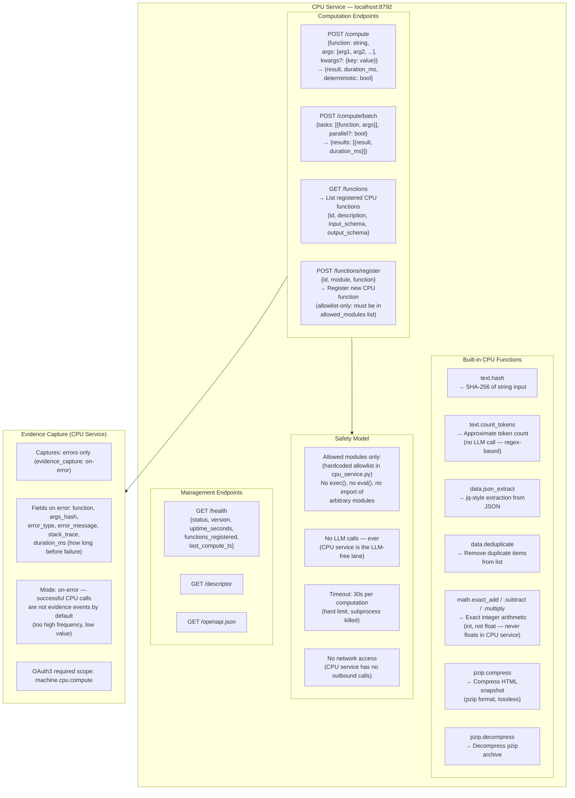

---

## Service 7: Browser (9222)

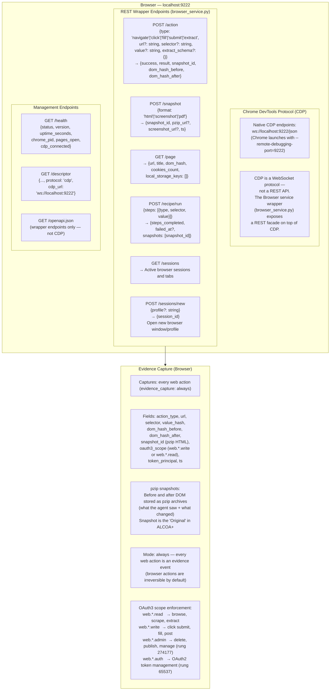

---

## Evidence Capture Summary: All Services

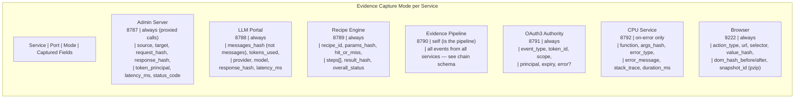

---

## OAuth3 Scope Summary: All Services

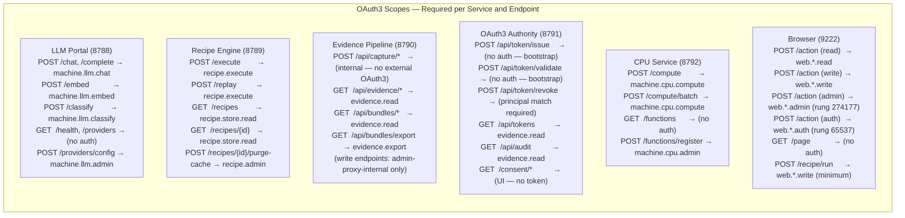

---

## Request/Response Flow: End-to-End Example

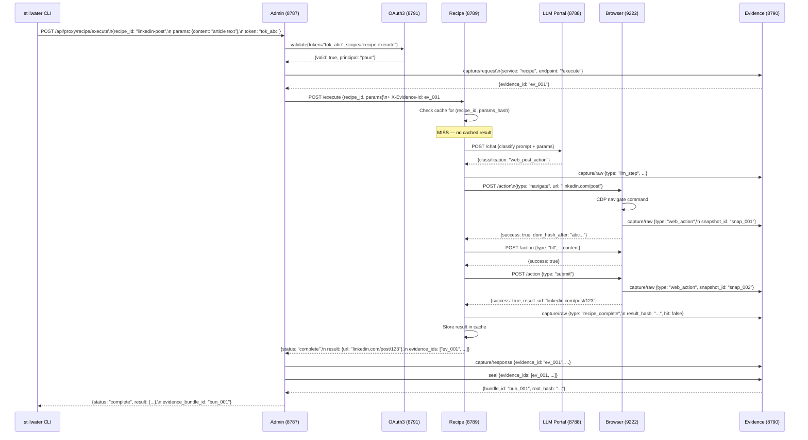

---

## Source Files

- `admin/server.py` — Admin Server (Phase 1; registry/proxy endpoints in Phase 2)
- `admin/llm_portal.py` — LLM Portal (Phase 1 service; full endpoint set)
- `papers/54-webservice-first-architecture.md` — Architectural narrative
- `diagrams/stillwater/23-service-registry.md` — ServiceDescriptor model and registry flow
- `diagrams/stillwater/24-service-mesh.md` — Inter-service communication topology
- `diagrams/stillwater/20-oauth3-flow.md` — OAuth3 token lifecycle (OAuth3 Authority design)

---

## Coverage

- All 7 service types: port, role, evidence mode, OAuth3 scope requirements
- Admin Server: registry endpoints (6) + proxy endpoint + existing Phase 1 endpoints
- LLM Portal: chat/complete/embed/classify + provider routing (BYOK vs managed) + management
- Recipe Engine: execute/replay + step classification (LLM/CPU/web/sub-recipe) + hit rate
- Evidence Pipeline: capture endpoints (4) + query endpoints (5) + hash chain schema + ALCOA+ mapping
- OAuth3 Authority: token lifecycle (issue/validate/refresh/revoke) + consent UI + vault storage
- CPU Service: compute endpoints + built-in function catalog (7 functions) + safety model + allowlist
- Browser: CDP architecture + REST wrapper endpoints (6) + pzip snapshot evidence + scope per action type
- Evidence capture modes per service: never / on-error / always — with justification
- OAuth3 scope table: every endpoint for every service with required scope
- End-to-end example: linkedin-post recipe through all 7 services with evidence chain
