# Stillwater Swarm Architecture v1.0.0

**Document type:** prime-mermaid.md (canonical spec)
**Canonical body:** README.mmd
**Identity:** README.sha256
**Version:** 1.0.0
**Authority:** 65537
**Status:** SEALED

---

## Purpose

This document defines the swarm architecture for the Stillwater project. It shows:

- The **main session** as the dispatch center (minimal context, maximum coordination)
- All **agent types** as typed nodes (with their assigned skill packs)
- **Artifact flow** arrows between the main session and each agent
- **Skill files** as separate nodes feeding into agents (dashed edges = "loaded by")

The canonical Mermaid body is `README.mmd`. The SHA-256 identity is `README.sha256`.

---

## Architecture Overview

### Main Session

The main session is the orchestration hub. It:
- Holds the minimal shared context (task, prior artifacts, scope)
- Dispatches sub-tasks to typed agents with skill packs injected inline
- Receives artifacts back from agents and routes them to downstream agents
- Never attempts to do the work of any agent role itself

### Agent Types

| Category | Agent | Primary Persona | Rung | Key Skill |
|---|---|---|---|---|
| Core | Scout | Ken Thompson | 641 | prime-coder |
| Core | Forecaster | Grace Hopper | 641 | phuc-forecast |
| Core | Judge | Ada Lovelace | 641 | phuc-forecast |
| Core | Coder | Donald Knuth | 641-65537 | prime-coder |
| Core | Skeptic | Alan Turing | 274177 | prime-coder + phuc-forecast |
| Core | Podcast | Carl Sagan | 641 | software5.0-paradigm |
| Specialist | Mathematician | Emmy Noether | 274177 | prime-math |
| Specialist | Writer | Richard Feynman | 641 | software5.0 + phuc-context |
| Specialist | Graph Designer | Grace Hopper | 641 | prime-mermaid |
| Specialist | Planner | Grace Hopper | 641 | phuc-forecast + phuc-context |
| Specialist | Janitor | Edsger Dijkstra | 641 | phuc-cleanup |
| Specialist | Wish Manager | Donald Knuth | 641 | prime-wishes + prime-mermaid |
| Security | Security Auditor | Bruce Schneier | 65537 | prime-coder (security gate) |
| Support | Context Manager | Barbara Liskov | 641 | phuc-context |
| Support | Social Media | MrBeast | 641 | phuc-forecast |

### The Core Swarm Loop (phuc-forecast spine)

```
DREAM  → Scout      (map codebase, define done, collect assets)
FORECAST → Forecaster (premortem, failure modes, stop rules)
DECIDE → Judge      (choose approach, lock scope, set rung target)
ACT    → Coder      (smallest valid patch, red→green gate)
VERIFY → Skeptic    (seed sweep, replay, adversarial, falsifiers)
REFLECT → Podcast   (lessons, recipe extraction, skill deltas)
```

This is the canonical ordering for any code or system change task.

### Specialist Agents (invoked on demand)

- **Mathematician:** IMO problems, proofs, exact computation, convergence analysis
- **Writer:** papers, technical reports, books (with typed claims [A/B/C])
- **Graph Designer:** state machines, architecture diagrams, canonical Mermaid
- **Planner:** standalone DREAM→FORECAST→DECIDE→ACT→VERIFY planning
- **Janitor:** workspace cleanup with scan/approve/apply receipts
- **Wish Manager:** wish contracts, belt progression, Prime Mermaid state tracking
- **Security Auditor:** full security gate (always rung 65537)
- **Context Manager:** CNF capsule creation, anti-rot, multi-turn context hygiene

---

## Node Type Legend

| Shape | Meaning | Examples |
|---|---|---|
| Box (thick border) | Main session (hub) | MAIN_SESSION |
| Box (blue border) | Core swarm agent | Scout, Forecaster, Judge, Coder, Skeptic, Podcast |
| Box (cyan border) | Specialist agent | Mathematician, Writer, Graph Designer, etc. |
| Pill (purple border) | Skill file | prime-safety.md, prime-coder.md, etc. |
| Cylinder (green border) | Artifact | SCOUT_REPORT.json, PATCH_DIFF, etc. |

## Edge Type Legend

| Edge | Meaning |
|---|---|
| `-->` solid | CNF capsule dispatch or artifact return |
| `-.->` dashed | Skill loaded by agent |

## Color Semantics

| Color | Meaning |
|---|---|
| `#1a1a2e` (deep navy) | Main session |
| `#16213e` (dark blue) | Core swarm agent |
| `#0f3460` (mid blue) | Specialist agent |
| `#533483` (purple) | Skill file |
| `#1b4332` (dark green) | Artifact |

---

## Forbidden States (Graph-Level)

The graph structure itself must never enter these states:

- **UNLABELED_BRANCH_FROM_DECISION_NODE:** every diamond must have labeled branches for all paths
- **OPEN_STATE_ENUMERATION:** no "..." or "etc." agents; all agent types are named
- **SHA256_OVER_NON_CANONICAL_FORM:** sha256 computed over normalized README.mmd bytes only
- **DRIFT_WITHOUT_VERSION_BUMP:** modifying README.mmd without updating README.sha256 and version

---

## SHA-256 Identity

```
File: README.mmd
SHA-256: d1d5977267a31239273721228de252ed6971a5908747d0e4f09fd2672bb75429
```

Recompute to verify: `sha256sum swarms/README.mmd`

Any change to README.mmd requires:
1. Recompute sha256 and update README.sha256
2. Bump version in this document (MINOR for additions, MAJOR for removals)
3. Update this document's SHA-256 reference

---

## Canonical Mermaid Diagram

```mermaid
flowchart TD
  classDef session fill:#1a1a2e,stroke:#65537,color:#fff,stroke-width:3px
  classDef core fill:#16213e,stroke:#4a90d9,color:#fff,stroke-width:2px
  classDef specialist fill:#0f3460,stroke:#7ec8e3,color:#fff,stroke-width:2px
  classDef skill fill:#533483,stroke:#c9b1ff,color:#ddd,font-size:11px,stroke-width:1px
  classDef artifact fill:#1b4332,stroke:#52b788,color:#fff,font-size:11px,stroke-width:1px
  classDef gate fill:#fff9c4,stroke:#f9a825,color:#333,stroke-width:2px
  classDef forbidden fill:#ffefef,stroke:#cc0000,color:#900,stroke-width:2px

  MAIN["MAIN SESSION
  prime-safety
  prime-coder
  phuc-orchestration"]:::session

  subgraph CORE_SWARM["Core Swarm (phuc-forecast spine)"]
    SCOUT["SCOUT
    Ken Thompson
    RNG: 641"]:::core
    FORECASTER["FORECASTER
    Grace Hopper
    RNG: 641"]:::core
    JUDGE["JUDGE
    Ada Lovelace
    RNG: 641"]:::core
    CODER["CODER
    Donald Knuth
    RNG: 641/274177/65537"]:::core
    SKEPTIC["SKEPTIC
    Alan Turing
    RNG: 274177"]:::core
    PODCAST["PODCAST
    Carl Sagan
    RNG: 641"]:::core
  end

  subgraph SPECIALISTS["Specialist Agents"]
    MATHEMATICIAN["MATHEMATICIAN
    Emmy Noether
    RNG: 274177"]:::specialist
    WRITER["WRITER
    Richard Feynman
    RNG: 641"]:::specialist
    GRAPH_DESIGNER["GRAPH-DESIGNER
    Grace Hopper
    RNG: 641"]:::specialist
    PLANNER["PLANNER
    Grace Hopper
    RNG: 641"]:::specialist
    JANITOR["JANITOR
    Edsger Dijkstra
    RNG: 641"]:::specialist
    WISH_MANAGER["WISH-MANAGER
    Donald Knuth
    RNG: 641"]:::specialist
    SECURITY_AUDITOR["SECURITY-AUDITOR
    Bruce Schneier
    RNG: 65537"]:::specialist
    CONTEXT_MANAGER["CONTEXT-MANAGER
    Barbara Liskov
    RNG: 641"]:::specialist
  end

  subgraph SKILLS["Skill Files (swarms/skills/)"]
    SK_SAFETY["prime-safety.md"]:::skill
    SK_CODER["prime-coder.md"]:::skill
    SK_FORECAST["phuc-forecast.md"]:::skill
    SK_MATH["prime-math.md"]:::skill
    SK_MERMAID["prime-mermaid.md"]:::skill
    SK_S50["software5.0-paradigm.md"]:::skill
    SK_CONTEXT["phuc-context.md"]:::skill
    SK_CLEANUP["phuc-cleanup.md"]:::skill
    SK_WISHES["prime-wishes.md"]:::skill
  end

  subgraph ARTIFACTS["Primary Artifacts"]
    A_SCOUT["SCOUT_REPORT.json
    completeness_matrix.json"]:::artifact
    A_FORECAST["FORECAST_MEMO.json"]:::artifact
    A_DECISION["DECISION_RECORD.json"]:::artifact
    A_PATCH["PATCH_DIFF
    repro_red.log
    repro_green.log
    tests.json
    evidence/plan.json"]:::artifact
    A_SKEPTIC["SKEPTIC_VERDICT.json
    falsifiers_list.md"]:::artifact
    A_PODCAST["LESSONS.md
    RECIPE.md
    PODCAST_TRANSCRIPT.md"]:::artifact
    A_PROOF["PROOF.md
    convergence.json
    halting_certificate.json"]:::artifact
    A_DRAFT["DRAFT.md
    RECIPE.md"]:::artifact
    A_GRAPH["state.prime-mermaid.md
    state.mmd
    state.sha256"]:::artifact
    A_PLAN["PLAN.json
    FORECAST_MEMO.json"]:::artifact
    A_CLEANUP["cleanup-scan-ts.json
    cleanup-apply-ts.json"]:::artifact
    A_WISH["wish.id.md
    state.mmd
    belt_promotion_receipt.json"]:::artifact
    A_SECURITY["security_scan.json
    EXPLOIT_REPRO.py
    MITIGATION.md"]:::artifact
    A_CONTEXT["context_capsule.json
    compaction_log.txt"]:::artifact
  end

  MAIN -->|"CNF capsule + [prime-safety, prime-coder]"| SCOUT
  SCOUT -->|"SCOUT_REPORT.json"| A_SCOUT
  A_SCOUT -->|"scout artifacts"| MAIN

  MAIN -->|"CNF capsule + [prime-safety, phuc-forecast]"| FORECASTER
  A_SCOUT -->|"input: SCOUT_REPORT"| FORECASTER
  FORECASTER -->|"FORECAST_MEMO.json"| A_FORECAST
  A_FORECAST -->|"forecast artifacts"| MAIN

  MAIN -->|"CNF capsule + [prime-safety, phuc-forecast]"| JUDGE
  A_SCOUT -->|"input: SCOUT_REPORT"| JUDGE
  A_FORECAST -->|"input: FORECAST_MEMO"| JUDGE
  JUDGE -->|"DECISION_RECORD.json"| A_DECISION
  A_DECISION -->|"decision artifacts"| MAIN

  MAIN -->|"CNF capsule + [prime-safety, prime-coder]"| CODER
  A_DECISION -->|"input: DECISION_RECORD"| CODER
  CODER -->|"patch + evidence"| A_PATCH
  A_PATCH -->|"coder artifacts"| MAIN

  MAIN -->|"CNF capsule + [prime-safety, prime-coder, phuc-forecast]"| SKEPTIC
  A_PATCH -->|"input: PATCH + tests"| SKEPTIC
  SKEPTIC -->|"SKEPTIC_VERDICT.json"| A_SKEPTIC
  A_SKEPTIC -->|"skeptic artifacts"| MAIN

  MAIN -->|"CNF capsule + [prime-safety, software5.0-paradigm]"| PODCAST
  A_SKEPTIC -->|"input: full swarm run"| PODCAST
  PODCAST -->|"lessons + recipe"| A_PODCAST
  A_PODCAST -->|"podcast artifacts"| MAIN

  MAIN -->|"CNF capsule + [prime-safety, prime-math]"| MATHEMATICIAN
  MATHEMATICIAN -->|"proof + certificate"| A_PROOF
  A_PROOF -->|"math artifacts"| MAIN

  MAIN -->|"CNF capsule + [prime-safety, software5.0, phuc-context]"| WRITER
  WRITER -->|"draft + recipe"| A_DRAFT
  A_DRAFT -->|"writing artifacts"| MAIN

  MAIN -->|"CNF capsule + [prime-safety, prime-mermaid]"| GRAPH_DESIGNER
  GRAPH_DESIGNER -->|"graph + sha256"| A_GRAPH
  A_GRAPH -->|"graph artifacts"| MAIN

  MAIN -->|"CNF capsule + [prime-safety, phuc-forecast, phuc-context]"| PLANNER
  PLANNER -->|"PLAN.json"| A_PLAN
  A_PLAN -->|"plan artifacts"| MAIN

  MAIN -->|"CNF capsule + [prime-safety, phuc-cleanup]"| JANITOR
  JANITOR -->|"scan + apply receipts"| A_CLEANUP
  A_CLEANUP -->|"cleanup artifacts"| MAIN

  MAIN -->|"CNF capsule + [prime-safety, prime-wishes, prime-mermaid]"| WISH_MANAGER
  WISH_MANAGER -->|"wish contract + state"| A_WISH
  A_WISH -->|"wish artifacts"| MAIN

  MAIN -->|"CNF capsule + [prime-safety, prime-coder]"| SECURITY_AUDITOR
  SECURITY_AUDITOR -->|"scan + exploit + mitigation"| A_SECURITY
  A_SECURITY -->|"security artifacts"| MAIN

  MAIN -->|"session history + turn N"| CONTEXT_MANAGER
  CONTEXT_MANAGER -->|"context_capsule.json"| A_CONTEXT
  A_CONTEXT -->|"fresh CNF capsule"| MAIN

  SK_SAFETY -.->|"loaded by"| SCOUT
  SK_SAFETY -.->|"loaded by"| FORECASTER
  SK_SAFETY -.->|"loaded by"| JUDGE
  SK_SAFETY -.->|"loaded by"| CODER
  SK_SAFETY -.->|"loaded by"| SKEPTIC
  SK_SAFETY -.->|"loaded by"| PODCAST
  SK_SAFETY -.->|"loaded by"| MATHEMATICIAN
  SK_SAFETY -.->|"loaded by"| WRITER
  SK_SAFETY -.->|"loaded by"| GRAPH_DESIGNER
  SK_SAFETY -.->|"loaded by"| PLANNER
  SK_SAFETY -.->|"loaded by"| JANITOR
  SK_SAFETY -.->|"loaded by"| WISH_MANAGER
  SK_SAFETY -.->|"loaded by"| SECURITY_AUDITOR
  SK_SAFETY -.->|"loaded by"| CONTEXT_MANAGER

  SK_CODER -.->|"loaded by"| SCOUT
  SK_CODER -.->|"loaded by"| CODER
  SK_CODER -.->|"loaded by"| SKEPTIC
  SK_CODER -.->|"loaded by"| SECURITY_AUDITOR

  SK_FORECAST -.->|"loaded by"| FORECASTER
  SK_FORECAST -.->|"loaded by"| JUDGE
  SK_FORECAST -.->|"loaded by"| SKEPTIC
  SK_FORECAST -.->|"loaded by"| PLANNER

  SK_MATH -.->|"loaded by"| MATHEMATICIAN
  SK_MERMAID -.->|"loaded by"| GRAPH_DESIGNER
  SK_MERMAID -.->|"loaded by"| WISH_MANAGER
  SK_S50 -.->|"loaded by"| PODCAST
  SK_S50 -.->|"loaded by"| WRITER
  SK_CONTEXT -.->|"loaded by"| WRITER
  SK_CONTEXT -.->|"loaded by"| PLANNER
  SK_CONTEXT -.->|"loaded by"| CONTEXT_MANAGER
  SK_CLEANUP -.->|"loaded by"| JANITOR
  SK_WISHES -.->|"loaded by"| WISH_MANAGER
```



---

## How To Add a New Agent Type

1. Create `swarms/{agent-type}.md` following the template structure (sections 0-8)
2. Define the agent's role, skill pack, persona, artifacts, CNF template, FSM, forbidden states, verification ladder, and anti-patterns
3. Update `README.mmd` to add the new agent node, skill edges, and artifact nodes
4. Recompute `sha256sum swarms/README.mmd` and update `README.sha256`
5. Bump version in this document (MINOR bump for new agents)
6. Update `skills/README.md` to reference the new agent if it uses a new skill

## How To Update a Skill Pack

1. Edit the target `swarms/{agent-type}.md` skill_pack frontmatter and section 1
2. Update the dashed skill edges in `README.mmd`
3. Recompute sha256 and update `README.sha256`
4. MINOR bump (new skill added to agent) or MAJOR bump (skill removed from agent)
