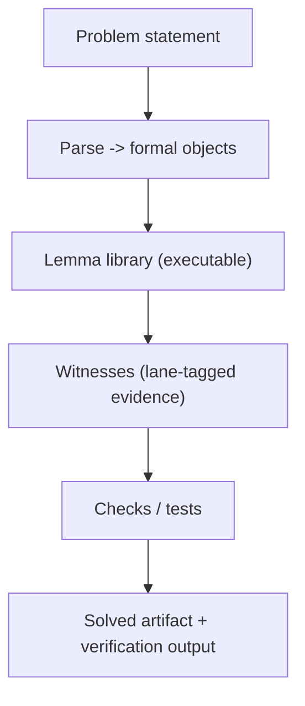
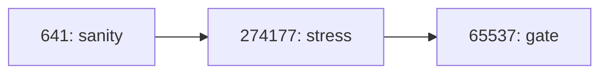

# imo/

This folder contains the Math Olympiad (IMO) demo code and tests.

Primary runnable artifact:
- `HOW-TO-CRUSH-MATH-OLYMPIAD.ipynb`

Code:
- `imo/src/imo_2024_solver_proper.py` (deterministic/offline path)
- `imo/src/geometry_lemma_library.py` (executable lemma scaffolding)
- `imo/src/imo_solver_real.py` (optional LLM-backed path)

## Proof Pipeline (Prime Diagram)



## Verification Ladder (Prime Rungs)



## Run

```bash
python -m nbconvert --execute --to notebook --inplace HOW-TO-CRUSH-MATH-OLYMPIAD.ipynb
```

