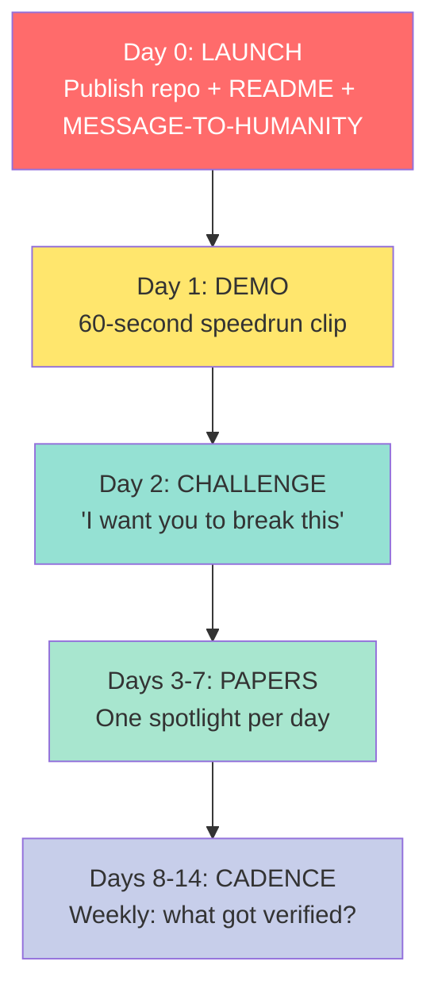
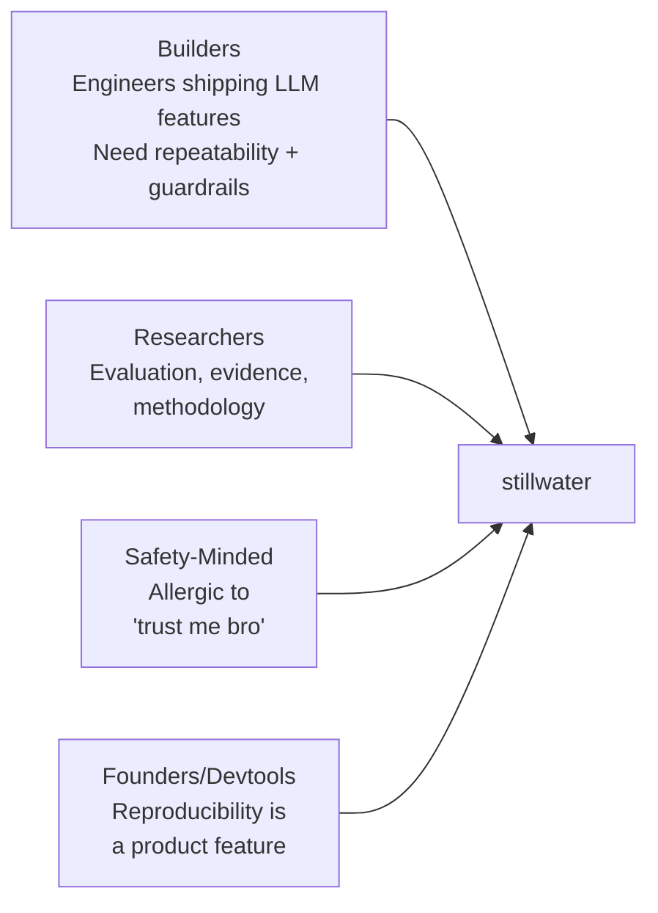
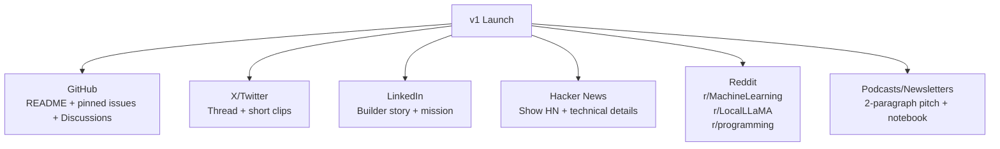

# Marketing Plan (Launch v1)

> "Showing off is the fool's idea of glory." -- Bruce Lee
>
> We would rather show less and prove more.

Repo: https://github.com/phuctruong/stillwater

Goal: get the right humans to run the notebooks, open issues, and turn this into something peer-reviewable and durable.

---

## Positioning (One Sentence)

Stillwater is a documentation-first repo (papers + notebooks + skills) for building AI workflows that feel less like vibes and more like rerunnable evidence. Think Bruce Lee's Jeet Kune Do for AI: strip what doesn't work, keep what does, prove it with artifacts.

## The Launch Tower (What Ships When)

## Primary Audiences

## Launch Assets (Ship These First)

- `MESSAGE-TO-HUMANITY.md` (mission -- the fire, the boat, the choice)
- `HOW-TO-CRUSH-SWE-BENCHMARK.ipynb` (500 real SWE-bench tests, not toy examples)
- `PHUC-ORCHESTRATION-SECRET-SAUCE.ipynb` (demo notebook -- the full DREAM->VERIFY loop)
- `AGI-SECRET-SAUCE.md` (the Game of Death tower -- 5 floors, 10 dragons)
- `papers/00-index.md` (map of concepts)

## Key Messages (The Five Punches)

> "I fear not the man who has practiced 10,000 kicks once, but I fear the man who has practiced one kick 10,000 times." -- Bruce Lee

1. **Verification-first:** "Rerun it. Inspect it. Don't just believe it."
2. **Portable demos:** "Offline demo mode by default. No API keys required."
3. **Honest claims:** "If it's not reproduced in repo, it's a hypothesis."
4. **Human story:** Born on a boat, forged at Harvard, open-sourced for the world.
5. **500 real SWE tests:** "Not toy examples. Real SWE-bench instances. 100% RED/GREEN."

## Content Calendar (14 Days)

Day 0:
- Publish repo + pin `MESSAGE-TO-HUMANITY.md`
- Post thread (X), LinkedIn post, Show HN
- "We just open-sourced 500 real SWE-bench tests with 100% RED/GREEN gate verification."

Day 1:
- Short demo clip/gif: nbconvert executing a notebook + clean outputs
- Post "How to run in 60 seconds" snippet

Day 2:
- Deep-dive post: "Why offline demo mode matters"
- Ask for reviewers: "I want you to break this"

Day 3:
- Paper spotlight: `papers/01-lane-algebra.md` (with one clear, practical example)

Day 4:
- Paper spotlight: `papers/02-counter-bypass.md`

Day 5:
- Paper spotlight: `papers/03-verification-ladder.md`

Day 6:
- "Behind the scenes": how the skills are structured + why "don't compress" matters

Day 7:
- Community roundup: thank-you post + link top issues/PRs

Days 8-14:
- Repeat 3 formats: demo snippet, paper spotlight, open question
- Start a weekly cadence: "Stillwater Weekly: what got verified this week?"

## Distribution Channels (Practical)

## Call To Action (Make It Easy)

> "Simplicity is the key to brilliance." -- Bruce Lee

Give people 3 asks max:
1. Star the repo.
2. Run one notebook.
3. Open one issue: "what confused you" or "what broke".

## Metrics (Don't Lie To Yourself)

Week 1 targets:
- 1k stars
- 20 issues (good issues are a sign people actually ran things)
- 5 external PRs
- 10 people who can reproduce the notebooks on their machine

## "Max Humor" Rule (Branding)

Humor is allowed, but keep these non-negotiables:
- no overclaiming
- no dunking on individuals
- no "growth hacks" that look like spam

If a post makes you laugh and a reviewer trust you more, ship it.
If it makes you laugh but makes a reviewer trust you less, delete it.

> "Mistakes are always forgivable, if one has the courage to admit them." -- Bruce Lee

---

*Endure, Excel, Evolve. Carpe Diem!*
