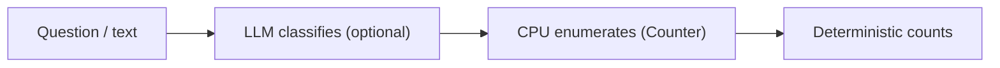
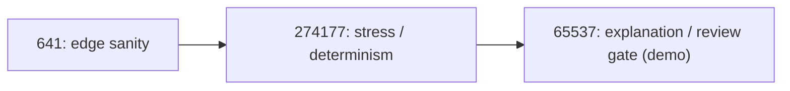

# oolong/

OOLONG is the “long context aggregation” demo in this repo.

Primary runnable artifact:
- `HOW-TO-OOLONG-BENCHMARK.ipynb`

Code:
- `oolong/src/oolong_solver.py` (deterministic/offline path)
- `oolong/src/oolong_solver_real.py` (optional LLM-backed path)

## Counter Bypass (Prime Diagram)



## Verification Ladder (Prime Rungs)



## Run

```bash
python -m nbconvert --execute --to notebook --inplace HOW-TO-OOLONG-BENCHMARK.ipynb
```
