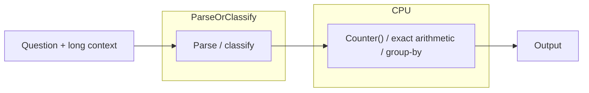

# Counter Bypass Protocol: LLM Classifies, CPU Enumerates (Pattern)

**Status:** Draft (open-source, repo-backed where referenced)  
**Last updated:** 2026-02-17  
**Scope:** A hybrid pattern for exact aggregation: use an LLM (or rules) for parsing/classification and deterministic CPU code for enumeration/aggregation.  
**Auth:** 65537 (project tag)

---

## Abstract

When a task reduces to exact aggregation (counts, top-k, uniqueness, group-by), the correct engineering move is deterministic enumeration. The Counter Bypass Protocol is the operational pattern:

1. Convert unstructured text into a structured representation (classification/parsing).
2. Perform aggregation on the CPU using exact routines (`Counter()`, integer arithmetic, sorting).

This repo includes a small executable demo and notebook. It does not claim external benchmark scores unless a reproducible harness is shipped in-repo.

---

## Claim Hygiene

- This paper describes a pattern.
- It does **not** claim reproduced leaderboard numbers.
- If you want to add numbers, add an in-repo harness + logged outputs (see `papers/99-claims-and-evidence.md`).

---

## Reproduce / Verify In This Repo

1. Run: `HOW-TO-OOLONG-BENCHMARK.ipynb`
2. Read:
   - `src/oolong/src/oolong_solver.py` (deterministic demo)
   - `src/oolong/src/solve-oolong.py` (runner)
3. Optional (external tooling):
   - `src/oolong/src/oolong_solver_real.py`

---

## 1. The Pattern

### 1.1 Why This Works

- The CPU aggregation step is deterministic and replayable.
- The only uncertainty is pushed to the parsing/classification boundary.

That shift makes systems easier to audit: you can test parsing and verify aggregation independently.

---

## 2. What Is Guaranteed (And What Is Not)

### 2.1 Deterministic aggregation step

If the structured representation is correct, the aggregation result is correct by construction.

Examples:
- Counting categories: `Counter(labels)`
- Uniqueness: `len(set(values))`
- Top-k: `counter.most_common(k)`

### 2.2 End-to-end correctness

End-to-end correctness depends on:
- parsing correctness
- schema/attribute selection
- query classification

The protocol does not magically eliminate those risks; it makes them explicit and testable.

---

## 3. Practical Checklist

When applying Counter Bypass in a production system:

- Define a strict schema for the structured representation.
- Fail closed when parsing is ambiguous.
- Add regression tests for parsing and dispatch.
- Log the structured representation alongside outputs for debugging.

---

## 4. Where It Fits

Counter Bypass is most appropriate when:
- the answer is an exact aggregate
- the context can be parsed into records/fields

It is less appropriate when:
- the task is inherently open-ended (creative writing)
- the definition of correctness is subjective

---

## References

- `papers/20-oolong-proof.md` (repo-local case study)
- `papers/99-claims-and-evidence.md` (repo policy)
