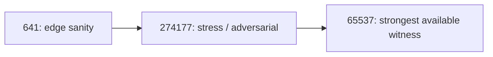

# Verification Ladder: 641 -> 274177 -> 65537 (Operational Gates)

**Status:** Draft (open-source, repo-backed where referenced)  
**Last updated:** 2026-02-17  
**Scope:** A practical gating framework for "how sure are we?" in tool-using and code-producing workflows.  
**Auth:** 65537 (project tag)

---

## Abstract

LLM confidence is not a correctness proof.

The Verification Ladder is a simple operational idea: separate verification into rungs with increasing cost and increasing witness strength. In this repo, the rungs are used as a reporting discipline and as a mental model for what evidence is required before making strong claims.

This ladder is not, by itself, a formal proof system, and it does not magically provide numeric failure bounds without additional assumptions and artifacts.

---

## Claim Hygiene

- This paper does not claim reproduced SWE-bench success rates.
- It does not claim "18 months of deployment" statistics.
- Any future numeric claims should ship with an in-repo harness + logs.

See `papers/99-claims-and-evidence.md`.

---

## Reproduce / Verify In This Repo

- Lane typing policy: `papers/01-lane-algebra.md`
- Claim policy: `papers/99-claims-and-evidence.md`
- Notebooks that use rung-style reporting:
  - `HOW-TO-CRUSH-MATH-OLYMPIAD.ipynb`
  - `HOW-TO-CRUSH-OOLONG-BENCHMARK.ipynb`

---

## 1. The Three Rungs

The rung numbers are memorable labels (prime-flavored), not mathematical guarantees.



### 1.1 Rung 641 (Edge Sanity)

Goal: catch obvious breakage.

Examples:
- unit tests on representative small inputs
- schema validation
- basic invariants (non-empty outputs, parse success)

### 1.2 Rung 274177 (Stress / Adversarial)

Goal: catch edge failures.

Examples:
- fuzz/property tests
- adversarial input suites
- performance tests
- regression tests for past bugs

### 1.3 Rung 65537 (Strongest Available Witness)

Goal: require the strongest evidence that is feasible for the domain.

Examples:
- formal proofs (rare, expensive)
- independent implementations that agree
- cross-checking with authoritative sources
- deterministic verification where applicable

**Important:** in most repositories, rung 65537 will be a *review gate* or *explanation gate*, not a machine-checked proof system.

---

## 2. Relationship To Lane Algebra

- The ladder is about **how hard you verified**.
- Lane Algebra is about **what you are allowed to claim**.

A useful mapping:
- a claim supported only by informal reasoning should not be presented as Lane A.
- a claim supported by runnable tests/tool output can be Lane A (for that scope).

---

## 3. Example Report (Illustrative)

This is an example of rung-style reporting that a notebook or CI job might emit:

```
Rung 641: PASS (unit tests)
Rung 274177: PASS (fuzz/regression suite)
Rung 65537: PASS (explanation + independent cross-check)
Confidence: Lane B (checked in-repo; not an external certificate)
```

This repo does not currently ship a universal CLI that produces formal certificates for arbitrary projects. Treat any certificate schema shown elsewhere as an example until a real implementation is added.

---

## 4. Limitations

- The ladder is not a substitute for domain expertise.
- "PASS" is only meaningful if the test suite is meaningful.
- Formal verification is often infeasible; the framework is designed to remain useful anyway.

---

## 5. Practical Contributor Checklist

When you add a new major claim:

1. Add a reproduction recipe (notebook/script).
2. Add rung-style evidence:
   - 641: unit tests or minimal sanity checks
   - 274177: regression/fuzz/property tests
   - 65537: strongest available witness you can actually ship
3. Update the relevant paper with links to the artifacts.

---

## References

- `papers/01-lane-algebra.md`
- `papers/99-claims-and-evidence.md`
