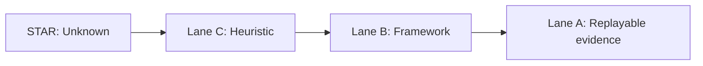
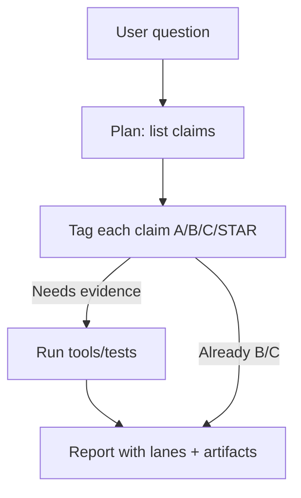

# Solving Hallucination: Lane Algebra + Verification Discipline (Operational)

**Status:** Draft (open-source, repo-backed where referenced)  
**Last updated:** 2026-02-17  
**Scope:** Operational practices that reduce ungrounded claims in tool-using sessions.  
**Auth:** 65537 (project tag)

---

## Abstract

"Hallucination" is best treated as an operational failure: the system emits claims without sufficient witness strength, and then presents them as if they were verified.

This paper describes a workflow-level mitigation:
- **Lane Algebra:** epistemically type each claim (A/B/C/STAR).
- **Verification discipline:** require runnable evidence artifacts before upgrading confidence.

This repo demonstrates the approach as documentation + skills constraints + notebook reporting. It does not claim model-specific hallucination rates without a reproducible benchmark harness.

---

## Claim Hygiene

This paper avoids model-comparison numbers.

If you want to include empirical metrics (hallucination rate, coverage, false positives), the bar is:
- a runnable harness in-repo
- logged outputs
- pinned prompts/configs
- clear definitions

See `papers/99-claims-and-evidence.md`.

---

## Reproduce / Verify In This Repo

- Spec:
  - `papers/01-lane-algebra.md`
  - `papers/03-verification-ladder.md`
- Skills (coding discipline):
  - `skills/prime-coder.md`
- Notebook-style application:
  - `PHUC-ORCHESTRATION-SECRET-SAUCE.ipynb`

---

## 1. What We Mean By "Hallucination"

A practical definition for engineering work:

> A hallucination is a claim presented without adequate evidence for the confidence level implied.

Two common subtypes:
- **Fabrication:** the claim is false (e.g., non-existent APIs, invented citations).
- **Premise laundering:** the claim might be true, but the system cannot produce a witness.

The second subtype is the one teams underestimate: it still breaks audits, reproducibility, and safety reviews.

---

## 2. Lane Algebra (Summary)

Lane Algebra is a reporting constraint.

- **Lane A:** replayable evidence exists (tests/tool output/checked artifacts).
- **Lane B:** definitions and stable background assumptions (non-controversial).
- **Lane C:** heuristic inference; plausible but not verified.
- **STAR:** unknown.

**Core rule (MIN):** composed claims cannot exceed the weakest premise.

This prevents a common failure mode:
- tool output exists (Lane A)
- model adds extra gloss (Lane C)
- the combined sentence gets presented as "proven" (incorrect upgrade)

---

## 3. Verification Discipline

Lane Algebra becomes useful when it constrains behavior:

1. **Fail closed on missing witnesses.**
2. **Require artifacts for upgrades.**
3. **Prefer small, replayable checks over long narratives.**

---

## 4. What This Approach Solves (And What It Does Not)

It helps with:
- invented file paths or APIs
- "it compiles" claims without running tests
- confident summaries that exceed available evidence

It does not automatically solve:
- ambiguous specs
- missing test coverage
- deep scientific disputes
- alignment/safety beyond epistemic hygiene

Lane Algebra is not alignment; it is a constraint on *what you are allowed to claim*.

---

## 5. Practical Checklists

### For coding tasks
- Every behavioral claim should be paired with a witness: `pytest`, a repro script, a diff, or tool output.
- If you cannot run it, downgrade the lane and say what is missing.

### For research/papers/docs
- Avoid placeholder citations.
- If you include a table of results, include the harness or label it as non-reproduced background.

---

## 6. Minimal Example

Bad (implicit upgrade):
- "This bug is fixed." (no witness)

Good (lane-typed):
- "Lane A: `pytest -q` passes." (tool output)
- "Lane C: I believe this covers the intended edge cases; add property tests to confirm." (explicit uncertainty)

---

## References

- `papers/01-lane-algebra.md` (repo spec)
- `papers/99-claims-and-evidence.md` (repo policy)
