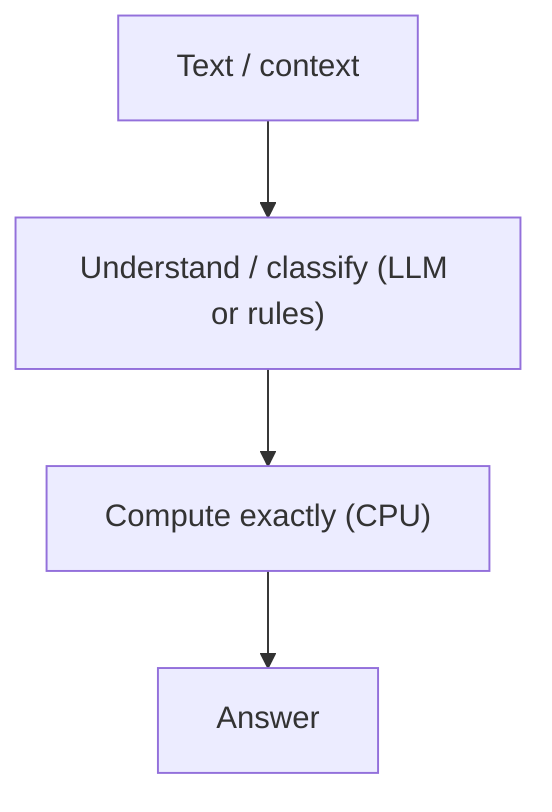

# Solving Counting Failures: Deterministic Aggregation (Operational)

**Status:** Draft (open-source, repo-backed where referenced)  
**Last updated:** 2026-02-17  
**Scope:** Why exact aggregation should be CPU-backed, and how this repo demonstrates the pattern.  
**Auth:** 65537 (project tag)

---

## Abstract

Counting is not a "reasoning" problem. It is an enumeration problem.

When systems try to count "in the head" (pure LLM), they often produce plausible-but-wrong tallies. The correct fix is not better prompting; it is deterministic computation.

This repo demonstrates a CPU-first aggregation demo (parse -> `Counter()` -> dispatch) and a notebook that runs it.

---

## Claim Hygiene

This paper does not claim external benchmark percentages.

If you want to publish numeric results, add an in-repo harness and log outputs (see `papers/99-claims-and-evidence.md`).

---

## Reproduce / Verify In This Repo

- Notebook: `HOW-TO-OOLONG-BENCHMARK.ipynb`
- Demo implementation: `src/oolong/src/oolong_solver.py`
- Runner: `src/oolong/src/solve-oolong.py`

---

## 1. Failure Mode

Common counting failure modes in tool-using sessions:
- the model loses its place in a long context
- the model double-counts or skips items
- the model provides an answer that sounds right but has no witness

---

## 2. Fix: Split "Understand" From "Compute"

- Treat classification/parsing as the only uncertain step.
- Treat aggregation as deterministic.

---

## 3. What This Repo Shows

- A small, rerunnable example of the pattern.
- A notebook that executes the demo and checks its output.

This is intended to be a seed for a real benchmark harness, not a substitute for one.

---

## 4. Limitations

- If parsing is wrong, aggregation will be wrong.
- If the data format shifts, the parser must be updated.

This is still a better failure mode than silent, un-auditable "counts" produced by a pure LLM.

---

## References

- `papers/02-counter-bypass.md`
- `papers/20-oolong-proof.md`
- `papers/99-claims-and-evidence.md`
