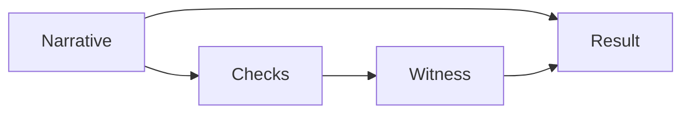

# Solving Reasoning: From Narratives To Witnesses (Operational)

**Status:** Draft (open-source, repo-backed where referenced)  
**Last updated:** 2026-02-17  
**Scope:** How to make reasoning outputs auditable by pairing them with executable checks and explicit uncertainty.  
**Auth:** 65537 (project tag)

---

## Abstract

Many reasoning failures are not a lack of "thinking". They are a lack of witnesses.

This repo pushes a simple discipline:
- separate the reasoning narrative from the evidence
- require runnable checks or tool output for strong claims
- label claims with lanes (A/B/C/STAR) and fail closed when witnesses are missing

---

## Claim Hygiene

This paper does not claim:
- official IMO grading
- machine-checked proof certificates
- external benchmark percentages

If you want to add numeric comparisons, ship a harness + logs in-repo (see `papers/99-claims-and-evidence.md`).

---

## Reproduce / Verify In This Repo

- Demo solver with executable checks:
  - `imo/src/imo_2024_solver_proper.py`
- Notebook that runs it:
  - `HOW-TO-MATH-OLYMPIAD.ipynb`
- Policy:
  - `papers/01-lane-algebra.md`
  - `papers/03-verification-ladder.md`

---

## 1. The Core Problem

Reasoning outputs often look like proofs but behave like stories:
- steps are not checkable
- hidden assumptions are not surfaced
- the system cannot say what evidence would change its mind

---

## 2. The Fix: Pair Reasoning With Checks

A useful pattern:

- The narrative is for humans.
- The witness is for correctness.

---

## 3. What This Repo Demonstrates

`imo/src/imo_2024_solver_proper.py`:
- implements solutions (as code) for a set of problems
- runs executable checks
- prints a stable stdout report that the notebook can verify

The notebook intentionally treats "6/6" as a demo-suite result, not an official competition claim.

---

## 4. Limitations

- executable checks are not the same as formal proofs
- an LLM self-check prompt is not authoritative
- test coverage can be incomplete

The goal is not to claim perfection; it is to make the system auditable and honest.

---

## References

- `papers/01-lane-algebra.md`
- `papers/03-verification-ladder.md`
- `papers/99-claims-and-evidence.md`
