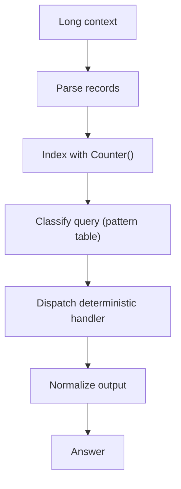

# OOLONG-Style Aggregation: Why Counter() Beats Attention For Exact Counting (Case Study)

**Status:** Draft (open-source, repo-backed where referenced)  
**Last updated:** 2026-02-17  
**Scope:** CPU-first aggregation for long-context counting-style tasks; demonstrated in-repo.  
**Auth:** 65537 (project tag)

---

## Abstract

Exact aggregation (counts, top-k, uniqueness) is deterministic enumeration. Transformer attention is a weighted blend. They are different computational operations, so treating an LLM as an exact aggregator is an avoidable engineering failure.

This repo includes a small, executable demonstration of a CPU-first aggregation pipeline (parse -> index -> dispatch with `Counter()`) and a notebook that runs it.

**In-repo evidence:** `HOW-TO-OOLONG-BENCHMARK.ipynb` executes the included demo and checks its stdout.

---

## Claim Hygiene

This paper is intentionally conservative:
- It does **not** claim any reproduced external benchmark or leaderboard score.
- It does **not** claim a machine-checked formal proof certificate.
- It does claim a repo-local, rerunnable demo with a small included test harness.

For the general policy, see `papers/99-claims-and-evidence.md`.

---

## Reproduce In This Repo

1. Run the notebook: `HOW-TO-OOLONG-BENCHMARK.ipynb`
2. Read the implementation:
   - `oolong/src/oolong_solver.py` (deterministic demo)
   - `oolong/src/solve-oolong.py` (runner)
3. Optional (external tooling):
   - `oolong/src/oolong_solver_real.py` (requires local wrapper and a Claude Code CLI)

---

## 1. The Core Distinction

### 1.1 Enumeration (What Counting Needs)

Counting is repeated exact increment:
- Each matching item contributes exactly `+1`.
- Non-matching items contribute exactly `+0`.
- The result is an exact integer.

### 1.2 Attention (What Transformers Compute)

Attention computes a weighted mixture of value vectors:
- Weights are continuous.
- Non-matching items are typically not *exactly* zero-weighted.
- The operation is interpolation, not enumeration.

This is not a moral judgement about LLMs. It is a tool selection point: use deterministic computation for deterministic subproblems.

---

## 2. A CPU-First Aggregation Pipeline

### 2.1 Architecture

### 2.2 What Is Deterministic Here

- `Counter()` enumeration is deterministic.
- Dispatch is deterministic (`max`, `min`, `len`, comparisons).

**Limitation:** end-to-end correctness still depends on parsing and query classification. This repo demonstrates the pattern and includes a small harness, but it is not presented as an externally validated benchmark system.

---

## 3. What This Repo Actually Demonstrates

The runnable demo in this repo:
- Implements a parse + index + dispatch pipeline in `oolong/src/oolong_solver.py`.
- Includes a 4-case local test harness to exercise the handlers.
- Runs via `HOW-TO-OOLONG-BENCHMARK.ipynb` and emits a consistent, checkable stdout report.

If you want to claim external numbers:
- Add an in-repo harness.
- Log outputs.
- Provide reproduction steps and artifacts.

---

## 4. Practical Guidance

If your system has any exact aggregation step (counts, group-by, uniqueness, top-k):
- Do it on the CPU.
- Treat the LLM (if used) as a classifier/translator that outputs a structured query.
- Fail closed when parsing/classification is ambiguous.

---

## References

- Vaswani, A. et al. (2017). "Attention Is All You Need." NeurIPS.
- Bertsch, A. et al. (2025). "Oolong: Evaluating Long Context Reasoning and Aggregation Capabilities." (See upstream paper for published benchmark numbers.)
