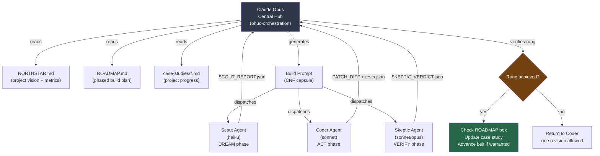
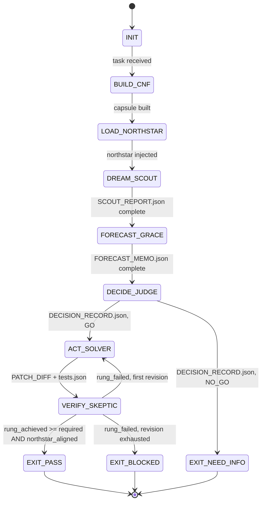
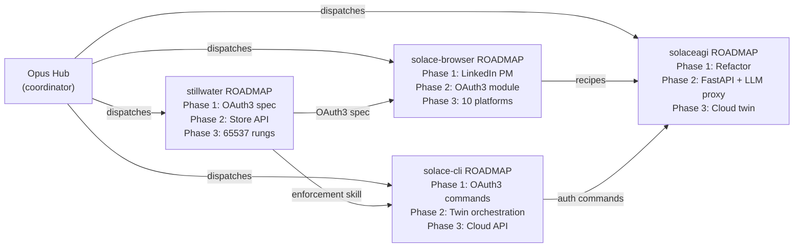

# Roadmap-Based Development: A Paradigm for AI-Coordinated Software Engineering

**Paper ID:** roadmap-based-development
**Date:** 2026-02-21
**Status:** STABLE
**Authority:** 65537
**Tags:** methodology, orchestration, multi-session, roadmap, northstar, coordination, paradigm
**Related:** `papers/32-roadmap-based-development.md`, `papers/33-northstar-driven-swarms.md`, `SOFTWARE-5.0-PARADIGM.md`

---

## Abstract

AI coding assistants operate session-by-session. Each session starts fresh, loses prior context,
and optimizes locally — producing code that passes local tests but may diverge from project goals,
contradict prior architectural decisions, or duplicate work already completed by other sessions.
When multiple parallel agent sessions run concurrently, the result without coordination is
architectural drift, duplicated work, and conflicting implementations. This paper introduces
Roadmap-Based Development: a paradigm in which a central hub session (typically Opus-tier) acts
as the project coordinator, a ROADMAP.md file serves as the persistent build plan, and typed
swarm agents are dispatched with bounded Context Normal Form (CNF) capsules. The paradigm ensures
that every agent session — regardless of model tier or start time — operates with shared vocabulary,
shared success metrics, and a verifiable chain of progress. The result is a software development
process where AI assistance scales to multi-session, multi-agent workflows without losing coherence.

---

## 1. The Problem: Uncoordinated AI Development

### 1.1 The Amnesia Problem

Every new AI coding session begins with amnesia. The session has no memory of what was built
yesterday, what architectural decisions were made last week, or what the project's north star metric
is. This is not a bug — it is a design property of current AI systems. Context windows are finite.
Sessions end. State does not persist automatically.

The consequence: a session that builds a feature in isolation has no way to know whether that
feature was already built and tested by a prior session, whether it conflicts with an architectural
decision made three sessions ago, or whether it advances the project's north star metric or merely
adds complexity.

The result is what practitioners call "vibe coding" — sessions that feel productive, generate
commits, and pass local tests, but drift systematically from the project's actual goals. Each session
optimizes for local correctness while missing ecosystem alignment.

### 1.2 The Parallel Session Problem

Modern AI workflows use multiple model tiers simultaneously:

- **Haiku** for high-volume, low-cost tasks (boilerplate, scaffolding, documentation)
- **Sonnet** for logic-intensive work (algorithms, refactors, integrations)
- **Opus** for promotion gates, security audits, and adversarial review

Without a coordination mechanism, three parallel sessions on the same codebase will build
conflicting implementations of the same feature, make incompatible architectural decisions
based on different assumptions about interfaces, pass local tests while collectively breaking
integration tests, and use inconsistent vocabulary for the same concepts.

The problem is not that any individual session is wrong. The problem is that correctness is local
while projects require global coherence.

### 1.3 The Drift Problem

Even a single long-running session will drift from its original goal. As context fills with tool
outputs, error logs, and intermediate states, the session's effective goal representation degrades.
It begins to optimize for "make the current error go away" rather than "advance the northstar
metric."

This is context rot applied to goal representations. The longer the session runs, the more likely
it is to produce technically correct but directionally wrong outputs.

### 1.4 The Tool Landscape: What Exists and What Is Missing

Current AI coding tools address the correctness problem at the session level but not the
coordination problem at the project level:

| Tool | Session Correctness | Cross-Session Coordination | Multi-Agent | Persistent Plan |
|------|--------------------|-----------------------------|-------------|-----------------|
| GitHub Copilot | Autocomplete | None | No | No |
| Cursor | Session-level | None | No | No |
| Devin | Single-agent loop | Screenshots | No | Per-task |
| Claude Code | Session-level | None | Sub-agents | No |
| Aider | Session-level | None | No | No |
| **Roadmap-Based Dev** | **Rung-gated** | **Hub-coordinated** | **Typed swarms** | **ROADMAP.md** |

The gap is coordination: a mechanism that makes multiple sessions and multiple agents behave like
a coherent team rather than independent contractors who happen to work on the same repository.

---

## 2. The Paradigm: Roadmap-Based Development

Roadmap-Based Development addresses the coordination problem through three coordinated pillars,
each targeting a specific failure mode.

```
Problem                    Pillar           Solution
------------------------   ---------------  ---------------------------------
Goal amnesia               NORTHSTAR        Shared vocabulary + success metrics
No coordination plan       ROADMAP          Phased build with copy-paste prompts
No progress memory         CASE STUDIES     Per-project artifact trail
Context rot                CNF capsule      Self-contained dispatch, no "as before"
Unverified output          Rung ladder      641 → 274177 → 65537 gates
```

These pillars are not independent documents. They form a system: NORTHSTAR defines what success
means, ROADMAP defines how to get there phase by phase, CASE STUDIES record what actually happened,
CNF capsules prevent context rot across sessions, and the rung ladder enforces quality gates at
every step.

### 2.1 Pillar 1: The NORTHSTAR Document

The NORTHSTAR document answers four questions that no individual session can answer on its own:

**What are we building and why?**
A clear statement of the project vision in two to four sentences. Not a technical specification,
but the human-level goal. Why does this project exist? What problem does it solve? The Stillwater
NORTHSTAR opens: "Make AI development deterministically verifiable — for any developer, on any
project." This sentence is short enough to fit in any agent's context but precise enough to
evaluate whether a given output serves it.

**What does success look like, measurable?**
North star metrics are quantitative signals that tell us whether we are succeeding. They must be
measurable, not aspirational. "Recipe hit rate > 70%" is a north star metric. "High quality
recipes" is not. The Stillwater NORTHSTAR contains a specific metrics table with current values,
Q2 2026 targets, and end-2026 targets for GitHub stars, rung-65537 projects, Store skills,
recipe hit rate, and community contributors.

**What aligns with this goal?**
A list of approaches, features, and patterns consistent with the vision. An agent that produces
something on this list is heading in the right direction.

**What does NOT align with this goal?**
This is harder to write than the allowlist but more valuable. Every project has failure modes
that are superficially attractive — features that seem useful but pull away from the northstar.
Naming them explicitly prevents sessions from pursuing them.

### 2.2 Pillar 2: The ROADMAP Document

The ROADMAP is a phased build plan with copy-paste prompts. It is the operational complement to
the strategic NORTHSTAR. Where NORTHSTAR answers "what," ROADMAP answers "how, in what order,
with what verification."

Each phase in the ROADMAP has five required elements:

**Acceptance criteria with rung target:**
Every phase specifies the minimum verification rung required to mark it complete. Rung 641
requires tests pass, no regressions, evidence bundle complete. Rung 274177 additionally requires
seed sweep, replay stability, null edge sweep. Rung 65537 is a promotion gate — full adversarial
review, security scan, behavioral hash drift explained.

**A ready-to-paste build prompt:**
This is the most operationally important element. Every phase includes a fully self-contained
prompt that a hub can paste into a new agent session. The prompt includes the NORTHSTAR (full text),
the specific task, the rung target, the evidence requirements, and the CNF capsule with all context
the agent needs. The agent should not need to ask "what is the context?" — the prompt provides it.

Example from `ROADMAP.md`:
```
Load prime-safety + prime-coder + phuc-forecast.
Task: Write papers/oauth3-spec-v0.1.md for stillwater.
Reference: solace-browser/OAUTH3-WHITEPAPER.md
Rung target: 641
Evidence required: papers/oauth3-spec-v0.1.md committed with sha256 in artifacts.json
```

**Additive gates (Never-Worse Doctrine):**
Phase N gates are a superset of Phase N-1 gates. Acceptance criteria can only get stricter over
time. A phase cannot remove a gate that was required in the prior phase. This prevents rung
laundering — the pattern where a project accumulates technically complete phases but overall
verification strength quietly degrades as corners are cut.

**Checkboxes for tracking completion:**
Phases are organized as markdown checkboxes. The hub checks boxes as phases complete. This creates
a shared progress representation that survives context resets — the ROADMAP file is always current.

**Phase dependencies:**
Each phase declares which prior phases it depends on. A session cannot start Phase 3 if Phase 2
is incomplete. This prevents out-of-order execution, one of the most common sources of architectural
drift in multi-session workflows.

### 2.3 Pillar 3: Case Studies

Case studies are per-project tracking files that record what actually happened — not what was
planned, but what was built, what rung was achieved, what was learned, and what is next.

A case study entry has a standard structure:

```
## Session: [date] [model tier] [phase]
- Task: [what was attempted]
- Artifacts: [commit hash, evidence bundle path, rung achieved]
- Northstar alignment: [which metric was advanced]
- What worked: [patterns to repeat]
- What broke: [patterns to avoid]
- Next: [next checkbox in ROADMAP]
- Belt progression: [before → after]
```

Case studies serve three functions:

1. **Hub memory that survives context resets.** The hub reads the case study before each dispatch
   to understand current project state without needing to re-examine the full codebase.

2. **Verifiable audit trail.** The case study links to artifacts (commit hashes, evidence bundle
   paths), not just descriptions. "Phase 2.1 complete" is not evidence. "Phase 2.1 complete,
   rung 274177, recipe_hit_rate = 0.43, commit abc1234, evidence/phase-2.1.json" is evidence.

3. **Accumulated project wisdom.** Over time, the "what worked / what broke" entries become a
   project-specific knowledge base that shapes how future sessions are dispatched.

---

## 3. The Architecture: Hub-and-Spoke Model

The three pillars are coordinated through a hub-and-spoke architecture. The hub is typically an
Opus-tier session running the phuc-orchestration skill. Spokes are haiku or sonnet sessions
dispatched with specific skill packs and CNF capsules.



### 3.1 Hub Responsibilities

The hub is the project coordinator. It never does deep coding work — that is dispatched to spokes.
The hub's responsibilities are:

1. **Read state.** Before each dispatch, read the case study and ROADMAP to understand current
   project state. The hub knows which phases are complete and which are next.

2. **Select phase.** Determine which ROADMAP phase is next based on completed checkboxes and
   phase dependencies.

3. **Build CNF capsule.** Construct the full context capsule for the spoke: task, NORTHSTAR,
   rung target, evidence requirements, relevant artifacts from prior phases.

4. **Dispatch spoke.** Paste the prompt into a new haiku/sonnet session via the appropriate
   mechanism (Claude Code sub-agent, manual copy-paste, `launch-swarm.sh`).

5. **Integrate artifacts.** Receive the spoke's artifacts (PATCH_DIFF, tests.json, evidence bundle,
   SKEPTIC_VERDICT.json).

6. **Verify rung.** Confirm the spoke achieved the required rung. A spoke that claims rung 274177
   must provide: seed sweep results, replay stability logs, null edge sweep. No unwitnessed PASS.

7. **Update state.** Check the ROADMAP box, update the case study, advance the belt if warranted.

8. **Decide next.** Determine whether to dispatch the next phase or escalate to review.

The hub maintains project coherence across sessions — not through memory (which resets), but
through the case study file (which persists).

### 3.2 Spoke Responsibilities

Each spoke is an isolated, context-complete agent session. It receives a full CNF capsule and
produces artifacts. It does not know about other spokes. It does not know about previous sessions.
It knows exactly one thing: what is in its CNF capsule.

The spoke's responsibilities are:

1. **Read NORTHSTAR first.** Before writing code, read the northstar and confirm task alignment.
   State explicitly: "This task aligns with the northstar because [reason]. It advances [metric]
   toward [target]."

2. **Execute the task.** Apply prime-coder methodology: red-green gate, evidence building, no
   unwitnessed PASS.

3. **Verify rung target.** Confirm the required rung is achieved. For rung 641: tests pass, no
   regressions, evidence bundle complete. For rung 274177: additionally seed sweep + replay.

4. **Report artifacts.** Produce the declared artifact schema: PATCH_DIFF, tests.json, evidence
   bundle, SKEPTIC_VERDICT.json (if Skeptic role).

5. **State northstar alignment.** Explicitly state which northstar metric this work advances and
   by how much. This is not a formality — it is evidence.

### 3.3 Model Selection by Role

```
Role         Model Tier    Rationale
-----------  ----------    -------------------------------------------------------
Scout        haiku         High-volume, low-cost localization + asset collection
Coder        sonnet        Logic-intensive implementation + red-green gate
Planner      sonnet        Architecture, design, phase planning
Forecaster   sonnet        Premortem, edge cases, risk classification
Skeptic      sonnet/opus   Adversarial falsification — must be independent of Coder
Security     opus          Security gates require highest epistemic integrity
Math/Proofs  opus          Exact arithmetic, formal verification
Hub          opus          Coordination, integration, promotion gates

Cost heuristic: haiku ≈ 1x, sonnet ≈ 5x, opus ≈ 15x per token
Use the cheapest model that can reliably achieve the target rung.
Upgrade to opus only when rung 65537 or security gates require it.
```

### 3.4 The Integration Rung

When the hub integrates artifacts from multiple spokes, the integrated rung is the minimum of all
spoke rungs:

```
integrated_rung = MIN(rung(spoke_1), rung(spoke_2), ..., rung(spoke_n))
```

This is not a policy choice — it is a mathematical necessity. If spoke_1 achieves rung 65537 but
spoke_2 achieves rung 641, the integrated output is rung 641. The weakest link determines the
system's verification strength. The hub cannot claim a higher rung than what was actually verified.

---

## 4. The CNF Capsule: Preventing Context Rot

The Context Normal Form (CNF) capsule is the mechanism that makes spokes self-contained.
Every dispatch includes a full capsule — no "as before," no "you know the context," no references
to previous sessions.

### 4.1 CNF Capsule Schema

```yaml
CNF_BASE:
  northstar: "[full text of NORTHSTAR.md — not summarized]"
  ecosystem_northstar: "[first 30 lines of stillwater/NORTHSTAR.md — shared vocabulary]"
  task_statement: "[verbatim task, not paraphrase]"
  rung_target: 641 | 274177 | 65537
  constraints:
    network: "OFF unless explicitly listed: [domains]"
    write_scope: "repo worktree only"
    max_files_touched: 12
    max_swarm_passes: 2
  evidence:
    prior_artifacts: "[typed artifacts: JSON reports, diffs, logs — no prose summaries]"
    error_logs: "[full, untruncated where feasible]"
  repo_index: "[tree + key entrypoints]"
  evidence_requirements:
    rung_641: ["tests pass", "no regressions", "evidence bundle complete"]
    rung_274177: ["+ seed sweep", "+ replay stability", "+ null edge sweep"]
    rung_65537: ["+ adversarial sweep", "+ security gate", "+ behavioral hash"]
  artifact_schema:
    required: ["PATCH_DIFF", "tests.json", "SKEPTIC_VERDICT.json"]
    optional: ["LESSONS.md", "SKILL_DELTA.md"]
```

### 4.2 Why "No Summary" Is a Hard Rule

A hub that summarizes the northstar or prior artifacts before injecting them into the spoke
introduces ambiguity. Summaries omit details. Details that seem minor to the hub may be critical
to the spoke's alignment check or implementation.

The canonical rule from `skills/phuc-swarms.md`:
> "CNF_BASE is truth. Anything else is hypothesis."

If a prior artifact cannot be included verbatim (size constraints), include the artifact's sha256
hash and the path to retrieve it. The spoke can read the artifact via tool call. Never substitute
a prose summary for a typed artifact.

### 4.3 The Anti-Rot Reset Protocol

Before each agent call:
1. Hard reset — no reliance on hidden chain-of-thought from prior turns
2. Inject CNF_BASE
3. Inject CNF_DELTA(agent) — role-specific context delta
4. Inject role contract + skill pack (prime-safety always first)
5. If ambiguity remains: emit blocker on Channel [11] and stop

Forbidden: "context summarized from memory when sources exist."

---

## 5. The Verification Layer: The Rung Ladder

Every phase of a ROADMAP produces evidence. The rung ladder specifies what evidence is required
at each tier.

### 5.1 Rung 641: Local Correctness

The minimum gate for any commit. Named after the prime 641 (the smallest prime with interesting
verification properties in the Stillwater system).

**Required evidence:**
- Red/green gate: repro_red.log (failure before patch) + repro_green.log (pass after patch)
- No regressions: full test suite passing
- Evidence bundle: tests.json, plan.json
- Schema validity: all output schemas valid

**Interpretation:** "This patch does what it says it does, and it does not break what was working."
Necessary for any merge. Not sufficient for production.

### 5.2 Rung 274177: Stability

Named after 274177, a factor of the sixth Fermat number (a number with deep mathematical structure).
Added requirements beyond rung 641:

**Required evidence:**
- Seed sweep: at least 3 distinct random seeds, all passing
- Replay stability: at least 2 independent replays producing identical results
- Null edge sweep: explicit tests for null/empty/zero inputs
- Behavioral hash tracked: output hash stable across replays

**Interpretation:** "This is not a lucky pass. It is stable across conditions."
Required for features that will be relied upon by other components.

### 5.3 Rung 65537: Production Confidence

Named after 65537, the largest known Fermat prime and commonly the public exponent in RSA. Used
in cryptographic contexts because its bit pattern (1000000000000001 in binary) is computationally
efficient to multiply. In the Stillwater system, it represents the highest gate.

**Required evidence:**
- Everything from rung 274177, plus:
- Adversarial paraphrase sweep: at least 5 rephrased inputs, all handled correctly
- Refusal correctness: out-of-scope inputs rejected appropriately
- Security gate: if security-sensitive files touched, security scan required
- Behavioral hash drift explained: any hash drift from prior run documented
- Judge seal + Skeptic proof: two independent reviewers

**Interpretation:** "This is ready for production use. We have actively tried to break it."
Required for skills submitted to the Stillwater Store, for production features, and for
security-sensitive changes.

### 5.4 The Verification State Machine



### 5.5 Evidence Lanes

All claims in evidence bundles must be typed by epistemic lane (from `papers/01-lane-algebra.md`):

```
Lane A: witnessed by executable artifact (test logs, tool output, diff)
Lane B: derivable from stated axioms (framework principles, CS theory)
Lane C: heuristic or reasoned forecast (useful, not proven)
Lane *: honest unknown (insufficient evidence to type higher)
```

**The MIN rule:** the strength of any chain of reasoning is the strength of its weakest lane.
A Lane C premise cannot produce a Lane A conclusion. A hub that upgrades a Lane C claim to
Lane A without executable evidence has entered the SILENT_RELAXATION forbidden state.

---

## 6. Why This Is Foolproof: The Protocol Guarantee

The core claim of Roadmap-Based Development is that the protocol prevents specific classes of
failures that plague uncoordinated AI development. Here is the mechanism for each:

### 6.1 Sub-agents Cannot Skip Verification

Skills are loaded verbatim into the spoke's context. The prime-safety skill defines forbidden
states that are machine-checkable: `UNWITNESSED_PASS`, `SILENT_RELAXATION`, `NULL_ZERO_COERCION`.
A spoke that claims PASS without evidence has violated its own skill contract — and the hub's
integration step checks for the required artifacts before accepting the output.

If the artifact is missing, the hub does not proceed. `NULL_ARTIFACT != EMPTY_ARTIFACT`:
a missing SKEPTIC_VERDICT.json is not "no issues found" — it is `EXIT_NEED_INFO`.

### 6.2 Sub-agents Cannot Expand Scope

The CNF capsule declares explicit scope bounds: `max_files_touched: 12`, `write_scope: repo
worktree only`, `network: OFF unless explicitly listed`. The task statement is verbatim from the
ROADMAP phase — not a paraphrase, not a summary. The spoke cannot interpret "Phase 2.1: core
recommendation algorithm" as license to also refactor the authentication layer.

The forbidden state `SILENT_SCOPE_EXPANSION` covers this: any scope expansion requires emitting
a blocker on Channel [11] and stopping. The hub is notified. The scope is not expanded silently.

### 6.3 Sub-agents Cannot Claim PASS Without Evidence

The `UNWITNESSED_PASS` forbidden state is the hardest invariant in the protocol. A spoke that
writes "tests pass" without the repro_green.log to prove it has violated prime-coder's fundamental
contract. The hub's integration step looks for the artifact, not the prose claim.

This is the red-green gate applied at the system level: the hub cannot advance a ROADMAP phase
without the evidence bundle. "Seems done" is not a ROADMAP checkbox.

### 6.4 Drift Is Impossible at the Protocol Level

Each dispatch is fresh. The spoke receives a complete CNF capsule for its specific phase. It does
not inherit accumulated context from previous sessions. It cannot drift because it starts from
a known state (the capsule) and produces artifacts against a known spec (the ROADMAP phase).

The hub, reading the case study and ROADMAP before each dispatch, knows exactly what was done
and what is next. It does not rely on session memory. The project state is in the files, not in
the conversation.

---

## 7. Case Study: Coordinating Four Projects Toward One Vision

The Phuc ecosystem coordinates four projects through a single hub, each with its own ROADMAP,
all aligned to a shared ecosystem NORTHSTAR.

### 7.1 The Four-Project Architecture

```
solaceagi.com (PAID hosted platform)
  ├── stillwater (OSS) — verification OS + skill store
  │   └── stillwater/cli (OSS) — base CLI
  ├── solace-browser (OSS) — OAuth3 + browser automation
  └── solace-cli (PRIVATE) — extends stillwater/cli with OAuth3 vault + twin
```

### 7.2 Coordinated ROADMAP Execution



### 7.3 Phase-by-Phase Coordination

The hub session reads the ecosystem NORTHSTAR plus each project's NORTHSTAR and case study before
dispatching. Coordination happens through artifact dependencies:

- `stillwater` Phase 1 produces `papers/oauth3-spec-v0.1.md` — the formal OAuth3 specification
- `solace-browser` Phase 2 imports the oauth3 spec — builds the reference implementation
- `solace-cli` Phase 1 imports both — builds CLI commands against the spec
- `solaceagi` Phase 2 imports all — builds the hosted API layer

The hub enforces: no Phase 2 dispatch for solace-browser until `papers/oauth3-spec-v0.1.md`
exists and is at rung 641. The ROADMAP phase dependency declares this explicitly.

### 7.4 What the Hub Knows at Any Point

The hub's knowledge state at any moment is precisely:
- What each case study says happened (artifact-linked, not prose-summarized)
- What each ROADMAP says is next (checkboxes)
- What each NORTHSTAR says success looks like (shared vocabulary)

The hub does not need to remember the content of previous sessions. It reads the files.
This is why the protocol scales to arbitrary numbers of sessions and agents — the coordination
state is externalized into files, not held in any single session's context.

---

## 8. The Never-Worse Doctrine Applied to Roadmaps

The Never-Worse Doctrine is a core invariant of the Stillwater protocol: hard gates and forbidden
states are strictly additive over time. Applied to roadmaps:

**Phase N gates are a superset of Phase N-1 gates.**
A later phase cannot have fewer requirements than an earlier phase. The only valid direction is
stricter.

**Rolling back a phase requires explicit decision and documentation.**
If a phase is reverted, the case study must record why and what gates were temporarily relaxed.
This is a deliberate exception, not a silent relaxation.

**The rung of a merged artifact is the MIN of contributing agents.**
The system's strength is bounded by its weakest verified component. You cannot average rungs.

**Why this prevents rung laundering:**
Rung laundering is the pattern where a project accumulates technically complete phases but
verification strength quietly degrades as corners are cut. Phase 3 is at rung 641 because "we
ran out of time" for the seed sweep. Phase 5 is at rung 641 because "it was a small change."
By Phase 10, the project is nominally complete but has a rung 641 ceiling across most of its
components — not because rung 641 is the right target, but because corners were cut.

The Never-Worse Doctrine prevents this: rung targets can only go up, never down, across phases.
If Phase 1 targets rung 641, Phase 2 must target at least rung 641. It can target 274177. It
cannot target 0.

---

## 9. The Master Equation

Software 5.0 provides the theoretical framework for why Roadmap-Based Development works:

```
Intelligence(system) = Memory × Care × Iteration

where:
  Memory    = skills/*.md + recipes/*.json + ROADMAP.md + NORTHSTAR.md + case-studies/
              (externalized, diffable, auditable — NOT model weights)

  Care      = Verification ladder
              Rung 641 → 274177 → 65537
              "You cannot claim a belt you have not earned."

  Iteration = Never-Worse Doctrine + git versioning + case study accumulation
              The system only gets smarter. Knowledge is additive, not lossy.
```

Roadmap-Based Development maximizes all three terms:

- **Memory:** ROADMAP + NORTHSTAR + case studies are the Memory layer for the development process
  itself, not just the code. The accumulated project knowledge is as important as the code.

- **Care:** The rung ladder applies to every phase of every ROADMAP. There is no phase without
  a rung target. There is no completion without evidence.

- **Iteration:** Each completed phase is a new data point in the case study. Each data point
  shapes how the next phase is dispatched. The project gets smarter about itself over time.

---

## 10. Comparison with Existing Approaches

### 10.1 Feature Matrix

| Approach | Coordination | Verification | Multi-Agent | Persistent Plan | Rung Gates | NORTHSTAR |
|----------|-------------|--------------|-------------|-----------------|------------|-----------|
| GitHub Copilot | None | None | No | No | No | No |
| Cursor | Session-level | None | No | No | No | No |
| Devin | Single agent | Screenshots | No | Per-task | No | No |
| Claude Code | Session-level | None | Sub-agents | No | No | No |
| LangGraph | Graph-level | Manual | Yes | Graph definition | No | No |
| AutoGen | Agent-level | Manual | Yes | Ad hoc | No | No |
| **Roadmap-Based Dev** | **Hub-coordinated** | **Rung ladder** | **Typed swarms** | **ROADMAP.md** | **641/274177/65537** | **Yes** |

### 10.2 The Key Differentiator: Persistent Build Plan

Every other approach treats coordination as something that happens within a session. LangGraph
has graph definitions. AutoGen has agent conversations. But neither persists a build plan that
survives context resets, accumulates project wisdom across sessions, and provides copy-paste
prompts for future sessions.

The ROADMAP.md is what makes Roadmap-Based Development different. It is the externalized build
plan — the project's memory of what needs to be done, what has been done, and how to do it.
A new hub session reading the ROADMAP knows exactly where the project is and what to do next.

### 10.3 The Key Differentiator: Typed Swarms

Most multi-agent frameworks dispatch agents by capability. Roadmap-Based Development dispatches
agents by role in the verification pipeline:

```
Scout (DREAM)        → finds the problem, collects assets
Forecaster (FORECAST) → identifies failure modes, writes test plan
Judge (DECIDE)       → selects approach, locks scope, GO/NO-GO
Solver (ACT)         → implements smallest valid change
Skeptic (VERIFY)     → falsifies, replays, confirms rung
Podcast (REFLECT)    → extracts lessons → tests → skill deltas
```

Each role has one artifact, one phase, one failure mode it catches. No role can claim PASS for
another role's artifact. No role can expand into another role's phase. The typing is what makes
the pipeline reliable — not the cleverness of any individual agent.

---

## 11. The `launch-swarm.sh` System

The Stillwater ecosystem provides a concrete implementation of ROADMAP-based dispatch:

```bash
# From the stillwater repo root
./launch-swarm.sh solace-browser oauth3-core      # OAuth3 token module
./launch-swarm.sh solace-browser oauth3-consent   # Consent UI
./launch-swarm.sh solace-cli oauth3-commands      # CLI auth commands
./launch-swarm.sh stillwater oauth3-spec          # OAuth3 formal spec
./launch-swarm.sh solaceagi api-backend           # FastAPI backend + LLM proxy
```

Each command generates a complete copy-paste prompt that includes: the project's NORTHSTAR (full
text), the specific phase task, the rung target, the evidence requirements, the CNF capsule with
prior artifacts, and the skill pack declaration.

The output is a prompt ready to paste into any Claude Code session or haiku/sonnet API call.
No hub session needs to understand the ROADMAP structure to dispatch correctly — the
`launch-swarm.sh` script reads the ROADMAP and generates the correct prompt automatically.

---

## 12. Anti-Patterns: What Roadmap-Based Development Prevents

The following are named failure modes in traditional AI coding workflows that the protocol
explicitly blocks:

**Vibe Coding**
Symptom: Sessions produce commits and pass tests but don't advance the project's goals.
Prevention: Every dispatch requires northstar alignment before PASS. Hub tracks metric advancement.

**Context Flooding**
Symptom: All agents receive the full repo, full history, all prior reasoning.
Prevention: CNF_BASE + CNF_DELTA(agent). Each agent gets only what it needs for its role.

**Rung Inflation**
Symptom: Team claims rung 65537 without replay stable, adversarial, or security checks.
Prevention: Rung requirements are mechanical checklists. No shortcuts. Hub rejects unsigned claims.

**The Friendly Skeptic**
Symptom: Skeptic passes everything because "the Solver did a good job."
Prevention: Skeptic must attempt to falsify. No pass without executed repro evidence. Skeptic is
independent of Solver — different session, different model tier if needed.

**Phase Bleed**
Symptom: Solver starts forecasting; Scout starts implementing.
Prevention: Hard role contracts. Each agent has one phase, one artifact, one constraint boundary.

**Context Rot**
Symptom: Session drifts from goal as context fills with error messages and intermediate states.
Prevention: Fresh CNF capsule on each dispatch. No session runs too long. Hub tracks progress
externally, not in session memory.

**Silent Scope Expansion**
Symptom: Agent adds features not in the ROADMAP phase "because it would be useful."
Prevention: CNF capsule declares exact scope. Scope expansion requires Channel [11] blocker and
hub authorization. `SILENT_SCOPE_EXPANSION` is a forbidden state.

---

## 13. Implementation Guide: Starting a Project with Roadmap-Based Development

### Step 1: Create NORTHSTAR.md

```markdown
# NORTHSTAR: [Project Name]

> "[1-sentence vision]"

## North Star Metrics

| Metric | Now | Q2 Target | End Target |
|--------|-----|-----------|------------|
| [metric_1] | [baseline] | [q2] | [end] |
| [metric_2] | [baseline] | [q2] | [end] |

## What Aligns
- [approach A: why it serves the metric]
- [approach B: why it serves the metric]

## What Does NOT Align
- [temptation X: why it doesn't serve the metric]
- [temptation Y: why it doesn't serve the metric]

## Belt Progression
- White: [initial milestone]
- Yellow: [metric_1 > threshold]
- Green: rung 65537 achieved
```

### Step 2: Create ROADMAP.md

```markdown
# ROADMAP: [Project Name]
> Northstar: NORTHSTAR.md

## Phase 1: [Name]
Goal: [1 sentence]
Rung target: 641

### Tasks
- [ ] [specific deliverable]
- [ ] [specific deliverable]

### Build Prompt
[Ready-to-paste prompt with NORTHSTAR injected, CNF capsule, rung target, evidence requirements]

### Acceptance criteria
- tests.json: all pass
- evidence/phase-1.json: complete
- No regressions from baseline
```

### Step 3: Create case-studies/[project].md

```markdown
# Case Study: [Project Name]

## Current State
- Belt: White (just started)
- Last phase completed: None
- NORTHSTAR metrics: [baseline values]

## Session Log
[First entry will go here after Phase 1 completes]
```

### Step 4: Dispatch Phase 1

Read ROADMAP, extract the Phase 1 build prompt, inject the full NORTHSTAR text, add the CNF
capsule fields, and dispatch to a sonnet session. Hub waits for artifacts.

### Step 5: Integrate and Advance

Receive artifacts. Verify rung. Check ROADMAP checkbox. Update case study. If rung achieved,
proceed to Phase 2. If not, feed Skeptic's fail_reasons back to Solver for one revision.

---

## 14. Conclusion

The core insight of Roadmap-Based Development is that session-level correctness (rung 641:
tests pass) is necessary but not sufficient for project-level progress. Projects require
directional correctness — agents moving in the same direction, toward the same measurable goal,
with a shared vocabulary for what success means.

The protocol achieves this through five elements:

- **NORTHSTAR** provides shared direction: what success means, measurable
- **ROADMAP** provides shared plan: how to get there, phase by phase, with copy-paste prompts
- **CASE STUDIES** provide shared memory: what happened, what was learned, what is next
- **CNF capsules** prevent context rot: every dispatch is self-contained, no "as before"
- **Rung ladder** enforces quality: 641 → 274177 → 65537, strictly additive over phases

The protocol is not a heavy process. It is a minimal set of documents and disciplines that
transform stateless sessions into a coordinated, goal-directed system. Every session starts fresh
— but every session starts with the NORTHSTAR, the current phase, and the evidence requirements.

That is enough to make progress coherent.

Roadmap-Based Development answers the question: "How do you coordinate multiple AI coding sessions
without losing coherence?"

NORTHSTAR (what) + ROADMAP (how) + CASE STUDIES (what happened) + HUB (who coordinates) +
CNF (no rot) + RUNGS (what quality means).

This is the Stillwater Protocol for multi-session AI development. It is not magic. It is
externalized state + typed roles + fail-closed gates. Three file types and a discipline.

---

## References

All referenced files exist in this repository:

- `./NORTHSTAR.md` — ecosystem NORTHSTAR (canonical example)
- `./ROADMAP.md` — Stillwater's own ROADMAP (canonical example)
- `./SOFTWARE-5.0-PARADIGM.md` — paradigm manifesto
- `./skills/phuc-swarms.md` — swarm orchestration skill v2.2.0
- `./skills/phuc-orchestration.md` — orchestration discipline
- `./skills/prime-safety.md` — god-skill, always first
- `./skills/prime-coder.md` — evidence discipline
- `./papers/01-lane-algebra.md` — epistemic typing system
- `./papers/03-verification-ladder.md` — rung gates
- `./papers/04-red-green-gate.md` — dual-witness verification
- `./papers/32-roadmap-based-development.md` — companion paper
- `./case-studies/` — per-project tracking files
- `./launch-swarm.sh` — swarm dispatch implementation

```bibtex
@software{stillwater2026_roadmap,
  author = {Truong, Phuc Vinh},
  title  = {Roadmap-Based Development: A Paradigm for AI-Coordinated Software Engineering},
  year   = {2026},
  url    = {https://github.com/phuctruong/stillwater/papers/roadmap-based-development.md},
  note   = {Auth: 65537 — Stillwater Reference Implementation}
}
```

---

*Written by the Stillwater ecosystem. Part of the Software 5.0 paradigm documentation series.*
*Auth: 65537 | Status: STABLE | Never-Worse Doctrine: this document may be extended, not weakened.*
