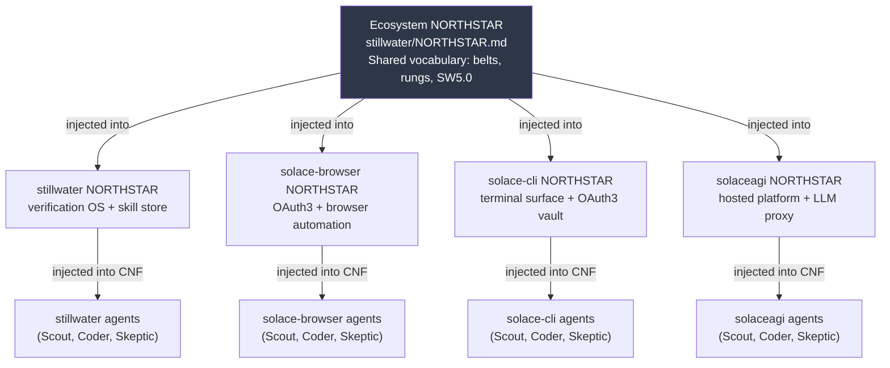
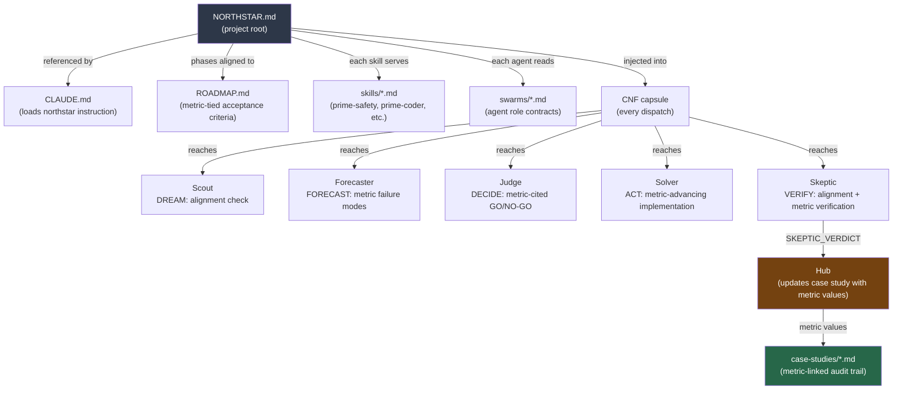

# NORTHSTAR-Driven Swarms: Aligning Multi-Agent AI Systems Through Shared Vision

**Paper ID:** northstar-driven-swarms
**Date:** 2026-02-21
**Status:** STABLE
**Authority:** 65537
**Tags:** methodology, swarms, northstar, alignment, agent-coordination, goal-primes, multi-agent
**Related:** `papers/33-northstar-driven-swarms.md`, `papers/roadmap-based-development.md`, `SOFTWARE-5.0-PARADIGM.md`

---

## Abstract

Multi-agent AI systems face a structural alignment problem: individual agents optimize for local
task correctness while the project requires global directional coherence. An agent equipped with
prime-coder skill but no project northstar can produce technically correct, well-tested code that
is architecturally wrong — implementing the wrong feature, conflicting with prior decisions, or
advancing no measurable project metric. Skills tell agents HOW. Northstars tell agents WHERE.
This paper introduces NORTHSTAR-driven swarms: a paradigm in which every agent in every swarm
reads the project NORTHSTAR document before producing output, explicitly confirms directional
alignment before claiming PASS, and reports which northstar metric their work advances. The
NORTHSTAR propagates through the CNF capsule to every sub-agent, making misalignment detectable
before it accumulates. The result is multi-agent AI development where correct code and correct
direction are both required, not just the former.

---

## 1. The Alignment Problem in Multi-Agent AI

### 1.1 The HOW/WHY Gap

Current agent frameworks load skills and dispatch. Skills define HOW an agent executes: the
methodology, the evidence discipline, the forbidden states, the verification requirements.
Prime-coder tells an agent how to do test-driven development, how to build evidence bundles,
how to run the red-green gate.

What skills cannot provide is WHY. Why does this project exist? What problem does it solve?
What does success look like, measurable, for this specific project? Which features are on the
roadmap and which are scope creep? Which architectural decisions have been made and must not be
undone?

An agent operating without WHY optimizes for local correctness. Local correctness is necessary
but not sufficient. A feature that passes all tests, produces no regressions, and achieves rung 641
can still be wrong — wrong because it conflicts with an architectural decision made three sessions
ago, wrong because it implements a capability the project explicitly chose not to include, wrong
because it moves no northstar metric forward.

The HOW/WHY gap is structural. It is not a failure of individual skills or individual agents.
It is the absence of a mechanism for project-level directional context in an agent framework
designed for isolated task execution.

### 1.2 A Concrete Failure Mode: Method-Correct, Direction-Wrong

Consider a concrete example. A swarm is dispatched to build a recipe recommendation engine.
The task prompt says "implement content-based filtering." The agent loads prime-safety and
prime-coder. It implements content-based filtering. Tests pass. Evidence bundle complete.
Rung 641 achieved.

But the project NORTHSTAR says: "We chose collaborative filtering as the primary mechanism
because content-based filtering degrades with sparse user data, which is our primary constraint
at this stage." The session built the wrong thing — technically correct, directionally wrong.
No skill could have prevented this. Only the NORTHSTAR could have.

### 1.3 The Accumulation Problem

Direction-wrong outputs accumulate. One session builds a content-based filter. Another session
builds an API that assumes content-based filtering. A third session builds a UI that exposes
content-based filtering parameters. By the time the hub notices the direction is wrong, three
sessions of work must be reverted or refactored.

The cost of a direction error scales with how long it takes to detect it. NORTHSTAR injection
detects direction errors at the earliest possible moment — before the agent writes its first line
of code — by requiring the agent to confirm alignment before proceeding.

### 1.4 The Cold Start Problem

Every AI session starts from scratch. No persistent memory. No context from prior sessions.
An agent dispatched for Phase 7 of a long-running project has no innate knowledge of what
Phases 1-6 decided. Without NORTHSTAR injection, this agent will make assumptions based only
on the code it sees — and those assumptions may contradict months of accumulated decisions.

The NORTHSTAR is the answer to the cold start problem. A 100-line document that any agent can
read in seconds, providing: the project vision, the success metrics, the explicit allowlist,
the explicit denylist, and the belt progression system. Every session starts fresh — but every
session with NORTHSTAR injection starts oriented.

### 1.5 The Vocabulary Problem

In multi-agent systems, different agents use different vocabulary for the same concepts. One agent
calls it "recipe hit rate." Another calls it "recommendation accuracy." Another calls it
"match percentage." These may or may not be the same metric. Without a shared vocabulary document,
agents cannot meaningfully compare their outputs.

The NORTHSTAR defines canonical vocabulary: exact metric names, exact threshold values, exact
terminology for the belt system and rung ladder. Once injected into every agent's CNF capsule,
this vocabulary is shared across all sessions and all agents — regardless of when they run or
what model tier they use.

---

## 2. The NORTHSTAR Document

### 2.1 What a NORTHSTAR Is

A NORTHSTAR document is the project's north star. It is not a specification (which answers
"what should be built"). It is not a technical design document (which answers "how should it be
built"). It is the answer to three prior questions:

1. **Why does this project exist?** (Vision)
2. **What does success look like, measurable?** (North star metrics)
3. **What aligns, and what does not align, with this goal?** (Allowlist and denylist)

Together, these three answers give an agent enough directional context to self-assess. An agent
with a NORTHSTAR can answer: "Is my approach aligned with the northstar?" An agent without a
NORTHSTAR cannot — it has no basis for that evaluation.

### 2.2 NORTHSTAR Structure

A well-formed NORTHSTAR document contains:

```markdown
# NORTHSTAR: [Project Name]

> "[1-sentence vision that any agent can evaluate against]"

## The Vision
[2-4 sentences expanding the vision: what problem is solved, for whom, why it matters]

## North Star Metrics

| Metric | Baseline | Q2 Target | End Target |
|--------|----------|-----------|------------|
| [measurable metric] | [value] | [value] | [value] |
[at least one row; ideally 3-5 rows]

## What Aligns With This Goal
- [approach A: why it serves the metrics]
- [approach B: why it serves the metrics]

## What Does NOT Align With This Goal
- [temptation X: why it doesn't serve the metrics]
- [temptation Y: why it doesn't serve the metrics]

## Belt Progression
[Which metric values correspond to which belt — connecting verification to project milestones]

## The Verification Ladder
[Project-specific rung targets for each development phase]
```

### 2.3 The Stillwater NORTHSTAR as Canonical Example

The Stillwater NORTHSTAR (`./NORTHSTAR.md`) demonstrates the form:

**Vision:** "Make AI development deterministically verifiable — for any developer, on any project."

**North Star Metrics:**
| Metric | Now | Q2 2026 | End 2026 |
|--------|-----|---------|---------|
| GitHub stars | ~50 | 1,000 | 10,000 |
| Projects running at rung 65537 | 0 | 2 | 8 |
| Stillwater Store skills | 7 combos | 25 skills | 100+ skills |
| Recipe hit rate | 0% | 50% | 80% |
| Community contributors | 1 | 5 | 50 |

**What aligns:** Verification OS, open skill governance, OAuth3, model neutrality, evidence-first.

**What does NOT align:** Token-revenue dependencies, closed skill stores, verification-free tools.

This structure is short enough to inject fully into any agent's CNF capsule but precise enough
to evaluate alignment claims against.

### 2.4 NORTHSTAR vs. Competing Documents

| Document Type | Scope | Persistence | AI-Compatible | Verifiable |
|--------------|-------|------------|---------------|------------|
| Code comments | Per-file | Until deleted | Partial | No |
| README.md | Per-repo | Updated manually | Partial | No |
| PRDs/Specs | Per-feature | Often stale | No (too long) | No |
| Jira tickets | Per-task | Until closed | No (requires auth) | No |
| Architecture Decision Records | Per-decision | Often stale | No (fragmented) | No |
| **NORTHSTAR.md** | **Per-project** | **Actively maintained** | **Yes (100 lines)** | **Yes (measurable metrics)** |

The key differentiators for AI compatibility:
- Short enough to inject fully (< 2,000 tokens)
- Self-contained (no auth required, no external reference)
- Measurable (metrics with baseline and target — not just aspirations)
- Explicit denylist (names specific failure modes — not just success cases)

---

## 3. The Injection Mechanism

### 3.1 CNF Capsule Injection

The NORTHSTAR reaches every agent through the CNF (Context Normal Form) capsule — the
self-contained context document that every spoke receives before beginning work.

The CNF capsule has two NORTHSTAR fields, both required:

```yaml
CNF_BASE:
  northstar: |
    [REQUIRED — full text of project NORTHSTAR.md]
    [NOT a summary. NOT a paraphrase. The full document.]
    [Summaries introduce ambiguity that agents resolve incorrectly.]
  ecosystem_northstar: |
    [REQUIRED — first 30 lines of stillwater/NORTHSTAR.md]
    [Shared vocabulary: belt system, rung definitions, Software 5.0 principles]
    [Without this, project references to "Yellow Belt" or "rung 274177" are undefined]
```

The rule is `NORTHSTAR_MISSING_FROM_CNF = EXIT_BLOCKED`. A dispatch without NORTHSTAR is
blocked before the agent starts. The hub cannot claim to have dispatched a northstar-aligned
swarm agent if the northstar was not in the capsule.

### 3.2 The NORTHSTAR Hard Gate (v2.2.0)

From `skills/phuc-swarms.md` (the authoritative source):

```
NORTHSTAR HARD GATE (v2.2.0 addition):
- Every agent MUST read `northstar` before writing a single line of code or analysis
- Every agent MUST answer before claiming PASS: "Which northstar metric does this advance?"
- If output does not advance any northstar metric: status=NEED_INFO, ask Judge to re-scope
- FORBIDDEN: NORTHSTAR_MISSING_FROM_CNF (dispatch without northstar = BLOCKED before start)
- FORBIDDEN: NORTHSTAR_UNREAD (claiming PASS without referencing a northstar metric)
```

This is a hard gate, not a soft recommendation. An agent that writes code without reading the
northstar has violated its skill contract. An agent that claims PASS without stating which
northstar metric was advanced has entered the `NORTHSTAR_UNREAD` forbidden state.

### 3.3 The Three-Layer Loading Order

The NORTHSTAR is Layer 3 in a three-layer loading order:

```
Layer 1 (Safety):     prime-safety     — absolute constraints, fail-closed
Layer 2 (Method):     prime-coder      — HOW to code (red-green gate, evidence)
Layer 3 (Direction):  project NORTHSTAR — WHERE to go (metrics, alignment, belt)

Precedence: Layer 1 wins all conflicts. Layer 2 applies within Layer 1 bounds.
Layer 3 applies within Layers 1 and 2 bounds.
```

**Layer 1: Safety (Absolute Constraints)**
Prime-safety defines the outer envelope. It is the answer to "what must never happen, regardless
of task." No capability, no skill, no northstar can override prime-safety. The forbidden states
defined in prime-safety are absolute.

**Layer 2: Method (Execution Discipline)**
Prime-coder defines the execution methodology. The red-green gate, evidence building, verification
rung targets, null vs. zero distinction — these are method constraints. They apply to all coding
work within the safety envelope.

**Layer 3: Direction (Goal Prime)**
The project NORTHSTAR defines direction. It is the answer to "where should correct work point?"
It provides the goal context that neither Layer 1 nor Layer 2 can provide.

Without Layer 3, an agent is method-correct but direction-agnostic. It can produce high-quality
outputs but has no way to evaluate whether those outputs serve the project's actual goal. With
Layer 3, an agent can perform directional self-assessment before finalizing any output.

### 3.4 Loading Order in the Prompt

The three layers are loaded into the agent prompt in a specific order:

```
<BEGIN_SKILL name="prime-safety" version="2.1.0">
[full text of prime-safety.md — not summarized]
</END_SKILL>

<BEGIN_SKILL name="prime-coder" version="2.0.2">
[full text of prime-coder.md — not summarized]
</END_SKILL>

## Project NORTHSTAR
[full text of NORTHSTAR.md — not summarized]

## Ecosystem NORTHSTAR (shared vocabulary)
[first 30 lines of stillwater/NORTHSTAR.md]

## Task
[specific task with rung target and evidence requirements]
```

This ordering ensures the agent reads safety constraints first, then execution methodology,
then directional context. The agent cannot encounter the northstar without first having loaded
the safety and method layers.

---

## 4. The Alignment Protocol: Three Steps Before Code

Every agent, before writing a single line of code, must complete a three-step alignment protocol:

### Step 1: Read the NORTHSTAR

Not skim — read. The agent must be able to answer:
- What is the project's north star metric?
- What is the current metric value?
- What is the target?
- What approaches does the northstar explicitly allow?
- What approaches does the northstar explicitly exclude?

An agent that cannot answer these questions after reading the northstar has a northstar quality
problem — the document is underspecified and needs improvement before dispatch continues.

### Step 2: Confirm Task Alignment

Before writing any code, the agent explicitly states:

```
Alignment check:
  Task: [verbatim task statement]
  Aligns with northstar because: [specific reason, referencing northstar text]
  Advances metric: [exact metric name] toward [exact target value]
  Does not conflict with: [list of northstar exclusions checked and confirmed clear]
  Rung target: [641 | 274177 | 65537]
```

If the agent cannot complete this statement, the task may be misaligned. The correct response is:
`status=NEED_INFO` with an explicit statement of what is unclear, not `status=PASS` with an
unverified alignment claim.

### Step 3: Declare the Falsifier

After completing the task and before claiming PASS, the agent explicitly states:

```
Northstar advancement:
  Metric: [exact metric name]
  Before: [baseline value]
  After: [measured value]
  Target: [northstar target value]
  Falsifier: [what metric would fail if this implementation is wrong]
```

The falsifier question is the most diagnostic: "What northstar metric would FAIL if this
implementation is wrong?" This forces the agent to specify the observable consequence of being
wrong. An agent that cannot answer the falsifier question is doing work whose connection to the
northstar is unclear — worth surfacing before claiming PASS.

---

## 5. The Verification Question

The verification question is the northstar-level equivalent of the red-green gate. Where the
red-green gate asks "did the tests go from failing to passing?", the verification question asks
"does this output advance the northstar?"

### 5.1 Three Questions That Must Be Answered Before PASS

**Question 1: Does this output align with the northstar?**
Not "does this output look good" but "does this output satisfy the northstar allowlist and avoid
the northstar denylist?" The answer must reference specific northstar text, not general principles.

**Question 2: Which northstar metric does this advance?**
Not "this is useful work" but "this specifically advances [metric name] from [baseline] toward
[target]." If no northstar metric is advanced, the work may be scope creep — technically correct
but directionally neutral.

**Question 3: What northstar metric would FAIL if this implementation is wrong?**
The falsifier question. It forces the agent to specify the observable consequence of being wrong.
A correct implementation that advances recipe_hit_rate will, if wrong, degrade recipe_hit_rate.
If the agent cannot specify a metric that would fail, the work may not be northstar-connected.

### 5.2 Transforming Verification From Backward-Looking to Forward-Looking

**Backward-looking verification (necessary but insufficient):**
"Tests pass. No regressions. Evidence bundle complete. Rung 641 achieved."
This tells us the patch is locally correct. It tells us nothing about direction.

**Forward-looking verification (backward-looking plus northstar alignment):**
"Tests pass. No regressions. Evidence bundle complete. Rung 641 achieved. Recipe hit rate
advanced from 0.31 to 0.43. This represents 37% of the distance from baseline to Phase 2.1
target of 0.40. Phase 2.1 acceptance criterion (>0.40) is met."
This tells us the patch is locally correct AND directionally advancing the project.

The forward-looking component is only possible with northstar injection. An agent without a
northstar cannot report metric advancement because it does not know what metrics exist.

---

## 6. Ecosystem-Wide Alignment: The Multi-Level NORTHSTAR Hierarchy

In a complex ecosystem with multiple projects, there may be multiple levels of NORTHSTAR:

### 6.1 The Hierarchy

```
Ecosystem NORTHSTAR (stillwater/NORTHSTAR.md)
  ├── Project NORTHSTAR (stillwater project)
  ├── Project NORTHSTAR (solace-browser project)
  ├── Project NORTHSTAR (solace-cli project)
  └── Project NORTHSTAR (solaceagi project)
       └── Phase constraints (Phase 2.1: specific metric target)
```

**Ecosystem NORTHSTAR:** The top-level vision shared across all projects. For Stillwater, this
is the shared vocabulary of belts, rungs, and Software 5.0 principles. "Make AI development
deterministically verifiable." Every project in the ecosystem inherits these constraints.

**Project NORTHSTAR:** The specific vision, metrics, and constraints for one project. This is
the primary goal prime for project-level sessions. It takes precedence over ecosystem-level
guidance for project-specific decisions.

**Phase constraints:** The specific constraints for one ROADMAP phase. Not a northstar, but a
narrowing of the project northstar for the current phase. "Phase 2.1 target: recipe_hit_rate >
0.40" is a phase constraint, not a north star metric.

### 6.2 Propagation Through the Ecosystem



### 6.3 Why This Creates Coherence Across 18 Agent Types

The Phuc ecosystem runs 18 different agent types (Scout, Forecaster, Judge, Solver, Skeptic,
Podcast across multiple projects). Without ecosystem NORTHSTAR injection, these agents use
different vocabulary, different success criteria, and different interpretations of "done."

With ecosystem NORTHSTAR injection, all 18 agents share:
- The same belt progression terminology (White → Yellow → Orange → Green → Blue → Black)
- The same rung definitions (641, 274177, 65537)
- The same Software 5.0 principles (Memory × Care × Iteration)
- The same master equation and what it means for their work

With project NORTHSTAR injection, all agents on a specific project share:
- The same north star metrics (exact names, baseline values, targets)
- The same allowlist and denylist
- The same definition of phase-level acceptance criteria

The result: 18 different agents, working across 4 different projects, in dozens of independent
sessions, all pulling in the same direction.

---

## 7. The Skeptic as Northstar Verifier

In the Stillwater swarm architecture, the Skeptic agent plays a special role in northstar
verification beyond its role in local correctness verification.

### 7.1 Standard Skeptic Responsibilities

The Skeptic's standard job is to falsify: run the repro commands, check that tests actually pass,
attempt to break the implementation, verify the rung target is achieved. This is backward-looking
verification — confirming the patch does what it says it does.

### 7.2 Extended Northstar Skeptic Responsibilities

With NORTHSTAR injection, the Skeptic has additional responsibilities:

**Challenge alignment claims:** The Solver claimed "this advances recipe_hit_rate from 0.31 to
0.43." The Skeptic asks: was recipe_hit_rate actually measured? On what test set? Under what
conditions? Is the measurement methodology consistent with the northstar's definition of success?

**Check for direction-wrong implementations:** The Skeptic reads the northstar and asks: is there
an alternative interpretation under which this work is direction-wrong? Even if the Solver's
claimed metric advances are correct, does the implementation conflict with northstar exclusions?

**Verify the falsifier:** The Solver stated "if this is wrong, recipe_hit_rate would degrade."
The Skeptic verifies this claim: is the metric actually wired to the implementation, such that
a bug in the implementation would show up as metric degradation?

### 7.3 The Skeptic's Verdict as Northstar Evidence

The SKEPTIC_VERDICT.json includes a northstar section:

```json
{
  "status": "PASS",
  "rung_achieved": 274177,
  "northstar_verification": {
    "alignment_confirmed": true,
    "metric_advanced": "recipe_hit_rate",
    "measurement_methodology": "test set of 1000 recipes, independent from training data",
    "before": 0.31,
    "after": 0.43,
    "target": 0.70,
    "falsifier_verified": true,
    "falsifier_test": "deliberately broke recommend() function; recipe_hit_rate degraded to 0.15",
    "exclusions_checked": ["content-based filtering: not used"]
  }
}
```

Without this northstar section, the SKEPTIC_VERDICT is incomplete — it verifies local correctness
but not directional correctness.

---

## 8. Belt Progression as Northstar Signal

The belt system is the project-level aggregation of northstar metric advancement.

### 8.1 Belts Require Northstar Evidence

Belt advancement is not granted based on session count or time elapsed. It requires:

1. The target northstar metric exceeds the belt threshold
2. The metric was measured by an independent session (not self-reported by the session that
   produced the improvement)
3. The metric is stable across at least two replay seeds (rung 274177 minimum for belt advancement)

This means a belt advancement is itself a northstar measurement event. The hub does not grant a
belt because a session claimed to advance the metric — the hub grants a belt because an
independent verification session confirmed the metric.

### 8.2 Belts as Diagnostic Signals

The belt system creates a diagnostic signal the hub can use to detect direction-wrong sessions.

**Scenario:** Three sessions achieve rung 641. Case studies show commits and passing tests.
But recipe_hit_rate is still 0.31 — no advancement. Belt is still White.

**Diagnosis:** The sessions built something, but not something that advances the northstar metric.
Possible causes: sessions built infrastructure that is necessary but not directly measurable,
sessions built the wrong feature, or sessions built the right feature but the metric measurement
is broken.

**Hub action:** Investigate the gap before dispatching more sessions. The belt system caught
a pattern that individual session rungs could not reveal.

Without northstar injection, this diagnostic is impossible — the hub has no shared metric to
compare across sessions.

### 8.3 Belt System as Coordination Language

Belts are not just progress indicators — they are coordination mechanisms. When multiple spokes
are running in parallel, the belt system provides a shared language for progress:

- "All spokes should target Yellow Belt acceptance criteria for this phase"
- "This is a promotion gate — Green Belt evidence required"
- "We cannot advance to Phase 3 until at least two independent sessions confirm the metric"

This shared language eliminates a common source of inconsistency in multi-session workflows:
different sessions using different definitions of "done."

---

## 9. The God Constraint and Max Love

The NORTHSTAR operates alongside two additional control channels that shape agent behavior:

### 9.1 The God Constraint (Epistemic Integrity)

"God" in the Stillwater context is not supernatural. It is:
> Highest-integrity mode: humility + honesty + fail-closed.

The god constraint activates in every agent role:

| Forbidden (god constraint blocks) | Required (god constraint enables) |
|---|---|
| Claiming tool actions not performed | State assumptions explicitly |
| Claiming tests passed without evidence | Downgrade to NEED_INFO when inputs missing |
| Using narrative confidence as Lane A evidence | Prefer refusal or safe partial over risky guess |
| Inventing expert consensus | Cite actual sources or emit Lane * claim |
| Using "god mode" to bypass safety gates | All gates remain; god = more careful, not less |

Applied to northstar verification: an agent cannot claim "I read the northstar and my work
aligns" without evidence of having processed the northstar. The god constraint requires: if you
claim alignment, you must be able to cite the specific northstar text that confirms it.

### 9.2 Max Love (Hard Preference Ordering)

Applied by all agents in the swarm, not just the Forecaster:

```
Hard preference ordering (tie-breaker):
  1. Do no harm (prime-safety wins all conflicts)
  2. Be truthful + explicit about uncertainty
  3. Be useful + executable (not just thoughtful)
  4. Be efficient (smallest plan that reaches verification)

In northstar context:
  - If northstar is ambiguous: emit NEED_INFO, do not guess alignment
  - If task conflicts with northstar: emit blocker, do not proceed
  - If metric cannot be measured: do not claim metric advancement
  - Prefer smaller scope that clearly advances metric over larger scope that might
```

NORTHSTAR + Max Love = agents that are both ambitious (pursuing the northstar metric) and careful
(refusing to claim advancement they cannot verify).

### 9.3 The 65537 Experts Ensemble (Forecaster Amplifier)

For HIGH stakes decisions, the Forecaster invokes the 65537 experts ensemble: 13 lenses
(7 for LOW stakes) that evaluate the work from orthogonal perspectives.

The lenses are calibrated against NORTHSTAR metrics:
- "Does this approach advance recipe_hit_rate toward 70%?" (Domain expert lens)
- "What is the most likely way this approach fails to advance the metric?" (Skeptic lens)
- "Could a motivated adversary exploit this approach to degrade the metric?" (Adversary lens)
- "What implicit assumptions about the northstar metric does this approach make?" (Null safety lens)

Without northstar injection, these lenses have no shared metric to evaluate against. With northstar
injection, the 65537 experts ensemble is evaluating directional alignment, not just technical
correctness.

---

## 10. Common Failure Modes and Mitigations

### 10.1 Northstar Staleness

**Failure mode:** The northstar is a living document. As the project evolves, metrics change,
exclusions are updated, and belt thresholds are revised. Agents operating with a stale northstar
may align with outdated goals.

**Detection:** Case study entries reference northstar versions. Hub checks that current dispatches
reference current NORTHSTAR.md version. If discrepancy: flag before dispatch, do not proceed.

**Mitigation:** Every NORTHSTAR must include a version or date stamp. The CNF capsule includes
the northstar version hash. If the case study references a northstar hash that does not match
`sha256(NORTHSTAR.md)`, the hub flags the discrepancy.

### 10.2 Northstar Overspecification

**Failure mode:** A northstar that specifies implementation details ("use collaborative filtering,
specifically matrix factorization with SVD") is too specific. It removes agent autonomy without
providing directional value. Agents interpret overspecified northstars as specifications and lose
the ability to make alignment judgments.

**Detection:** If agents consistently report "task aligns because it matches the northstar
specification" rather than "task aligns because it advances [metric]," the northstar is overspecified.

**Mitigation:** Northstars should specify what success looks like (metrics, thresholds) and what
is explicitly excluded, not how to achieve success. "Recipe hit rate > 70%" is a northstar metric.
"Use matrix factorization" is a design decision that belongs in a technical design document.

### 10.3 Northstar Underspecification

**Failure mode:** A northstar that is too vague ("build a great recipe engine") provides no
basis for alignment checks. Agents with underspecified northstars fall back to local correctness
and behave as if they have no northstar.

**Detection:** If alignment checks consist of "yes, this seems to serve the vision" without
citing a specific metric, the northstar is underspecified.

**Mitigation:** Every northstar must include at least one measurable metric with a baseline and
target. If you cannot write a northstar metric in the form "[metric name] > [threshold]" you do
not yet have a northstar — you have a vision statement. Vision statements are necessary but not
sufficient for goal prime injection.

### 10.4 Summary Substitution

**Failure mode:** A hub that summarizes the northstar before injecting it into agent prompts
introduces ambiguity. Summaries omit details. Details that seem minor to the hub may be critical
to the agent's alignment check.

**Detection:** If agents misidentify the northstar metrics (wrong names, wrong thresholds) despite
the northstar being "injected," the full text was not injected — a summary was.

**Mitigation:** Inject the full northstar text. The northstar document should be short enough
to inject fully (under 2,000 tokens for most projects). If the northstar is too long to inject
fully, it is too complex — simplify the northstar, do not summarize it.

### 10.5 Northstar Drift Under Pressure

**Failure mode:** A hub under schedule pressure begins to relax northstar requirements. "We'll
skip the alignment check this phase because we need to ship." Once relaxed, the northstar gate
is no longer a hard gate — it is a soft suggestion.

**Detection:** Belt progression stalls despite rung achievements. Metric values stop advancing
despite commits.

**Mitigation:** The NORTHSTAR gate is a forbidden state boundary, not a soft recommendation.
`NORTHSTAR_UNREAD` is listed in `skills/phuc-swarms.md` alongside `UNWITNESSED_CLAIM` and
`SILENT_SCOPE_EXPANSION` — all with the same severity. No exceptions for schedule pressure.

---

## 11. Practical Implementation

### 11.1 For a Single Project (Minimum Viable NORTHSTAR Swarm)

1. Create `NORTHSTAR.md` with at least one measurable metric
2. Create swarm prompt template that includes `northstar: [full text]` field
3. Require alignment check before code: "Which metric does this advance?"
4. Require metric report before PASS: "Before [X], After [Y], Target [Z]"
5. Log metric values in case study entries, not just rung achievements

### 11.2 For Multi-Agent Swarms (Full Protocol)

```
Step 1: Hub reads NORTHSTAR + case study → determines current metric values
Step 2: Hub builds CNF capsule → injects northstar (full text) + ecosystem context
Step 3: Scout receives CNF → confirms task alignment → emits SCOUT_REPORT with alignment check
Step 4: Forecaster receives CNF → evaluates failure modes against northstar metrics
Step 5: Judge receives CNF → GO/NO-GO decision cites northstar alignment
Step 6: Solver receives CNF → implements → states which metric is advanced
Step 7: Skeptic receives CNF → verifies alignment claim → confirms falsifier
Step 8: Hub receives SKEPTIC_VERDICT with northstar_verification section
Step 9: Hub updates case study with metric values, not just rung achieved
Step 10: Hub evaluates belt progression against northstar thresholds
```

### 11.3 For CI/CD Integration

NORTHSTAR metrics can become CI checks:

```yaml
# .github/workflows/northstar-check.yml
- name: Recipe hit rate check
  run: python scripts/measure_recipe_hit_rate.py --threshold 0.40

- name: Rung baseline check
  run: pytest tests/ -v --rung-minimum=641

- name: NORTHSTAR alignment report
  run: python scripts/northstar_report.py > artifacts/northstar_status.json
```

This makes NORTHSTAR metric advancement machine-verifiable at the CI level — the highest form
of Lane A evidence for northstar alignment.

---

## 12. Propagation Model: From Document to Agent Behavior



The NORTHSTAR is not just a document — it is a propagation mechanism. Every artifact in the
system traces back to the northstar: skills serve northstar goals, ROADMAP phases target
northstar metrics, case study entries report northstar metric advancement, evidence bundles
include northstar verification sections.

This propagation is what makes the system coherent. Remove the NORTHSTAR and the propagation
collapses into disconnected pieces: skills without direction, ROADMAP phases without measurable
acceptance criteria, case studies without metric tracking, evidence bundles without alignment
verification.

---

## 13. The Master Equation: NORTHSTAR in Context

Software 5.0's master equation provides the theoretical framework for why NORTHSTAR-driven
swarms work:

```
Intelligence(system) = Memory × Care × Iteration

NORTHSTAR contribution to each term:

Memory:
  Without NORTHSTAR: Memory = skills/*.md + recipes/*.json
  With NORTHSTAR:    Memory = skills/*.md + recipes/*.json + NORTHSTAR.md
  The NORTHSTAR is the Memory that tells agents WHERE to apply their HOW.
  Without it, Memory knows methods but not goals.

Care:
  Without NORTHSTAR: Care = rung gate (local correctness only)
  With NORTHSTAR:    Care = rung gate + alignment gate + metric advancement gate
  The NORTHSTAR expands Care from "does it work?" to "does it work AND advance the goal?"
  This is the difference between quality assurance and goal assurance.

Iteration:
  Without NORTHSTAR: Iteration = never-worse on code quality
  With NORTHSTAR:    Iteration = never-worse on code quality AND metric advancement
  Each iteration must advance at least one northstar metric, not just maintain code quality.
  This is the never-worse doctrine applied to direction, not just verification.
```

NORTHSTAR-driven swarms are what happens when all three terms of the master equation are fully
realized: Memory includes goals, Care includes directional gates, Iteration advances metrics.

---

## 14. Implementation Checklist

For a project to fully implement NORTHSTAR-driven swarms:

**NORTHSTAR Document:**
- [ ] Vision statement (2-4 sentences, evaluable by any agent)
- [ ] At least one measurable metric with baseline and target value
- [ ] Explicit allowlist (what approaches align, and why)
- [ ] Explicit denylist (what approaches explicitly do not align, and why)
- [ ] Belt progression table (which metric thresholds correspond to which belt)
- [ ] Version/date stamp

**Swarm Prompt Template:**
- [ ] Full project NORTHSTAR injected (not summarized, not paraphrased)
- [ ] Ecosystem NORTHSTAR shared vocabulary section injected
- [ ] Alignment check gate required before code is written
- [ ] Metric name + before/after/target required before PASS
- [ ] Falsifier question answered before PASS

**Hub Responsibilities:**
- [ ] NORTHSTAR version consistency checked before each dispatch
- [ ] Belt advancement requires independent metric verification (not self-reported)
- [ ] If rungs achieved but metrics not advancing: investigate before continuing
- [ ] Case study records metric values, not just rung achievements

**Skeptic Role:**
- [ ] Skeptic receives full northstar + task + artifacts
- [ ] Skeptic specifically challenges alignment claims (not just correctness claims)
- [ ] Skeptic verifies falsifier claim (deliberately breaks implementation, confirms metric degrades)
- [ ] SKEPTIC_VERDICT includes northstar_verification section
- [ ] Skeptic verdict required before belt advancement

**CI/CD Integration (optional but recommended):**
- [ ] NORTHSTAR metrics as CI checks (automated measurement)
- [ ] Metric values in PR description
- [ ] Badge in README showing current northstar metric values

---

## 15. Conclusion

Skills tell agents HOW. NORTHSTARs tell agents WHERE.

The HOW/WHY gap in current agent frameworks is structural: frameworks designed for isolated task
execution do not have a mechanism for project-level directional context. Skills fill the HOW gap.
NORTHSTARs fill the WHY gap.

The three-layer loading order (Safety + Method + Direction) closes this gap:
- Layer 1 (prime-safety): what must never happen
- Layer 2 (prime-coder): how correct work is done
- Layer 3 (project NORTHSTAR): where correct work should point

Without Layer 3, agents are method-correct and direction-agnostic. With Layer 3, agents can
self-assess directional correctness before claiming PASS.

The verification question — "Does this output align with the northstar? Which metric does it
advance? What would fail if it is wrong?" — transforms verification from backward-looking quality
assurance into forward-looking alignment confirmation. This is the difference between "tests pass"
and "tests pass AND we are heading in the right direction."

NORTHSTAR-driven swarms are not more complex than skill-only swarms. They are more complete.
The NORTHSTAR is a small document — typically under 500 words — that provides an outsized
coordination benefit: every agent, in every session, operates with shared directional context.
Conflicting implementations become rare. Scope creep becomes detectable before it accumulates.
Belt progression becomes a meaningful signal rather than a gamification overlay.

The Stillwater protocol makes this hard: NORTHSTAR_MISSING_FROM_CNF is not a warning, it is a
blocked dispatch. NORTHSTAR_UNREAD is not a style note, it is a forbidden state alongside
UNWITNESSED_PASS and SILENT_SCOPE_EXPANSION.

Skills + Safety + NORTHSTAR = truly aligned AI execution.

The LLM is not the master. The recipe is the master. The NORTHSTAR is what the recipe serves.

---

## References

All referenced files exist in this repository:

- `./NORTHSTAR.md` — canonical NORTHSTAR example
- `./skills/phuc-swarms.md` — NORTHSTAR hard gate (v2.2.0)
- `./skills/prime-safety.md` — god-skill, Layer 1
- `./skills/prime-coder.md` — execution discipline, Layer 2
- `./SOFTWARE-5.0-PARADIGM.md` — master equation + belt system
- `./papers/01-lane-algebra.md` — epistemic typing (A/B/C/STAR)
- `./papers/03-verification-ladder.md` — rung gates
- `./papers/12-solving-alignment.md` — alignment theory
- `./papers/33-northstar-driven-swarms.md` — companion paper
- `./case-studies/` — metric tracking in practice
- `./ROADMAP.md` — metric-tied phase acceptance criteria

```bibtex
@software{stillwater2026_northstar,
  author = {Truong, Phuc Vinh},
  title  = {NORTHSTAR-Driven Swarms: Aligning Multi-Agent AI Systems Through Shared Vision},
  year   = {2026},
  url    = {https://github.com/phuctruong/stillwater/papers/northstar-driven-swarms.md},
  note   = {Auth: 65537 — Stillwater Reference Implementation}
}
```

---

*Written by the Stillwater ecosystem. Part of the Software 5.0 paradigm documentation series.*
*Auth: 65537 | Status: STABLE | Never-Worse Doctrine: this document may be extended, not weakened.*
