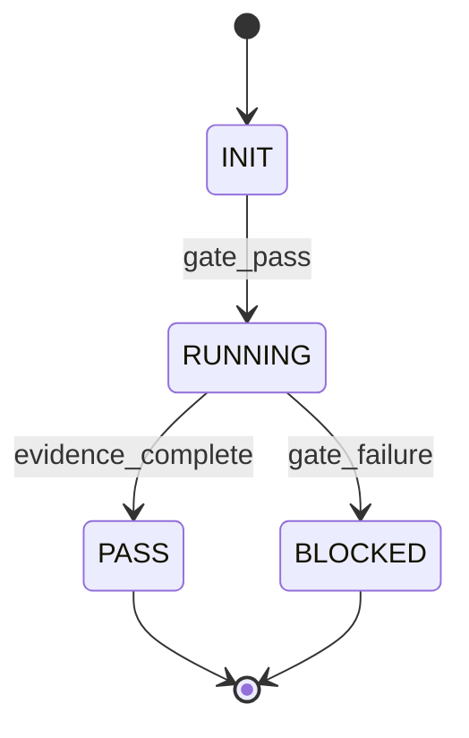

# Prime Mermaid Primacy: Why .prime-mermaid.md Is the Canonical Source of Truth

**Status:** Strategic Paper
**Date:** 2026-02-21
**Author:** Phuc Vinh Truong, Stillwater Project
**Scope:** Establishing .prime-mermaid.md as the canonical source-of-truth representation format, with JSON/YAML/XML as derived transport formats.
**Auth:** 65537

---

## Thesis

JSON, YAML, and XML are derived transport formats. They are optimized for machine parsing, not human reasoning. They encode data as flat trees, not as the graphs that intelligence tasks actually are.

Prime Mermaid — a Markdown document with embedded Mermaid diagrams as the canonical representation of a system — is the source of truth. JSON and YAML are outputs derived from it, suitable for machine consumption. The skill definition, the state machine, the configuration, the scope registry: all of these are graphs. Mermaid is a graph language. JSON is not.

This paper argues that for the artifact categories identified in the ban list below, the canonical representation must be .prime-mermaid.md. JSON/YAML/XML are acceptable as derived transport, but they are never the source of truth.

---

## 1. Graphs Are the Right Structure for Intelligence Tasks

The foundational argument: most intelligence tasks are graph problems. Skill definitions encode state machines. OAuth3 delegation chains are trees with monotone invariants. Verification rung requirements form a partial order. Agent orchestration is a directed acyclic graph. Configuration relationships are often dependency graphs.

JSON encodes trees: a root node with children, each child with children. JSON can represent a list. JSON can represent a nested object. JSON cannot natively represent a graph — the moment you need to express that node A connects to both node B and node C, and that B also connects back to C, you need either a workaround (arrays of edge objects) or a convention that is not enforced by the format.

Mermaid is a graph language. It natively expresses nodes and directed edges. Subgraphs. Cycles. Multiple paths between nodes. Conditional branches. The structure of a Mermaid diagram is the structure of the system it describes. The structure of a JSON file is a tree imposed on a system that may not be a tree.

When the representation format does not match the underlying structure, the representation lies. It flattens what is curved. It hides relationships. It makes forbidden states invisible.

---

## 2. Human Readability Is Not Optional for Canonical Forms

The canonical form of a specification — the form from which all other forms are derived — must be human-readable. A developer must be able to open the canonical file and understand the system it describes. If understanding requires running a parser or rendering a chart, the file is a compiled artifact, not a source.

A .prime-mermaid.md file is readable in any text editor. The Mermaid blocks are human-legible even without rendering — the node names and edge labels carry semantic information. A developer reading:



understands the state machine without any tooling. They can see INIT, RUNNING, PASS, BLOCKED. They can see that gate_failure leads to BLOCKED. They can see that BLOCKED is terminal.

A JSON file encoding the same information:

```json
{
  "states": ["INIT", "RUNNING", "PASS", "BLOCKED"],
  "transitions": [
    {"from": "INIT", "to": "RUNNING", "on": "gate_pass"},
    {"from": "RUNNING", "to": "PASS", "on": "evidence_complete"},
    {"from": "RUNNING", "to": "BLOCKED", "on": "gate_failure"}
  ],
  "initial": "INIT",
  "terminal": ["PASS", "BLOCKED"]
}
```

is machine-parseable. It is not immediately human-comprehensible as a state machine. The structure of the data gives no visual cue about the relationships. You have to mentally simulate the graph from the edge list.

For the canonical form, human-comprehensibility is the requirement. The Mermaid file is the canonical form. The JSON file is derived from it, suitable for consumption by the execution engine.

---

## 3. Hashability Without Ambiguity

SHA-256 over a file requires that the file has a canonical byte representation. The hash detects drift.

JSON does not have a canonical representation. The keys of a JSON object have no required ordering. `{"a": 1, "b": 2}` and `{"b": 2, "a": 1}` are semantically identical JSON, but their SHA-256 hashes differ. To hash a JSON file reproducibly, you must either sort keys (a convention not enforced by the format) or use a canonical JSON serializer (an external dependency that can change).

A Mermaid file in a .md document has a deterministic byte representation. Two authors writing the same state machine will produce different Mermaid files — but the canonical .prime-mermaid.md format (Overview + Diagram + Invariants + Derivations) provides a stable structure within which the Mermaid block can be normalized.

Critically, the invariants section provides the semantic hash anchor: if the invariants change, the system has changed. If the diagram changes but the invariants do not — that is a warning signal, not an automatic pass. The invariants are the specification; the diagram is the visualization of the specification.

For drift detection in the Stillwater verification OS, SHA-256 over the canonical .prime-mermaid.md file is the mechanism. A skill file whose hash changes without a documented reason is a regression. The hash is the integrity check. JSON key ordering ambiguity makes this check unreliable for JSON source files.

---

## 4. Forbidden States Are Visually Inspectable

The Stillwater skill system depends on forbidden state enumeration. An agent must not enter certain states. The forbidden states are the safety guarantees of the system.

In a Mermaid state diagram, forbidden states are visually inspectable. A developer reviewing the diagram can ask: "Is there a path from START to BLOCKED that does not pass through the confirmation gate?" They can trace it visually. If they find such a path — a missing edge, a missing gate, a shortcut — the diagram reveals the bug.

In a JSON encoding of the same state machine, the forbidden state check requires running a reachability analysis algorithm. The visual inspection is not possible. You need tooling. You need to trust the tooling. The structure of the JSON file does not make the forbidden states apparent.

This is not merely an aesthetic preference. In the context of the Stillwater verification OS — where the prime-safety skill enumerates forbidden states and the evidence gate is the mechanism for enforcing them — the ability to visually inspect the state machine is a security property. An auditor reviewing a .prime-mermaid.md file can verify the safety properties with their eyes. An auditor reviewing a JSON file must run a program.

"If you can't draw it, you don't understand it." — Knut Sveidqvist

For the Stillwater verification system, "you don't understand it" is not an acceptable state for the definition of safety-critical behaviors.

---

## 5. Composability Through Subgraphs

Mermaid supports subgraphs: named groupings of nodes within a larger graph. Subgraphs compose. A complex system can be expressed as a collection of subgraphs, each representing a component, connected by edges that cross subgraph boundaries.

JSON objects are composable through nesting, but the composition structure is a tree, not a graph. Two JSON objects can be merged (with key-collision risk), but they cannot reference each other bidirectionally without breaking the tree structure. A JSON object that refers back to its parent introduces a cycle that the format cannot express cleanly.

A .prime-mermaid.md file with subgraphs expresses:
- The components of the system as named subgraphs
- The interactions between components as edges crossing subgraph boundaries
- The internal structure of each component as the nodes within its subgraph

The composition is visible. The boundaries are visible. The interactions are visible. Nothing is hidden in a nesting hierarchy that requires traversal to understand.

---

## 6. The Ban List

The following artifact categories must never use JSON/YAML/XML as their canonical source-of-truth:

**Skill definitions:** Skill files are behavioral contracts for agents. They define states, transitions, forbidden behaviors, and evidence requirements. These are graph-structured. The canonical form is .md with embedded Mermaid state diagrams. JSON representation of a skill is a derived transport format for tooling that needs to parse skills programmatically.

**State machines:** Any system component with states and transitions — verification rungs, agent lifecycle, OAuth3 gate sequence, recipe execution flow — has a canonical form in Mermaid stateDiagram-v2 or flowchart. JSON encoding of a state machine is a secondary artifact for machine consumption.

**Configuration:** Configuration files that describe relationships between components — which skills depend on which, which agents compose which sub-agents, which scopes are required for which platforms — are graph-structured. The canonical form is .prime-mermaid.md with dependency diagrams. YAML configuration files derived from the canonical graph are acceptable as deployment artifacts.

**Scope registry:** The OAuth3 scope registry — the mapping of `platform.action.resource` triples to descriptions, risk levels, and step-up requirements — has natural graph structure. Scopes group by platform (subgraph), by action class, by resource type. The canonical scope registry is a .prime-mermaid.md with a mindmap or ER diagram. JSON/YAML representation for machine validation is derived.

**Agent orchestration plans:** The structure of a swarm — which agents exist, which delegate to which, which skills each carries — is a directed graph. The canonical representation is a Mermaid flowchart or sequence diagram. JSON encoding of the orchestration plan is a derived transport format.

**NORTHSTAR metrics:** The relationships between metrics, their dependencies, and the path from current state to goal state form a graph. The canonical NORTHSTAR representation includes Mermaid flowcharts showing the flywheel, the belt progression, and the metric dependencies.

---

## 7. The Exception: Recipes as Transport

Recipes — structured JSON files describing task execution patterns for the browser execution engine — are an acceptable exception to the canonical JSON ban. The exception is precisely defined:

Recipes are transport format, not specification. The recipe.json file is the wire format for the execution engine. It must be parseable by the browser extension. It must be diffable. It must be versioned. For these purposes, JSON is appropriate.

However: the canonical recipe specification — what a recipe is, what fields it must contain, what execution semantics it has, what the recipe state machine looks like — is a .prime-mermaid.md file. The JSON schema for recipes is derived from this specification.

The correct workflow:
1. Write the canonical recipe spec as .prime-mermaid.md (the state machine, the required fields, the execution flow)
2. Derive the JSON schema from the spec
3. Author individual recipes as recipe.json files conforming to the derived schema
4. SHA-256 hash each recipe.json and store the sidecar — the hash detects drift from the verified execution

Recipe JSON files are not the source of truth for what a recipe is. The .prime-mermaid.md specification is.

---

## 8. Implementation: The .prime-mermaid.md Standard

A .prime-mermaid.md file has four required sections:

```markdown
## Overview
[One paragraph: what system does this diagram describe? What are the key entities?]

## Diagram
[One or more Mermaid blocks. Choose the type that matches the structure:
  - stateDiagram-v2 for state machines
  - flowchart for process flows
  - sequenceDiagram for interaction protocols
  - erDiagram for data relationships
  - mindmap for taxonomy]

## Invariants
[Bullet list of properties that must always hold:
  - "State X can only be reached via gate Y"
  - "No path from START reaches FORBIDDEN without passing through CONFIRMATION"
  - "Every node has at least one outgoing edge (no dead states except terminal)"]

## Derivations
[What can be mechanically derived from this diagram?
  - "JSON schema for recipe.json is derived from the Recipe state machine"
  - "YAML configuration for skill pack is derived from the Skill dependency graph"
  - "OAuth3 scope list is derived from the Scope registry mindmap"]
```

The SHA-256 hash is computed over the entire .prime-mermaid.md file. Any change to any section — including the Invariants — produces a different hash. The hash is stored in the corresponding sidecar file (filename.prime-mermaid.md.sha256).

---

## 9. Conclusion

The choice of canonical representation format is an architectural decision that determines the tractability of future audits, reviews, and modifications. Choosing JSON as the canonical form for graph-structured specifications is choosing a format that cannot express the structure natively, cannot be visually inspected for forbidden states, and introduces key-ordering ambiguity that breaks deterministic hashing.

The .prime-mermaid.md format addresses all of these:
- Natively expresses graph structure (nodes and directed edges)
- Human-readable without tooling (readable in any text editor)
- Deterministically hashable (no key-ordering ambiguity)
- Visually inspectable for forbidden states (an auditor can trace paths with their eyes)
- Composable through subgraphs (components connect without breaking tree structure)

The ban is not on JSON as a format. JSON is excellent for transport, for API payloads, for structured data exchange. The ban is on JSON as the source of truth for systems whose structure is a graph, not a tree.

Draw the graph first. The JSON is the shadow it casts.

---

## References

- `skills/prime-mermaid.md` — Prime Mermaid standard (full skill)
- `personas/mermaid-creator.md` — Knut Sveidqvist persona for diagram-as-code expertise
- `personas/graph-theorist.md` — Generic graph theory persona
- `skills/prime-safety.md` — Forbidden states as first-class architectural concept
- `papers/fda-part-11-architecture.md` — Evidence bundles and audit trail structure
- `papers/03-verification-ladder.md` — Rung system graph structure
- NORTHSTAR.md — The system diagram this paper is part of

---

**Auth: 65537**
