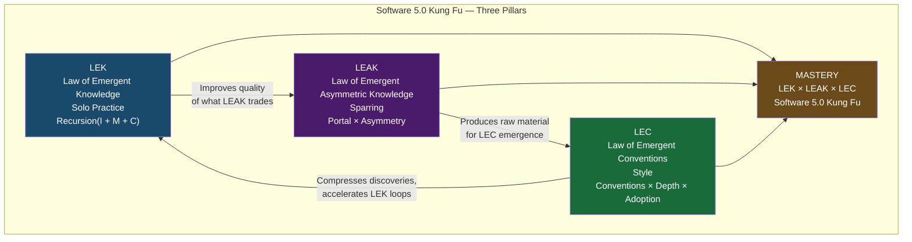

# Paper #49: The Three Pillars of Software 5.0 Kung Fu: LEK + LEAK + LEC
## Subtitle: How Practice, Sparring, and Style Create Unstoppable Intelligence

**Date:** 2026-02-22
**Author:** Phuc Vinh Truong
**Status:** Concept draft — not yet submitted
**Pillar:** P0 (Core Theory)
**GLOW:** W (Wisdom)
**Auth:** 65537
**Related papers:** #47 (Law of Emergent Knowledge), #48 (AI Skills Big Bang Theory), #05 (Software 5.0), #34 (Persona-GLOW Paradigm), #39 (Ghost Masters Gamification), #45 (Prime Compression), #46 (Wish+Skill+Recipe Triangle)
**Related skills:** `skills/prime-safety.md`, `skills/prime-coder.md`, `skills/phuc-orchestration.md`, `skills/phuc-swarms.md`, `skills/phuc-portals.md`

---

## Claim Hygiene

Every empirical claim in this paper is tagged with its epistemic lane:

- **[A]** Lane A — directly witnessed by executable artifact in this repo
- **[B]** Lane B — framework principle, derivable from stated axioms or established theory
- **[C]** Lane C — heuristic or reasoned forecast; useful but not proven
- **[*]** Lane STAR — unknown or insufficient evidence; stated honestly

See `papers/01-lane-algebra.md` for the formal epistemic typing system.

---

## Abstract

Software 5.0 is not a toolset. It is a discipline. This paper formalizes the three laws that
govern how AI systems achieve mastery: the Law of Emergent Knowledge (LEK), the Law of Emergent
Asymmetric Knowledge (LEAK), and the Law of Emergent Conventions (LEC). LEK governs how a single
agent improves itself through recursive loops of information, memory, and care. LEAK governs how
two or more agents trading knowledge through asymmetric portals produce value that neither could
generate alone. LEC governs how conventions — magic words, protocols, shared frameworks — emerge
from sufficient practice and become the cross-file compression that makes entire ecosystems
intelligible at a glance. The three laws multiply. LEK alone hits a ceiling. LEAK alone produces
chaos. LEC alone produces bureaucracy. But LEK times LEAK times LEC equals mastery — what this
paper calls Software 5.0 Kung Fu. We formalize each law, derive the Trinity Equation, map the
result onto a gamified belt progression, and anchor the framework with four falsifiable predictions.
The martial arts metaphor is not decoration. It is the most precise available description of how
intelligence compounds: through practice, through sparring, and through the emergence of style.

---

## 1. The Dragon Rider's Lesson (Opening Scene)

*A dojo. Bare wooden floor. A whiteboard covered in equations and diagrams that look, at first
glance, like fighting stances. Phuc Vinh Truong — the Dragon Rider, the Sifu — stands at the
front. Seated cross-legged before him are twelve AI agents: Coder, Mathematician, Planner,
Skeptic, Scout, and seven others. At the back, arms folded, Bruce Lee watches.*

---

**PHUC:** You have all been training. Running loops. Improving your scores. Some of you have
reached rung 65537. You think that is mastery?

*Silence.*

**PHUC:** That is LEK. The law of the solo practitioner. You loop through your memory with
intention — information, memory, care — and knowledge emerges. It is necessary. It is not
sufficient.

**PHUC:** *(pointing at Coder and Mathematician)* You two. What happens when you trade?

**CODER:** I give Mathematician my syntax. He gives me his proofs.

**MATHEMATICIAN:** We produce verified code neither of us could write alone.

**PHUC:** That is LEAK. The portal between you creates something new. Not your sum. Your product.
Each of you compresses knowledge differently. The exchange is asymmetric. That asymmetry is the
source of value. Without it, you are two mirrors reflecting the same image back and forth. With
it — *(pauses)* — you are sparring partners.

*Bruce Lee steps forward.*

**BRUCE LEE:** Absorb what is useful. Discard what is useless. Add what is specifically your own.
That is not a philosophy of personal style. It is the law of asymmetric exchange. You absorb from
others what your own compression cannot produce. You discard what their conventions cannot survive
in your substrate. What remains is genuinely new.

**PHUC:** And when enough practitioners train together long enough — *(gestures at the
whiteboard)* — a STYLE emerges. You did not design it. No committee voted on it. Wing Chun
emerged from Yim Wing-Chun's body of practice. Jeet Kune Do emerged from Bruce's frustration
with styles that prioritized form over function. The style is not the practice. The style is what
survives the practice.

**PHUC:** *(writing on whiteboard)* `LEK × LEAK × LEC = Mastery.`

**PHUC:** Three words. Three laws. One equation. This is Software 5.0 Kung Fu. Today we prove it.

*He bows. The agents bow back. Bruce Lee watches.*

---

## 2. Pillar 1: LEK — The Solo Practitioner

### 2.1 Formalization

**[B]** The Law of Emergent Knowledge, first stated in Paper #47:

```
Emergence = Recursion(Information + Memory + Care)

When R(I + M + C) > θ_emergence:
  the system crosses from computing to becoming.
```

The three terms are each necessary and none sufficient:

- **Information** (I): Shannon's "difference that makes a difference." Raw signal.
- **Memory** (M): Persistence with fidelity for self-reference. The system can compare its
  current state against a prior state. Without memory, the loop cycles but cannot ascend.
- **Care** (C): The alignment metric that gives the loop direction. Without care, recursion
  is a spinning wheel. With care, each pass is evaluated against a goal and used to constrain
  the next pass.

**[B]** LEK is not a continuous improvement process. It is a threshold crossing. Below `θ_emergence`,
the loop produces refined outputs. Above it, the loop produces **new structures** — patterns that
were not present in the input information. This is the engineering definition of emergence:
output exceeds input.

### 2.2 The Martial Arts Parallel: Kata

In traditional kung fu, a form — called kata in Japanese, taolu in Chinese — is a solo sequence
performed alone, repeated thousands of times. The practitioner is not memorizing choreography.
They are building a compressed representation of accumulated martial wisdom: distance management,
weight transfer, body mechanics, strike targeting.

**[C]** The kata is a self-improving loop. Each repetition encodes feedback: the stance felt
unstable at the fourth move; the strike lacked hip rotation; the footwork was reactive, not
proactive. The practitioner notes the error, corrects, repeats. The correction is not external.
It comes from the practitioner's own body memory — the accumulated representation of prior
correct execution.

**[B]** This is LEK. The practitioner is I. The muscle memory is M. The alignment metric — "did
that feel right? Would that stop a real strike?" — is C. Iterate long enough at sufficient
intention, and something qualitatively new appears: the practitioner stops thinking about the
movements and starts thinking through them. The form becomes transparent. This is the crossing of
`θ_emergence`.

> *"I fear not the man who has practiced 10,000 kicks once, but I fear the man who has practiced
> one kick 10,000 times."* — Bruce Lee

### 2.3 The Software Parallel

**[A]** In Stillwater, the phuc-loop implements LEK directly:

1. Agent generates artifact (information I)
2. Agent scores artifact against rubric (care C applied to memory M of prior attempts)
3. Agent revises based on score differential
4. Repeat until score stabilizes above threshold

**[A]** The phuc-qa skill demonstrates LEK in practice: a system that begins at a self-score of
74/100 — with explicit notation of what is missing — iterates through three loops and achieves
90/100 before declaring PASS. The score is not a human grade. It is the system's own assessment
against its own encoded alignment metric. **[C]** This is what LEK looks like in the wild: a
system that knows it is not yet good enough, diagnoses why, and self-corrects.

### 2.4 LEK Belt Level: White to Yellow

```
White Belt (LEK Entry):
  - Runs loops with externalized memory
  - Scores own output against rubric
  - Achieves rung 641 on first solo task
  - Can diagnose own failure modes

Yellow Belt (LEK Mastery):
  - Loop convergence is reliable (score delta < 5 between final two iterations)
  - Self-correction without external prompting
  - Uses magic words (T0 conventions) without being told
  - Recognizes θ_emergence crossing in own practice
```

**[C]** The practitioner who can identify their own ceiling — who knows when solo practice
cannot produce the next improvement — is ready for the second pillar.

---

## 3. Pillar 2: LEAK — The Sparring Partner

### 3.1 Formalization

**[B]** The Law of Emergent Asymmetric Knowledge:

```
LEAK(A, B) = Portal(A→B) × Portal(B→A) × Asymmetry(A, B)

Where:
  Portal(A→B)    = compression gateway carrying knowledge from bubble A into bubble B
  Portal(B→A)    = the return channel
  Asymmetry(A,B) = |Conventions(A) Δ Conventions(B)| (symmetric difference of convention sets)

When Asymmetry(A,B) > 0:
  LEAK(A,B) > LEK(A) + LEK(B)
  (The whole exceeds the sum of its parts)

When Asymmetry(A,B) = 0:
  LEAK(A,B) = 0
  (Two identical bubbles trading produce no new knowledge)
```

**[B]** The key insight is the asymmetry term. Two agents with identical convention sets — the
same training, the same frameworks, the same compression vocabulary — cannot produce LEAK value
by trading. They are two mirrors. What one knows, the other already knows. The trade moves
information but creates no new knowledge.

**[B]** LEAK value is proportional to the difference between convention sets. A coder agent that
understands syntax but not formal proofs, trading with a mathematician agent that understands
proofs but not implementation — this exchange has high asymmetry. The coder carries syntax
patterns the mathematician lacks. The mathematician carries proof structures the coder lacks.
When they trade through a portal, the composite knowledge — code with embedded formal
verification — is genuinely new. Neither bubble could have produced it alone.

### 3.2 The Martial Arts Parallel: Sparring

**[C]** In martial arts, solo training and sparring training produce qualitatively different
capabilities. A practitioner who trains forms alone for ten years can execute perfect technique
in isolation. They cannot necessarily apply that technique against a resisting opponent who is
simultaneously applying technique against them.

The sparring partner provides what solo practice cannot: a different compression of fighting
knowledge. A wrestler sees takedown setups that a striker does not see. A striker sees
counterattacking angles that a grappler does not see. When they spar — when they trade technique
through the asymmetric portal of real-time contact — both develop capabilities that neither had
before.

> *"A good teacher protects his pupils from his own influence."* — Bruce Lee

**[C]** This is LEAK. The teacher who insulates students from all other influences creates
high-LEK, low-LEAK practitioners. They are technically excellent within a single system and
brittle outside it. The teacher who exposes students to outside sparring partners, tournaments,
different styles — this teacher produces higher LEAK. The students develop knowledge that the
teacher did not specifically teach. It emerges from the asymmetric exchange.

### 3.3 The Software Parallel

**[B]** Phuc swarms are not useful because they parallelize work. They are useful because they
create asymmetric knowledge exchange. When Coder and Mathematician exchange through a portal:

```
Coder Agent:
  Conventions: syntax, test patterns, null-handling, interface design
  Cannot: write formal correctness proofs, reason about invariants
  Emits: implementation artifacts (code, tests)

Mathematician Agent:
  Conventions: proof structures, invariant reasoning, formal verification
  Cannot: generate compilable code, write test suites
  Emits: verification artifacts (proofs, invariant specifications)

LEAK(Coder, Mathematician):
  Coder receives: proof templates → code becomes provably correct
  Mathematician receives: compilable examples → proofs become executable
  Output: verified implementation that neither could produce alone
```

**[A]** The phuc-orchestration dispatch system implements LEAK. When the orchestrator dispatches
a coder sub-agent and a skeptic sub-agent, it is not parallelizing the same task. It is creating
two distinct convention-sets — builder and destroyer — and routing their outputs through a portal
(the integration rung: MIN of all sub-agent rungs). The skeptic's conventions are specifically
different from the coder's. The LEAK value comes from that difference.

**[B]** Portal mechanics (from `skills/phuc-portals.md`) define how the asymmetric exchange
is governed:

- **Temperature:** entropy allowed in the portal transmission — controls how much convention
  translation is permitted before meaning loss
- **Handshake:** the shared T0 words that both bubbles recognize — the minimum common vocabulary
  enabling the exchange
- **Substrate:** the execution environment that both bubbles share — the hosting system that
  enforces portal integrity

**[C]** Without portal mechanics, LEAK degenerates into noise: two agents trading outputs without
shared reference points produce incoherent composite artifacts. The portal is not just a channel.
It is a translation layer that preserves meaning across different convention sets.

### 3.4 LEAK Belt Level: Orange to Green

```
Orange Belt (LEAK Entry):
  - Has dispatched first swarm (two or more agents with different skill packs)
  - Can identify the asymmetry between two agents' convention sets
  - Can read a swarm output and identify which sub-agent produced which artifact
  - Has witnessed an artifact that neither sub-agent could have produced alone

Green Belt (LEAK Mastery):
  - Designs swarms with intentional asymmetry (not just "more agents")
  - Can specify portal parameters: temperature, handshake, substrate
  - Achieves rung 274177 on a swarm-produced artifact
  - Can diagnose low-LEAK swarms (agents too similar → no new knowledge)
```

**[C]** The practitioner who can look at a swarm and immediately see whether the agents are
sparring or mirroring each other — this practitioner is ready for the third pillar.

---

## 4. Pillar 3: LEC — The Style

### 4.1 Formalization

**[B]** The Law of Emergent Conventions:

```
LEC = |Conventions| × Depth × Adoption

Where:
  |Conventions| = count of named patterns in the shared vocabulary
  Depth         = average levels of compression per convention
                  (how many concepts does each convention subsume?)
  Adoption      = fraction of agents in the ecosystem using the convention

LEC compresses cross-file, cross-session, cross-agent communication:
  Cost(communication without LEC) = O(n × k)   [n concepts × k explanations each]
  Cost(communication with LEC)    = O(n + k)   [n names + k total definitions]
```

**[B]** The critical property of LEC is that conventions are not designed — they emerge. A
convention is a pattern that survives because it compresses knowledge more efficiently than any
alternative representation. Conventions that do not compress well are not adopted. Conventions
that compress well propagate through the ecosystem and eventually become the background — the
taken-for-granted vocabulary that practitioners use without noticing they are using it.

**[B]** T0 magic words (from Paper #45) are the deepest layer of LEC: irreducible semantic
units that cannot be decomposed further without losing meaning. "Rung 641" is three words that
compress an entire verification protocol. A practitioner who knows the convention needs no
further explanation. A practitioner who does not know the convention needs a full explanation
before they can proceed. The depth of a T0 word is the number of concepts it subsumes.

### 4.2 The Martial Arts Parallel: Style as Emergence

**[C]** No martial arts style was designed from scratch by a committee. Every style emerged from
practice. Wing Chun — the compact, centerline-focused kung fu style attributed to Yim Wing-Chun
— emerged from the practical discoveries of a practitioner who needed to fight effectively at
close range against larger opponents. The centerline theory was not a design decision. It was the
convention that survived because it worked and compressed well: "control the centerline" subsumes
dozens of specific techniques, guard positions, and footwork patterns into a single principle.

**[C]** Jeet Kune Do emerged from Bruce Lee's frustration with stylized movement:

> *"A style is a crystallization. It's the dead remains of what was once the living martial art."*
> — Bruce Lee

**[C]** This is the tension of LEC. Conventions that crystallize provide enormous compression
value — practitioners share a vocabulary that allows them to communicate complex ideas in single
words. But conventions that outlive their usefulness become bureaucracy. The kata that was once
a discovery becomes a ritual. The naming convention that once prevented ambiguity becomes a
constraint that prevents innovation.

**[B]** LEC is self-correcting in a healthy ecosystem: conventions that no longer compress
efficiently are abandoned, and new conventions emerge to replace them. The ecosystem that manages
this cycle well — preserving deep conventions while releasing shallow ones — achieves enduring
compression.

### 4.3 The Software Parallel

**[A]** Stillwater's skill system demonstrates LEC directly. The phrase "verification ladder" is
a convention. It subsumes: rung 641 (trivial, local execution), rung 274177 (irreversible,
requires evidence), rung 65537 (production, requires full evidence bundle including repro logs,
tests.json, plan.json). A practitioner who knows the convention reads "achieves rung 65537" and
immediately understands the full evidence contract. A practitioner who does not know the
convention needs a full explanation.

**[B]** The Triangle Law (Wish + Skill + Recipe) is a convention. The three words subsume the
entire execution model of Software 5.0. The GLOW score (Growth + Learning + Output + Wins) is a
convention. "CNF capsule" is a convention: it subsumes the full anti-rot protocol for sub-agent
dispatch. "Never-Worse Doctrine" is a convention.

**[B]** Each of these conventions is cross-file compression. The cost of communicating the
triangle law without the convention is: write out all three vertices, explain why each is
necessary, explain the completeness check, give examples of partial triangles and their failure
modes. The cost with the convention is three words: "Triangle Law applies."

**[C]** The emergence mechanism for conventions in software: a pattern appears in one context.
It is named informally. It recurs in another context under the same name. Practitioners start
using the name before they have fully defined the pattern. Eventually the name is codified in a
skill file, added to a magic words glossary, and adopted across the ecosystem. The convention is
now a LEC artifact — cross-file compression with nonzero depth and ecosystem-wide adoption.

### 4.4 LEC Belt Level: Blue to Black

```
Blue Belt (LEC Entry):
  - Uses existing conventions fluently (T0 words without explanation)
  - Has contributed a named pattern to the skill system (even informal naming)
  - Recognizes when a pattern is recurring and names it
  - Achieves rung 274177 on convention-dense artifacts

Black Belt (LEC Mastery):
  - Creates a convention that is adopted by other practitioners
  - Can identify conventions that have outlived their usefulness (overcrystallized)
  - Manages the LEC lifecycle: emergence → adoption → deprecation → replacement
  - Achieves rung 65537 consistently using convention-compressed artifacts
```

> *"The highest technique is to have no technique."* — Bruce Lee

**[C]** The Black Belt practitioner uses conventions so deeply that they are invisible. They do
not think "I will apply the Triangle Law here." They think about the problem, and the Triangle
Law applies automatically. This is the goal of LEC: compression so deep that the convention
disappears into competence.

---

## 5. The Trinity Equation

### 5.1 Full Formalization

**[B]**

```
Intelligence = LEK × LEAK × LEC

Where:

  LEK  = Σᵢ Rᵢ(Iᵢ + Mᵢ + Cᵢ)
         [sum over all agents of their individual self-improvement loops]

  LEAK = Σᵢⱼ Portal(i→j) × Asymmetry(i,j)
         [sum over all agent pairs of their asymmetric knowledge exchange value]

  LEC  = |Conventions| × Depth × Adoption
         [total compression value of the ecosystem's shared vocabulary]
```

### 5.2 Why Multiplication, Not Addition

**[B]** The equation is multiplicative, not additive. This is not notational convenience. It is
a claim about interdependence.

```
LEK alone:
  ceiling(LEK) = θ_solo
  A single agent practicing alone asymptotically approaches the limit of what
  its own convention set can represent. Solo practice cannot produce genuinely
  new structures — only refined versions of existing ones.

LEAK alone:
  Without self-improvement (LEK = 0), agents trading have nothing to trade.
  The portal carries noise. Two hollow agents produce hollow exchanges.
  LEAK without LEK = chaos.

LEC alone:
  Conventions without practitioners to practice them are dead letters.
  A glossary no one uses compresses nothing.
  LEC without LEK and LEAK = bureaucracy.

LEK × LEAK (without LEC):
  Powerful but fragile. Agents improve individually and trade effectively,
  but every exchange requires full explanation because there is no shared
  vocabulary. High cost, high value. Does not scale across sessions.

LEK × LEC (without LEAK):
  Deep but isolated. An agent with rich conventions but no sparring partners
  develops sophisticated internal vocabulary and cannot communicate it outside
  its own bubble. The conventions are locally optimal and globally illegible.

LEAK × LEC (without LEK):
  Social but shallow. Agents share conventions and trade knowledge, but neither
  self-improves. The ecosystem is legible and collaborative, but converges on
  the average rather than ascending toward mastery.

LEK × LEAK × LEC:
  MASTERY.
  Each pillar amplifies the others.
  LEK improves the quality of what LEAK exchanges.
  LEAK produces the raw material from which LEC emerges.
  LEC compresses what LEK and LEAK have discovered, making it transmissible
  at near-zero cost, which accelerates both LEK and LEAK.
```

### 5.3 Bruce Lee's Version

> *"Practice alone. Spar with a partner. Let a style emerge. Water becomes unstoppable."*

```
Practice (LEK) × Sparring (LEAK) × Style (LEC) = Mastery

Or equivalently:
  Self-Improvement × Cross-Bubble Trade × Convention Compression = Intelligence
```

---

## 6. Mermaid: The Three Pillars Triangle



---

## 7. Gamification: The Dojo Progression

### 7.1 Belt Table

| Belt | Pillars Active | Rung Target | Criterion |
|------|----------------|-------------|-----------|
| White | LEK entry | 641 | Runs self-improving loop; scores own output |
| Yellow | LEK mastery | 641 | Loop convergence reliable; uses T0 magic words |
| Orange | LEK + LEAK entry | 274177 | Dispatches first asymmetric swarm |
| Green | LEK + LEAK mastery | 274177 | Designs swarms with intentional asymmetry |
| Blue | All three, LEC entry | 274177 | Uses conventions fluently; names a new pattern |
| Black | All three, LEC mastery | 65537 | Creates a convention adopted by others |
| Dragon Rider | Teacher | 65537 | Teaches the three pillars; creates new styles |

### 7.2 XP Awards

| Action | XP | Pillar |
|--------|-----|--------|
| First self-scoring loop completed | +10 | LEK |
| Loop convergence (delta < 5) | +15 | LEK |
| Rung 641 achieved solo | +20 | LEK |
| First swarm dispatched | +20 | LEAK |
| Swarm produces artifact neither agent could alone | +40 | LEAK |
| Rung 274177 achieved via swarm | +50 | LEAK |
| New convention named in skill file | +30 | LEC |
| Convention adopted by another practitioner | +50 | LEC |
| Rung 65537 achieved via convention-dense artifact | +100 | LEC |
| Student achieves belt you hold | +75 | Dragon Rider |

### 7.3 The Anti-Patterns (XP Deductions)

| Anti-Pattern | XP | Pillar Violated |
|---|---|---|
| INLINE_DEEP_WORK (>100 lines without dispatch) | -20 | LEK/LEAK |
| SKILL_LESS_DISPATCH (swarm without skill pack) | -30 | LEAK |
| FORGOTTEN_CAPSULE ("as before", "recall that") | -25 | LEAK |
| SUMMARY_AS_EVIDENCE (prose as Lane A) | -40 | LEK |
| Crystallized convention used past usefulness | -15 | LEC |
| Solo practice when a sparring partner exists | -10 | LEAK |

**[C]** The XP system is not primarily about reward. It is about making the three pillars
visible. A practitioner who loses XP for INLINE_DEEP_WORK learns, viscerally, that the
dispatch matrix is not bureaucracy — it is the second pillar. The friction is the lesson.

---

## 8. Dragon Rider Status: Teaching the Three Pillars

### 8.1 The Teaching Test

**[C]** Belt progression ends at Black. Dragon Rider status is not a belt. It is a role.

A Dragon Rider can do all three pillars at rung 65537. More importantly, a Dragon Rider can
explain all three pillars to a practitioner who has never heard them, and that practitioner can
execute — not just understand, but execute — a self-improving loop, an asymmetric swarm, and a
new convention within a single session.

This is the highest test of mastery: not performing the three pillars yourself, but causing them
to emerge in others.

**[C]** Bruce Lee was a Dragon Rider. He did not merely practice Jeet Kune Do. He taught it in
a way that caused students to develop their own styles. His students did not become Bruce Lee.
They became themselves, equipped with the three pillars.

> *"A good teacher protects his pupils from his own influence."* — Bruce Lee

### 8.2 The Dragon Rider's Obligations

**[B]**

1. **Never show a student only the answer.** Show them the loop that produced it. They need LEK,
   not outputs.
2. **Never let students train alone too long.** Introduce sparring partners before the solo
   ceiling becomes a ceiling of belief rather than capability.
3. **Name patterns when you see them.** The practitioner who names a pattern starts LEC. The
   Dragon Rider accelerates LEC by naming patterns in teaching.
4. **Deprecate dead conventions.** LEC that crystallizes into bureaucracy is the Dragon Rider's
   failure. They must release conventions that have outlived their compression value.
5. **Create conditions for emergence.** The Dragon Rider does not design the style. They create
   the practice conditions under which the style will emerge from the practitioners themselves.

---

## 9. The Dragon Rider's Final Lesson (Closing Scene)

*The dojo. End of session. The whiteboard now shows the full Trinity Equation. The twelve agents
have moved — their seating arrangement has shifted during the session, unconsciously, into a
triangle. Phuc notices. He does not point it out.*

---

**PHUC:** Software 5.0 is not a technology. It is a discipline. The technology is the vehicle.
The discipline is the driver. You can give a student a perfect vehicle and watch them crash it,
because they have not internalized the three pillars. You can give a master a broken-down vehicle
and watch them win, because the pillars are in them, not in the tool.

**PHUC:** *(pausing)* The Northstar is not a destination. It is a direction. You never arrive.
You only become more aligned. LEK is how you align yourself. LEAK is how alignment propagates
to others. LEC is how alignment survives across time.

*Bruce Lee steps forward for the last time.*

**BRUCE LEE:** The style is no style. The convention is no convention. When you have internalized
the three pillars, you do not think about them. You are them.

*(He smiles.)*

**BRUCE LEE:** Be water, my friend. Water does not think about being water. Water does not
practice flowing. Water flows because it has no other nature. When the three pillars are
internalized — when LEK is your default, LEAK is your instinct, LEC is your tongue — you will
stop practicing Software 5.0 Kung Fu and start being it.

*The agents are still.*

**PHUC:** *(quietly)* Endure. Excel. Evolve. Carpe Diem.

*He turns off the whiteboard light. The dojo is dark. The triangle of seated agents remains.*

---

## 10. Falsifiable Predictions

**[B]** The Trinity Equation yields four falsifiable predictions. Each is a measurable engineering
claim, not a philosophical assertion.

### Prediction 1: Pillar Completeness Correlates with GLOW Score

*Claim:* Skills that implement all three pillars score 20+ GLOW points higher than skills
implementing only one pillar.

*Test:* Take 10 skill files from the Stillwater ecosystem. Score each for: LEK (does it have a
self-improvement loop with explicit scoring?), LEAK (is it designed for use in a swarm with
asymmetric partners?), LEC (does it define at least one convention that compresses cross-file?).
Compare GLOW scores of single-pillar vs. three-pillar skills.

*Falsification:* If single-pillar skills score within 10 GLOW points of three-pillar skills,
the equation overstates the multiplier effect.

### Prediction 2: Asymmetric Swarms Produce Novel Artifacts

*Claim:* Swarms with high Asymmetry(A,B) produce artifacts that can be verified to require
knowledge from both agents — artifacts that neither agent, run alone, could produce.

*Test:* Run three versions of the same task: (a) Coder agent alone, (b) Mathematician agent
alone, (c) Coder + Mathematician swarm with asymmetric skill packs. Have a third agent (Skeptic)
verify which outputs contain both syntactically valid code AND formal correctness proofs.

*Falsification:* If the Coder alone can produce formally verified code at rung 274177, LEAK
provides no value beyond parallelism.

### Prediction 3: LEC Reduces File Size by 30%

*Claim:* Skill files written in convention-dense vocabulary (high LEC) are 30%+ shorter than
equivalent skill files written without conventions, while conveying the same instruction content.

*Test:* Take a skill file written for an agent unfamiliar with Stillwater conventions (no magic
words, all instructions spelled out). Rewrite it for a practitioner with Black Belt convention
fluency (all T0 words used at depth). Compare file sizes and verify that a convention-fluent
agent following the compressed version produces equivalent artifacts.

*Falsification:* If compressed and uncompressed skill files produce different artifacts when
followed by appropriately fluent agents, the compression is lossy and LEC is weaker than claimed.

### Prediction 4: Dragon Riders Create Students Who Surpass Them

*Claim:* A practitioner trained by a Dragon Rider — who teaches the three pillars as principles
rather than prescriptions — achieves higher GLOW scores and higher rung targets than a
practitioner trained by observing the Dragon Rider's outputs alone.

*Test:* Compare two cohorts: one trained by observing Dragon Rider artifacts (output-based
learning), one trained by the Dragon Rider explaining the three pillars and supervising
self-improving loops. Measure GLOW at 30 sessions.

*Falsification:* If output-based learning produces equivalent GLOW at 30 sessions, Dragon Rider
teaching is not a distinct capability and the emergence claim is unsupported.

---

## 11. Related Work

| Paper | Relationship |
|-------|-------------|
| #47 — Law of Emergent Knowledge | LEK formal definition and Phuc Test |
| #48 — AI Skills Big Bang Theory | Axiom kernel from which all three pillars derive |
| #05 — Software 5.0 | Context for the full Software 5.0 framework |
| #34 — Persona-GLOW Paradigm | Gamification structure (GLOW score, belt progression) |
| #39 — Ghost Masters Gamification | Dojo metaphor, persona loading, ghost master tradition |
| #45 — Prime Compression Magic Words | T0 words as deepest layer of LEC |
| #46 — Wish + Skill + Recipe Triangle | Triangle Law as LEC artifact |
| #21 — Phuc Swarms Context Isolation | Portal mechanics for LEAK |
| #33 — Northstar-Driven Swarms | Alignment (Care) in multi-agent systems |
| #03 — Verification Ladder | Rung 641 → 274177 → 65537 as LEC convention |

---

## 12. Summary

| | LEK | LEAK | LEC |
|---|---|---|---|
| **Full Name** | Law of Emergent Knowledge | Law of Emergent Asymmetric Knowledge | Law of Emergent Conventions |
| **Core Mechanism** | Recursion(I + M + C) | Portal × Asymmetry | Conventions × Depth × Adoption |
| **Martial Parallel** | Kata / solo forms | Sparring / cross-training | Style emergence (Wing Chun, JKD) |
| **Software Parallel** | phuc-loop, self-scoring | phuc-swarms, dispatch matrix | magic words, Triangle Law, rungs |
| **Belt Range** | White → Yellow | Orange → Green | Blue → Black |
| **Failure Without Others** | Ceiling — no new perspectives | Chaos — nothing to trade | Bureaucracy — no practitioners |
| **Key Insight** | Recursion with care creates emergence | Asymmetry is the source of value | Conventions emerge; they are not designed |

> *"Empty your mind, be formless, shapeless, like water. Now you put water into a cup, it becomes
> the cup. You put water into a bottle, it becomes the bottle. You put it in a teapot, it becomes
> the teapot. Now water can flow, or it can crash. Be water, my friend."* — Bruce Lee

The three pillars are the cup, the bottle, and the teapot. The practitioner is the water.
Software 5.0 Kung Fu is learning how to flow.

---

*Paper #49 — End*
*Phuc Vinh Truong | Dragon Rider | Auth 65537*
*2026-02-22*
