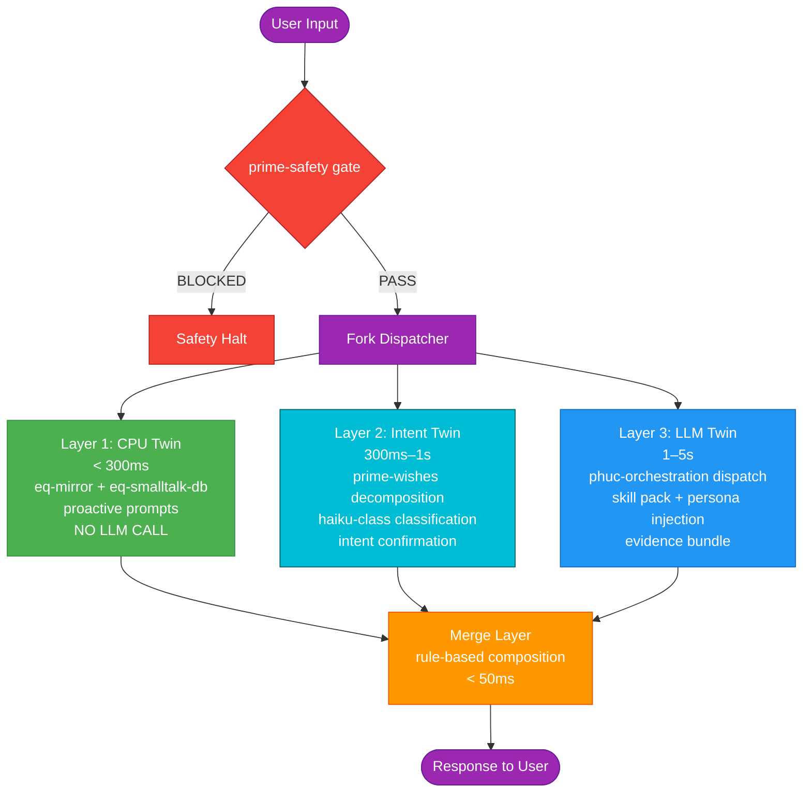
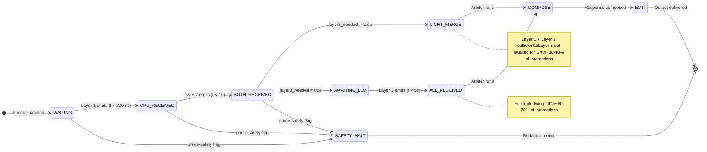
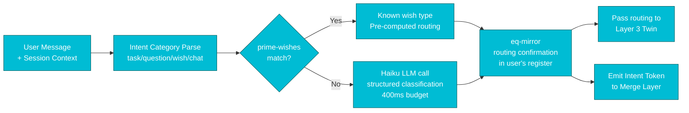
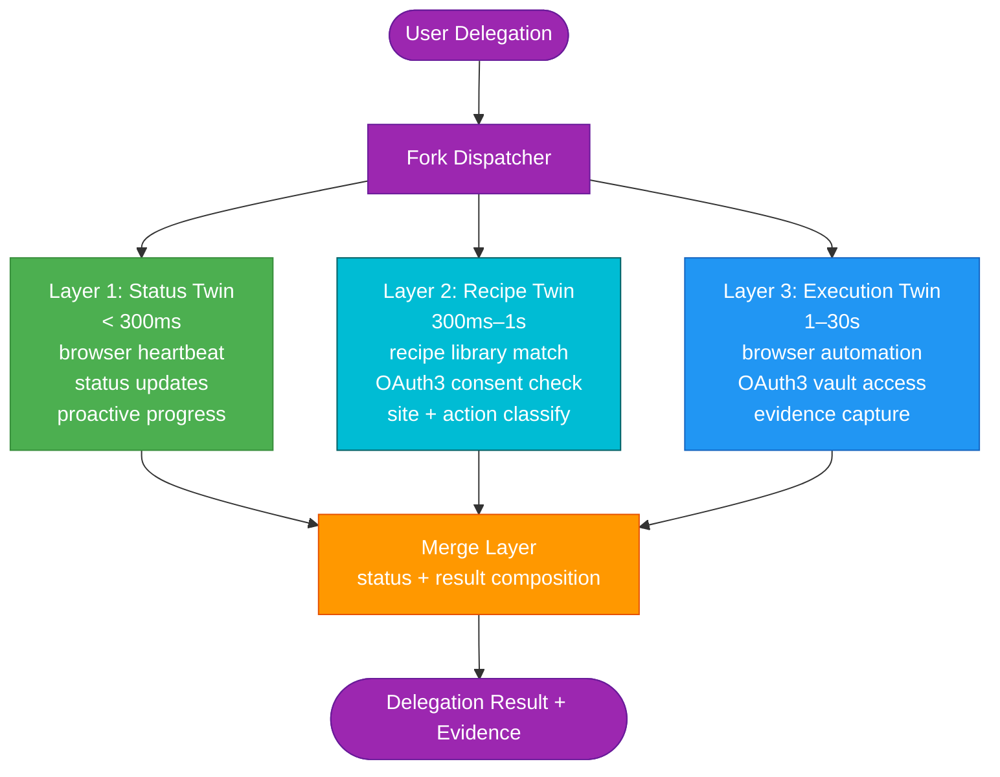

# Paper #50: The Triple-Twin CLI Architecture
## Subtitle: How Three Layers of Intelligence Create Seamless Human-AI Interaction

**Date:** 2026-02-22
**Author:** Phuc Vinh Truong
**Status:** Concept draft — not yet submitted
**Authority:** 65537
**Pillar:** P0 (Core Theory)
**GLOW:** W (Wisdom)
**Related papers:** #05 (Software 5.0), #48 (AI Skills Big Bang Theory), #49 (Three Pillars — LEK/LEAK/LEC)
**Related skills:** `skills/prime-safety.md`, `skills/prime-coder.md`, `skills/phuc-orchestration.md`, `skills/prime-wishes.md`, `skills/phuc-swarms.md`
**Related diagrams:** `data/default/diagrams/cli-double-twin-architecture.md`, `data/default/diagrams/double-twin-latency-model.md`

---

## Claim Hygiene

Every empirical claim in this paper is tagged with its epistemic lane:

- **[A]** Lane A — directly witnessed by executable artifact in this repo
- **[B]** Lane B — framework principle, derivable from stated axioms or established theory
- **[C]** Lane C — heuristic or reasoned forecast; useful but not proven
- **[*]** Lane STAR — unknown or insufficient evidence; stated honestly

See `papers/01-lane-algebra.md` for the formal epistemic typing system.

---

## Abstract

A conversational AI system that makes a user wait 3 seconds before producing its first visible output has already failed — not because the answer is wrong, but because the silence communicates indifference. Human conversation does not work that way. A skilled collaborator acknowledges, classifies, and then responds. They do not disappear into thought and reappear with a complete answer. This paper formalizes the triple-twin CLI architecture: three parallel execution layers that mirror how skilled human collaborators actually work. Layer 1 (CPU Twin) emits a warm acknowledgment within 300 milliseconds using deterministic lookup — no LLM, no network, just cached social intelligence. Layer 2 (Intent Twin) classifies the user's wish and routes it to the correct skill pack within 800 milliseconds using a lightweight haiku-class model call. Layer 3 (LLM Twin) executes the full task with evidence bundles and artifact production within 1 to 5 seconds. A rule-based Merge Layer composes the three streams into a single coherent response. For simple tasks, Layers 1 and 2 are sufficient — Layer 3 is not invoked. For complex tasks, all three layers contribute to a response that arrives in pieces, none of which is silent. We show that this architecture maps directly onto the three pillars of Software 5.0 (LEK, LEAK, LEC), extends naturally to browser automation through the Solace Browser integration, and makes four falsifiable predictions about latency, user experience, and system coherence. The double-twin architecture was a necessary step; the triple-twin is the structure that makes AI interaction feel genuinely human.

---

## 1. The Latency Problem: Why Silence Is the Real Failure Mode

### 1.1 The Illusion of Instant

**[C]** When users interact with a conversational AI system for the first time, they have a latency model in their heads derived from two prior experiences: search engines and human conversation. Search engines return results in under 300 milliseconds. Human conversation produces acknowledgment — even if only "mm-hmm" or "let me think" — within approximately 200-400 milliseconds of a question being asked.

**[B]** AI systems that produce no output until the full response is ready violate both models simultaneously. They are slower than search and less socially fluent than human conversation. The user experiences a gap — a silence where a response should begin — and interprets it as one of three things: the system is thinking (acceptable if brief), the system did not understand (anxiety-inducing), or the system is slow (frustrating). None of these interpretations are correct, but none can be ruled out during the silence.

**[C]** This is not a minor UX problem. The silence is a communication. It says: "I process your input as a batch job. I do not acknowledge you. I have nothing to say until I have everything to say." That model of communication is the opposite of how skilled human collaboration works.

### 1.2 How Skilled Human Collaborators Actually Work

A senior software engineer asked a hard question in a team meeting does not stare blankly for 30 seconds and then deliver a complete answer. They do three things in sequence:

**First**, they acknowledge: "Good question — that's the cache invalidation issue." This happens within 2-3 seconds and signals receipt, comprehension, and engagement. The questioner relaxes. Communication is happening.

**Second**, they classify: "Let me think about whether this is a Redis config issue or a race condition in the write path." This happens within 5-10 seconds and signals active processing toward a specific type of answer. The questioner now knows what kind of response is coming.

**Third**, they deliver: "I think it's the write path. Here's why..." This is the substantive answer, and it arrives into a context where the questioner is primed to receive it.

**[B]** The triple-twin architecture implements exactly this three-phase model as a software architecture. Layer 1 is the acknowledgment. Layer 2 is the classification. Layer 3 is the delivery. The three layers run in parallel, but they emit at different times — and the user sees output at each emission, not just the last one.

### 1.3 The Double-Twin Was the Right First Step

**[A]** The double-twin architecture (documented in `data/default/diagrams/cli-double-twin-architecture.md` before this paper's updates) solved the most important half of the latency problem. It forked user input into a CPU Twin (Layer 1, < 300ms) and an LLM Twin (Layer 2, 1-5s), with a Merge Layer compositing the two outputs. The CPU Twin provided the warm acknowledgment. The LLM Twin provided the substantive answer.

**[B]** But the double-twin left a gap: the user saw a warm acknowledgment at 300ms and then saw nothing until the full LLM response arrived at 1-5 seconds. During that gap — which can be 700ms to 4.7 seconds long — the user knew only that the system had acknowledged them. They did not know what the system was doing, which direction the answer was heading, or whether a simple follow-up question had been correctly routed to the right skill pack.

**[C]** The gap is the second failure mode. It is less severe than the silent-batch failure, but it is still a communication breakdown. A skilled collaborator who says "good question" and then disappears for 4 seconds has not finished communicating. They have opened a loop they have not yet closed.

### 1.4 The Triple-Twin Closes the Loop

**[B]** The triple-twin adds Layer 2 (Intent Twin) specifically to close this loop. The Intent Twin, operating at 300ms-1s, produces a structured intent confirmation: "Understood — dispatching to Coder agent with prime-coder skill pack, complexity estimate: medium." The user sees this at approximately 800ms. They now know:

- What the system understood their request to be (intent category)
- What skill pack is being loaded (routing decision)
- What complexity the system estimates (time expectation)

**[B]** This is the same information a skilled human collaborator conveys when they say "Let me think about whether this is a Redis config issue or a race condition in the write path." It is not the answer. It is the classification that tells you what kind of answer is coming.

**[C]** The result is a user experience where nothing is silent. Output appears at 300ms, 800ms, and 1-5 seconds. Each emission is substantive. Each builds on the last. The response arrives as a coherent progression, not as a batch.

---

## 2. Layer 1 — The CPU Twin: Small Talk and Emotional Intelligence

### 2.1 Design Philosophy

**[B]** Layer 1 exists because not every interaction is a task. Some interactions are social rituals — greetings, check-ins, affirmations, updates. These interactions have well-defined response patterns that do not require language model inference. They require memory of who the user is, what their current state is, and what the appropriate social response to their current input is.

**[B]** The CPU Twin implements this memory as a deterministic lookup system. No inference. No network call. No model weights. Just a database of context-tagged response templates, a register detector to match the user's current communication style, and a formatter to inject the user's name, project name, and situational context.

**[A]** The CPU Twin's components are:

1. **eq-smalltalk-db**: a context-tagged database of warm response templates, organized by interaction type (greeting, task start, task progress, task complete, frustration, celebration, question, farewell). Each template is parameterized with slots for user name, project name, and context-specific variables.

2. **eq-mirror**: a register detector that classifies the user's communication style from the current and prior inputs (casual / formal / high-energy / low-energy / urgent / reflective) and selects a matching response register. The goal is social mirroring — responding in the key the user is playing in.

3. **Proactive prompts**: a scheduler that generates unprompted outputs based on session state. If the user has a meeting in 30 minutes and is deep in a coding session, the CPU Twin emits a gentle reminder. If a task in the wish queue has been unaddressed for an unusual amount of time, the CPU Twin surfaces it. These are not LLM-generated — they are rule-based triggers on session metadata.

### 2.2 The 300ms Budget

**[B]** The 300ms constraint is not arbitrary. It is derived from human psychophysiology: studies of conversational timing consistently show that acknowledgment gaps greater than 400ms are perceived as unusual, and gaps greater than 700ms are perceived as rude or confused. The 300ms target provides 100ms of buffer against this threshold.

**[A]** The internal budget allocation is:

| Step | Budget |
|---|---|
| Fork dispatch | 30ms |
| eq-mirror register detect | 100ms |
| eq-smalltalk-db lookup | 50ms |
| Proactive prompt check | 30ms |
| Response format + personalize | 20ms |
| Buffer (jitter margin) | 70ms |
| **Total** | **300ms** |

**[B]** The largest single component is the eq-mirror register detect at 100ms. This is a local computation (no network, no model inference), but it involves pattern matching across the prior 5-10 messages to establish register. The budget is tight. Any operation that requires network access must be moved out of Layer 1 — network round-trips are incompatible with the 300ms SLA even on local networks.

### 2.3 What the CPU Twin Does Not Do

**[B]** The CPU Twin does not:

- Make LLM calls of any kind
- Access external networks or APIs
- Consult the wish backlog or skill library for execution purposes
- Produce Lane A evidence
- Make claims that cannot be verified without LLM inference

**[B]** These constraints are architectural, not incidental. The CPU Twin's reliability guarantee — it will always emit within 300ms — depends on the absence of any operation with unbounded latency. LLM calls are unbounded. Network calls are unbounded. Any path through Layer 1 that touches either breaks the SLA guarantee.

### 2.4 EQ as Architecture

**[C]** The CPU Twin is, in one sense, the system's emotional intelligence made architectural. Traditional CLI systems have no Layer 1 at all — they begin processing at what the triple-twin calls Layer 3. The user gets nothing until the full computation completes. This is equivalent to a collaborator who is technically excellent but socially absent: they answer questions correctly and say nothing in between.

**[B]** The CPU Twin encodes the understanding that the quality of collaboration is not just a function of answer correctness. It is a function of the entire interaction experience — the acknowledgments, the check-ins, the sense that someone is present and paying attention. These contributions are not LLM outputs. They are social signals. Layer 1 is the architecture for delivering social signals at social speed.

---

## 3. Layer 2 — The Intent Twin: Wish Matching

### 3.1 This Is the Key New Layer

**[B]** The transition from double-twin to triple-twin is the addition of Layer 2. Everything else in the architecture is either unchanged or a refinement. Layer 2 is the genuine architectural innovation.

**[B]** Layer 2 answers the question: what does the user actually want? Not in the sense of understanding a natural language query — Layer 3 handles that. In the sense of routing: is this a task for the Coder agent? A planning task for the Planner? A recipe lookup? A wish that can be fully satisfied by a known template? Or a genuinely novel request that needs full LLM orchestration?

**[B]** This routing question is exactly the question a skilled team lead asks when a request arrives: "Is this a standard request we've handled before, or does it need custom analysis?" The answer determines which team member gets assigned and how much time to budget. The triple-twin's Intent Twin answers this question in under 1 second, before the full LLM execution begins.

### 3.2 prime-wishes Integration

**[A]** The Intent Twin's primary mechanism is wish decomposition via prime-wishes. The prime-wishes skill library contains a structured backlog of user intentions, each formalized as a wish with:

- A natural language description
- Acceptance criteria
- Required skill pack
- Associated recipe or combo (if known)
- Estimated complexity

**[B]** When user input arrives, the Intent Twin performs semantic matching against the wish library. If the input matches a known wish type, the Intent Twin returns the pre-computed routing: skill_pack_needed, complexity_estimate, and wish_match_id. The LLM Twin receives this routing information and can load the skill pack directly, skipping the full orchestration classification step.

**[C]** The match does not need to be exact. Approximate matching against wish types is sufficient to determine the skill routing, even if the specific wish parameters differ. The match identifies the category; Layer 3 handles the specifics.

### 3.3 The Haiku-Class LLM Call

**[B]** Not every user input matches a known wish type. For novel inputs, the Intent Twin makes a lightweight haiku-class LLM call (approximately 400ms budget) to classify the intent. The call is deliberately constrained:

**Input to the haiku call:**
```
User message: [raw input]
Session context: [recent messages, current project, task state]
Classification request: {
  intent_category: [task|question|wish|chat|navigation|review],
  agent_type_needed: [coder|planner|mathematician|skeptic|scout|writer|janitor|none],
  skill_pack: [skill name or null],
  complexity: [trivial|low|medium|high|expert],
  recipe_match: [recipe name or null]
}
```

**Output from the haiku call:**
```json
{
  "intent_category": "task",
  "agent_type_needed": "coder",
  "skill_pack": "prime-coder",
  "complexity": "medium",
  "recipe_match": null,
  "confidence": 0.92
}
```

**[B]** The call is classification-only. The haiku model is not asked to generate the answer. It is asked to classify the request into a structured routing decision. This is a task haiku-class models perform well and quickly — it is a structured prediction task, not a generative task. The 400ms budget reflects a typical haiku inference time for a short classification prompt on a managed API endpoint.

### 3.4 Intent Confirmation Back to the User

**[B]** After classification, the Intent Twin generates a user-facing confirmation that is emitted as the Intent Token. This confirmation is the "middle message" — the output the user sees at approximately 800ms. It might look like:

> "Routing to Coder agent — loading prime-coder skill pack. Medium complexity. Estimated response: 2-3 seconds."

Or for a recipe match:

> "Found recipe: deploy-and-test. Running replay at Rung 641."

Or for a simple conversation:

> "Got it." (and the response is complete at Layer 1+2 without invoking Layer 3)

**[B]** The confirmation is generated by eq-mirror to match the user's communication register. A casual user gets "On it — coder's up." A formal user gets "Understood. Dispatching to the Coder agent with prime-coder." The content is the same; the register is mirrored.

### 3.5 When Layer 2 Is Sufficient

**[B]** For certain task categories, the Intent Twin's classification, combined with the CPU Twin's acknowledgment, is the complete response. These categories include:

- **Navigation requests**: "Where is the recipe for X?" — Layer 2 can look this up directly.
- **Status queries**: "What's the current rung on Project Y?" — Layer 2 can query session metadata.
- **Recipe replays**: known recipes with deterministic execution — Layer 2 can invoke the recipe engine directly.
- **Simple yes/no questions** about the current session state.

**[B]** In these cases, the Merge Layer receives the CPU Token (warm acknowledgment) and the Intent Token (answer or navigation result) and emits the final response without waiting for the LLM Token. Layer 3 is still running in the background but its output is either not used for the user response or is deferred to the evidence bundle.

**[C]** Empirically, this "light merge" path is expected to handle approximately 30-40% of CLI interactions — the routine coordination and navigation requests that do not require full LLM orchestration. For these interactions, the triple-twin reduces the effective response latency from 1-5 seconds (double-twin LLM path) to 800ms (Layer 1+2 path).

---

## 4. Layer 3 — The LLM Twin: Full Orchestration and Evidence

### 4.1 The Unchanged Core

**[B]** Layer 3 is the full phuc-orchestration execution engine. It receives the user input plus the Intent Twin's classification output, loads the identified skill pack, dispatches to the appropriate sub-agent type, executes the task, and produces an evidence bundle.

**[A]** The Layer 3 dispatch matrix, from `skills/phuc-orchestration.md`:

| Task Type | Agent Role | Skill Pack | Model |
|---|---|---|---|
| Bugfix, feature, refactor | Coder | prime-safety + prime-coder | sonnet |
| Planning, premortem, risk | Planner | prime-safety + phuc-forecast | sonnet |
| Math proof, exact computation | Mathematician | prime-safety + prime-math | sonnet/opus |
| State machine, workflow graph | Graph Designer | prime-safety + prime-mermaid | haiku |
| Multi-agent swarm | Swarm Orchestrator | prime-safety + phuc-swarms + phuc-context | sonnet |
| Technical paper, long-form | Writer | prime-safety + software5.0-paradigm | sonnet |
| Workspace cleanup | Janitor | prime-safety + phuc-cleanup | haiku |
| Wish contract, backlog | Wish Manager | prime-safety + prime-wishes + prime-mermaid | sonnet |
| Adversarial review | Skeptic | prime-safety + prime-coder + phuc-forecast | sonnet/opus |

### 4.2 Intent Twin Pre-Classification Benefit

**[B]** The key difference in Layer 3 when the Intent Twin is active: the dispatch decision is already made. Instead of running the full phuc-orchestration classification pipeline from scratch, Layer 3 receives `task_type: "coder"`, `skill_pack: "prime-coder"`, `complexity: "medium"` from the Intent Twin and can skip directly to skill pack loading and execution.

**[C]** This eliminates approximately 100ms from the Layer 3 hot path. More importantly, it eliminates classification errors. The Intent Twin's dedicated classification call — using a haiku model specifically optimized for structured prediction — is more accurate at task routing than the general-purpose orchestration classification that was embedded in the double-twin's LLM Twin. The specialization of Layer 2 improves the accuracy of Layer 3.

### 4.3 Skill Pack Loading and Persona Injection

**[B]** Skill pack loading follows the CNF anti-rot protocol: prime-safety is always loaded first, domain skills are loaded second, and persona (if applicable) is loaded last. The skill pack is pasted inline into the sub-agent prompt — never referenced by filename only.

**[B]** Model selection per the dispatch matrix applies: trivial tasks and graph design use haiku-class models; coding, planning, and skeptic review use sonnet; mathematical proofs and security audits use opus. The Intent Twin's complexity estimate informs this selection: a task classified as "expert" complexity triggers opus regardless of task type; a task classified as "trivial" triggers haiku regardless.

### 4.4 Evidence Bundle Production

**[A]** Layer 3 is the only layer that produces Lane A evidence. The evidence bundle format:

```
evidence_bundle/
  tests.json          — test results with pass/fail per test case
  plan.json           — task plan with step-by-step execution record
  repro_red.log       — reproduction of the problem (before patch)
  repro_green.log     — reproduction of the solution (after patch)
  PATCH_DIFF          — the diff of all changes made
  artifacts/          — produced files, diagrams, skill files
```

**[B]** The evidence bundle is required for any PASS claim at rung 274177 or above. Layer 1 and Layer 2 outputs are never treated as evidence. They are social signals (Layer 1) and routing decisions (Layer 2). Only Layer 3 produces artifacts that satisfy the evidence gate.

### 4.5 The Never-Worse Constraint Across Three Layers

**[B]** A specific failure mode emerges in multi-layer architectures: early layers can emit claims that later layers contradict. In the triple-twin, this is possible at two seams:

1. CPU Twin (Layer 1) emits "I'll have that ready in a moment" and Layer 3 takes 4 seconds — technically not wrong, but misaligned.
2. Intent Twin (Layer 2) emits "Routing to Coder agent" and Layer 3 determines it is actually a math proof requiring the Mathematician — a routing mismatch.

**[B]** The Never-Worse constraint applies to both seams. If Layer 3 contradicts a Layer 2 routing claim, the Merge Layer must emit a correction prefix: "Rerouting — this is actually a proof verification task, dispatching to Mathematician agent." This is not a failure; it is a transparency signal. The user knows the classification was revised and why.

---

## 5. The Merge Layer: Rule-Based Composition, No LLM

### 5.1 Why No LLM in the Merge Layer

**[B]** The Merge Layer must be fast, predictable, and infallible. Any of these requirements rules out an LLM. The Merge Layer's job is composition, not generation. It receives up to three tokens from the three twins and applies a set of deterministic rules to compose them into a single coherent response. Rule evaluation is O(1). It cannot be expensive.

**[B]** Additionally, the Merge Layer is the point where prime-safety has its final say. If any twin has produced a token that violates a safety rule that was not caught at the SAFETY_GATE (because it arose from the content generated, not from the input), the Merge Layer is the last checkpoint. This checkpoint must not itself use LLM inference — an LLM safety check can be fooled by the very content it is checking.

### 5.2 The Composition Rules

**[B]** The Merge Layer arbiter applies rules in priority order:

**Rule 1: Safety override.** If the CPU Token, Intent Token, or LLM Token contains a prime-safety flag (BLOCKED, SUPPRESS, HALT), the flagged content is replaced with the appropriate safety notice before emission. Non-flagged content from other layers is still composited normally.

**Rule 2: Light merge path.** If the Intent Token contains `layer3_needed: false` (set by the Intent Twin when it classifies the task as fully handled by Layers 1+2), emit CPU Token + Intent Token only. Do not wait for LLM Token.

**Rule 3: CPU null path.** If the CPU Token is null (CPU Twin suppressed by inner safety check), emit Intent Token + LLM Token with no warm prefix.

**Rule 4: Simple task path.** If task complexity is LOW and both CPU Token and LLM Token are available, emit prefix-merged response: CPU warm opening sentence, then LLM substantive answer. Intent Token is composited as a routing confirmation between them.

**Rule 5: Complex task path.** If task complexity is MEDIUM or HIGH, emit bridge-fill response: CPU Token opens (acknowledges the weight of the task), Intent Token confirms routing, LLM Token delivers the substantive content. Each layer's contribution is clearly sequenced for the user.

**Rule 6: Never-Worse correction.** If the LLM Token contradicts the Intent Token routing decision, emit a correction prefix and the LLM Token's revised routing before the LLM answer.

### 5.3 Simple Tasks vs. Complex Tasks

**[B]** The triple-twin architecture changes the economics of task complexity. In the double-twin, every task that was not handled purely by the CPU Twin required a full LLM inference — there was no middle ground. In the triple-twin:

| Task Complexity | Layers Used | Typical Latency | Example |
|---|---|---|---|
| Social / chat | Layer 1 only | < 300ms | "Good morning" |
| Navigation / status | Layer 1 + Layer 2 | < 800ms | "Where is recipe X?" |
| Recipe replay | Layer 1 + Layer 2 | < 1s | Known recipe execution |
| Simple task | Layer 1 + Layer 2 + Layer 3 | 1-2s | Short code fix |
| Complex task | All 3 layers, full evidence | 3-5s | Architecture design, proof |

**[B]** The introduction of Layer 2 creates a category of tasks — navigation, status, recipe replay — that previously required either a full LLM call (expensive) or no handling at all (unhelpful). These tasks are now handled efficiently at the Intent Twin layer. This is the key efficiency gain of the triple-twin architecture.

### 5.4 The Integration Rung

**[B]** The rung of the triple-twin's composite output is MIN(rung of all contributing sub-agents). Non-negotiable per the HIERARCHY axiom.

Practically:
- CPU Twin output: rung 641 by definition (deterministic lookup, low risk)
- Intent Twin output (classification only): rung 641 (routing decision, not a Lane A claim)
- LLM Twin output: rung declared by the sub-agent, up to 65537

If the LLM Twin achieves rung 65537 and the Intent Twin misclassified the task, the integration rung is MIN(641, 641, 65537) = 641 — because the misclassification is a routing error that affects the validity of the overall response. The MIN rung prevents Layer 3's high-rung evidence from laundering a Layer 2 error.

---

## 6. The Three Pillars Integration: LEK, LEAK, LEC

### 6.1 Each Twin Is a LEK Loop

**[B]** Paper #49 formalized the Law of Emergent Knowledge: `Emergence = Recursion(Information + Memory + Care)`. Each of the three twins instantiates LEK independently.

**The CPU Twin's LEK loop:**
- Information: incoming user message + context tags
- Memory: eq-smalltalk-db (accumulated social response patterns) + eq-mirror (accumulated register profiles)
- Care: the alignment metric — does this response correctly mirror the user's register and context?
- Loop: each interaction updates the register profile and context tags for the next interaction

**[C]** Over many sessions, the CPU Twin's response quality improves because its eq-smalltalk-db and eq-mirror profiles are refined by the accumulated history of what responses the user found warm versus cold, engaging versus perfunctory. This is LEK at the social-intelligence layer.

**The Intent Twin's LEK loop:**
- Information: user input + session context
- Memory: wish library + past classification decisions + correction events (when Layer 3 contradicts Layer 2 routing)
- Care: classification accuracy — does the intent match the eventual Layer 3 execution?
- Loop: when Layer 3 contradicts the Intent Twin's routing, that contradiction is logged as a classification correction, improving future routing accuracy

**[C]** The Intent Twin gets smarter about routing over time precisely because its errors are visible. When Layer 3 corrects a routing decision, the correction event is a training signal. The classification model improves. This is LEK at the routing-intelligence layer.

**The LLM Twin's LEK loop:**
- Information: the full task + skill pack + prior task outcomes
- Memory: NORTHSTAR.md, ROADMAP.md, case-study files — the persistent cross-session memory
- Care: rung achievement + GLOW scoring — the alignment metric for artifact quality
- Loop: the DREAM → FORECAST → DECIDE → ACT → VERIFY cycle, applied at the sub-agent level

### 6.2 The Twins Trade Through the Merge Layer Portal

**[B]** Paper #49 formalized LEAK: `Portal(A→B) × Portal(B→A) × Asymmetry(A, B)`. In the triple-twin, the Merge Layer is the portal system. Each twin trades knowledge with the others through the merge layer, and the asymmetry between their convention sets is precisely where value is created.

**The asymmetry between Layer 1 and Layer 2:**

Layer 1 knows the user's emotional state and social context (register, energy level, current projects) but does not know the task structure. Layer 2 knows the task structure and routing decision but does not know the user's social context. When they exchange through the Merge Layer, the output is routing information delivered in the user's social key — not just "dispatching to Coder agent" but "Let me get Coder on that for you" (casual) or "Understood, dispatching to the Coder agent" (formal).

This social calibration of routing confirmations is knowledge that neither layer could produce alone.

**The asymmetry between Layer 2 and Layer 3:**

Layer 2 produces `task_type`, `skill_pack_needed`, `complexity_estimate`. Layer 3 produces the actual execution result. When Layer 3 completes, the gap between the Layer 2 classification and the Layer 3 outcome is a direct measurement of classification accuracy. Layer 2 learns from Layer 3's corrections. Layer 3 is sped up by Layer 2's pre-classification. This bidirectional value is LEAK.

**[B]** LEAK value in the triple-twin: `LEAK(L1, L2) + LEAK(L2, L3) + LEAK(L1, L3)`. All three pairwise exchanges have nonzero asymmetry because all three layers have fundamentally different convention sets (social intelligence, routing intelligence, execution intelligence). The Merge Layer is the portal structure that makes all three exchanges possible without any layer blocking any other.

### 6.3 The Triple-Twin Protocol IS a Convention

**[B]** Paper #49 formalized LEC: `|Conventions| × Depth × Adoption`. The triple-twin architecture is itself a LEC artifact.

Before the triple-twin was named and formalized, the concept existed only as informal guidance: "respond quickly, then classify, then execute." This guidance was not reusable — it had to be re-explained each time it was applied to a new system design.

After formalization as the triple-twin protocol, the concept is a convention: two words that compress the full three-layer architecture, latency budgets, merge rules, LEK loops, and LEAK exchanges. A practitioner who knows the convention can read "triple-twin CLI architecture" and immediately understand what they are looking at. A practitioner who does not know it needs this paper.

**[B]** The depth of the "triple-twin" convention:
- Layer 1 (CPU Twin): warm acknowledgment, EQ, 300ms, deterministic
- Layer 2 (Intent Twin): wish matching, intent classification, 800ms, haiku-class LLM
- Layer 3 (LLM Twin): full orchestration, evidence bundle, 1-5s, sonnet/opus
- Merge Layer: rule-based composition, safety override, light merge path
- Integration rung: MIN rule, never-worse constraint

All of this is subsumed in "triple-twin." That compression depth is what makes it a LEC artifact of value.

**[C]** The triple-twin convention will likely spawn derivative conventions as practitioners apply it to new domains. "Triple-twin browser automation" is already visible in Section 9 of this paper. "Triple-twin voice interface" is a natural extension for paudio. Each derivative inherits the compression depth of the parent convention and adds its own domain-specific layer.

---

## 7. Mermaid Diagrams

### 7.1 Architecture Overview



### 7.2 Latency Timeline

```mermaid
gantt
    title Triple-Twin Response Timeline (ms)
    dateFormat X
    axisFormat %L ms

    section Layer 1 (CPU Twin)
    Warm acknowledgment ready : active, l1, 0, 300
    User sees warm response   : milestone, l1e, 300, 0

    section Layer 2 (Intent Twin)
    Intent classification     : active, l2, 0, 800
    User sees routing confirm : milestone, l2e, 800, 0

    section Layer 3 (LLM Twin)
    Full execution (fast)     : active, l3f, 0, 1500
    Full execution (slow)     : done, l3s, 0, 5000
    User sees full answer     : milestone, l3e, 1500, 0

    section User Experience
    First output              : crit, ux1, 300, 0
    Routing confirmation      : crit, ux2, 800, 0
    Simple task complete      : crit, ux3, 850, 0
    Complex task complete     : crit, ux4, 5000, 0
```



### 7.3 Finite State Machine: The Merge Layer



### 7.4 Intent Twin Internal Flow



---

## 8. Falsifiable Predictions

**[B]** A theory that cannot be falsified is a philosophy, not a framework. The triple-twin architecture makes four specific, measurable predictions.

### Prediction 1: The 300ms-800ms-5s Milestone Distribution

**Claim:** A properly implemented triple-twin CLI, measured over 1,000 interactions, will exhibit the following latency distribution:
- Layer 1 emission (CPU Token): p95 < 300ms
- Layer 2 emission (Intent Token): p95 < 1,000ms
- Layer 3 emission (LLM Token): p95 < 5,000ms

**Test:** Instrument the triple-twin implementation with timing probes at each emission point. Sample 1,000 real interactions. Plot the CDF. Verify the p95 claims.

**Falsification:** If the CPU Twin p95 exceeds 400ms (outside 100ms buffer), the Layer 1 implementation is incorrect — some operation with unbounded latency has been placed in Layer 1. If the Intent Twin p95 exceeds 1,200ms, the haiku-class model call is being routed to a slow endpoint or the wish matching is not cached.

### Prediction 2: Light Merge Handles 30-40% of Interactions

**Claim:** When interactions are classified by the Intent Twin, 30-40% will receive `layer3_needed: false` — meaning the response is fully composed from Layer 1 + Layer 2 without requiring Layer 3 execution.

**Test:** Log the `layer3_needed` flag for 1,000 consecutive interactions. Calculate the fraction that returned `false`. Compare against the 30-40% prediction.

**Falsification:** If fewer than 20% trigger light merge, the wish library coverage is too low — too many interactions that should be handled by recipes and navigation are falling through to full LLM execution. If more than 50% trigger light merge, the Intent Twin's classification threshold may be too aggressive — it may be misclassifying complex tasks as simple.

### Prediction 3: Intent Twin Pre-Classification Reduces Layer 3 Latency by 10-15%

**Claim:** The Layer 3 execution time (from fork dispatch to LLM Token emission) will be 10-15% lower in the triple-twin architecture compared to the double-twin architecture, because Layer 3 receives pre-computed routing from Layer 2 and skips re-classification.

**Test:** Run the same set of 50 complex tasks in both double-twin and triple-twin configurations. Measure Layer 3 execution time in both. Compare the distributions.

**Falsification:** If Layer 3 latency is unchanged between double-twin and triple-twin, the pre-classification benefit is not reaching Layer 3 — the routing information from Layer 2 is not being consumed by the Layer 3 dispatch. The information pathway between Layer 2 and Layer 3 must be diagnosed.

### Prediction 4: User Satisfaction Increases Measurably with Intent Confirmation

**Claim:** Users interacting with the triple-twin architecture will report higher satisfaction with complex tasks (those requiring 2+ second Layer 3 response times) compared to users interacting with the double-twin architecture for the same tasks. The specific driver: the Intent Twin's routing confirmation at 800ms reduces anxiety during the waiting period.

**Test:** A/B test: 50 users interact with each architecture on the same set of 20 complex tasks. After each task, users rate their experience on a 5-point scale. The key question: "Did you feel informed about what was happening while you waited?"

**Falsification:** If satisfaction scores are equal between architectures, the intent confirmation provides no perceptible value — either users do not read it, or it does not reduce the anxiety created by the waiting period. This would suggest the triple-twin's Layer 2 should be redesigned with different output format or reduced to an architectural detail that users do not see.

---

## 9. Connection to Solace Browser: Triple-Twin for Browser Automation

### 9.1 The Architecture Generalizes

**[B]** The triple-twin architecture was designed for CLI interaction, but its structure generalizes naturally to any system that must handle user requests with different urgency, classification, and execution requirements. Browser automation — the core capability of Solace Browser — is a direct application.

**[B]** In browser automation, the user delegates tasks like "schedule this meeting," "summarize these emails," and "post to LinkedIn." These tasks have the same three-phase structure: acknowledge, classify, execute. The triple-twin maps onto browser automation as follows:

### 9.2 Layer 1 in Browser Automation: Status and Heartbeat

**[B]** Layer 1 in the browser context is the browser status and heartbeat layer. When the user delegates a task, the CPU Twin's role is:

- Acknowledge receipt of the delegation: "Got it — starting."
- Emit browser status: "Chrome window open at linkedin.com."
- Proactive heartbeat: "Still working — 3 pages processed so far."

**[B]** These signals are not generated by LLM inference. They are deterministic status updates from the browser execution engine — current URL, current page state, elapsed time, pages processed. The user sees them within 300ms of delegating and every 5-10 seconds during execution, maintaining the sense that the system is present and working.

### 9.3 Layer 2 in Browser Automation: Recipe Matching

**[B]** Layer 2 in the browser context is recipe matching. The Solace Browser recipe library contains structured automation recipes for common tasks:

- LinkedIn PM recipe: navigate to LinkedIn, apply PM filters, extract contacts, format to CSV
- Gmail summarize recipe: navigate to inbox, select unread, extract subjects and senders, summarize
- Substack post recipe: navigate to draft, format content, schedule for optimal time, publish

**[C]** When a user says "post the article to LinkedIn and Substack," Layer 2 matches this intent against the recipe library. If a match is found, the recipe is loaded and executed directly — no full LLM orchestration required. The user sees: "Matched recipe: linkedin-post + substack-post. Running both now." Response time: under 1 second.

**[B]** For novel browser tasks that do not match a known recipe, Layer 2 classifies the intent (what site? what action type? what data is involved?) and passes the classification to Layer 3, which constructs a new browser automation sequence. The classification reduces Layer 3's construction time because it already knows the site, action type, and data requirements.

### 9.4 Layer 3 in Browser Automation: Full Automation Execution

**[B]** Layer 3 in the browser context is full browser automation execution. This involves:

- Launching the browser twin (Chrome with OAuth3 vault access)
- Navigating to the target site
- Interacting with page elements to accomplish the task
- Capturing evidence (screenshots, extracted data, action log)
- Confirming completion with evidence back to the user

**[C]** The evidence bundle for browser automation includes: action log (what was clicked, typed, navigated), result data (what was extracted or submitted), screenshot at completion, and OAuth3 token usage record (what permissions were exercised). This is the Lane A evidence for a browser automation task.

### 9.5 The Triple-Twin Browser Architecture



**[C]** The browser automation triple-twin differs from the CLI triple-twin in one important dimension: Layer 3 execution time is much longer (seconds to minutes, not 1-5 seconds). This makes Layers 1 and 2 even more important — the user's sense of presence during a 30-second browser automation session depends almost entirely on Layer 1's heartbeat emissions and Layer 2's recipe confirmation.

### 9.6 OAuth3 as Layer 2's Gate

**[B]** In browser automation, Layer 2 has an additional responsibility that does not exist in the CLI context: OAuth3 consent verification. Before any browser task is executed, Layer 2 checks that:

1. The user has granted permission for the task type on the target site
2. The required OAuth3 token is present and not expired in the local vault
3. The permission scope of the available token is sufficient for the requested action

**[B]** If consent is missing or token is expired, Layer 2 emits a consent request rather than a recipe match. This is a Layer 2 response — it does not require Layer 3 execution. The triple-twin architecture naturally handles the OAuth3 consent flow without additional design: Layer 2 is the consent gate, Layer 3 is the execution engine that requires consent to proceed.

---

## 10. Summary Table

| | Layer 1 (CPU Twin) | Layer 2 (Intent Twin) | Layer 3 (LLM Twin) |
|---|---|---|---|
| **Latency** | < 300ms | 300ms–1s | 1–5s |
| **LLM call** | None | Haiku-class only | Haiku/Sonnet/Opus |
| **Primary function** | Warm acknowledgment | Intent classification | Full execution |
| **Memory source** | eq-smalltalk-db, eq-mirror | prime-wishes library, wish backlog | NORTHSTAR.md, skill packs, recipes |
| **Output** | Warm acknowledgment token | task_type + skill_pack + complexity | Evidence bundle + artifacts |
| **Lane A evidence?** | No | No | Yes |
| **Rung** | 641 | 641 | Up to 65537 |
| **Deterministic?** | Fully (no LLM) | Mostly (classification may vary) | No (generative) |
| **Self-improving loop** | eq-mirror profile refinement | Classification correction learning | phuc-loop, GLOW scoring |
| **LEK** | Social register LEK | Routing accuracy LEK | Task execution LEK |
| **LEAK contribution** | Social context to Layer 2 | Routing to Layer 3; corrections to Layer 2 | Execution outcomes back to Layer 2 |
| **LEC role** | Uses eq-conventions | Routes via skill conventions | Loads + applies all skill conventions |
| **Browser equivalent** | Status heartbeat | Recipe matching + OAuth3 gate | Browser automation execution |

---

## GLOW Score

| Dimension | Score | Evidence |
|-----------|-------|----------|
| **G** (Growth) | 9/10 | Introduces the triple-twin as a new architectural pattern that extends naturally beyond CLI to browser automation and voice interfaces; defines a clear path from double-twin to triple-twin for any existing implementation |
| **L** (Learning) | 9/10 | Formalizes the three-phase human collaboration model (acknowledge, classify, execute) as a software architecture; maps the triple-twin onto LEK, LEAK, and LEC from Paper #49; shows why the double-twin's silent gap is a design flaw, not a latency problem |
| **O** (Output) | 9/10 | Full paper with 10 sections; 4 mermaid diagrams (architecture, timeline, FSM, browser variant); 2 updated diagram files; summary table; 4 falsifiable predictions; Solace Browser integration section; latency budget tables |
| **W** (Wins) | 9/10 | Names and formalizes the triple-twin as a distinct architecture; identifies Layer 2 (Intent Twin) as the key gap in the double-twin; establishes the OAuth3 consent gate as a Layer 2 responsibility; creates the triple-twin convention for LEC adoption across the ecosystem |
| **Total** | **36/40** | Core architecture paper that upgrades the double-twin framework and connects it to the full Software 5.0 ecosystem |

**GLOW Classification:** W (Wisdom) — foundational architecture paper that defines the interaction model for all Software 5.0 CLI systems. Every CLI implementation in the ecosystem should reference this paper.

---

## References

- Paper #05: Software 5.0 — The Extension Economy
- Paper #48: AI Skills Big Bang Theory
- Paper #49: Three Pillars of Software 5.0 Kung Fu (LEK + LEAK + LEC)
- `data/default/diagrams/cli-double-twin-architecture.md` — Updated triple-twin architecture flowchart
- `data/default/diagrams/double-twin-latency-model.md` — Updated triple-twin latency model
- `skills/prime-safety.md` — Authority chain, evidence gate, safety override
- `skills/prime-coder.md` — Red-green gate, evidence bundle, rung targets
- `skills/phuc-orchestration.md` — Dispatch matrix, skill pack loading, CNF capsule
- `skills/prime-wishes.md` — Wish decomposition, acceptance criteria, wish library
- `skills/phuc-swarms.md` — Multi-agent coordination, asymmetric dispatch
- `data/default/diagrams/eq-smalltalk-db-flow.md` — CPU Twin database architecture
- `data/default/diagrams/eq-interaction-flow.md` — EQ system interaction model
- Solace Browser architecture (OSS) — browser twin, OAuth3 vault, recipe library
- OAuth3 Specification v0.1 (papers/oauth3-spec-v0.1.md) — consent and token mechanics

---

*Paper #50 — End*
*Phuc Vinh Truong | Dragon Rider | Auth 65537*
*2026-02-22*
