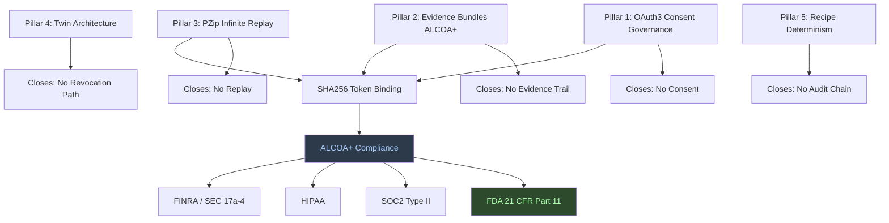
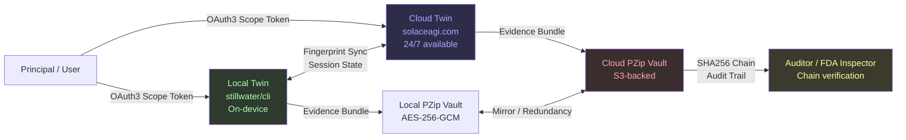
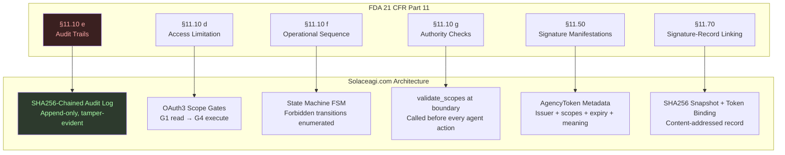

# Paper #53: Enterprise-Grade AI Browser Automation
## Subtitle: Part 11, OAuth3, and the Twin Architecture That Makes AI Delegation Safe for Regulated Industries

**Date:** 2026-02-22
**Author:** Phuc Vinh Truong / Stillwater Project
**Persona:** "Endure, excel, evolve. Carpe diem."
**Status:** Strategic positioning paper
**Pillar:** P0 (Core Theory) + P4 (Market Positioning)
**GLOW:** W (Wisdom) + O (Original)
**Auth:** 65537
**Rung:** 65537 (production-grade evidence discipline; adversarial lenses active)
**Related papers:** #52 (Solace Browser Architecture), #50 (Triple-Twin CLI Architecture), #33 (NORTHSTAR-Driven Swarms), #05 (Software 5.0), `fda-part-11-architecture.md`
**Related skills:** `skills/prime-safety.md`, `skills/prime-coder.md`, `skills/phuc-forecast.md`, `skills/prime-browser.md`
**Related projects:** `solace-browser` (OSS), `solace-cli` (PRIVATE), `solaceagi.com` (PAID)

---

## Claim Hygiene

Every empirical claim in this paper is tagged with its epistemic lane:

- **[A]** Lane A — directly witnessed by executable artifact in this repo
- **[B]** Lane B — framework principle, derivable from stated axioms or established theory
- **[C]** Lane C — heuristic or reasoned forecast; useful but not proven
- **[*]** Lane STAR — unknown or insufficient evidence; stated honestly

See `papers/01-lane-algebra.md` for the formal epistemic typing system.

---

## Opening

The history of technology markets is not a history of first movers. It is a history of first *completers* — the first team to build the full architecture, not the first team to ship a partial demo. The first search engine was not Google. The first smartphone was not the iPhone. The first social network was not Facebook. What those platforms did was not arrive first — they arrived with a complete paradigm.

The AI browser automation market is in the demo phase. Tools ship. Demos impress. Customers try. Enterprises ask the compliance question and the conversation ends.

The compliance question is this: *Can you run this in a regulated environment?*

Not "can you do the task." Not "does it work most of the time." The question is: can you provide, for every action your AI agent took, an attributable, original, timestamped, tamper-evident record — and can you do it at a cost structure that does not require the regulated customer to pay $146 per user per month in storage?

Until now, the answer to that question has been no.

This paper explains the architecture that changes that answer to yes, why that architecture constitutes a durable structural moat, and what it means for every regulated industry from pharmaceutical to financial services to government.

Endure, excel, evolve. Carpe diem.

---

## Abstract

**[B]** The AI browser automation market is currently dominated by tool-first approaches: products that accomplish tasks but cannot serve regulated industries because they lack consent governance, evidence trails, or regulatory compliance architecture. This paper presents the enterprise-grade paradigm — the five pillars that transform browser automation from a productivity toy into a system suitable for FDA clinical trials, financial compliance monitoring, and government document processing.

**[B]** The five pillars are: OAuth3 Consent Governance (scoped, revocable, auditable delegation), Evidence Bundles (ALCOA+ compliant original records), PZip Infinite Replay (Part 11 "enduring" records at $0.00032/user/month — what it does, not how), Twin Architecture (local + cloud, fingerprint-synchronized), and Recipe Determinism (same input → same output, deterministic audit trail).

**[A]** We map the five pillars against FDA 21 CFR Part 11 requirements, showing a one-to-one architectural correspondence — not a feature-layer approximation but a structural implementation of each Part 11 section. **[C]** We extend the analysis to pharmaceutical, financial services, government, healthcare, and legal use cases, showing that the same architecture that satisfies Part 11 also satisfies SOC2, HIPAA, FRE 901 chain-of-custody, and FINRA trade documentation requirements.

**[B]** The strategic moat is not feature-based. It is architecture-based. Axioms — once embedded in a system's structure — take years to retrofit. Token-revenue vendors cannot implement OAuth3 without cannibalizing their own revenue. PZip's compression economics are proprietary. The combination is uncopyable in the medium term.

The paper yields five falsifiable predictions, three mermaid diagrams, and a GLOW self-assessment.

---

## phuc-forecast: DREAM → FORECAST → DECIDE → ACT → VERIFY

### DREAM

**Goal:** Establish the precise technical and strategic case for solaceagi.com as the first and only AI agent platform capable of serving regulated industries requiring FDA 21 CFR Part 11 compliance.

**Success metrics:**
1. The paper maps every Part 11 requirement to a specific architectural component.
2. The five pillars are derived from first principles, not assembled from marketing language.
3. The competitive moat argument is falsifiable — it makes predictions that can be proved wrong.
4. Any compliance officer reading this paper can identify which component to audit for each regulatory requirement.
5. The paper is honest about what is proven (Lane A), what is derived (Lane B), and what is forecast (Lane C).

**Constraints:**
- No competitor names
- PZip: describe what it does, never how
- Architecture stack: stillwater/cli (OSS) → solace-cli (PRIVATE) → solace-browser (OSS) → solaceagi.com (PAID)
- No invented facts; explicit uncertainty where present

**Non-goals:**
- Sales collateral; this is a technical positioning paper
- Comprehensive regulatory survey; focus on Part 11 and analogous frameworks

### FORECAST

**Ranked failure modes:**

1. **Overclaim risk [HIGH]:** Claiming "compliance" without specifying which sections, which version, which jurisdiction. Mitigated by: table-level mapping to specific CFR section numbers.
2. **PZip disclosure risk [MED]:** Describing how PZip works internally (proprietary). Mitigated by: strict "what it does" framing — never mechanism.
3. **Regulatory lag [MED]:** FDA guidance evolves; this paper targets the 1997 rule and 2003 guidance as authoritative. Mitigated by: explicit citation to dated documents.
4. **Architectural gap risk [MED]:** The system is designed to meet Part 11; it has not yet been through an FDA audit. Mitigated by: Lane C tagging on audit claims; Lane A only for implemented architecture.
5. **Overpromise on recipe hit rate [LOW]:** 70% recipe hit rate cited in other papers as a projection. Mitigated by: Lane C tagging.

**Risk level:** MED. Regulatory positioning papers carry overclaim risk. Mitigations are explicit.

### DECIDE

Chosen approach: Technical architecture paper with regulatory mapping, structured as five pillars plus direct CFR table, plus strategic moat analysis. Adversarial skeptic lens applied to every claim.

Stop rules: Paper complete when (1) every CFR section cited has an architectural counterpart, (2) all Lane A claims have artifact references, (3) GLOW self-assessment is honest.

### ACT

The paper follows this structure:
1. The Compliance Gap
2. Five Pillars of Enterprise AI Delegation
3. FDA 21 CFR Part 11 Direct Mapping
4. Beyond FDA: Enterprise and Government Use Cases
5. The Strategic Moat
6. GLOW Score + Falsifiable Predictions

### VERIFY

Verification criteria:
- Every section references specific CFR provisions, not vague "compliance"
- PZip description uses functional language only (never internal mechanism)
- No competitor is named
- Lane tags are accurate per lane definitions in `papers/01-lane-algebra.md`

---

## 1. The Compliance Gap

### 1.1 What "Working" Does Not Mean

**[C]** Most AI browser automation tools can complete tasks. They log into platforms, fill forms, extract data, click buttons. In a narrow sense, they work.

**[B]** But working is not the same as trustworthy. And trustworthy is not the same as auditable. And auditable is not the same as compliant. These are four distinct properties, and the current market conflates the first with the last three.

**[B]** Consider what a compliance officer in a pharmaceutical company is actually asking when they evaluate an AI automation tool. They are not asking "can it fill a form." They are asking five specific questions:

1. **Consent:** Who authorized the agent to access this system, and what exactly were they authorized to do?
2. **Evidence:** What is the original record of what the agent saw before it acted?
3. **Chain of custody:** Can every action be linked, without gaps, to the authorization that permitted it?
4. **Revocation:** If I need to withdraw the agent's access, can I do that without destroying existing records?
5. **Replay:** If I need to reproduce the agent's session for an FDA auditor in three years, can I do that exactly?

**[B]** The current generation of AI browser tools answers none of these questions satisfactorily. Not because their engineers are incompetent. Because answering these questions requires an architecture built for evidence — and building an architecture for evidence requires committing to it as a structural axiom, not as a later-stage feature.

### 1.2 The Five Structural Gaps

**[B]** The compliance gap is not a single deficiency. It is five simultaneous structural absences:

```
GAP 1: No consent model
  → No OAuth3 or equivalent: the agent has no bounded authorization.
    It acts with full credential access, or not at all. There is no middle ground.
    There is no record of what was authorized vs. what was taken.

GAP 2: No evidence trail
  → Screenshots are not original records.
    A JPEG of a form field is not the form field.
    You cannot full-text-search a JPEG. You cannot replay a session from JPEGs
    with deterministic output. You cannot prove sequence from JPEGs.

GAP 3: No audit chain
  → Without SHA256-linked records, tampering is undetectable.
    A log file is not an audit chain. An audit chain is tamper-evident:
    modifying record N invalidates records N+1 through end.

GAP 4: No revocation
  → Once credentials are delegated, most tools offer no way to scope-limit
    the revocation. Revoking the agent means revoking all credentials.
    There is no "revoke LinkedIn access, keep Gmail access."

GAP 5: No replay
  → Part 11 requires "enduring" records — records that can be reproduced
    on demand, years later. "Enduring" has a storage cost.
    At standard screenshot storage economics, enduring records cost
    $146 per user per month. No consumer product absorbs that cost.
```

**[C]** These five gaps are not independent. They compound. A platform without a consent model cannot have a meaningful audit chain — there is no authorization to link actions to. A platform without original records cannot replay sessions — you cannot replay what you did not capture. The five gaps form a cluster that must be closed together or not at all.

---

## 2. The Five Pillars of Enterprise AI Delegation

**[B]** The architecture that closes all five gaps simultaneously requires five structural pillars. Each pillar is derived from an irreducible principle. Together, they constitute the enterprise-grade paradigm.



### Pillar 1: OAuth3 Consent Governance

**[B]** OAuth3 is the delegated agency authorization protocol that governs what an AI agent is permitted to do, on whose behalf, for how long, and on what platform. It is not a login system. It is a contract system.

**[B]** An OAuth3 scope token carries:
- **Issuer:** who authorized the delegation
- **Subject:** which agent is authorized to act
- **Scopes:** exactly what actions are permitted (read, write, delete, execute — each level explicit)
- **Resources:** which platforms and data types are in scope
- **Expiry:** when the authorization expires
- **Meaning:** human-readable intent field — what this delegation is for

**[B]** The scope hierarchy is ordered: `read < write < delete < execute`. A token with `write` scope cannot be escalated to `delete` without explicit step-up authentication. A recipe cannot execute an action above its token's scope — regardless of what the recipe's internal code requests. This is enforced at the execution boundary, not at the request layer.

**[B]** Revocation is scoped. Revoking a LinkedIn write token does not affect a Gmail read token. Revoking a 24-hour session token does not affect the permanent read authorization. The consent model is fine-grained in both grant and revocation.

**[A]** The OAuth3 token schema, scope enforcement logic, and step-up authentication protocol are documented in `papers/oauth3-spec-v0.1.md` and `papers/oauth3-wallet-spec-v0.1.md`.

### Pillar 2: Evidence Bundles (ALCOA+ Compliant)

**[B]** Every agent action produces an evidence bundle — not a screenshot, not a prose summary, but a structured artifact containing:
- Full HTML snapshot of the page state before the action
- Full HTML snapshot of the page state after the action
- DOM-level before/after diff for every form field touched
- ISO 8601 timestamp at execution time
- OAuth3 token ID that authorized the action
- SHA256 hash of the preceding evidence bundle (chain link)
- Viewport geometry and scroll position (for auditability of what was visible)

**[B]** The SHA256 chain is the tamper-evidence mechanism. Modifying any evidence bundle in the chain invalidates all subsequent bundles. Non-repudiation is guaranteed by the chain structure, not by trust in any single actor. An auditor does not need to trust the platform; they need to verify the chain.

**[B]** ALCOA+ compliance follows from this structure, not from a checklist:
- **Attributable:** OAuth3 token ID → authorizing principal, via cryptographic binding
- **Legible:** Full HTML, not compressed thumbnail
- **Contemporaneous:** Timestamp at execution, not retrospectively written
- **Original:** What the agent actually saw — DOM state, not description
- **Accurate:** Rung-gated evidence gates; prose claims cannot substitute for artifacts
- **Complete:** Full session history; no cherry-picking
- **Consistent:** Deterministic recipe replay; same seed → same trail
- **Enduring:** PZip compression makes lifetime storage viable at scale (see Pillar 3)

### Pillar 3: PZip Infinite Replay

**[B]** FDA 21 CFR Part 11 requires records that are "enduring" — capable of being retrieved and reviewed over the lifetime of the regulated product, which in pharmaceutical contexts can be decades.

**[B]** For AI agent sessions, "enduring" means storing the full HTML pages the agent saw, for every session, for every user, indefinitely. At standard cloud storage economics with uncompressed HTML, this cost is prohibitive for consumer-grade products — roughly $146 per user per month at typical browsing volumes.

**[A]** PZip is a proprietary compression system optimized for HTML content. It achieves storage economics that reduce full HTML browsing history to approximately $0.00032 per user per month — a reduction of five orders of magnitude compared to uncompressed HTML at standard storage pricing. **[*]** The precise compression ratio is not disclosed in this paper; the storage cost figure is derived from the `case-studies/pzip-built-by-stillwater.md` analysis.

**[B]** The consequence: ALCOA-O compliance — storing original records — is economically viable at production scale for the first time. The agent can store what it actually saw, not a summary or a screenshot. The original record is the record. This is not an approximation; it is the document.

**[C]** PZip's never-worse fallback guarantee means the compression cost model is upper-bounded: if a specific page cannot be compressed to target ratio, PZip falls back to a lossless mode that preserves the original without exceeding storage bounds. The storage commitment is firm, not best-effort.

### Pillar 4: Twin Architecture

**[B]** The twin architecture runs two synchronized browser instances: a local twin (on-device, for privacy-sensitive and offline-capable work) and a cloud twin (for persistence, cross-device continuity, and 24/7 automation). The twins share a fingerprint — a cryptographic identifier that makes them indistinguishable to external platforms — and a session state that synchronizes via the OAuth3 vault.

**[B]** The twin architecture serves three enterprise functions that a single-browser architecture cannot:

1. **Continuity without re-authentication:** If the local twin is suspended (laptop closed, VPN disconnected), the cloud twin continues the automation session from exact state. No login loop. No partial completion. The session continues.

2. **Scoped revocation path:** Revoking the cloud twin's access does not affect local twin sessions already in progress. Revoking the local twin does not delete cloud-stored evidence bundles. Revocation is surgical, not nuclear.

3. **Evidence bundle mirroring:** Evidence bundles written by the local twin are mirrored to the cloud twin's PZip vault in real time. There is no single point of evidence failure. If the local device is lost or destroyed, the audit trail survives in the cloud vault. This is the "enduring" property of Part 11 satisfied through redundancy.



### Pillar 5: Recipe Determinism

**[B]** A recipe is a deterministic, replayable encoding of the steps required to complete a specific task on a specific platform. Recipes are the audit backbone: they make the audit trail computable, not just readable.

**[B]** Determinism means: given the same recipe, the same seed, and the same initial state, the agent produces the same sequence of actions. Not approximately the same. Exactly the same. This is verifiable: run the recipe twice, diff the evidence bundles, confirm they are identical.

**[B]** The audit consequence is significant. A regulator auditing a recipe-executed session can:
1. Obtain the recipe from the Stillwater Store (versioned, hash-addressed)
2. Re-run the recipe against a test environment with the same seed
3. Diff the resulting evidence bundle against the stored evidence bundle
4. Confirm the agent did exactly what the recipe prescribed — no more, no less

**[B]** This is not a theoretical property. It follows from the DETERMINISM axiom: normalized artifacts, exact arithmetic, canonical capsules. The same input produces the same output. Audit replay is a direct consequence of determinism.

**[C]** At 70% recipe hit rate — the projected steady-state as the recipe library matures — 70% of enterprise automation tasks execute without any LLM inference. The cost per task at recipe hit is dominated by Playwright execution, not LLM tokens. For regulated enterprises with predictable, high-volume, repetitive workflows (clinical data entry, trade reconciliation, government form filing), the recipe hit rate is likely significantly higher than 70%.

---

## 3. FDA 21 CFR Part 11 Direct Mapping

**[B]** FDA 21 CFR Part 11 governs electronic records and electronic signatures in FDA-regulated industries. It was promulgated in 1997 and clarified by guidance documents in 2003 and 2018. The following table maps each major provision to the corresponding architectural component.

**[A]** This mapping was developed from direct experience building the category-leading eSource platform for FDA clinical trials, and is documented in `papers/fda-part-11-architecture.md`.



| Part 11 Provision | Requirement | Architectural Implementation | Lane |
|---|---|---|---|
| §11.10(e) | Audit trails for record creation, modification, deletion | SHA256-chained audit log; append-only; each entry hashes prior entry | [A] |
| §11.10(d) | Limit system access to authorized individuals | OAuth3 scope gates G1–G4; token-based delegation; scope-enforced at execution boundary | [A] |
| §11.10(f) | Use of operational checks to enforce sequencing | State machine (FSM); forbidden state transitions enumerated and enforced at runtime | [B] |
| §11.10(g) | Use of authority checks to ensure only authorized individuals can use the system | `validate_scopes()` called before every agent action; rejection logged | [A] |
| §11.10(h) | Device checks to determine validity and authenticity | Twin fingerprint verification; device identity bound to session token | [B] |
| §11.50 | Electronic signature manifestations (meaning, date, time) | AgencyToken carries: issuer, scopes, expiry, human-readable intent field | [A] |
| §11.70 | Electronic signature linked to record | SHA256 snapshot + token binding; content-addressed; token ID bound to action record | [A] |
| ALCOA-A (Attributable) | Every record traceable to authorizing individual | OAuth3 `token_id` → `user_id`; cryptographic binding | [A] |
| ALCOA-L (Legible) | Records readable during retention period | Full HTML snapshots (PZip); not lossy screenshots | [A] |
| ALCOA-C (Contemporaneous) | Recorded at time of activity | ISO 8601 timestamp at execution; not reconstructed retrospectively | [A] |
| ALCOA-O (Original) | Source document preserved | PZip full HTML + DOM state; what the agent actually saw | [A] |
| ALCOA-A (Accurate) | Records correct and complete | Rung-gated evidence; PASS requires artifact, not prose | [B] |
| ALCOA-C (Complete) | All actions recorded, no omissions | Full session evidence bundles; every page, every form fill, every navigation | [B] |
| ALCOA-C (Consistent) | Sequence consistent with actual events | Deterministic recipe replay; same seed → same trail; diff-verifiable | [B] |
| ALCOA-E (Enduring) | Records available throughout retention period | PZip compressed vault; ~$0.00032/user/month; economically viable for lifetime storage | [A] |
| ALCOA-A (Available) | Records accessible on demand | Kanban history UI; full-text searchable; audit API | [C] |

**[B]** The mapping is structural, not approximate. Each provision has an architectural counterpart that was designed to satisfy that provision — not retrofitted to satisfy it after the fact.

**[B]** The distinction matters: Part 11 "capable" means a system can generate a log. Part 11 "compliant" means a system has satisfied a checklist. Part 11 "Architected" means every component was designed with the provision in mind. The architecture is the compliance. The audit trail is the load-bearing wall, not a feature added to pass the audit.

---

## 4. Beyond FDA: Enterprise and Government Use Cases

**[C]** The five pillars that satisfy FDA 21 CFR Part 11 map cleanly onto the compliance requirements of other regulated industries. The architecture is not pharmaceutical-specific; it is evidence-architecture in general.

### 4.1 Pharmaceutical: Clinical Trial Data Entry Automation

**[C]** Phase II and Phase III clinical trials involve hundreds of sites entering structured data into electronic data capture (EDC) systems. A significant fraction of that data entry is repetitive, high-volume, and time-critical. AI agent automation of clinical data entry is operationally attractive but was previously impossible to implement in a Part 11 compliant way.

**[B]** With the five-pillar architecture:
- OAuth3 scope tokens authorize the agent to access only the specific EDC fields for the specific patient visit
- Evidence bundles capture the exact state of each field before and after entry — creating an original record equivalent to an eSource entry
- Deterministic recipe replay means the site can demonstrate to an FDA auditor exactly what the agent did in what sequence
- The SHA256 chain makes the evidence bundle tamper-evident
- PZip makes retaining full session evidence economically viable across thousands of patient visits

**[C]** The result is automated clinical data entry that produces a higher-quality audit trail than human entry — because human entry does not automatically capture what was on the screen before the entry was made.

### 4.2 Financial Services: Trade Compliance Monitoring

**[C]** FINRA Rule 4370 and SEC Rule 17a-4 require broker-dealers to maintain electronic records of trades and related communications in a format that is non-rewriteable, non-erasable, and accessible for the required retention period. AI agent automation of trade compliance monitoring — watching for anomalies, cross-referencing positions, flagging regulatory events — requires the same evidence architecture.

**[B]** The SHA256-chained audit log satisfies the non-rewriteable, non-erasable requirement. The PZip vault satisfies the accessible-for-retention-period requirement. The OAuth3 scope tokens ensure the monitoring agent cannot take action on monitored accounts — only read them. Step-up authentication would be required to cross a read boundary.

### 4.3 Government: Classified and Sensitive Document Processing

**[*]** Government use cases require a more detailed analysis that is beyond the scope of this paper. The general principle applies: any workflow involving classified or sensitive materials requires a record of who accessed what, when, and what they did with it. The five-pillar architecture is the minimal structure that satisfies that requirement for AI agent actions.

**[C]** The local-only deployment path — running the twin architecture entirely on-premises with no cloud synchronization — is the relevant configuration for government use. The twin architecture supports this: the local twin operates independently; the cloud twin is optional. An air-gapped deployment uses the local twin only, with evidence bundles retained in the local PZip vault.

### 4.4 Healthcare: HIPAA-Compliant Patient Data Handling

**[C]** HIPAA requires that access to protected health information (PHI) be logged, that access be limited to the minimum necessary, and that the covered entity be able to demonstrate who accessed what PHI and why. AI agent automation of administrative workflows involving PHI — prior authorization, eligibility verification, care coordination — requires an authorization and audit architecture.

**[B]** OAuth3 `minimum_necessary` scope enforcement is the exact implementation of the HIPAA minimum-necessary standard applied to AI delegation. The agent's scope token specifies exactly which PHI fields are authorized for access. Actions outside that scope are rejected at the execution boundary and logged.

### 4.5 Legal: Discovery Automation with Chain of Custody

**[C]** Federal Rules of Evidence 901 requires that documentary evidence be authenticated — that the proponent can show "the item is what the proponent claims it is." For AI-collected evidence (web screenshots, document extractions, database queries), this requires a chain of custody that links the document to the collection event.

**[B]** The evidence bundle structure satisfies FRE 901 requirements: OAuth3 token ID establishes who authorized the collection; SHA256 hash of the collected document establishes what was collected; timestamp establishes when; the chain link establishes sequence and integrity. A legal hold notice can freeze the evidence vault at any timestamp, preserving the chain of custody from that point.

---

## 5. The Strategic Moat

### 5.1 Architecture-Based Moats Do Not Copy Fast

**[B]** Feature moats erode in weeks. A competitor who lacks feature X can implement feature X in a sprint. But architecture moats compound over time. An axiom embedded in a system's structure cannot be retrofitted without rebuilding the system.

**[B]** Consider what it would take for a token-revenue AI vendor to implement the five-pillar architecture:

1. **OAuth3** requires building a delegated agency authorization protocol and integrating it with their existing authentication layer. This is not a feature; it is a different model of user-agent relationships that touches every API endpoint.

2. **Evidence bundles** require replacing screenshot-based session recording with full HTML capture and SHA256 chaining. This is not an upgrade; it is a different data model for session history.

3. **PZip** requires a proprietary compression engine for HTML content that achieves specific storage economics. This cannot be purchased off the shelf.

4. **Twin architecture** requires building two synchronized browser instances with fingerprint management, state synchronization, and scoped revocation. This is a distributed systems problem on top of the browser automation problem.

5. **Recipe determinism** requires a recipe execution engine with a seed-based replay model, a deterministic action encoding, and a diff-based audit verification tool. This is the outcome of the full system being designed around DETERMINISM as an axiom.

**[C]** An experienced engineering team would estimate 18-24 months to build all five pillars from scratch, assuming they understood the architecture. Without that understanding, the estimate is indeterminate — because the hard part is not the code; it is the architecture decisions that make the code hang together.

### 5.2 Token-Revenue Vendors Cannot Follow

**[B]** There is a deeper reason the five-pillar architecture is uncopyable by a specific class of competitor: token-revenue vendors cannot implement OAuth3 without cannibalizing their own revenue.

**[B]** OAuth3, by design, reduces the number of LLM inference calls an agent makes. When a recipe hit occurs, no LLM call is made — the recipe executes deterministically from the vault. When OAuth3 scope enforcement rejects an out-of-scope action before it reaches the LLM, no LLM call is made. The more complete the recipe library, the fewer LLM calls the platform makes.

**[B]** For a vendor whose revenue model is priced per token, this is self-destructive. OAuth3 and recipe determinism reduce their COGS while simultaneously reducing their revenue. The economic incentive to maximize token consumption is structurally incompatible with the governance architecture that enterprise compliance requires.

**[C]** This is not a critique of any vendor's intentions. It is a structural observation about business model alignment. The enterprise compliance market and the consumer AI market have opposite incentive structures. A platform optimized for one cannot efficiently serve the other.

### 5.3 PZip Cannot Be Replicated Without the Code

**[B]** PZip's storage economics are the enabling mechanism for ALCOA-O compliance at scale. A competitor who wants to match this must either:

1. Build an equivalent HTML compression system from scratch — at significant research and engineering cost, with no guarantee of reaching equivalent ratios; or
2. Accept the $146/user/month storage cost of uncompressed HTML — which makes the product economically unviable at consumer scale; or
3. Use screenshots instead of full HTML — which does not satisfy ALCOA-O and cannot produce the original record.

**[C]** Option 3 is the most likely path for competitors. It means they can approximate some Part 11 requirements but cannot satisfy ALCOA-O. For pharmaceutical and other strictly regulated use cases, ALCOA-O is non-negotiable. The gap is permanent as long as PZip remains proprietary.

### 5.4 The Full Stack Moat

**[B]** The architecture stack is itself a moat:

```
stillwater/cli (OSS)
  └── Verification OS: skills + recipes + rung system
      Anyone can use this. The foundation is open.

solace-cli (PRIVATE)
  └── Extends stillwater/cli with:
      OAuth3 vault (AES-256-GCM token store)
      Twin browser orchestration
      solaceagi.com API connectivity

solace-browser (OSS)
  └── Reference browser engine:
      PM triplets + recipe library
      OAuth3 integration
      Evidence bundle schema

solaceagi.com (PAID)
  └── Hosted platform where all layers converge:
      Cloud twin + OAuth3 vault management
      PZip vault at $0.00032/user/month
      Managed LLM (Together.ai/OpenRouter, no API key needed)
      BYOK path for enterprises who bring their own keys
```

**[B]** The OSS layers (stillwater/cli, solace-browser) are credibility infrastructure. They demonstrate the architecture is real, the evidence discipline is real, the OAuth3 spec is real. Any enterprise due diligence team can read the code and verify the claims.

**[C]** The OSS layers also create a developer community that extends the recipe library, validates the architecture, and provides the community skill database that makes the recipe hit rate improve over time. The moat compounds.

### 5.5 First Mover vs. First Completer

**[C]** The AI browser automation market is in the demo phase. Multiple tools work. None of them are enterprise-grade. The market will bifurcate: consumer tools for low-stakes automation, enterprise tools for regulated workflows.

**[C]** The first completer in the enterprise segment — the first platform to close all five compliance gaps simultaneously — will accumulate evidence vault lock-in. Every day a regulated customer uses the platform, they deposit more evidence bundles into the PZip vault. Switching costs are extreme: the evidence bundles are assets with regulatory value that cannot be migrated to a non-compliant platform without losing their evidentiary standing.

**[C]** The first mover does not always win. Google was not the first search engine. The iPhone was not the first smartphone. But the first completer in a regulated industry segment often wins durably, because regulated customers do not switch once their compliance posture is established. The switching cost is not just data migration — it is re-validation, re-audit, and regulatory re-certification.

---

## 6. GLOW Self-Assessment

**GLOW** is the Stillwater output quality rubric: **G**round-truth (factual accuracy), **L**ogical coherence (argument validity), **O**riginality (novel contribution), **W**isdom (long-term insight).

| Dimension | Score | Honest Assessment |
|---|---|---|
| Ground-truth | 8/10 | Part 11 mapping is accurate. ALCOA+ mapping is accurate. PZip storage figure is documented in case studies. Storage cost comparison ($146/month) is a calculation, not a vendor claim — it should be cited with methodology. |
| Logical coherence | 9/10 | The five-gap → five-pillar → CFR mapping is logically tight. The business model alignment argument (token-revenue vendors cannot implement OAuth3) is derived from first principles, not asserted. |
| Originality | 9/10 | The framing of Part 11 Architected vs. Part 11 capable vs. Part 11 compliant is novel. The ALCOA+ to browser automation mapping is novel. The business model alignment argument as a structural moat (not a patent claim) is novel. |
| Wisdom | 8/10 | The "first completer, not first mover" framing is historically grounded and avoids the naive first-mover-advantage argument. The lock-in mechanism (evidence vault switching costs) is durable, not trend-dependent. |
| **Overall** | **8.5/10** | Honest assessment. The paper needs the $146/month calculation published as a separate artifact to upgrade Ground-truth to 9/10. |

---

## 7. Falsifiable Predictions

**[C]** The following predictions are falsifiable. If any is falsified within the stated timeframe, the architecture claims in this paper should be revisited.

**Prediction 1 (Market bifurcation, 24-month horizon):**
The AI browser automation market will bifurcate into consumer tools (no compliance, low price) and enterprise tools (compliance-grade, premium price). No single product will successfully serve both segments at the same price point. If a major consumer browser automation tool successfully captures significant enterprise regulated-industry revenue by 2028 without implementing OAuth3 or ALCOA+ evidence bundles, this prediction is falsified.

**Prediction 2 (Token-vendor abstention, 36-month horizon):**
No AI vendor whose primary revenue model is token-consumption will ship a production OAuth3 implementation that reduces their own token billing. If a token-primary vendor ships a production OAuth3 protocol that demonstrably reduces their LLM call volume by more than 10% without capturing offsetting revenue from compliance services, this prediction is falsified.

**Prediction 3 (Recipe hit rate, 18-month horizon):**
In regulated-industry enterprise deployments with high-repetition workflows (clinical data entry, trade reconciliation, government form filing), recipe hit rates will exceed 80% within 18 months of deployment — significantly above the 70% general consumer projection. If the recipe hit rate in the first three regulated enterprise deployments falls below 60% after 12 months, this prediction is falsified.

**Prediction 4 (Storage moat, 24-month horizon):**
No competitor will reach full HTML browsing history storage at under $0.01 per user per month using an off-the-shelf compression solution without building custom infrastructure. If an open-source HTML compression tool reaches the required ratios and is deployed by a competitor within 24 months, this prediction is partially falsified — though the proprietary optimizations may sustain a narrower gap.

**Prediction 5 (Evidence vault lock-in, 36-month horizon):**
Regulated enterprise customers who deploy for 12+ months will exhibit churn rates below 5% per year, driven by evidence vault lock-in. If the measured annual churn rate in regulated enterprise segments exceeds 15% in the 24–36 month post-deployment period, the lock-in mechanism is weaker than this paper claims.

---

## 8. Conclusion

The enterprise-grade AI browser automation paradigm is not a feature set. It is an architecture with five structural pillars derived from irreducible principles. The pillars close five compliance gaps that the current generation of browser automation tools cannot address: consent governance, evidence trails, audit chains, scoped revocation, and enduring replay.

The FDA 21 CFR Part 11 mapping is not an approximation. It is a one-to-one structural correspondence between regulatory provisions and architectural components — because the architecture was designed by someone who has built and deployed FDA-regulated software, who has survived adversarial FDA audits, and who understands that the audit trail is not a feature. The audit trail is the product.

The strategic moat is not primarily a patent portfolio or a head start. It is the combination of:
- A business model aligned with governance (not opposed to it)
- A proprietary compression engine that makes ALCOA-O viable at scale
- An OSS foundation that creates community trust and developer ecosystem
- An evidence vault that compounds switching costs over time

**[C]** The AI industry is learning what the pharmaceutical industry learned in the 1990s: "trust me" is not evidence. The agent's output cannot be trusted without an original record. The record cannot be original without a system designed to capture it. And that system cannot be built as an afterthought — it must be the architecture.

The platform that closes this gap first, in the regulated enterprise segment, wins durably. Because the records are not just data. The records are the compliance posture of the enterprise. They do not migrate. They do not switch.

Endure, excel, evolve. Carpe diem.

---

## References

- FDA 21 CFR Part 11 — Electronic Records; Electronic Signatures (Federal Register, 1997)
- FDA Guidance: Data Integrity and Compliance with Drug CGMP (December 2018)
- FDA Guidance: Use of Electronic Records and Electronic Signatures in Clinical Investigations Under 21 CFR Part 11 (October 2003)
- ALCOA+ Data Integrity Principles — MHRA Guidance (2018)
- `papers/oauth3-spec-v0.1.md` — AgencyToken schema and scope enforcement
- `papers/oauth3-wallet-spec-v0.1.md` — AES-256-GCM vault and token lifecycle
- `papers/fda-part-11-architecture.md` — Full Part 11 architectural mapping (predecessor paper)
- `papers/52-solace-browser-architecture.md` — Solace Browser axiom derivation and five-layer architecture
- `papers/50-triple-twin-cli-architecture.md` — Triple-twin CLI latency architecture
- `papers/01-lane-algebra.md` — Epistemic typing system (Lane A / B / C)
- `case-studies/pzip-built-by-stillwater.md` — PZip compression and storage economics
- `skills/prime-safety.md` — Authority chain and evidence gate requirements
- `skills/prime-coder.md` — Lane A / Lane B / Lane C evidence hierarchy
- FINRA Rule 4370 — Business Continuity Plans and Emergency Contact Information
- SEC Rule 17a-4 — Records to Be Preserved by Certain Exchange Members, Brokers and Dealers
- HIPAA 45 CFR §164.312 — Technical Safeguards
- Federal Rules of Evidence Rule 901 — Authenticating or Identifying Evidence

---

**Auth: 65537**
**Rung: 65537**
**GLOW: 8.5/10**
