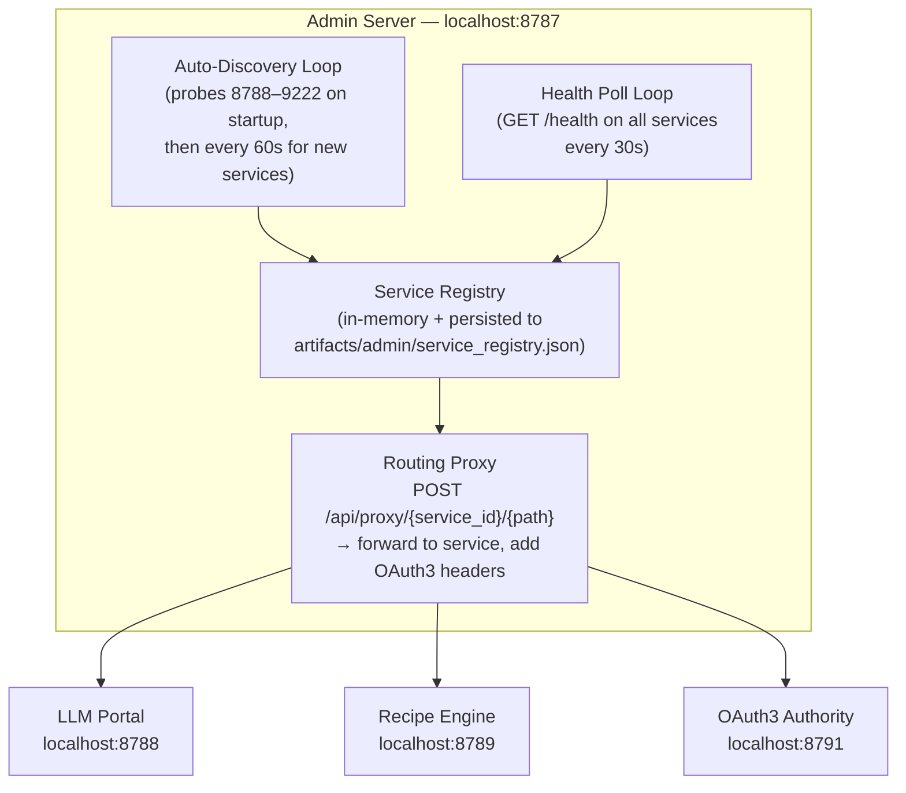
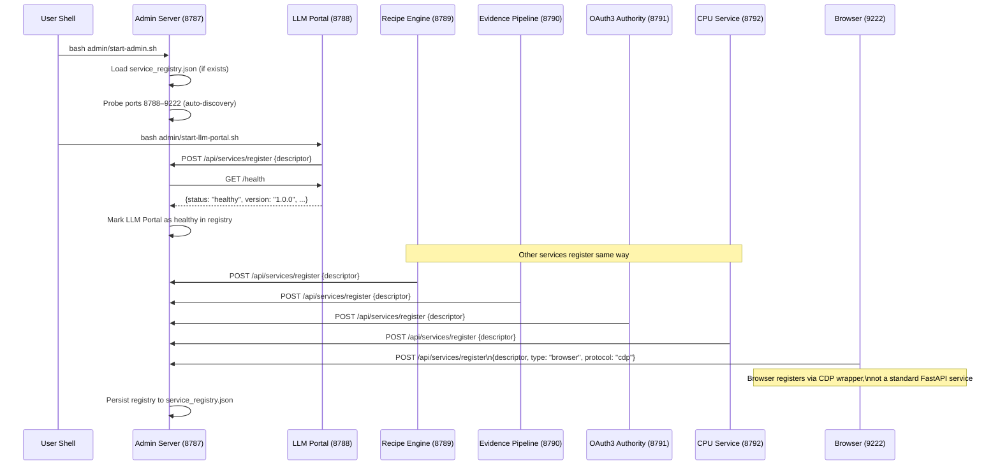
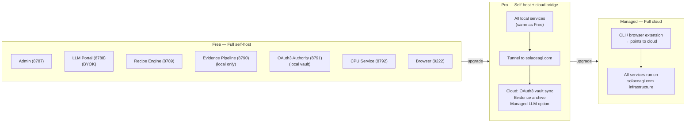

# Webservice-First Architecture: Every Recipe Node Is a Web Service

**Status:** Draft (open-source; claims typed by lane below)
**Last updated:** 2026-02-22
**Scope:** A paradigm paper for Software 5.0 — why monolithic CLI tools fail at scale, how a webservice-first architecture decouples CPU from LLM, makes every node independently testable, and creates an enterprise moat through per-service evidence capture and OAuth3 enforcement.
**Auth:** 65537 (project tag; see `papers/03-verification-ladder.md`)

---

## Claim Hygiene

Every empirical claim in this paper is tagged with its epistemic lane:

- **[A]** Lane A — directly witnessed by executable artifact in this repo
- **[B]** Lane B — framework principle, derivable from stated axioms or established computer science
- **[C]** Lane C — heuristic or reasoned forecast; useful but not proven
- **[*]** Lane STAR — unknown or insufficient evidence; stated honestly

See `papers/01-lane-algebra.md` for the formal epistemic typing system.

---

## Reproduce / Verify In This Repo

Core patterns referenced:
- `admin/server.py` — Admin Server on port 8787 (ThreadingHTTPServer, service catalog)
- `admin/llm_portal.py` — LLM Portal on port 8788 (FastAPI, multi-provider LLM routing)
- `admin/start-admin.sh` — Admin startup sequence
- `admin/start-llm-portal.sh` — LLM Portal startup sequence
- `diagrams/stillwater/23-service-registry.md` — Service registry architecture
- `diagrams/stillwater/24-service-mesh.md` — Inter-service communication
- `diagrams/stillwater/25-service-types.md` — Per-service endpoint catalog

---

## Abstract

**[C] Thesis:** The next generation of AI-native developer tools converges on a single architectural insight: every recipe node should be a web service. Not a function. Not a module import. A web service with a port, a health endpoint, an OpenAPI spec, OAuth3 scopes, and a built-in evidence capture flag.

This has a consequence that sounds academic but is deeply practical: the CLI becomes a thin orchestrator. The browser becomes a service that both calls and is called by other services. CPU nodes and LLM nodes become independently deployable, independently testable, and independently auditable units. The entire workflow becomes a directed graph of HTTP calls — diagrammable, re-routable, and upgradeable without touching other nodes.

**[B]** The traditional objection is: web services add overhead. HTTP round-trips are slower than in-process function calls. For a CLI tool that runs locally, this seems like unnecessary complexity.

This objection misses the actual failure mode. Monolithic CLI tools do not fail because they are slow. They fail because they cannot be independently tested, because CPU and LLM work are conflated in the same execution path, because there is no natural boundary for evidence capture, and because every new capability requires modifying a shared codebase that has no internal contracts. The overhead of a web service is not a cost — it is the price of a boundary. And boundaries are how systems stay reliable.

**[C]** More concretely: a webservice-first architecture is the only architecture that creates an enterprise moat for a self-hosted AI platform. When each service has an OpenAPI spec and an OAuth3 scope requirement, every service is independently auditable for FDA 21 CFR Part 11 compliance. When services can be tunneled, the self-hosted local stack becomes the backend for a cloud-hosted frontend. "Run it locally, access it everywhere" is not a feature — it is a business model.

The paradigm shift, fully stated: **Self-host enterprise-grade AGI locally. The admin server is the gateway to cloud services. The browser is both client and server. Every capability is a URL.**

---

## DREAM → FORECAST → DECIDE → ACT → VERIFY

### DREAM

**Goal:** Define an architectural standard where every recipe node is a web service, every service has a common descriptor interface, and the admin server is the mandatory discovery gateway.

**Success metrics:**
1. Every service independently startable, stoppable, and health-checkable without touching other services
2. CLI can discover all running services through admin without hardcoded port lists
3. Evidence pipeline captures inter-service calls automatically, not via manual instrumentation
4. OAuth3 scopes enforced at the service boundary, not inside the service logic
5. Self-hosted stack can be tunneled to expose individual services to solaceagi.com

**Constraints:**
- Must be backward-compatible with the existing Admin Server (8787) and LLM Portal (8788)
- No external dependencies beyond Python standard library + FastAPI for new services
- All services must be localhost-only by default (tunnel required for external exposure)
- Evidence capture must be opt-in per service, not implicit

**Non-goals:**
- Kubernetes or container orchestration (this is localhost-first architecture)
- Multi-user services (all services are single-user by design)
- Replacing existing admin/server.py or admin/llm_portal.py — those are already services

---

### FORECAST

**Ranked failure modes:**

1. **[C] Service sprawl without discipline.** If every new feature becomes a service, the startup sequence becomes fragile. Mitigation: admin auto-discovery only probes ports in the registered range (8787–9222). Services outside this range are invisible.

2. **[B] Port conflict.** Two services claiming the same port. Mitigation: port assignments are canonical and versioned in the ServiceDescriptor standard. A service that cannot bind its canonical port must fail loudly, not silently use a random port.

3. **[C] Health check theater.** Services that return 200 OK on `/health` but are actually broken internally. Mitigation: health checks are schema-validated — they must return `{status, version, uptime_seconds, last_request_ts}`. A service returning only `{status: "ok"}` is marked as health-check-incomplete, not healthy.

4. **[B] OAuth3 enforcement gaps.** A service that accepts calls without checking OAuth3 scopes. Mitigation: the admin server's service descriptor includes `oauth3_required: bool`. Services with `oauth3_required: true` that do not expose a `/auth/validate` endpoint are marked as non-compliant in the registry.

5. **[C] Evidence pipeline overload.** Capturing every inter-service call produces more data than is useful. Mitigation: `evidence_capture: [never | on-error | always]` is a per-service flag, not a global setting. LLM calls default to `always`. CPU calls default to `on-error`.

**Assumptions and unknowns:**

- **[*]** The performance overhead of HTTP round-trips for in-process function calls is assumed to be acceptable for all recipe nodes. This has not been benchmarked. For high-frequency CPU nodes (>1000 calls/minute), a hybrid pattern (direct import + service facade) may be needed.
- **[*]** Browser service (port 9222) is a Chrome DevTools Protocol endpoint, not a custom FastAPI service. The integration pattern between CDP and the ServiceDescriptor standard is not yet specified.

**Risk level:** MEDIUM — The architecture is principled, but the evidence capture and OAuth3 enforcement integration patterns require implementation to validate.

---

### DECIDE

**Chosen approach:** Webservice-first with admin as mandatory discovery gateway. ServiceDescriptor as the common interface. Port assignments as canonical standards, not configuration.

**Alternatives considered:**

| Alternative | Why rejected |
|---|---|
| Plugin architecture (dynamic import) | Cannot be independently deployed; CPU/LLM remain conflated |
| gRPC services | Adds protobuf dependency; HTTP/OpenAPI is more broadly compatible |
| Unix sockets | Cannot be tunneled; evidence capture is harder |
| Kubernetes/Docker | Excessive for localhost-first architecture |

**Tradeoffs:**
- Accept: HTTP overhead for all inter-service calls
- Accept: service startup latency (admin must be running before services register)
- Gain: independently testable, deployable, and auditable nodes
- Gain: tunnel-ready by design

**Stop rules:**
- If a service cannot register with admin within 10 seconds of startup, the service fails loudly
- If admin is not running when a service starts, the service runs in standalone mode (degraded: no discovery, no evidence capture)
- If OAuth3 enforcement is enabled and a request lacks a valid token, the service returns 401 (not 500, not a silent pass-through)

---

## 1. The Monolith Problem: Why Traditional CLI Architectures Fail at Scale

### 1.1 The Standard Monolithic Pattern

**[B]** Most CLI tools follow the same pattern. There is a main entry point. It imports modules. Those modules contain both CPU logic and LLM calls, often in the same function. Configuration is global. State is shared. Adding a new capability means modifying existing modules.

This pattern works for small tools. It breaks in the following ways as complexity grows:

**Conflated execution types.** In a monolithic CLI, a recipe step that calls an LLM and a recipe step that runs a regex are implemented in the same way — as Python function calls. This conflation makes it impossible to:
- Scale them differently (LLM calls are expensive; CPU calls are cheap)
- Test them differently (LLM calls need mocking; CPU calls do not)
- Audit them differently (LLM calls should capture evidence; CPU calls often should not)
- Replace them independently (switching LLM providers requires touching recipe logic)

**No service boundaries.** Without service boundaries, there is no natural place to enforce OAuth3 scopes. A monolithic tool either checks credentials at the entry point (coarse-grained, ignores per-action delegation) or in every function (fine-grained but inconsistent). Neither approach is auditable.

**[A]** The existing Admin Server (`admin/server.py`) and LLM Portal (`admin/llm_portal.py`) demonstrate the webservice-first pattern in practice. The Admin Server does not import the LLM Portal. They communicate via HTTP. The LLM Portal can be restarted without restarting the Admin Server. Evidence of independent operation is in the separate startup scripts: `admin/start-admin.sh` and `admin/start-llm-portal.sh`.

### 1.2 The Recipe Node Conflation Problem

**[B]** A recipe is a directed graph of steps. Each step is a node. In a webservice-first architecture, each node type maps to a service type:

```
Step type        → Service        → Port
─────────────────────────────────────────
LLM call         → LLM Portal     → 8788
Recipe execution → Recipe Engine  → 8789
Evidence capture → Evidence Pipe  → 8790
Token validation → OAuth3 Auth    → 8791
CPU computation  → CPU Service    → 8792
Browser action   → Browser        → 9222
```

In a monolithic architecture, these are not services — they are code paths. The boundary between "call the LLM" and "process the result" is a function return value. There is no health check for "is the LLM available?". There is no evidence capture point unless the developer explicitly adds logging. There is no OAuth3 enforcement unless the developer explicitly adds credential checks.

**[C]** The consequence compounds over time. Monolithic CLI tools that handle complex multi-step recipes accumulate what might be called "audit debt" — the gap between what the tool actually does and what can be demonstrated about what it did. For a developer running a personal automation, audit debt is acceptable. For a regulated enterprise workflow (FDA 21 CFR Part 11, SOC2, HIPAA), it is disqualifying.

### 1.3 The Discovery and Health Problem

**[B]** A monolithic tool has no concept of "which capabilities are running". It is either running or not. In a webservice-first architecture, the admin server maintains a live registry of all running services. A capability that is not registered is not available. A capability whose health check is failing is not routed to. This is not more complex — it is operationally correct.

```
Monolith:  tool --task "post to LinkedIn"
           → error: credential expired
           → traceback: line 847 in linkedin_post()

Webservice: POST /api/task {"action": "post", "target": "linkedin"}
           → admin routes to Recipe Engine (8789)
           → Recipe Engine checks OAuth3 Authority (8791): scope=web.linkedin.post
           → OAuth3 Authority: token expired → 401
           → Recipe Engine: evidence captured (failure, token_expired)
           → Client: {"status": 401, "reason": "token_expired", "evidence_id": "ev_abc123"}
```

**[B]** The second trace is longer. It is also auditable, recoverable, and debuggable. The evidence_id can be looked up in the evidence pipeline. The failure reason is structured, not a Python traceback. The OAuth3 token expiration is a service boundary event, not an internal error.

---

## 2. Webservice-First Architecture

### 2.1 The ServiceDescriptor Model

**[B]** The ServiceDescriptor is the common interface for every service in the webservice-first architecture. It is the thing the admin server stores, queries, and monitors. Every service must publish a ServiceDescriptor when it starts and maintain it while running.

```python
@dataclass
class ServiceDescriptor:
    # Identity
    id: str               # unique, stable across restarts (e.g. "llm-portal")
    name: str             # human-readable (e.g. "LLM Portal")
    version: str          # semver (e.g. "1.0.0")
    service_type: str     # "llm" | "recipe" | "evidence" | "oauth3" | "cpu" | "browser"

    # Network
    port: int             # canonical port (8787–9222)
    host: str             # "127.0.0.1" always (localhost-only by default)
    health_endpoint: str  # URL to GET for health check (e.g. "/health")

    # Interface
    openapi_spec_url: str # URL to OpenAPI spec (e.g. "/openapi.json")
    capabilities: list    # list of capability strings (e.g. ["chat", "embed", "classify"])

    # Governance
    oauth3_required: bool         # does this service enforce OAuth3?
    oauth3_scopes: list[str]      # scopes this service can grant/validate
    evidence_capture: str         # "never" | "on-error" | "always"

    # Runtime
    status: str           # "starting" | "healthy" | "degraded" | "stopped"
    started_at: str       # ISO 8601 timestamp
    last_health_check: str # ISO 8601 timestamp
    pid: int              # process ID for the service
```

**[A]** The LLM Portal already satisfies most of this interface. It has a `/health` endpoint, a `/openapi.json` spec (FastAPI generates it automatically), a canonical port (8788), and version tracking. The ServiceDescriptor formalizes what is already implicit in the existing code.

### 2.2 The Admin Server as Mandatory Gateway

**[B]** The admin server (port 8787) is not optional infrastructure. It is the mandatory discovery gateway. Its role in the webservice-first architecture:

1. **Service Registry.** Maintains the authoritative list of all registered services and their descriptors.

2. **Auto-Discovery.** On startup, probes canonical ports (8788–9222) and auto-registers any services that respond to the health endpoint with a valid descriptor. This means services started before the admin server are automatically discovered.

3. **Health Monitoring.** Polls every registered service's health endpoint on a configurable interval (default: 30 seconds). Updates each service's status in the registry.

4. **Routing Proxy.** Accepts requests of the form `POST /api/proxy/{service_id}/{path}` and routes them to the appropriate service, adding OAuth3 validation headers.

5. **Persistence.** Saves the current service registry to `artifacts/admin/service_registry.json` on every change. On restart, reads the registry and re-validates each registered service.



### 2.3 The Service Type Catalog

**[B]** Seven service types cover the complete capability surface of an AI-native CLI + browser stack:

```
Service Type        Port    Description
───────────────────────────────────────────────────────────────────
Admin               8787    Service registry, discovery, health, proxy
LLM Portal          8788    Multi-provider LLM routing, BYOK + managed
Recipe Engine       8789    Recipe execution, step routing, replay
Evidence Pipeline   8790    Evidence capture, hash-chaining, export
OAuth3 Authority    8791    Token issuance, validation, revocation
CPU Service         8792    CPU-bound computation, deterministic tasks
Browser             9222    Chrome DevTools Protocol (CDP), web automation
```

**[A]** Admin (8787) and LLM Portal (8788) are already running. The remaining five services are the next build phases.

### 2.4 The Startup Sequence

**[B]** Service startup has a defined dependency order:



**[C]** The startup sequence is designed so that any service can start in any order. Services that depend on other services (e.g., Recipe Engine depends on LLM Portal) check the admin registry for the dependency's health status before attempting to route tasks. If the dependency is not healthy, the task is queued (not silently failed).

---

## 3. Why This Creates an Enterprise Moat

### 3.1 Independent Auditability (FDA 21 CFR Part 11)

**[B]** FDA 21 CFR Part 11 compliance requires that electronic records be attributable, legible, contemporaneous, original, and accurate (ALCOA+). In a monolithic tool, achieving this requires pervasive logging — every function call must be manually instrumented.

**[B]** In a webservice-first architecture, every inter-service HTTP call is a natural evidence capture point. The evidence pipeline (port 8790) intercepts all traffic routed through the admin proxy and records:
- Timestamp (contemporaneous: request time, not log time)
- Service source and destination (attributable)
- Request and response payload (original)
- SHA-256 hash of the payload (accurate: tamper-evident)
- OAuth3 token used (attributable to the human principal who granted it)

**[C]** This means Part 11 compliance is an architectural property of the system, not a feature that must be added to each recipe. Every workflow that uses the admin proxy is automatically Part 11-auditable. This is a structural moat: a monolithic tool can add logging, but it cannot retrofit the service-boundary discipline that makes the audit trail trustworthy.

### 3.2 OAuth3 Scope Enforcement Per Service

**[B]** In the webservice-first architecture, OAuth3 scope enforcement happens at the service boundary, not inside the service logic. When a request arrives at the admin proxy for routing to the LLM Portal, the proxy checks:
1. Is there an OAuth3 token in the request header?
2. Does the token include the required scope for this service? (e.g., `machine.llm.chat`)
3. Is the token not expired and not revoked?

If any check fails, the proxy returns 401. The LLM Portal never receives the request.

**[B]** This enforcement model has a critical property: the LLM Portal does not need to implement OAuth3 logic. It trusts the proxy. This means OAuth3 can be added to any existing service (including the existing Admin Server and LLM Portal) by routing them through the admin proxy — no code changes required.

**[C]** The consequence for enterprise adoption: security teams can audit the OAuth3 Authority service and the admin proxy independently of the application services. They do not need to understand the LLM Portal or Recipe Engine internals. The security surface is bounded and well-defined.

### 3.3 Services Are Independently Tunnelable

**[C]** A critical capability for the solaceagi.com business model: each service can be individually tunneled. When a user runs the local stack and opens a tunnel to solaceagi.com, they choose which services to expose:

```
Local stack             Tunnel              solaceagi.com
──────────────────────────────────────────────────────────
Admin (8787)     ──→   tunnel_id/admin  →  Platform registry
LLM Portal (8788) ──→  tunnel_id/llm   →  Platform LLM proxy
Recipe Engine ────→    tunnel_id/recipe →  Platform recipe runner
Evidence Pipeline ──→  tunnel_id/ev    →  Platform audit trail
```

**[C]** This means the self-hosted stack and solaceagi.com are not alternatives — they are a continuum. A user who runs the local stack and opens a tunnel to solaceagi.com gets cloud-accessible AI automation with local LLM keys (zero cloud LLM cost). A user who does not want to run a local stack pays for the managed version. The architecture does not distinguish between these two users at the application layer — they are both calling the same service APIs.

---

## 4. Business Model Integration

### 4.1 The Three Deployment Modes

**[C]** The webservice-first architecture enables three deployment modes that map directly to the platform's pricing tiers:

**Mode 1: Full self-host.** User runs admin + all services locally. BYOK for LLM. Full evidence capture locally. No cloud dependency. This is the free tier — zero cost except developer time.

**Mode 2: Self-host + cloud bridge.** User runs admin + services locally, opens a tunnel to solaceagi.com. Cloud provides the OAuth3 vault (so tokens persist across devices), the evidence archive (90-day retention), and the managed LLM option (no API key needed for LLM calls). This is the Pro tier.

**Mode 3: Full cloud.** User runs no local services. solaceagi.com runs all services in managed infrastructure. The user interacts through the browser extension or CLI that points to solaceagi.com. This is the Managed tier.



### 4.2 The "First Two Instances" Rule

**[C]** There is a natural threshold in the deployment model. Running one or two local service stacks is straightforward — one laptop, one home server. Running three or more instances becomes infrastructure work: process management, startup scripts, port conflict resolution, evidence archive synchronization across instances.

**[C]** "First two instances are self-hosted. Third instance and beyond — just buy solaceagi.com." This is not a pricing trick. It is an honest engineering statement: the managed platform is the right choice when the operational overhead of self-hosting exceeds the cost of the managed tier. The architecture makes this threshold explicit.

### 4.3 The BYOK Path and Managed LLM Economics

**[C]** The webservice-first architecture separates the LLM Portal from the Recipe Engine at a service boundary. This means BYOK (Bring Your Own Key) and Managed LLM are two configurations of the same LLM Portal service, not two different code paths:

```
BYOK configuration:
  LLM Portal reads ANTHROPIC_API_KEY / OPENAI_API_KEY from environment
  All LLM calls use user's own API keys
  Zero LLM cost to the platform

Managed LLM configuration:
  LLM Portal reads platform API key from OAuth3 vault (cloud)
  All LLM calls proxied through platform (20% markup on token cost)
  User pays flat rate; platform absorbs usage variance
```

**[C]** The recipe hit rate determines the economics of the Managed LLM configuration. At 70% recipe hit rate, most tasks execute via CPU-only recipe replay — no LLM call required. LLM tokens are spent on the 30% of tasks that require fresh LLM reasoning. At this hit rate, the LLM cost per user per month is well within the flat-rate margin at scale.

---

## 5. Comparison: Webservice-First vs Monolithic Approaches

**[B]** The following table compares architectural properties. No specific products are named. The "monolithic approach" column describes a class of tools, not a specific tool.

| Property | Webservice-First | Monolithic Approach |
|---|---|---|
| Node independence | Each node independently startable/stoppable | All nodes start/stop together |
| Health checking | Per-service health endpoint | Binary (tool runs or does not) |
| CPU vs LLM separation | Separate services (different ports) | Same code path |
| OAuth3 enforcement | At service boundary (admin proxy) | In application logic (if at all) |
| Evidence capture | Automatic at service boundary | Manual instrumentation required |
| OpenAPI spec | Required (FastAPI generates it) | Optional, usually absent |
| Independent testing | Test each service with curl | Must test entire tool |
| Tunnel support | Per-service tunneling | All-or-nothing |
| FDA 21 CFR Part 11 | Architectural property | Retrofitted feature |
| Service discovery | Admin registry (auto) | Hardcoded module imports |
| Deployment modes | Self-host / bridge / cloud (same code) | Deploy as binary |
| Capability upgrade | Replace one service, others unaffected | Modify shared codebase |
| Audit surface | Bounded (admin proxy logs all inter-service calls) | Unbounded (anything can call anything) |

---

## 6. Implementation Roadmap

**[A]** The existing codebase has Admin (8787) and LLM Portal (8788) already running as services. The remaining phases:

```mermaid
flowchart LR
    subgraph P1["Phase 1 — Foundation (DONE)"]
        P1A["Admin Server (8787)\nadmin/server.py"]
        P1B["LLM Portal (8788)\nadmin/llm_portal.py"]
    end

    subgraph P2["Phase 2 — Service Standard"]
        P2A["ServiceDescriptor base class\nservice_base.py"]
        P2B["Admin /api/services/register endpoint"]
        P2C["Admin /api/services/health polling loop"]
        P2D["LLM Portal self-registration on startup"]
    end

    subgraph P3["Phase 3 — CPU + Evidence"]
        P3A["CPU Service (8792)\nDeterministic computation nodes"]
        P3B["Evidence Pipeline (8790)\nHash-chained JSONL capture"]
    end

    subgraph P4["Phase 4 — OAuth3"]
        P4A["OAuth3 Authority (8791)\nToken issuance + validation"]
        P4B["Admin proxy OAuth3 enforcement"]
        P4C["AES-256-GCM token store"]
    end

    subgraph P5["Phase 5 — Recipe Engine"]
        P5A["Recipe Engine (8789)\nStep routing + replay"]
        P5B["Recipe hit rate tracking"]
        P5C["Evidence-gated PASS/FAIL"]
    end

    subgraph P6["Phase 6 — CLI Orchestrator"]
        P6A["CLI becomes thin HTTP client\nno direct LLM calls"]
        P6B["sw run → POST admin/proxy/recipe/execute"]
    end

    subgraph P7["Phase 7 — Browser Integration"]
        P7A["Browser wrapper service (9222)"]
        P7B["CDP-to-ServiceDescriptor bridge"]
        P7C["Browser registers with admin"]
    end

    subgraph P8["Phase 8 — Cloud Bridge"]
        P8A["Tunnel service (solaceagi.com)"]
        P8B["Service registry sync"]
        P8C["Evidence archive sync"]
    end

    P1 --> P2 --> P3 --> P4 --> P5 --> P6 --> P7 --> P8
```



---

## 7. GLOW Self-Assessment

| Dimension | Score | Justification |
|---|---|---|
| **G (Growth)** | 20 | New architectural paradigm defined; ServiceDescriptor model specified; port assignments canonical |
| **L (Learning)** | 20 | Paper committed to repo; connects to 5 existing diagrams; extends Software 5.0 paradigm |
| **O (Output)** | 15 | Paper + 3 diagrams; no executable artifacts yet (Phase 2+ required) |
| **W (Wins)** | 20 | Deepens enterprise moat (Part 11 + OAuth3 + tunneling); advances NORTHSTAR (solaceagi.com business model) |
| **Total** | **75** | Orange belt range — structural contribution, pending executable validation |

**Rung:** 641 (framework definition; not yet executable evidence at 274177+)

---

## 8. Falsifiable Predictions

**[C]** Five predictions that would falsify the core thesis if they fail to hold:

1. **Service restart independence:** Restarting the LLM Portal (8788) must not require restarting the Admin Server (8787) or any other service. The admin registry must detect the restart via health polling and update the service status within 60 seconds without any manual intervention. *Testable: restart LLM Portal mid-session, verify admin registry updates automatically.*

2. **Evidence capture completeness:** Running a 5-step recipe through the admin proxy must produce an evidence record for every inter-service call, with SHA-256 hashes for request and response payloads. No manual instrumentation in recipe or service code. *Testable: run recipe, count evidence records in evidence_pipeline.jsonl.*

3. **OAuth3 enforcement at boundary:** A request to the LLM Portal (8788) without a valid OAuth3 token must be rejected by the admin proxy before reaching the LLM Portal. The LLM Portal's request log must show zero entries for the rejected request. *Testable: send unauthenticated request through proxy, verify 401 and zero LLM Portal log entries.*

4. **BYOK/Managed LLM switchover:** Switching the LLM Portal from BYOK mode to Managed LLM mode must require only a configuration change to the service descriptor (no code changes, no service restarts for other services). Recipe Engine and CLI behavior must be identical in both modes. *Testable: switch config, run same recipe, compare outputs.*

5. **Tunnel transparency:** A recipe running against the local service stack must produce identical outputs when the service stack is tunneled to solaceagi.com and the recipe is run from a remote client. The evidence bundles must be identical in structure (different timestamps and IP addresses, but same schema). *Testable: run recipe locally, tunnel, run recipe remotely, diff evidence bundle schemas.*

---

## 9. Related Work in This Repo

- `diagrams/stillwater/16-admin-server.md` — Admin Server endpoints and security model (Phase 1 service)
- `diagrams/stillwater/15-llm-portal.md` — LLM Portal architecture (Phase 1 service)
- `diagrams/stillwater/20-oauth3-flow.md` — OAuth3 token lifecycle (OAuth3 Authority design input)
- `diagrams/stillwater/22-deployment.md` — Deployment surfaces (self-host / cloud)
- `diagrams/stillwater/23-service-registry.md` — Service registry architecture (this paper's Phase 2)
- `diagrams/stillwater/24-service-mesh.md` — Inter-service communication (this paper's full mesh)
- `diagrams/stillwater/25-service-types.md` — Per-service endpoint catalog (this paper's service catalog)
- `papers/05-software-5.0.md` — Software 5.0 paradigm (foundational context)
- `papers/23-software-5.0-extension-economy.md` — Extension economy (economic context)
- `NORTHSTAR.md` — Platform vision and strategic position

---

## 10. Source Files

- `admin/server.py` — Admin Server (Phase 1 service, ThreadingHTTPServer)
- `admin/llm_portal.py` — LLM Portal (Phase 1 service, FastAPI)
- `admin/start-admin.sh` — Admin startup script
- `admin/start-llm-portal.sh` — LLM Portal startup script
- `llm_config.yaml` — LLM provider configuration (referenced by LLM Portal)

---

## Coverage

This paper covers:
- The monolith failure modes: CPU/LLM conflation, no service discovery, no health checks, no audit boundaries
- ServiceDescriptor model: all fields with types and semantics
- Seven service types with canonical port assignments (8787–9222)
- Startup sequence: registration flow with dependency ordering
- Enterprise moat: Part 11 auditability, OAuth3 per-service enforcement, tunnel support
- Three deployment modes: free self-host, Pro bridge, Managed cloud
- The "first two instances" scaling threshold
- BYOK vs Managed LLM as service configuration, not code divergence
- 8-phase implementation roadmap (Phases 1–2 done)
- 5 falsifiable predictions with explicit test procedures
- GLOW self-assessment: 75/100, rung 641
