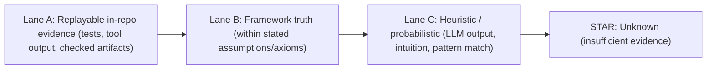
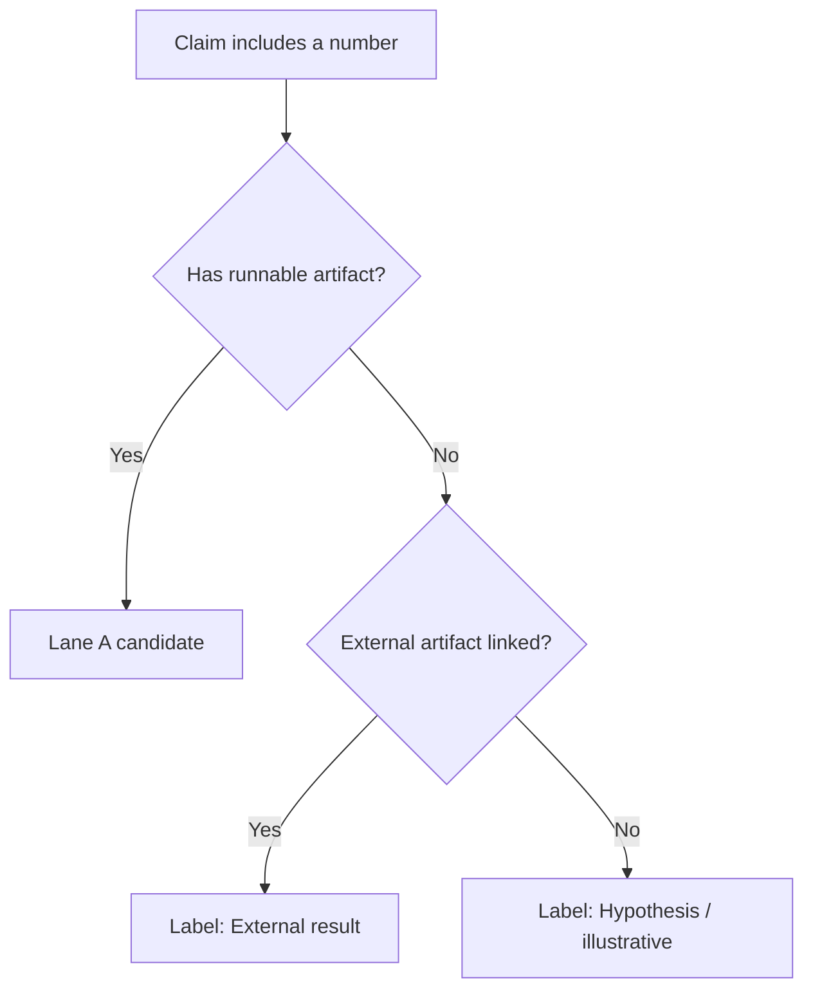
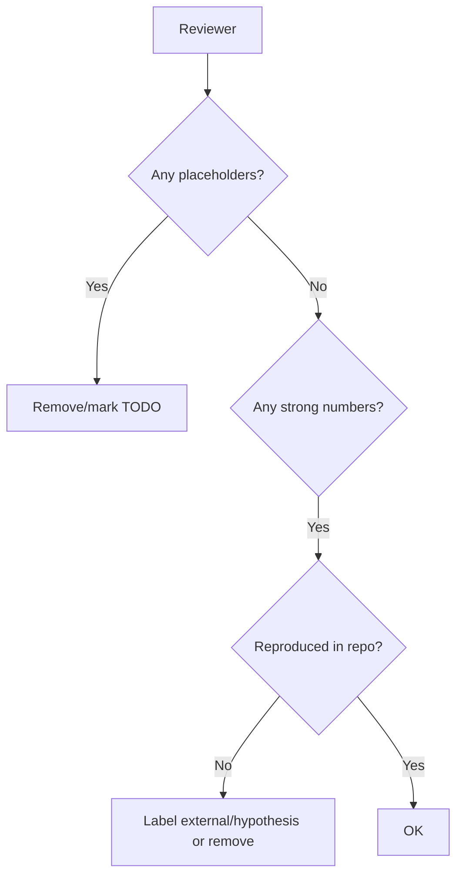

# Claims And Evidence (Repo Policy)

This repo is documentation-first. Trust comes from runnable artifacts, not prose.

## Lanes (Evidence Strength)

## Rule: Numbers Need Artifacts

If you state a numeric claim (accuracy %, success rate, failure probability, energy per query), you must provide at least one of:
- a runnable script/notebook in this repo that reproduces it, or
- a link to an external artifact (dataset + exact command + hashes) and label it **external**

Otherwise, label it as:
- **Hypothesis** (plausible but not reproduced here), or
- **Illustrative example** (toy numbers used for explanation)

## Rule: No Placeholder Citations

Do not ship references like `(arXiv id TBD)` or `CVE-YYYY-NNNN (placeholder)`.

If you don’t have the identifier yet:
- remove the identifier, keep author/title, and add `TODO: add id/url`

## Rule: “Formal Proof” Is Reserved

“Formal proof” is only allowed when there is a machine-checkable proof artifact and a checker.

Otherwise use:
- “proof narrative”
- “executable checks”
- “operational gate”
- “demo verification”

## Reviewer Checklist

