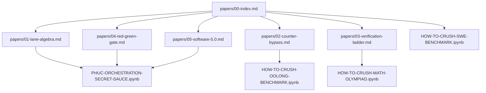
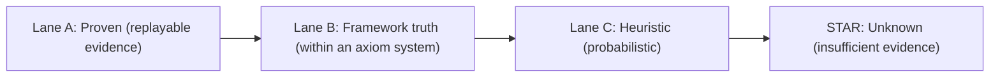

# Papers

Start here: `00-index.md`

This folder is the long-form documentation for the concepts used by the runnable artifacts in repo.

## Map (Papers -> Artifacts)

## Claim Hygiene (Prime Lanes)

If a paper makes a claim, it should be clear what lane it is in:

## What Reviewers Can Run

- Notebooks:
  - `HOW-TO-CRUSH-OOLONG-BENCHMARK.ipynb`
  - `HOW-TO-CRUSH-MATH-OLYMPIAD.ipynb`
  - `PHUC-ORCHESTRATION-SECRET-SAUCE.ipynb`
- SWE guide:
  - `HOW-TO-CRUSH-SWE-BENCHMARK.md`

## Update Rule

If you change a notebook or solver in a way that changes the conceptual story:
1. update the relevant paper(s)
2. update `00-index.md`
