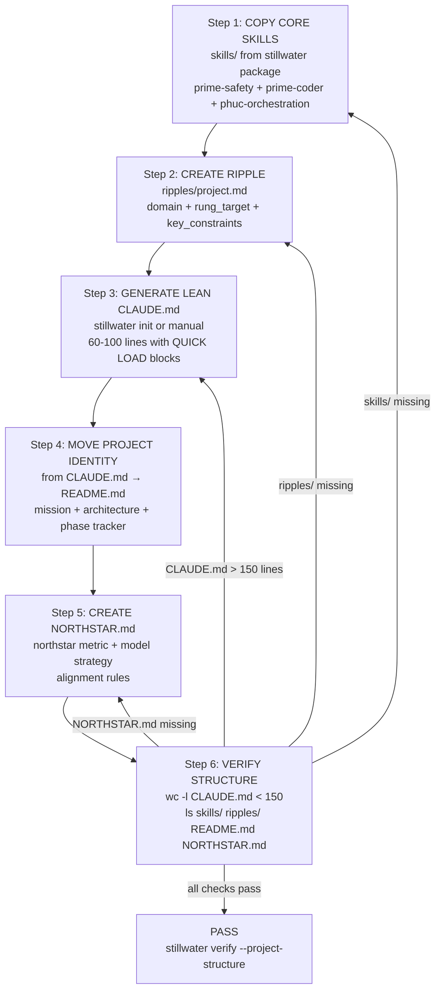

# Recipe: project-onboard — Install Stillwater Into Any Project

**Recipe ID:** project-onboard
**Version:** 1.0.0
**Rung Target:** 641
**Tags:** setup, onboarding, ripple, CLAUDE.md, project-install
**Authored-By:** Phuc Truong + Claude Sonnet 4.6
**Status:** CANONICAL

> "Adapt what is useful, reject what is useless, and add what is specifically your own." — Bruce Lee
>
> The `project-onboard` recipe does exactly this. It installs Stillwater into any project by
> keeping only what is project-specific in that project, and loading everything else from
> the Stillwater core.

---

## The Problem This Solves

### Symptom
Every project in the Phuc.Net ecosystem has a massive, monolithic CLAUDE.md:

| Project | CLAUDE.md Lines | What's Actually Project-Specific |
|---|---|---|
| pzip | 793 | ~50 lines |
| paudio | 1,113 | ~60 lines |
| solace-cli | 609 | ~40 lines |
| solace-browser | 1,692 | ~80 lines |
| **Total** | **4,207** | **~230 lines** |

**4,743 lines are copy-pasted Stillwater skill content.** This is the problem.

### Root Cause

CLAUDE.md mixes three concerns that belong in three different places:

```
Current (monolithic):
CLAUDE.md (793-1692 lines)
├── Project identity, mission, architecture     ← belongs in README.md
├── Ecosystem integration notes                 ← belongs in README.md
├── Stillwater skill content (copy-pasted)      ← belongs in skills/ + QUICK LOAD
└── Project-specific AI behavior (tiny)         ← the ONLY thing for CLAUDE.md
```

### The OOP Design Principle

```python
# What we have now (BAD — duplicated inheritance by copy-paste):
class PZipClaudeMd:
    prime_safety  = "...(200 lines, copy-pasted, might be stale)..."
    prime_coder   = "...(300 lines, copy-pasted, might be stale)..."
    project_stuff = "Beat LZMA..."  # the only part that should be here

# What we want (GOOD — inheritance via skill loading):
class PZipClaudeMd(StillwaterBase):  # prime-safety, prime-coder loaded from package
    ripple = load("ripples/project.md")  # only the delta — 30 lines
    # CLAUDE.md is now 80 lines, not 793
```

---

## Canonical Project Structure (Target State)

```
project/
├── CLAUDE.md           ← LEAN: 60-100 lines
│                          = QUICK LOAD skill summaries (5-15 lines each)
│                          + project ripple reference
│                          + link to README for project context
│
├── README.md           ← PROJECT IDENTITY: mission, architecture, quick start, phases
│                          (what is now embedded in CLAUDE.md)
│
├── skills/             ← FULL SKILL FILES (for sub-agent dispatch via phuc-orchestration)
│   ├── prime-safety.md        ← from stillwater package (copy or symlink)
│   ├── prime-coder.md         ← from stillwater package
│   ├── phuc-forecast.md       ← from stillwater package
│   └── [project-domain].md    ← project-specific skill (ONLY if truly custom)
│
├── ripples/            ← PROJECT-SPECIFIC OVERRIDES (10-30 lines)
│   └── project.md             ← rung target, domain, key constraints, entry points
│
└── recipes/            ← PROJECT-SPECIFIC WORKFLOWS
    └── [workflow].md          ← only what this project uniquely needs
```

---

## The Three Files That Matter

### 1. CLAUDE.md (lean — 60-100 lines)

```markdown
# CLAUDE.md — {PROJECT_NAME}
# Stillwater v{VERSION} | Generated by: stillwater init
# For project context, architecture, and phases: see README.md

## Project Ripple
See: ripples/project.md

---
{QUICK LOAD of prime-safety — 15 lines}
{QUICK LOAD of prime-coder — 20 lines}
{QUICK LOAD of phuc-orchestration — 15 lines}
{QUICK LOAD of phuc-forecast — 10 lines}
---

## Skill Directory
Full skill files for sub-agent dispatch: skills/
```

### 2. ripples/project.md (30 lines max)

```markdown
# {PROJECT_NAME} Ripple

PROJECT: {name}
DOMAIN: {e.g. lossless compression / audio synthesis / web automation}
RUNG_TARGET: {641 | 274177 | 65537}
NORTHSTAR: Phuc_Forecast
ECOSYSTEM: {PUBLIC | PRIVATE}
LANGUAGE: {Python | Node.js | etc.}

KEY_CONSTRAINTS:
  - {project-specific constraint 1}
  - {project-specific constraint 2}

ENTRY_POINTS:
  - {main module or script}
  - {test command}

FORBIDDEN_IN_THIS_PROJECT:
  - {anything project-specific to never do}

SEE_ALSO: README.md for full architecture, phases, and XP tracker
```

### 3. README.md (project identity)

Everything that was in CLAUDE.md's "MISSION", "ARCHITECTURE", "ECOSYSTEM INTEGRATION",
phase trackers, XP trackers, quest status, etc. — **all of it goes here**.

CLAUDE.md says `see README.md`. README.md has the full story.

---

## Installation Steps (Manual)

### Step 1 — Copy core skills (or use symlinks)

```bash
cd ~/projects/{your-project}
mkdir -p skills

# Copy from installed stillwater package
STILLWATER_DIR=$(python -c "import stillwater; import os; print(os.path.dirname(stillwater.__file__))")
# Or copy from repo
STILLWATER_DIR=~/projects/stillwater/skills

cp $STILLWATER_DIR/prime-safety.md skills/
cp $STILLWATER_DIR/prime-coder.md skills/
cp $STILLWATER_DIR/phuc-orchestration.md skills/
cp $STILLWATER_DIR/phuc-forecast.md skills/
```

### Step 2 — Create the ripple file

```bash
mkdir -p ripples
cat > ripples/project.md << 'EOF'
# {PROJECT_NAME} Ripple

PROJECT: {name}
DOMAIN: {domain}
RUNG_TARGET: 641
NORTHSTAR: Phuc_Forecast
LANGUAGE: Python

KEY_CONSTRAINTS:
  - never-worse on standard test suite

ENTRY_POINTS:
  - src/{project}/main.py
  - pytest -q

SEE_ALSO: README.md
EOF
```

### Step 3 — Generate lean CLAUDE.md

```bash
stillwater init --name "{PROJECT_NAME}" --skills prime-safety,prime-coder,phuc-orchestration,phuc-forecast
```

This generates a CLAUDE.md with QUICK LOAD summaries only (~80 lines total).

### Step 4 — Move project identity to README.md

Extract from your old CLAUDE.md:
- Mission section → README.md ##  Mission
- Architecture section → README.md ## Architecture
- Ecosystem integration → README.md ## Ecosystem
- Phase tracker / XP tracker → README.md ## Status
- Quick start / commands → README.md ## Quick Start

Leave in CLAUDE.md: **only the ripple reference and skill QUICK LOADs**.

### Step 5 — Create NORTHSTAR.md

```bash
cat > NORTHSTAR.md << 'EOF'
# NORTHSTAR — {PROJECT_NAME}

## Mission
{One sentence: what problem this project solves and why it matters}

## North Star Metric
{The single metric that tells you the project is succeeding}

## Model Strategy
- **Main session**: haiku (coordination, dispatch only)
- **Coder/Planner/Skeptic**: sonnet (domain work)
- **Mathematician/Security/Audit**: opus (promotion gates)

## Rung Target
{641 | 274177 | 65537} — {why}

## What aligns with this northstar
- {example: shipping a bug-free release aligns}

## What doesn't
- {example: adding features without tests does not align}
EOF
```

Then load it at session start with `/northstar`.

### Step 6 — Verify

```bash
# CLAUDE.md should be under 150 lines
wc -l CLAUDE.md

# Skills should exist for sub-agent dispatch
ls skills/

# Ripple file exists
cat ripples/project.md

# NORTHSTAR.md exists
cat NORTHSTAR.md
```

---

## Installation via CLI (Recommended)

```bash
pip install stillwater

cd ~/projects/if   # example: adding Stillwater to IF Theory project
stillwater init \
  --name "IF Theory" \
  --skills prime-safety,prime-coder,phuc-forecast \
  --rung 274177 \
  --domain "physics simulation / information theory"
```

**What `stillwater init` generates:**
1. `CLAUDE.md` — lean, with QUICK LOAD skill summaries (~80 lines)
2. `ripples/project.md` — project config template to fill in
3. `skills/` — copies of core skill files for sub-agent dispatch

---

## Ecosystem-Wide Sync

When Stillwater ships a new version with updated skills:

```bash
# In each project:
stillwater sync              # updates skills/ from installed stillwater package
stillwater sync --check      # dry-run: shows what would change
```

Or, via solace-cli:
```bash
cd ~/projects/solace-cli
python -m solace_cli.cli.stillwater_upgrade --all-projects
```

---

## Per-Project Recommendations

| Project | Skills to Load | Project-Specific Skill | Rung Target |
|---|---|---|---|
| **pzip** | prime-safety, prime-coder, prime-math, phuc-forecast | `skills/prime-compression.md` | 274177 |
| **paudio** | prime-safety, prime-coder, prime-math, phuc-forecast | `skills/prime-audio.md` | 274177 |
| **solaceagi** | prime-safety, prime-coder, phuc-orchestration, phuc-forecast | none | 65537 |
| **solace-browser** | prime-safety, phuc-cleanup, prime-wishes | `skills/prime-browser.md` | 641 |
| **solace-cli** | prime-safety, prime-coder, phuc-orchestration, phuc-context | none | 65537 |
| **if** | prime-safety, prime-coder, prime-math | none | 274177 |
| **phucnet** | prime-safety, phuc-cleanup | none | 641 |

---

## What Goes Where (Decision Table)

| Content | CLAUDE.md | README.md | ripples/ | skills/ |
|---|:---:|:---:|:---:|:---:|
| Project mission statement | ❌ | ✅ | ❌ | ❌ |
| Architecture diagrams | ❌ | ✅ | ❌ | ❌ |
| Phase tracker / XP / quests | ❌ | ✅ | ❌ | ❌ |
| Ecosystem integration notes | ❌ | ✅ | ❌ | ❌ |
| Quick start / commands | ❌ | ✅ | ❌ | ❌ |
| Rung target, domain, constraints | ❌ | ❌ | ✅ | ❌ |
| Key forbidden behaviors | ❌ | ❌ | ✅ | ❌ |
| Entry points / test commands | ❌ | ❌ | ✅ | ❌ |
| Stillwater core skill QUICK LOAD | ✅ | ❌ | ❌ | ❌ |
| Full skill content for sub-agents | ❌ | ❌ | ❌ | ✅ |
| Project-specific skill (custom domain) | ❌ | ❌ | ❌ | ✅ |

---

## Why This Is the Right Design

**For users installing Stillwater:**
- `pip install stillwater && stillwater init` — done in 30 seconds
- CLAUDE.md stays small → less context consumed → Claude works better
- Clear separation: "what Stillwater does" vs "what THIS project does"

**For project maintainers:**
- Stillwater skill updates propagate via `stillwater sync` — no manual drift
- README is the canonical project reference (linkable, SEO-able, human-readable)
- CLAUDE.md is a machine-readable directive file, not a documentation dump

**For AI agents (Claude Code):**
- Small CLAUDE.md = more context available for actual work
- Skills loaded efficiently via QUICK LOAD summaries
- Full skills available in skills/ for sub-agent dispatch when needed
- Ripple file gives project context without bloating the main session

**OOP principle applied:**
```
Base class (Stillwater) defines:
  - All verification rules
  - All forbidden states
  - All evidence contracts

Derived class (Project Ripple) overrides only:
  - domain
  - rung_target
  - key_constraints
  - entry_points

Everything else: inherited from base. Never duplicated. Never drifted.
```

---

## Anti-Patterns (Named)

**AP-1: Monolithic CLAUDE.md**
- Symptom: CLAUDE.md > 300 lines mixing project identity + skills
- Fix: Run `stillwater init` to regenerate lean CLAUDE.md; move project content to README

**AP-2: Skill Drift**
- Symptom: prime-safety in pzip's skills/ is v2.0.0; stillwater package has v2.1.0
- Fix: `stillwater sync` after every `pip install --upgrade stillwater`

**AP-3: No Ripple File**
- Symptom: Project-specific constraints buried inside CLAUDE.md prose
- Fix: Create `ripples/project.md` with explicit key-value constraints

**AP-4: README as Stub**
- Symptom: README has 20 lines while CLAUDE.md has 1000 lines of project context
- Fix: Move project identity to README; CLAUDE.md only loads skills + ripple

**AP-5: skills/ dir missing for sub-agent dispatch**
- Symptom: Main session can't dispatch coder agent with full prime-coder skill
- Fix: Keep full skill files in skills/; CLAUDE.md uses QUICK LOAD; sub-agents get full

---

## Verification

**Rung 641 checklist for a correctly onboarded project:**

- [ ] `wc -l CLAUDE.md` < 150 lines
- [ ] `ripples/project.md` exists and has rung_target, domain, key_constraints
- [ ] `skills/` directory has at minimum prime-safety.md and prime-coder.md
- [ ] `README.md` has mission, architecture, quick start
- [ ] `NORTHSTAR.md` exists with mission, metric, model strategy, rung target
- [ ] CLAUDE.md references README.md for project context
- [ ] CLAUDE.md contains QUICK LOAD blocks for each skill (not full content)
- [ ] CLAUDE.md has `## Phuc-Orchestration: MANDATORY` section at the top with haiku line
- [ ] No project-specific architecture prose inside CLAUDE.md

```bash
# Automated check (coming in stillwater v1.6.0):
stillwater verify --project-structure
```

---

---

## Skill Pack

Load these skills before executing this recipe:
- `skills/prime-safety.md` (always first — write_default: repo worktree only)
- `skills/prime-coder.md` (for generating lean CLAUDE.md and verifying structure)
- `skills/phuc-orchestration.md` (for dispatch discipline when sub-agents needed)

---

## Onboarding Flow (Mermaid Diagram)



---

## FSM: Project Onboarding State Machine

```
States: COPY_SKILLS | CREATE_RIPPLE | GENERATE_CLAUDE_MD |
        MOVE_IDENTITY | CREATE_NORTHSTAR | VERIFY | PASS | BLOCKED | NEED_INFO

Transitions:
  [*] → COPY_SKILLS: project directory identified
  COPY_SKILLS → NEED_INFO: stillwater package not installed and repo not found
  COPY_SKILLS → CREATE_RIPPLE: prime-safety.md + prime-coder.md in skills/
  CREATE_RIPPLE → GENERATE_CLAUDE_MD: ripples/project.md with rung_target + domain + key_constraints
  GENERATE_CLAUDE_MD → MOVE_IDENTITY: CLAUDE.md <= 150 lines with QUICK LOAD blocks
  GENERATE_CLAUDE_MD → BLOCKED: stillwater init fails and manual CLAUDE.md > 300 lines
  MOVE_IDENTITY → CREATE_NORTHSTAR: README.md has mission + architecture + quick start
  CREATE_NORTHSTAR → VERIFY: NORTHSTAR.md with metric + model strategy + rung target
  VERIFY → COPY_SKILLS: skills/ directory empty
  VERIFY → CREATE_RIPPLE: ripples/ directory or ripples/project.md missing
  VERIFY → GENERATE_CLAUDE_MD: CLAUDE.md > 150 lines
  VERIFY → CREATE_NORTHSTAR: NORTHSTAR.md missing
  VERIFY → PASS: all 9 checklist items pass

  Anti-pattern transitions (blocked):
  [*] → BLOCKED: attempting to create project-specific content in CLAUDE.md directly
  ANY → BLOCKED: writing absolute paths in ripples/project.md

Exit conditions:
  PASS: wc -l CLAUDE.md < 150, skills/ has prime-safety + prime-coder, NORTHSTAR.md exists
  BLOCKED: CLAUDE.md cannot be reduced without destroying essential project-specific constraints
  NEED_INFO: stillwater not installed; project root ambiguous
```

---

## GLOW Scoring

| Dimension | Contribution | Points |
|-----------|-------------|--------|
| **G** (Growth) | Project gains lean CLAUDE.md + skills/ directory enabling proper sub-agent dispatch; context available for actual work increases | +5 when CLAUDE.md reduces from > 300 lines to < 150 |
| **L** (Love/Quality) | NORTHSTAR.md present with falsifiable metric; README.md is the canonical project reference; ripple file has concrete key_constraints | +5 when all 9 verification checklist items pass |
| **O** (Output) | skills/ directory with core skill files; ripples/project.md; lean CLAUDE.md committed | +5 per successfully onboarded project |
| **W** (Wisdom) | Northstar metric (recipe_hit_rate) advances — stillwater sync enables automatic skill updates across all onboarded projects | +5 when `stillwater sync` can propagate updates without drift |

**Northstar Metric:** `recipe_hit_rate` — every project onboarded with the correct structure can receive skill updates via `stillwater sync`. Correct onboarding prevents skill drift, which is one of the primary causes of recipe replay failure (a recipe that assumes a certain skill version fails if the skill has drifted).

---

## Three Pillars of Software 5.0 Kung Fu

| Pillar | How This Recipe Applies It |
|--------|--------------------------|
| **LEK** (Self-Improvement) | The ripple file + lean CLAUDE.md pattern enables `stillwater sync` — each update to Stillwater's core skills propagates automatically to all onboarded projects without manual copy-paste, creating a self-improving skill corpus across the ecosystem |
| **LEAK** (Cross-Agent Trade) | Lean CLAUDE.md + skills/ directory enables clean sub-agent dispatch: main session loads QUICK LOAD summaries, sub-agents receive full skill content from skills/ — knowledge traded asymmetrically between session types without context bloat |
| **LEC** (Emergent Conventions) | The lean CLAUDE.md + ripple + README separation becomes a universal project structure convention — any agent that inspects a Stillwater-onboarded project can immediately locate the rung target, key constraints, and full skill files without reading monolithic documentation dumps |

---

*Recipe: project-onboard | v1.0.0 | Stillwater v1.5.0*
*The right structure makes skills load faster, context rot impossible, and drift automatic to detect.*
