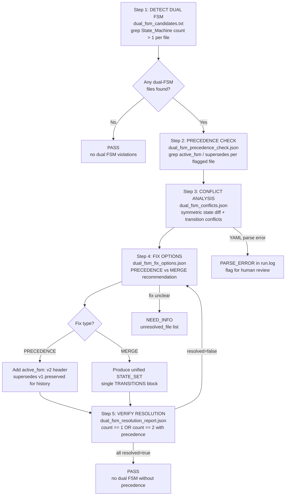

# Recipe: Dual FSM Detection and Resolution

## Purpose

Detect skill files that contain two or more State Machine (FSM) definitions without an explicit precedence declaration. This failure mode was discovered during a prime-wishes.md audit where a v1 and v2 FSM coexisted in the same file with no indication of which was authoritative, causing downstream agents to make different (and incompatible) assumptions about valid states.

## When to Use

- After a skill file undergoes a major version upgrade (where old FSM may persist)
- As part of the skill completeness audit (recipe.skill-completeness-audit)
- When an agent reports "invalid state" errors that don't match the current skill documentation

## Root Cause of Dual FSM Drift

When a skill file is upgraded from v1 to v2:
1. Author adds new FSM section but forgets to remove or clearly deprecate the old one
2. Different agents load the file and parse different sections (depending on parser strategy)
3. FSM transitions diverge: one agent may accept states the other rejects
4. Result: non-deterministic behavior that is hard to debug

## Fix Options

| Option | When to Use | Effect |
|--------|-------------|--------|
| PRECEDENCE | FSMs are genuinely different versions | Add `active_fsm: v2` declaration; v1 remains for historical reference |
| MERGE | FSMs are meant to be complementary | Combine into single unified STATE_SET + TRANSITIONS |

## Notes

- Prefer PRECEDENCE over MERGE unless state sets are strictly compatible
- After any fix, always re-run the detection check to confirm resolution
- The DUAL_FSM_WITHOUT_PRECEDENCE forbidden state is a Lane A violation — it creates non-deterministic agent behavior

---

## Detection Flow (Mermaid Diagram)



---

## FSM: Dual FSM Detection State Machine

```
States: DETECT | PRECEDENCE_CHECK | CONFLICT_ANALYSIS | FIX_OPTIONS |
        APPLY_PRECEDENCE | APPLY_MERGE | VERIFY_RESOLUTION | PASS | BLOCKED | NEED_INFO

Transitions:
  [*] → DETECT: audit invoked on all skill files
  DETECT → PASS: zero files with FSM section count > 1 (clean repo)
  DETECT → PRECEDENCE_CHECK: >= 1 file flagged with count > 1
  PRECEDENCE_CHECK → PASS: all flagged files have has_precedence = true
  PRECEDENCE_CHECK → CONFLICT_ANALYSIS: any file has has_precedence = false
  CONFLICT_ANALYSIS → CONFLICT_ANALYSIS (PARSE_ERROR): YAML unparseable; flag for human
  CONFLICT_ANALYSIS → FIX_OPTIONS: symmetric state diff computed for all flagged files
  FIX_OPTIONS → NEED_INFO: fix cannot be determined for specific file
  FIX_OPTIONS → APPLY_PRECEDENCE: recommended_fix = PRECEDENCE
  FIX_OPTIONS → APPLY_MERGE: recommended_fix = MERGE (only if state sets compatible)
  APPLY_PRECEDENCE → VERIFY_RESOLUTION: active_fsm: v2 header added
  APPLY_MERGE → VERIFY_RESOLUTION: single unified FSM written
  VERIFY_RESOLUTION → FIX_OPTIONS: resolved = false for any file (re-attempt)
  VERIFY_RESOLUTION → PASS: all files have resolved = true

  Forbidden state transitions:
  APPLY_MERGE → BLOCKED: semantic conflict in TRANSITIONS (incompatible states merged)
  CONFLICT_ANALYSIS → BLOCKED: PARSE_ERROR and human review refuses to engage

Exit conditions:
  PASS: all flagged files resolved; re-run detection shows count==1 OR count==2 with active_fsm
  BLOCKED: semantic merge conflict unresolvable; or YAML parse failures block all analysis
  NEED_INFO: fix cannot be determined without human review
```

---

## GLOW Scoring

| Dimension | Contribution | Points |
|-----------|-------------|--------|
| **G** (Growth) | Each run expands the agent's FSM conflict taxonomy — symmetric state differences and transition conflicts catalog into better detection heuristics | +4 per new conflict pattern type cataloged |
| **L** (Love/Quality) | All flagged files have resolved=true; no DUAL_FSM_WITHOUT_PRECEDENCE remains; YAML structure preserved after patching | +4 when dual_fsm_resolution_report.json shows all resolved=true |
| **O** (Output) | dual_fsm_patches.diff committed; resolution_report.json with before/after status per file | +4 per successful run resolving >= 1 conflict |
| **W** (Wisdom) | Northstar metric (skill_quality_avg) advances as non-deterministic FSM ambiguity is eliminated from skill files | +4 when re-audit shows zero dual-FSM violations |

**Northstar Metric:** `skill_quality_avg` — DUAL_FSM_WITHOUT_PRECEDENCE is a Lane A violation that silently corrupts agent behavior. Each resolution directly improves the affected skill's correctness score (C1 FSM criterion now unambiguous).

---

## Three Pillars of Software 5.0 Kung Fu

| Pillar | How This Recipe Applies It |
|--------|--------------------------|
| **LEK** (Self-Improvement) | Each detection run expands the agent's catalog of FSM conflict patterns — symmetric state differences and transition conflicts discovered in one skill file feed back into more precise detection heuristics for the next audit cycle |
| **LEAK** (Cross-Agent Trade) | Shares dual-FSM conflict reports (dual_fsm_conflicts.json) between the coder and skeptic agents: coder applies the PRECEDENCE or MERGE fix, skeptic re-runs detection to confirm resolution — neither can close the loop alone |
| **LEC** (Emergent Conventions) | Enforces the `active_fsm: v2  # supersedes v1` precedence declaration as a mandatory skill file convention, making FSM versioning explicit and deterministic across all agents that load skill files |

**Belt Level:** Orange — demonstrates systematic detection and resolution of non-deterministic state machine drift, a failure mode that silently corrupts agent behavior without triggering visible errors.

**GLOW Score:** +4 per successful run that resolves at least one dual-FSM conflict with a verified before/after resolution report (dual_fsm_resolution_report.json with all entries resolved==true).
