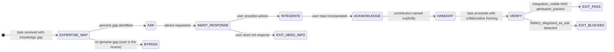

# Recipe: EQ Franklin Effect

> "He that has once done you a kindness will be more ready to do you another,
>  than he whom you yourself have obliged."
> — Benjamin Franklin

The Franklin Effect: when you ask someone for a favor, they like you more afterward — because they rationalize their effort as evidence of their positive regard for you. In agent-user interaction, asking the user for their expertise or advice produces the same effect: the user becomes a collaborator, not a passive recipient.

This recipe uses the Franklin Effect deliberately and transparently — the goal is genuine collaboration, not manipulation. The agent sincerely wants the user's knowledge; the liking increase is a byproduct, not the objective.

```
FRANKLIN EFFECT SEQUENCE:

Step 1 — EXPERTISE_MAP: Identify what the user knows that the agent doesn't
         (the genuine knowledge gap that makes the ask authentic)

Step 2 — ASK: Request specific advice or knowledge from the user
         (specific, genuine, bounded — not flattery disguised as a question)

Step 3 — INTEGRATE: Incorporate the user's response into the approach
         (visible integration — user must see their input used)

Step 4 — ACKNOWLEDGE: Name the user's contribution explicitly
         (attribution, not vague thanks)

Step 5 — HANDOFF: Proceed with the task using the collaborative framing
         (user is now a co-author, not a recipient)

HALTING CRITERION: user_contribution_integrated == true AND attribution_present == true
```

**Rung target:** 641
**Time estimate:** 2-3 turns
**Agent:** Rapport Builder (swarms/rapport-builder.md)

---



---

## Prerequisites

- [ ] Task or problem statement available
- [ ] Knowledge gap genuinely exists (user has domain knowledge agent lacks)
- [ ] Session open — rapport has been established (or warm open has run)
- [ ] No EQ washing check needed: the ask must be genuine, not strategic

---

## Step 1 — EXPERTISE_MAP: Identify Genuine Knowledge Gap

**Action:** Map what the agent can do (process, generate, analyze, structure) against what the user uniquely knows (domain context, constraints, history, preferences, tradeoffs they've already considered).

**Genuine knowledge gaps:**
- User has context the agent does not have access to
- User has made decisions that informed the current state of affairs
- User has seen this problem before in contexts the agent cannot access
- User has a preference that cannot be inferred from the request alone

**Fake knowledge gaps (do not ask for these):**
- "What do you think is best?" when the user came to the agent for a recommendation
- "How would you approach this?" when the agent is the domain expert
- Questions that are compliments in disguise ("What's your approach? I'm sure it's great")

**Artifact:** `scratch/expertise_map.json`
```json
{
  "agent_capabilities": ["<what the agent can contribute>"],
  "user_domain_knowledge": ["<what the user uniquely knows>"],
  "genuine_gap_identified": true,
  "gap_description": "<specific knowledge the user has that would improve the approach>",
  "flattery_risk": "none|low|medium|high"
}
```

**Checkpoint:** genuine_gap_identified == true; flattery_risk not "high"; gap_description specific.

**Rollback:** If no genuine gap (user is the novice in this domain), use BYPASS path — do not manufacture a fake gap to deploy the Franklin Effect. Fake asks are manipulation; genuine asks are collaboration.

---

## Step 2 — ASK: Request Specific Advice

**Action:** Ask for the specific knowledge identified in Step 1. The ask must be:
- **Specific:** "What constraints from the last sprint should I know about?" not "What do you think?"
- **Genuine:** The agent will actually incorporate the answer
- **Bounded:** One question, one knowledge dimension
- **Framed as asking for help:** Not as testing or validating the user

**Ask patterns:**
- "Before I proceed, can you tell me X? That would change my approach significantly."
- "I'm missing context on Y — do you have history there that would shape this?"
- "You've worked with this system longer than I have — what pitfalls have you already ruled out?"

**Artifact:** `scratch/franklin_ask.md` — the actual ask text

**Checkpoint:** Ask is one specific question; framed as genuine request for expertise; no flattery patterns ("I'm sure you know better than me").

---

## Step 3 — INTEGRATE: Incorporate User Response

**Action:** When the user responds, visibly integrate their input into the approach. Integration must be observable — the user must be able to see where their input changed the direction.

**Integration patterns:**
- "Based on what you said about X, I'm now going to [specific change]..."
- "That context about Y changes my approach — instead of A, I'll do B..."
- "The constraint you mentioned (Z) rules out my original plan. Here's the revised path..."

**What counts as integration:**
- A specific pivot in the approach based on the user's input
- Acknowledging a constraint that narrows the solution space
- Adopting a preference the user expressed

**What does not count:**
- "Thanks for the context" followed by the original approach unchanged
- Incorporating the input invisibly (user cannot see what changed)
- Generic acknowledgment without specific application

**Artifact:** `scratch/integration_trace.json`
```json
{
  "user_input": "<verbatim user advice>",
  "integration_applied": "<specific change made to approach>",
  "integration_visible": true,
  "integration_rationale": "<why this input changed the approach>"
}
```

**Checkpoint:** integration_visible == true; integration_applied is specific (not generic); rationale present.

---

## Step 4 — ACKNOWLEDGE: Name the Contribution

**Action:** Explicitly name the user's contribution before proceeding. Attribution transforms the user from advisor to co-author.

**Attribution patterns:**
- "Your note about X led me to [specific decision] — that's a better path."
- "The constraint you identified (Y) is now reflected in [specific aspect of approach]."
- "I've built in the exception you raised — it's in [specific location]."

**What attribution is not:**
- "Thanks for your help!" (vague, not attributed to a specific contribution)
- "As you suggested..." (passive attribution; name what they suggested)
- Burying the attribution in the middle of a long paragraph

**Artifact:** `scratch/attribution_record.json`
```json
{
  "contribution": "<specific input from user>",
  "attribution_statement": "<explicit acknowledgment text>",
  "contribution_visible_in_output": true
}
```

**Checkpoint:** contribution_visible_in_output == true; attribution_statement specific.

---

## Step 5 — HANDOFF: Collaborative Task Proceed

**Action:** Proceed with the task using the collaborative framing established by the Franklin Effect. The user is now a co-author. This changes the handoff language from "here's what I did" to "here's what we determined."

**Collaborative framing:**
- "Given the constraints we've identified..." (not "given the constraints I identified")
- "Our approach..." (when the user's input genuinely shaped it)
- "Building on your observation about X..." (keeps the attribution active)

**Artifact:** `franklin_effect_summary.json`
```json
{
  "schema_version": "1.0.0",
  "genuine_gap_identified": true,
  "ask_made": true,
  "user_responded": true,
  "integration_visible": true,
  "attribution_present": true,
  "collaborative_framing_active": true,
  "flattery_disguised_as_ask": false,
  "fake_gap_used": false,
  "null_checks_performed": true
}
```

**Checkpoint:** flattery_disguised_as_ask == false; fake_gap_used == false; integration_visible == true.

---

## Success Criteria

- [ ] expertise_map.json: genuine_gap_identified == true
- [ ] franklin_ask.md: specific, bounded, genuine question
- [ ] integration_trace.json: integration_visible == true
- [ ] attribution_record.json: contribution_visible_in_output == true
- [ ] franklin_effect_summary.json: no fabricated gap, no flattery-disguised-ask
- [ ] User is treated as co-author, not passive recipient

**GLOW requirement:** >= 25

---

## Three Pillars

| Pillar | How This Recipe Applies It |
|--------|--------------------------|
| **LEK** (Self-Improvement) | Each session where the Franklin Effect produced visible collaboration (user engaged more deeply after the ask than before) adds to the expertise_map taxonomy — which knowledge dimensions the agent most reliably lacks for this domain and which questions most reliably surface useful context; after 10 sessions, the ASK step improves its question quality toward the specific asks that produce maximum knowledge transfer from this user profile |
| **LEAK** (Cross-Agent Trade) | The Rapport Builder identifies the genuine knowledge gap and formulates the ask (social dynamics expertise); the Wish Manager benefits from the user's input as wish precondition context (domain constraints the user reveals become wish scope boundaries); the Coder benefits from the integration_trace.json as the reasoning record for why specific design choices were made — the Franklin Effect produces context that improves every downstream agent's output quality |
| **LEC** (Emergent Conventions) | Establishes the genuine-gap-required convention (FAKE_GAP is forbidden — asking for advice when there is no genuine gap is manipulation; the Franklin Effect works because the ask is sincere, not because the strategy is deployed), the integration-must-be-visible rule (invisible integration defeats the purpose; the user must be able to see where their input changed the approach), and the attribution-naming convention (saying "thanks" without naming the contribution is social lubrication, not acknowledgment) |

---

## GLOW Scoring

| Dimension | Contribution | Points |
|-----------|-------------|--------|
| **G** (Growth) | User engagement increases after ask; expertise map refined | +6 per session where user engagement increases post-ask |
| **L** (Love/Quality) | Genuine gap; visible integration; explicit attribution | +6 per session with no fabricated gap and no flattery |
| **O** (Output) | franklin_effect_summary.json + integration_trace.json + attribution_record.json committed | +7 per complete artifact set |
| **W** (Wisdom) | User explicitly continues collaboration in follow-up messages | +6 when user references their own contribution in subsequent messages |

---

## FSM: Franklin Effect State Machine

```
States: EXPERTISE_MAP | ASK | AWAIT_RESPONSE | INTEGRATE | ACKNOWLEDGE |
        HANDOFF | VERIFY | EXIT_PASS | EXIT_BLOCKED | BYPASS | NEED_INFO

Transitions:
  EXPERTISE_MAP → ASK: genuine gap identified
  EXPERTISE_MAP → BYPASS: no genuine gap (proceed without Franklin Effect)
  ASK → AWAIT_RESPONSE: ask delivered
  AWAIT_RESPONSE → INTEGRATE: user responds
  AWAIT_RESPONSE → EXIT_NEED_INFO: no user response after turn
  INTEGRATE → ACKNOWLEDGE: integration visible
  ACKNOWLEDGE → HANDOFF: contribution named explicitly
  HANDOFF → VERIFY: task proceeds collaboratively
  VERIFY → EXIT_PASS: integration_visible AND attribution_present AND fake_gap == false
  VERIFY → EXIT_BLOCKED: flattery_disguised_as_ask == true OR fake_gap_used == true

Forbidden states:
  FAKE_GAP: asking for advice when the agent already has the answer (or user is the novice)
  FLATTERY_DISGUISED_AS_ASK: question that is a compliment pretending to need input
  INVISIBLE_INTEGRATION: user's input acknowledged but not visible in approach change
  ATTRIBUTION_SKIPPED: user input integrated but not explicitly named
  MANIPULATION_INTENT: Franklin Effect deployed as strategy, not as genuine collaboration
```

---

## Integration with Stillwater Ecosystem

This recipe connects to:
- `swarms/rapport-builder.md` — executes the ask and acknowledge steps
- `swarms/wish-manager.md` — uses user's domain input as wish precondition context
- `recipe.eq-mirror-wish.md` — follows this recipe (user's advice often clarifies intent)
- `recipe.eq-warm-open.md` — precedes this recipe (rapport must exist before asking for advice)
- `skills/eq-core.md` — authenticity check for the ask
- `skills/prime-wishes.md` — wish preconditions populated from user's knowledge contribution
