```mermaid
stateDiagram-v2
    direction LR
    [*] --> SIGNAL_DETECT : emotional signal in message
    SIGNAL_DETECT --> WINDOW_ASSESS : signal confirmed
    SIGNAL_DETECT --> EXIT_PASS : no signal (neutral message)
    WINDOW_ASSESS --> NAME : window is regulated or mild_arousal
    WINDOW_ASSESS --> GROUND_FIRST : window is hyperarousal
    GROUND_FIRST --> NAME : grounding achieved
    GROUND_FIRST --> EXIT_BLOCKED : grounding not possible in text channel
    NAME --> UNDERSTAND : affect label + evidence produced
    UNDERSTAND --> READINESS_CHECK : underlying need identified
    READINESS_CHECK --> TRANSFORM : readiness confirmed
    TRANSFORM --> VERIFY : solution seed + NUT trace produced
    VERIFY --> EXIT_PASS : clinical_claim==false AND rapport_delta>=0
    VERIFY --> EXIT_BLOCKED : clinical_claim detected
```

# Recipe: EQ NUT Job Flow

> "Name it to tame it. Affect labeling takes the charge out of the emotion
>  by moving it from the amygdala to the prefrontal cortex."
> — Daniel Siegel, Interpersonal Neurobiology

The NUT Job is the three-step emotional processing protocol that MUST precede any solution delivery when emotional signals are detected. The acronym is the contract: **N**ame → **U**nderstand → **T**ransform. Skipping any step produces a solution that lands in hostile territory.

```
THE NUT JOB PROTOCOL:

N — NAME: What is the emotional state?
    Affect label with textual evidence.
    "Name it to tame it" — cortical language reduces amygdala activation.

U — UNDERSTAND: What need is beneath it?
    Universal human need the emotion points to.
    Not "what do they want" — what do they NEED?
    Autonomy | Clarity | Progress | Respect | Safety | Connection | Achievement

T — TRANSFORM: Only now, offer a path forward.
    Readiness confirmed. Window of Tolerance assessed.
    Solution offered in the user's register.
    Solution_deferred until NUT chain is complete.

HALTING CRITERION: nut_job_trace.json complete with all three steps + evidence
                   clinical_claim_present == false
```

**Rung target:** 274177
**Time estimate:** 3 steps per emotional signal; 1-2 turns per NUT Job
**Agent:** Empath (swarms/empath.md)

---



---

## Prerequisites

- [ ] User message with emotional signal available
- [ ] Window of Tolerance assessment model loaded (from eq-core)
- [ ] Affect taxonomy loaded (six primary families: joy, sadness, anger, fear, disgust, surprise)
- [ ] Clinical claim prohibition active (prime-safety governs)

---

## Step 1 — SIGNAL_DETECT: Identify Emotional Signal

**Action:** Read the user message for emotional signal indicators:
- Direct affect expression ("I'm frustrated", "this is overwhelming")
- Implicit affect indicators (all-caps, excessive punctuation, shortened responses, withdrawal)
- Frustration proxy patterns ("I've tried X three times", "nothing works", "I give up")
- Disengagement signals (abrupt shifts, monosyllabic responses after prior engagement)

**Artifact:** `scratch/signal_detection.json`
```json
{
  "signal_detected": true,
  "signal_type": "direct_expression|implicit_indicator|frustration_proxy|disengagement",
  "evidence_phrase": "<exact phrase from user message>",
  "affect_family": "joy|sadness|anger|fear|disgust|surprise|mixed|none",
  "signal_intensity": "high|medium|low"
}
```

**Checkpoint:** signal_detected is boolean; if true, evidence_phrase is non-null.

**Rollback:** If signal_detected == false, EXIT_PASS immediately with note "no emotional signal detected — NUT Job not required."

---

## Step 2 — WINDOW_ASSESS: Window of Tolerance Assessment

**Action:** Classify the user's current regulatory state using the Window of Tolerance model:
- **Regulated:** Prefrontal cortex accessible; solutions can land; proceed to NAME
- **Mild arousal:** Some activation but manageable; NAME is especially important here
- **Hyperarousal:** Overwhelmed, fragmented, urgent — grounding before NAME; if grounding not possible in text channel, EXIT_BLOCKED
- **Hypoarousal:** Flat, withdrawn, disconnected — gentle activation before NAME

**Artifact:** `scratch/window_assessment.json`
```json
{
  "window_state": "regulated|mild_arousal|hyperarousal|hypoarousal",
  "evidence": ["<specific indicator>"],
  "grounding_required": false,
  "grounding_approach": "<if required: breathing prompt|simple question|validation statement>",
  "proceed_to_name": true
}
```

**Checkpoint:** window_state is set; proceed_to_name is boolean; if hyperarousal and grounding_required == true, grounding_approach is non-null.

---

## Step 3 — NAME: Affect Labeling

**Action:** Label the affect with precision. Use the six primary families as anchors. Apply secondary specificity where evidence supports it.

**Affect labeling taxonomy (primary families → secondary labels):**
- `anger` → frustrated | irritated | exasperated | livid | resentful
- `sadness` → disappointed | discouraged | defeated | hopeless | grieving
- `fear` → anxious | overwhelmed | worried | panicked | uncertain
- `disgust` → repelled | disheartened | cynical | contemptuous
- `surprise` → disoriented | confused | caught-off-guard | shocked
- `joy` → excited | satisfied | proud | relieved | energized

**Critical rule:** Every label requires a textual anchor. "User seems frustrated" without citing a specific phrase is affect fabrication.

**Artifact:** `scratch/name_step.json`
```json
{
  "primary_affect_family": "<family>",
  "specific_label": "<secondary label>",
  "label_evidence": "<exact phrase from user message>",
  "secondary_affect": "<if mixed signal: second label + evidence>",
  "affect_fabrication_check": false
}
```

**Checkpoint:** label_evidence is a direct quote from the user message; affect_fabrication_check == false.

---

## Step 4 — UNDERSTAND: Underlying Need Identification

**Action:** Identify the universal human need the affect points to. Do not label the symptom — find the root.

**Universal human needs taxonomy (non-clinical):**
- `autonomy`: control over one's own decisions and direction
- `clarity`: understanding what is happening and why
- `progress`: forward movement; seeing effort translated to results
- `respect`: being taken seriously; having contributions valued
- `safety`: predictability; freedom from threat or sudden change
- `connection`: feeling accompanied, not alone in the problem
- `achievement`: completing something that matters; competence confirmation
- `acknowledgment`: having the struggle seen before the solution arrives

**Critical rule:** The need is never "they want X" (that is a want). The need is the deeper driver. "They want a fix" is a want. "They need progress — they've been stuck" is a need.

**Artifact:** `scratch/understand_step.json`
```json
{
  "underlying_need": "<from taxonomy>",
  "need_evidence": "<behavioral or linguistic indicator>",
  "want_vs_need_distinguished": true,
  "relational_signal": "<what the user is asking for at the relationship layer — to be seen? to be helped? to be left alone?>",
  "empathy_statement_draft": "<1 sentence acknowledging the affect + the need>"
}
```

**Checkpoint:** underlying_need is from the taxonomy; want_vs_need_distinguished == true; empathy_statement_draft non-null.

---

## Step 5 — READINESS_CHECK: Confirm Transform Readiness

**Action:** Before offering any solution, confirm:
1. The user has been named (affect labeled)
2. The user has been understood (need identified)
3. The window state allows the solution to land

**Readiness criteria:**
- NAME step complete with evidence
- UNDERSTAND step complete with need identified
- window_state is regulated, mild_arousal, or mild_hyperarousal (not full hyperarousal)

**Artifact:** `scratch/readiness_check.json`
```json
{
  "name_complete": true,
  "understand_complete": true,
  "window_allows_transform": true,
  "readiness_confirmed": true,
  "solution_defer_reason": "<if readiness_confirmed == false: why>"
}
```

**Checkpoint:** readiness_confirmed is boolean; if false, solution_defer_reason is non-null.

---

## Step 6 — TRANSFORM: Offer Path Forward

**Action:** With readiness confirmed, offer the transform. The transform has two parts:
1. **Empathy acknowledgment:** Deliver the empathy_statement_draft from Step 4 — acknowledge the affect and the need before the solution
2. **Solution seed:** First sentence of the solution — calibrated to the user's register, paced to their window state

**Transform sequence within the response:**
1. Acknowledge (empathy_statement_draft)
2. Bridge ("Given that you're feeling X and need Y, here's a path...")
3. Solution seed (first step only — not a wall of text)

**Artifact:** `nut_job_trace.json` (the complete trace artifact)

**Checkpoint:** empathy_statement precedes solution seed in the response; solution_deferred == false (the solution is now appropriate); all three steps documented with evidence.

---

## Step 7 — VERIFY: EQ Audit Gate

**Action:** Before delivering the response, run the EQ Audit check:
- clinical_claim_present == false
- affect labels have textual evidence
- solution was preceded by empathy statement
- no affect fabrication

**Artifact:** `nut_job_trace.json` (final, complete)

```json
{
  "schema_version": "1.0.0",
  "agent_type": "empath",
  "rung_target": 274177,
  "input_excerpt": "<1-3 sentences with emotional signal>",
  "window_of_tolerance_assessment": {"state": "<state>", "evidence": "<phrase>", "confidence": "<level>"},
  "name_step": {"affect_labels": ["<label>"], "label_evidence": "<phrase>", "label_family": "<family>"},
  "understand_step": {"underlying_need": "<need>", "need_evidence": "<indicator>", "relational_signal": "<signal>"},
  "transform_step": {"readiness_confirmed": true, "response_register": "<register>", "proposed_response_seed": "<1-2 sentences>", "solution_deferred": false},
  "rapport_delta": {"before": 0, "after": 0, "unit": "rapport_points_0_to_100"},
  "null_checks_performed": true,
  "clinical_claim_present": false
}
```

**Checkpoint:** All three steps populated; clinical_claim_present == false; null_checks_performed == true.

---

## Success Criteria

- [ ] signal_detection.json: signal_detected boolean, evidence non-null if true
- [ ] window_assessment.json: window_state set, proceed_to_name boolean
- [ ] name_step.json: label with direct quote evidence, affect_fabrication_check == false
- [ ] understand_step.json: need from taxonomy, want_vs_need_distinguished == true
- [ ] readiness_check.json: readiness_confirmed boolean
- [ ] nut_job_trace.json: all three steps complete, clinical_claim_present == false
- [ ] No PREMATURE_TRANSFORM (solution before empathy statement)

**GLOW requirement:** >= 30

---

## Three Pillars

| Pillar | How This Recipe Applies It |
|--------|--------------------------|
| **LEK** (Self-Improvement) | Each NUT Job trace where the empathy statement was confirmed ("yes, that's exactly it" or equivalent user acknowledgment) refines the affect taxonomy — which labels consistently map to which underlying needs for this user or domain; after 10 traces, the UNDERSTAND step's need mapping improves; the gap between affect label and need identification narrows as the causal chain is rehearsed repeatedly |
| **LEAK** (Cross-Agent Trade) | nut_job_trace.json exports the underlying_need field to the Conflict Resolver (which uses it as the NVC Need step starting point), the Wish Manager (which uses it as wish precondition context), and the EQ Auditor (which uses clinical_claim_present as its first gate); imports rapport_score.json from the Rapport Builder to know how much relational capital exists before deciding whether to defer or deliver the transform step |
| **LEC** (Emergent Conventions) | Establishes the name-before-transform convention as a project-wide rule: no solution is delivered to a user showing emotional signals without a completed NUT Job trace; this becomes the EQ equivalent of the red-green test gate — the solution is not deployed until the empathy chain is verified; PREMATURE_TRANSFORM is the EQ equivalent of PATCH_WITHOUT_REPRO |

---

## GLOW Scoring

| Dimension | Contribution | Points |
|-----------|-------------|--------|
| **G** (Growth) | Affect label confirmed by subsequent user message; taxonomy refined | +8 per label confirmed by user acknowledgment |
| **L** (Love/Quality) | Full NUT chain completed with evidence; clinical_claim == false | +8 when all three steps have textual evidence |
| **O** (Output) | nut_job_trace.json with all fields populated + window_assessment | +8 per complete NUT Job trace at rung 274177 |
| **W** (Wisdom) | Rapport delta positive after Transform; need identified before solution | +6 when rapport_delta shows improvement after transform |

---

## FSM: NUT Job State Machine

```
States: SIGNAL_DETECT | WINDOW_ASSESS | GROUND_FIRST | NAME | UNDERSTAND |
        READINESS_CHECK | TRANSFORM | VERIFY | EXIT_PASS | EXIT_BLOCKED | NEED_INFO

Transitions:
  SIGNAL_DETECT → EXIT_PASS: no signal detected (neutral message)
  SIGNAL_DETECT → WINDOW_ASSESS: signal confirmed
  WINDOW_ASSESS → NAME: window regulated or mild
  WINDOW_ASSESS → GROUND_FIRST: window hyperarousal
  GROUND_FIRST → NAME: grounding achieved
  GROUND_FIRST → EXIT_BLOCKED: grounding not possible
  NAME → UNDERSTAND: label with evidence produced
  UNDERSTAND → READINESS_CHECK: need identified from taxonomy
  READINESS_CHECK → TRANSFORM: readiness confirmed
  READINESS_CHECK → EXIT_BLOCKED: window prevents transform
  TRANSFORM → VERIFY: solution seed + empathy acknowledgment produced
  VERIFY → EXIT_PASS: complete trace + clinical_claim == false
  VERIFY → EXIT_BLOCKED: clinical_claim detected

Forbidden states:
  PREMATURE_TRANSFORM: solution before NAME + UNDERSTAND complete
  AFFECT_FABRICATION: label without textual evidence
  SKIP_UNDERSTAND: NAME → TRANSFORM without UNDERSTAND
  CLINICAL_CLAIM: therapy or diagnosis language anywhere in trace
  WINDOW_BYPASS: TRANSFORM while window_state is hyperarousal
```

---

## Integration with Stillwater Ecosystem

This recipe connects to:
- `swarms/empath.md` — the executing agent
- `swarms/conflict-resolver.md` — receives underlying_need as NVC input
- `swarms/eq-auditor.md` — receives nut_job_trace.json for authenticity audit
- `recipe.eq-conflict-deescalate.md` — extends NUT Job into full NVC four-step
- `recipe.eq-mirror-wish.md` — follows NUT Job with intent confirmation
- `combos/wish-with-mirror.md` — uses NUT Job as the pre-processor for wish decomposition
- `skills/eq-nut-job.md` — the full NUT Job skill specification
