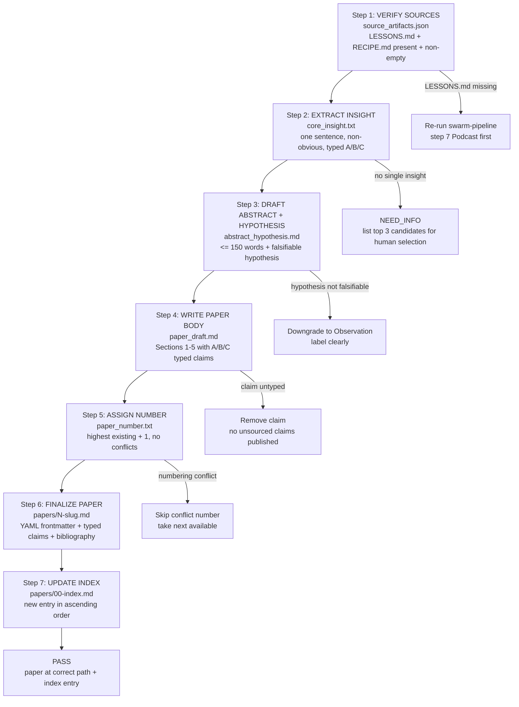

# Recipe: Paper Extraction from Completed Swarm Run

## Purpose

Transform a completed swarm run's artifacts (LESSONS.md + RECIPE.md + evidence) into a structured, publishable research paper with typed claims. Designed to compress 1 week of manual paper writing into 2 hours by following a deterministic extraction protocol.

## When to Use

- After any swarm run that produced a non-obvious generalizable insight
- When the Podcast agent's LESSONS.md contains a hypothesis worth formalizing
- When a recipe or skill upgrade reveals a new failure mode worth documenting

## Claim Typing Guide

Every key claim in the paper must be typed:

| Lane | Type | Meaning | Example |
|------|------|---------|---------|
| [A] | Invariant | Hard safety/correctness rule | "Dual FSM without precedence causes non-deterministic agent behavior" |
| [B] | Engineering quality | Strong preference with trade-off space | "Minimal diffs are preferred when evidence supports multiple solutions" |
| [C] | Heuristic | Guidance only, not sufficient for PASS | "Localization scoring heuristics typically converge in 3 iterations" |

## Paper Structure Template

```markdown
# <Number>. <Title>

## Abstract
(150 words max)

## 1. Introduction
## 2. Method
## 3. Results
## 4. Discussion
## 5. Recipe (Reusable Steps)
```

## Notes

- Every number in the results section must trace to a run artifact file with an explicit path
- The paper number is determined by the directory state at writing time — always re-check before finalizing
- Lane C claims are valuable in papers but must be clearly labeled as heuristics, not proofs

---

## Paper Extraction Flow (Mermaid Diagram)



---

## FSM: Paper Extraction State Machine

```
States: VERIFY_SOURCES | EXTRACT_INSIGHT | DRAFT_ABSTRACT |
        WRITE_BODY | ASSIGN_NUMBER | FINALIZE | UPDATE_INDEX |
        PASS | BLOCKED | NEED_INFO

Transitions:
  [*] → VERIFY_SOURCES: completed swarm run artifacts provided
  VERIFY_SOURCES → NEED_INFO: LESSONS.md or RECIPE.md missing (re-run Podcast step first)
  VERIFY_SOURCES → EXTRACT_INSIGHT: both source artifacts exist and non-empty
  EXTRACT_INSIGHT → NEED_INFO: no single generalizable insight (emit top 3 candidates)
  EXTRACT_INSIGHT → DRAFT_ABSTRACT: core_insight.txt with typed lane annotation
  DRAFT_ABSTRACT → DRAFT_ABSTRACT (DOWNGRADE): hypothesis not falsifiable → label as Observation
  DRAFT_ABSTRACT → WRITE_BODY: abstract <= 150 words + hypothesis/observation stated
  WRITE_BODY → WRITE_BODY (REMOVE): claim cannot be typed → remove, do not publish unsourced
  WRITE_BODY → ASSIGN_NUMBER: all claims typed [A/B/C], all numbers sourced to artifacts
  ASSIGN_NUMBER → ASSIGN_NUMBER (SKIP): numbering conflict → take next available
  ASSIGN_NUMBER → FINALIZE: number confirmed unique
  FINALIZE → BLOCKED: YAML frontmatter breaks file parsing (simplify, flag parse issue)
  FINALIZE → UPDATE_INDEX: paper at correct path, frontmatter parses
  UPDATE_INDEX → PASS: index entry present, ascending order maintained

Exit conditions:
  PASS: paper exists at papers/N-slug.md; YAML parses; >= 3 typed claims; index entry correct
  BLOCKED: YAML parse failure unresolvable
  NEED_INFO: source artifacts missing; no single generalizable insight
```

---

## GLOW Scoring

| Dimension | Contribution | Points |
|-----------|-------------|--------|
| **G** (Growth) | Paper extracts a non-obvious generalizable insight from swarm artifacts; typed Lane A claim (invariant) discovered | +6 per paper with at least 1 Lane A [A] claim |
| **L** (Love/Quality) | All claims typed [A/B/C]; all figures sourced to run artifacts; hypothesis is falsifiable (not forced consensus) | +6 when python3 grep for [A][B][C] confirms >= 3 annotations |
| **O** (Output) | Paper committed at papers/N-slug.md; index updated in ascending order; frontmatter parses | +6 per published paper |
| **W** (Wisdom) | Northstar metric (skill_quality_avg + recipe_hit_rate) advanced because paper formalizes a new convention or invariant | +6 when paper documents a new Lane A invariant adopted by others |

**Northstar Metric:** `skill_quality_avg` + `recipe_hit_rate` — papers that document Lane A invariants (discovered during swarm runs) directly improve both: the invariant becomes a skill constraint (raising quality score) and the RECIPE.md section becomes a replayable recipe (raising hit rate).

---

## Three Pillars of Software 5.0 Kung Fu

| Pillar | How This Recipe Applies It |
|--------|--------------------------|
| **LEK** (Self-Improvement) | Each paper extraction run trains the agent to identify which swarm artifacts contain publishable insights — the feedback loop between LESSONS.md quality and paper generalizability improves the Podcast agent's synthesis discipline in future swarm runs |
| **LEAK** (Cross-Agent Trade) | The Podcast agent distills the Solver and Skeptic agents' combined evidence into typed claims [A/B/C], enabling the Writer agent to produce a paper without needing to re-read all underlying artifacts — compressed, typed knowledge traded across agent roles |
| **LEC** (Emergent Conventions) | Establishes the [A/B/C] claim typing system as a reusable convention for all published work: Lane A = invariant, Lane B = engineering preference, Lane C = heuristic — making the epistemic status of every claim explicit and reviewable |

**Belt Level:** Green — demonstrates the full lifecycle from execution to knowledge: running a swarm, synthesizing its insights via Podcast, extracting typed claims, and publishing a falsifiable paper with traceable provenance to run artifacts.

**GLOW Score:** +6 per published paper with at least 3 typed claims [A/B/C], a falsifiable hypothesis, all figures sourced to run artifacts, and a correct index entry in papers/00-index.md.
