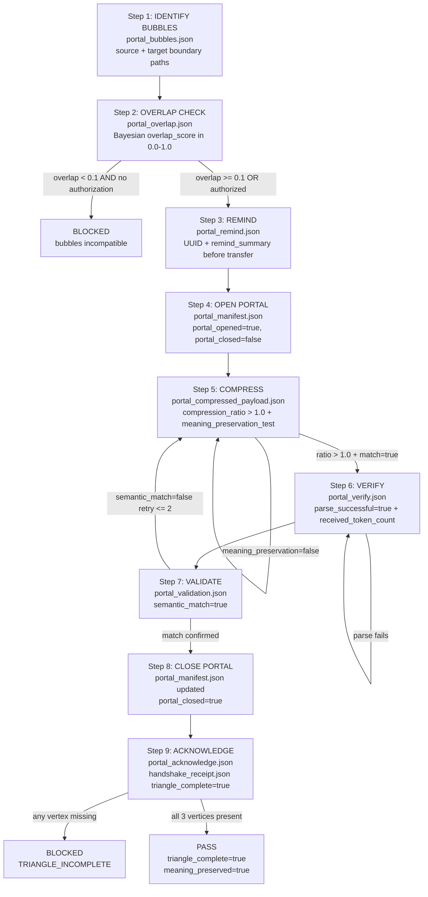

# Recipe: Portal Traversal (Safe Cross-Bubble Communication)

## Purpose

Provide a deterministic, auditable protocol for transferring context between isolated knowledge bubbles. Bubbles exist to maintain separation of concerns — projects, modules, agents, and contexts should not bleed into each other without explicit, verified, and triangulated handshakes. This recipe encodes the full portal lifecycle with meaning preservation proof and triangle law verification.

## When to Use

- When sharing context between two separate projects (e.g., stillwater → solace-cli)
- When an agent in one domain needs context from another domain's boundary spec
- When a swarm needs to pass verified, compressed context to a sub-agent in a different module
- When testing whether two projects have sufficient conceptual overlap to collaborate

## Triangle Law (REMIND-VERIFY-ACKNOWLEDGE)

Every portal transfer must complete all three vertices of the triangle:

| Vertex | When | What |
|--------|------|------|
| REMIND | Before transfer | "Here is what I am about to send you" |
| VERIFY | After receipt | "I confirm I received and can parse this" |
| ACKNOWLEDGE | After validation | "I confirm the meaning was preserved" |

A transfer that skips any vertex is not a verified transfer — it is a hope.

## Overlap Score Interpretation

| Score | Meaning | Action |
|-------|---------|--------|
| 0.0 | No shared concepts | BLOCKED unless explicitly authorized |
| 0.1–0.3 | Low overlap | Proceed with caution; narrow portal |
| 0.3–0.7 | Medium overlap | Standard portal; full recipe |
| 0.7–1.0 | High overlap | Consider whether bubbles should be merged |
| 1.0 | Identical | Transfer unnecessary; bubbles are the same |

## Rung Target: 274177

This recipe targets rung 274177 (stability) because cross-bubble transfers involve:
- Multiple files being modified or read across project boundaries
- Meaning preservation that must be verified, not just assumed
- Triangle law completeness that must be auditable on replay

A rung 641 (local correctness) is insufficient for portal traversal — you need stability evidence that the transfer is reproducible and meaning-preserving.

## Output Artifacts

- `scratch/portal_bubbles.json` — bubble identification
- `scratch/portal_overlap.json` — Bayesian overlap computation
- `scratch/portal_remind.json` — REMIND vertex
- `scratch/portal_manifest.json` — portal lifecycle (open → closed)
- `scratch/portal_compressed_payload.json` — prime-compressed transfer payload
- `scratch/portal_compression_audit.json` — compression ratio and meaning test
- `scratch/portal_verify.json` — VERIFY vertex
- `scratch/portal_validation.json` — end-to-end meaning preservation
- `scratch/portal_acknowledge.json` — ACKNOWLEDGE vertex
- `scratch/handshake_receipt.json` — final triangle verification receipt

---

## Portal Lifecycle Flow (Mermaid Diagram)



---

## FSM: Portal Traversal State Machine

```
States: IDENTIFY_BUBBLES | OVERLAP_CHECK | REMIND | OPEN_PORTAL |
        COMPRESS | VERIFY | VALIDATE | CLOSE_PORTAL | ACKNOWLEDGE |
        PASS | BLOCKED | NEED_INFO

Transitions:
  [*] → IDENTIFY_BUBBLES: CNF capsule with SOURCE_BUBBLE + TARGET_BUBBLE provided
  IDENTIFY_BUBBLES → NEED_INFO: either bubble undefined or boundary file missing
  IDENTIFY_BUBBLES → OVERLAP_CHECK: both boundary paths exist and readable
  OVERLAP_CHECK → BLOCKED: overlap_score < 0.1 AND no explicit authorization
  OVERLAP_CHECK → REMIND: transfer_authorized = true
  REMIND → OPEN_PORTAL: portal_remind.json with UUID + non-empty remind_summary
  OPEN_PORTAL → COMPRESS: portal_manifest.json with portal_opened=true
  COMPRESS → COMPRESS (RETRY 1): meaning_preservation_test.match = false (try different prime words)
  COMPRESS → VERIFY: compression_ratio > 1.0 AND meaning_preservation = true
  VERIFY → BLOCKED: parse fails after re-send of uncompressed payload
  VERIFY → VALIDATE: parse_successful = true
  VALIDATE → COMPRESS (RETRY): semantic_match = false, retry <= 2
  VALIDATE → BLOCKED: semantic_match = false after 3 failures
  VALIDATE → CLOSE_PORTAL: semantic_match = true
  CLOSE_PORTAL → ACKNOWLEDGE: portal_closed = true in manifest
  ACKNOWLEDGE → BLOCKED: any triangle vertex missing (TRIANGLE_INCOMPLETE)
  ACKNOWLEDGE → PASS: handshake_receipt.json triangle_complete = true, meaning_preserved = true

Exit conditions:
  PASS: portal_opened=true, portal_closed=true, triangle_complete=true, meaning_preserved=true
  BLOCKED: Bayesian overlap failure, parse failure, semantic mismatch after 3 retries, or triangle incomplete
  NEED_INFO: bubble boundary files missing
```

---

## GLOW Scoring

| Dimension | Contribution | Points |
|-----------|-------------|--------|
| **G** (Growth) | Source bubble agent's boundary understanding deepens through overlap computation; prime word coverage increases when new words compress reliably | +7 per traversal where compression_ratio > 2.0 |
| **L** (Love/Quality) | All three triangle vertices present; meaning preserved end-to-end; no secrets transmitted in payload | +7 when handshake_receipt.json triangle_complete=true AND meaning_preserved=true |
| **O** (Output) | portal_manifest.json with both portal_opened and portal_closed; handshake_receipt.json committed | +7 per successful traversal |
| **W** (Wisdom) | Northstar metric (recipe_hit_rate) advances when cross-project knowledge is transferred and applied; Bayesian overlap score informs future portal routing | +7 when transferred knowledge is reused in target bubble |

**Northstar Metric:** `recipe_hit_rate` — portal traversal transfers compressed knowledge between projects. When the target bubble reuses a recipe learned via portal transfer, that replay counts toward hit rate.

---

## Three Pillars of Software 5.0 Kung Fu

| Pillar | How This Recipe Applies It |
|--------|--------------------------|
| **LEK** (Self-Improvement) | Each portal traversal deepens the source bubble agent's understanding of its own boundary — computing Bayesian overlap forces explicit enumeration of shared concepts, and meaning preservation failures in step 7 reveal which prime words do not compress reliably across this bubble pair |
| **LEAK** (Cross-Agent Trade) | Enables asymmetric knowledge exchange between bubble agents: the source agent compresses its expertise into prime words, the target agent receives and validates that the meaning survived the compression — this is the protocol for knowledge transfer without context bleeding |
| **LEC** (Emergent Conventions) | Standardizes the REMIND-VERIFY-ACKNOWLEDGE triangle as the universal handshake convention for all cross-bubble communication: any transfer that skips a vertex is explicitly a forbidden state (TRIANGLE_INCOMPLETE), making incomplete transfers detectable by any agent that checks the handshake_receipt.json |

**Belt Level:** Blue — demonstrates mastery of cross-project context management: maintaining bubble isolation, compressing knowledge for safe transfer, and proving via the triangle that meaning was preserved end-to-end.

**GLOW Score:** +7 per successful portal traversal with triangle_complete=true, meaning_preserved=true, compression_ratio > 1.0, and portal_closed=true in the manifest — all four conditions must hold.
