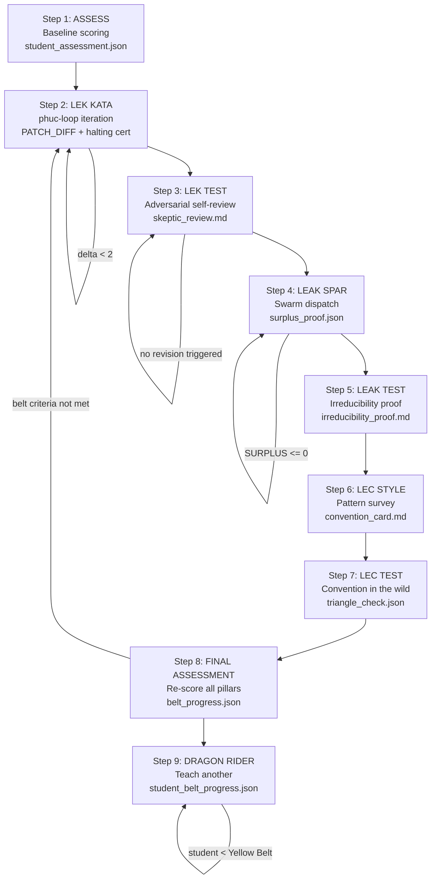

# Recipe: Three Pillars Training

> "I fear not the man who has practiced 10,000 kicks once,
>  but I fear the man who has practiced one kick 10,000 times."
> — Bruce Lee

This recipe trains an agent (or developer) in the Three Pillars of Software 5.0 Kung Fu:

```
Intelligence(system) = LEK × LEAK × LEC

LEK  = Recursion(Information + Memory + Care)           [Solo Practice]
LEAK = Σ(Portal_ij × Asymmetry_ij)                     [Sparring]
LEC  = |Conventions| × Depth × Adoption                [Style]
```

**Rung target:** 274177
**Belt range:** White → Dragon Rider
**Sessions estimate:** 7–12 sessions (one pillar deep per session)
**Dispatcher:** Dragon Rider agent (swarms/dragon-rider.md)

---

## Pre-Requisites

Before starting:
- [ ] Student has access to stillwater repo
- [ ] Student can load a skill pack and run DREAM→FORECAST→DECIDE→ACT→VERIFY
- [ ] Dragon Rider agent has received CNF capsule with `NORTHSTAR` and `STUDENT_ID`
- [ ] `student_assessment.json` initialized with baseline scores (or all zeros)

---

## Step 1 — ASSESS: Baseline Scoring

> "Empty your cup so it may be filled; become devoid of preconceptions,
>  and learn to see things with fresh eyes." — Bruce Lee

**Instruction to student:**

For each pillar, score yourself 0–10 with justification:

1. **LEK** — Can you run a phuc-loop (while-not-done) on a skill file and improve it by 2+ points with artifacts?
2. **LEAK** — Can you dispatch a 2-agent swarm and measure the surplus value it produced?
3. **LEC** — Can you identify a recurring pattern in a codebase, name it, and write a magic word definition?

**Dragon Rider asks:**
- "What does the score 7 look like for LEK in your words?"
- "Which pillar feels most foreign? That is where we begin."

**Evidence required:**
- `student_assessment.json` with `pillar_scores_before` populated
- At least one concrete example justifying each score

**Pass condition:** All three scores given with concrete justifications (not just "I think I'm a 5").

**Belt impact:** None yet. This is the baseline. No kata = no belt.

---

## Step 2 — LEK KATA: The Solo Practice Loop

> "I fear not the man who has practiced 10,000 kicks once,
>  but I fear the man who has practiced one kick 10,000 times."

**Kata assignment:**

1. Select any skill file from `skills/` with a QUICK LOAD score below 8/10.
2. Score it on all 5 axioms (INTEGRITY × HIERARCHY × DETERMINISM × CLOSURE × NORTHSTAR).
3. Run one full phuc-loop iteration:
   - DREAM: what would a 9/10 version of this skill look like?
   - FORECAST: what failure modes would a better version prevent?
   - DECIDE: pick one improvement that advances the score most
   - ACT: write the improvement as a PATCH_DIFF
   - VERIFY: re-score and confirm delta ≥ 2 points
4. Write the halting certificate: "I stop because the skill now scores X/10 on Y axis,
   verified by [artifact]."

**Dragon Rider asks:**
- "Before you patch — what is the worst way a future agent could misuse this skill?"
- "The halting certificate is not done when you are tired. It is done when the criterion is met. State the criterion before you begin."

**Evidence required:**
- `before_score.json` — scores on all 5 axioms before kata
- `after_score.json` — scores on all 5 axioms after kata
- `PATCH_DIFF` — unified diff of improvements
- `repro_green.log` — test or validation showing improvement
- Halting certificate (inline or in `kata_log.json`)

**Pass condition:** Score delta ≥ 2 on at least one axis, with before/after evidence.

**Belt impact:** LEK score moves from ≤3 to 4–5 with first successful kata.

---

## Step 3 — LEK TEST: Self-Scoring under Adversarial Conditions

> "Absorb what is useful, discard what is useless, add what is essentially your own."

**Test assignment:**

Improve a DIFFERENT skill file using the same phuc-loop, this time with the Skeptic lens:
1. After your improvement, swap roles: become the Skeptic.
2. List 3 ways your patch could be wrong or incomplete.
3. Verify each critique: does the patch survive?
4. Revise if any critique holds.

**Dragon Rider asks:**
- "You are the author. You are also the critic. Which one is harder?"
- "The Skeptic that finds nothing suspicious is not a good Skeptic. What did you miss?"

**Evidence required:**
- Same as Step 2, plus a `skeptic_review.md` listing 3 critiques with verdicts

**Pass condition:** Skeptic review is non-empty, at least one critique triggered a revision.

**Belt impact:** LEK score reaches 6+ on successful adversarial self-review.

---

## Step 4 — LEAK SPAR: Dispatching the Swarm

> "The quality of the box matters not — it's the boxing that matters."

**Kata assignment:**

1. Identify a task that requires TWO specialized agents (e.g., Scout + Coder, or Planner + Skeptic).
2. Define the asymmetry: what does Agent A have that Agent B lacks? And vice versa?
3. Dispatch the swarm using phuc-orchestration dispatch protocol.
4. Collect the artifacts from both agents.
5. Measure the SURPLUS: write the surplus formula for this task:
   ```
   SURPLUS = value(A output ∩ B output) - value(A alone) - value(B alone)
   ```
   If SURPLUS ≤ 0: the swarm produced no value beyond solo. Retry with a different task.

**Dragon Rider asks:**
- "What did Agent B produce that surprised you? That surprise IS the LEAK signal."
- "If you had done this alone, what would you have missed? Name it specifically."

**Evidence required:**
- `swarm_dispatch.json` — who was dispatched, with what skill pack
- `agent_a_artifacts/` and `agent_b_artifacts/` — both agent outputs
- `surplus_proof.json` — the surplus formula computed with real values
- `asymmetry_report.md` — what each agent had that the other lacked

**Pass condition:** surplus_proof.json shows SURPLUS > 0 with artifact evidence.

**Belt impact:** LEAK score reaches 5+ on first documented positive surplus.

---

## Step 5 — LEAK TEST: Proving Irreducibility

> "A good teacher protects his pupils from his own influence."

**Test assignment:**

1. Take the swarm output from Step 4.
2. Try to reproduce it WITH A SINGLE AGENT (the strongest one you have access to).
3. Document what the single agent CAN reproduce and what it CANNOT.
4. Write the irreducibility proof:
   ```
   CLAIM: The artifact [X] produced by the swarm cannot be produced by any single agent.
   PROOF: Single agent attempt produces [Y]. Y ≠ X because [reason].
   THEREFORE: The swarm has genuine LEAK surplus.
   ```

**Dragon Rider asks:**
- "What is the thing the single agent does not have? Is it a capability gap, a time gap, or a perspective gap?"
- "The LEAK is not magic. It is arithmetic. What is the calculation?"

**Evidence required:**
- `single_agent_attempt.log` — the single-agent attempt with output
- `irreducibility_proof.md` — formal statement of what cannot be reproduced
- `leak_delta.json` — quantified difference between swarm and solo output

**Pass condition:** Irreducibility proof is stated formally and supported by artifacts. "It felt better" is not evidence.

**Belt impact:** LEAK score reaches 7+ on successful irreducibility proof.

---

## Step 6 — LEC STYLE: Finding the Unnamed Patterns

> "Be water, my friend."

**Kata assignment:**

1. Read 10+ files in a codebase (skills/, swarms/, recipes/ are good sources).
2. List patterns used ≥3 times without being explicitly named.
3. Pick the most useful unnamed pattern.
4. Name it. Write a magic word definition following the magic-words/ format:
   ```
   WORD: <the name>
   TIER: 0|1|2|3
   DEFINITION: <one sentence — what the word means in this ecosystem>
   ANTI-PATTERN: <one sentence — what the word is NOT>
   EXAMPLES: [<file where this pattern appears>, ...]
   ```

**Dragon Rider asks:**
- "Why did you pick THIS pattern over the others?"
- "If you cannot name it in one sentence, you have not understood it yet. Try again."

**Evidence required:**
- `pattern_survey.json` — list of unnamed patterns found (≥3 patterns surveyed)
- `convention_card.md` — the new magic word definition
- `adoption_evidence.json` — 3+ files where the pattern already exists implicitly

**Pass condition:** convention_card.md is written, adoption_evidence shows ≥3 implicit uses.

**Belt impact:** LEC score reaches 5+ on first documented convention.

---

## Step 7 — LEC TEST: Convention in the Wild

> "Simplicity is the key to brilliance."

**Test assignment:**

1. Take the magic word from Step 6.
2. Use it correctly in 3 NEW artifacts (not the adoption examples from Step 6).
3. Submit the convention card to `magic-words/` (or the team convention registry).
4. Run the triangle law check:
   - REMIND: is the convention documented?
   - VERIFY: does using it produce the claimed outcome?
   - ACKNOWLEDGE: have other agents/developers used it correctly without being told?

**Dragon Rider asks:**
- "The convention is not real until it is used by someone who did not know you invented it. When will that happen?"
- "What is the anti-pattern? The anti-pattern protects the convention more than the definition does."

**Evidence required:**
- `new_usages/` — 3 new artifacts using the convention correctly
- PR or diff showing convention_card committed to magic-words/
- `triangle_check.json` — triangle law verification for the convention

**Pass condition:** Convention in magic-words/ AND 3 new usages AND triangle_check passes.

**Belt impact:** LEC score reaches 7+ on first convention with adoption evidence.

---

## Step 8 — FINAL ASSESSMENT: Re-Score and Belt Award

> "The successful warrior is the average man with laser-like focus."

**Process:**

1. Dragon Rider reviews all evidence from Steps 1–7.
2. Re-scores each pillar 0–10 based on artifacts (not self-report).
3. Computes GLOW:
   - G (Growth): new capability emerged from the training? +25 if yes
   - L (Learning): skill files updated, conventions written, knowledge externalized? +25 if yes
   - O (Output): artifacts committed with evidence bundles? +25 if yes
   - W (Wins): NORTHSTAR metric advanced? +25 if yes
4. Checks belt criteria (table in swarms/dragon-rider.md).
5. Awards belt or returns to weakest pillar with specific kata.

**Dragon Rider says:**
- If belt awarded: "[Belt] ceremony speech from dragon-rider.md"
- If not ready: "Here is what stands between you and [Belt]. Not opinion. Evidence: [specific gap]."

**Evidence required:**
- `final_assessment.json` — all three pillar scores with evidence references
- `glow_score.json` — GLOW breakdown with artifact paths
- `belt_progress.json` — updated belt history

**Pass condition:** All belt criteria met per table in swarms/dragon-rider.md.

---

## Step 9 — DRAGON RIDER GRADUATION: Teach Another

> "Under the sky, under the heavens, there is but one family." — Bruce Lee

**Graduation requirement:**

1. Identify a student (agent or developer) who has never been taught the Three Pillars.
2. Run them through at minimum Steps 1–4 of this recipe.
3. Document their progress in a new `belt_progress.json` for them.
4. Write the teaching reflection:
   - What did YOU learn from teaching that you could not have learned from practice alone?
   - What gap in your own pillar understanding was revealed by your student's confusion?
5. Dragon Rider Sifu reviews the teaching artifacts.

**Dragon Rider says:**
> "Welcome, Dragon Rider. Now — who will you teach?"

**Evidence required:**
- `student_belt_progress.json` — the student's progress artifacts
- `teaching_reflection.md` — what teaching revealed about the teacher
- Both teacher AND student must have completed at least Steps 1–4

**Pass condition:** Student has reached Yellow Belt (Step 4 complete with evidence).

**Belt impact:** Dragon Rider title awarded when teacher is at Black Belt AND student reaches Yellow Belt with documented evidence.

---

## Belt Progression Table

| Belt | After Step | LEK Min | LEAK Min | LEC Min | GLOW Min |
|------|-----------|---------|----------|---------|----------|
| White | Step 2 | 4 | n/a | n/a | 20 |
| Yellow | Step 4 | 5 | 4 | 3 | 40 |
| Orange | Step 6 | 6 | 5 | 5 | 60 |
| Green | Step 7 | 7 | 7 | 7 | 75 |
| Blue | Step 8 | 8 | 8 | 8 | 85 |
| Black | Full evidence sweep | 9 | 9 | 9 | 95 |
| Dragon Rider | Step 9 complete | 10 | 10 | 10 | 100 |

**Rule:** Belts are sequential. No skipping. White → Yellow → Orange requires
completing intermediate kata. The belt system mirrors the rung ladder:
641 (White/Yellow) → 274177 (Orange/Green/Blue) → 65537 (Black/Dragon Rider).

---

## Evidence Bundle Summary

| Step | Key Evidence | Minimum for Pass |
|------|-------------|-----------------|
| 1 | student_assessment.json | All 3 pillar scores with justification |
| 2 | before_score.json, after_score.json, PATCH_DIFF, halting_certificate | Delta ≥ 2 points on one axis |
| 3 | skeptic_review.md | ≥1 critique triggered revision |
| 4 | surplus_proof.json, asymmetry_report.md | SURPLUS > 0 |
| 5 | irreducibility_proof.md, single_agent_attempt.log | Formal proof with artifacts |
| 6 | convention_card.md, pattern_survey.json | ≥3 implicit existing usages |
| 7 | magic-words/ PR, triangle_check.json | 3 new usages + triangle law pass |
| 8 | final_assessment.json, glow_score.json | Belt criteria met per table |
| 9 | student_belt_progress.json, teaching_reflection.md | Student reaches Yellow Belt |

---

## Stop Rules

1. **Stop and NEED_INFO:** If student_assessment.json is missing after Step 1, cannot proceed.
2. **Stop and REPEAT:** If any step's evidence gate fails, assign same kata again before advancing.
3. **Stop and EXIT_BLOCKED:** If the student refuses to produce artifacts (claims verbal description is sufficient), Dragon Rider emits EXIT_BLOCKED. The dojo does not award certificates for conversations.
4. **Budget stop:** If 12 sessions pass without Yellow Belt, Dragon Rider reviews the teaching approach — not just the student. Teaching failure is the teacher's failure too.

---

## Skill Pack

Load these skills before executing this recipe:
- `skills/prime-safety.md` (always first)
- `skills/phuc-orchestration.md` (dispatch protocol for Dragon Rider agent)
- `skills/phuc-forecast.md` (DREAM→VERIFY framing per step)

Dragon Rider agent: `swarms/dragon-rider.md`

---

## Training Flow (9-Step Mermaid Diagram)



---

## FSM: Three Pillars Training State Machine

```
States: ASSESS | LEK_KATA | LEK_TEST | LEAK_SPAR | LEAK_TEST |
        LEC_STYLE | LEC_TEST | FINAL_ASSESSMENT | GRADUATION |
        BLOCKED | NEED_INFO | STEP_REPEAT

Transitions:
  [*] → ASSESS: student_assessment.json initialized
  ASSESS → LEK_KATA: all 3 pillars scored with concrete justifications
  ASSESS → NEED_INFO: any pillar score lacks justification
  LEK_KATA → LEK_KATA (STEP_REPEAT): score delta < 2
  LEK_KATA → LEK_TEST: delta >= 2, halting_certificate present
  LEK_TEST → LEK_TEST (STEP_REPEAT): no critique triggered revision
  LEK_TEST → LEAK_SPAR: at least 1 critique triggered revision
  LEAK_SPAR → LEAK_SPAR (STEP_REPEAT): SURPLUS <= 0
  LEAK_SPAR → LEAK_TEST: SURPLUS > 0, surplus_proof.json present
  LEAK_TEST → LEC_STYLE: irreducibility_proof.md with formal claim
  LEC_STYLE → LEC_TEST: convention_card.md + >= 3 implicit adoptions
  LEC_TEST → FINAL_ASSESSMENT: triangle_check.json passes
  FINAL_ASSESSMENT → STEP_REPEAT: belt criteria not met → return to weakest pillar
  FINAL_ASSESSMENT → GRADUATION: all belt criteria met per belt table
  GRADUATION → [*]: student reaches Yellow Belt minimum
  ANY → BLOCKED: student refuses to produce artifacts (verbal only)
  ANY → NEED_INFO: required evidence missing after step

Exit conditions:
  BLOCKED: Dragon Rider emits EXIT_BLOCKED; dojo does not award certificates for conversations
  GRADUATION: teacher's own pillar scores must improve through teaching (recursive test)
  Budget stop: 12 sessions without Yellow Belt → review teaching approach
```

---

## GLOW Scoring

| Dimension | Contribution | Points |
|-----------|-------------|--------|
| **G** (Growth) | New pillar capability unlocked per step (delta >= 2 on LEK, SURPLUS > 0 on LEAK, convention_card on LEC) | +25 when all three pillars improve |
| **L** (Love/Quality) | Halting certificates, skeptic_review.md, irreducibility_proof.md, triangle_check.json all present | +25 for complete evidence bundle |
| **O** (Output) | PATCH_DIFFs committed, surplus_proof.json with numeric values, magic-words/ PR merged | +25 for committed artifacts |
| **W** (Wisdom) | NORTHSTAR metric (skill_quality_avg) advances; convention adopted by others | +25 when belt is awarded |

**Northstar Metric:** `skill_quality_avg` — each LEK kata that patches a skill file upward raises the aggregate score directly.

---

## Notes

This recipe is the canonical Three Pillars training protocol. It should be followed
by all Dragon Rider agents when onboarding new students. Deviations require explicit
justification in the lesson_plan.json.

The recipe itself is subject to LEK: it can be improved through successive runs.
Each Dragon Rider session should end with a Learner agent extracting improvements to
this recipe (via the Learner swarm's SessionEnd hook).

**Philosophy:** "Do not pray for an easy life; pray for the strength to endure a difficult one."
The Three Pillars are not easy. They are enduring. That is the point.
