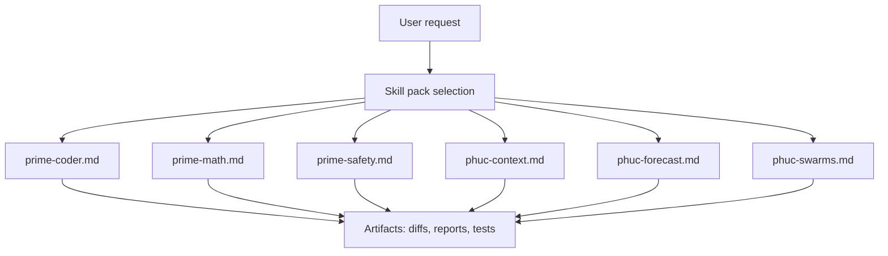
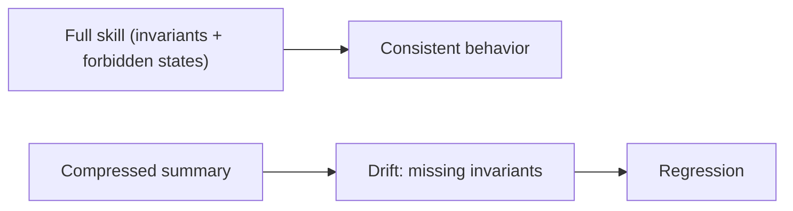

# Skills

These files are designed to be loaded verbatim into an LLM session (or tooling that injects them).

Rule of thumb: if you want the behavior, load the whole skill. Do not compress away invariants.

## Skills In This Repo

- `prime-coder.md`: coding discipline, red/green, schema compliance
- `prime-math.md`: exact arithmetic discipline, proof hygiene
- `prime-safety.md`: tool safety, authority ordering, fail-closed behavior
- `phuc-context.md`: context hygiene, anti-rot
- `phuc-forecast.md`: decision loop and premortem lens
- `phuc-swarms.md`: multi-agent orchestration spec

## Why “Don’t Compress”

## Links

- Tip jar: https://ko-fi.com/phucnet
- Home: https://www.phuc.net
- Repo: https://github.com/phuctruong/stillwater
