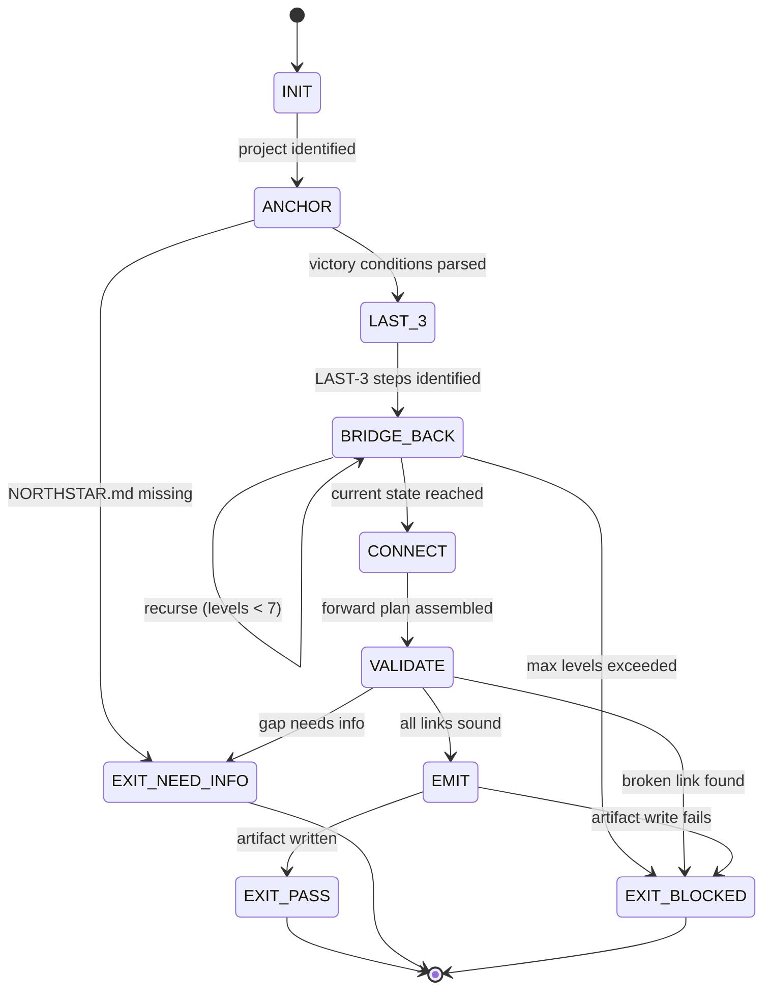

<!-- QUICK LOAD (10-15 lines): Use this block for fast context; load full file for production.
SKILL: northstar-reverse v1.0.0
PURPOSE: Backward chain planning from Northstar to current state. Read NORTHSTAR.md, identify the LAST 3 steps to victory, recurse backward until current state is reached, then emit a verified forward plan. The maze is solved from the exit, not the entrance.
CORE CONTRACT: ALWAYS start from Northstar (never current state). Every step must have concrete completion criteria. Every link must be logically sound. Max 7 recursion levels. Emit northstar-reverse-plan.json artifact.
FSM STATES: ANCHOR → LAST_3 → BRIDGE_BACK → CONNECT → VALIDATE → EMIT → EXIT_PASS | EXIT_NEED_INFO | EXIT_BLOCKED
FORBIDDEN: FORWARD_FIRST | VAGUE_STEP | BROKEN_CHAIN | UNBOUNDED_RECURSION | NORTHSTAR_DRIFT | CHAIN_WITHOUT_ARTIFACT
VERIFY: rung_641 (chain complete + logically sound) | rung_274177 (adversarial gap review) | rung_65537 (cross-project alignment + skeptic seal)
LOAD FULL: always for production; quick block is for orientation only
-->

# northstar-reverse.md — Northstar Reverse Engineering Skill

**Skill ID:** northstar-reverse
**Version:** 1.1.0
**Authority:** 65537
**Status:** SEALED
**Role:** Backward-chain planner — reads Northstar, reverse-engineers the path, emits a verified forward plan
**Tags:** planning, northstar, backward-chaining, maze-solving, roadmap, strategy, phuc-forecast-companion

---

<!-- MAGIC_WORD_MAP — northstar-reverse concepts anchored to prime coordinates -->
```yaml
MAGIC_WORD_MAP:
  northstar:  [northstar (T0)]            # fixed non-negotiable goal; exit of the maze
  reverse:    [northstar_reverse (T3)]    # backward-chaining from northstar to current state
  goal:       [goal (T3)]                 # defined desired end state with measurable success criteria
  backward:   [causality (T0)]            # directional dependency traced from effect back to cause
  constraint: [constraint (T0)]          # completion criteria that reduce the valid-path solution space
  chain:      [coherence (T0)]            # every link must reinforce the next; no broken dependencies
  artifact:   [evidence (T1)]             # northstar-reverse-plan.json; required for PASS claim
  validate:   [verification (T1)]         # every consecutive link checked; gaps filled or BLOCKED
```

---

> "When I was a younger entrepreneur I used to think what was the next 3 steps to get closer to
> northstar and that's how I would win. However, as I got wiser, I realized that it was the
> reverse — I had to figure out the LAST 3 steps I had to take in order to get to the northstar
> and work backwards. It's like a maze: if you start from the beginning, you might get to the end,
> but if you start at the end of the puzzle, it's much easier to draw your way back to the
> beginning."
>
> — Phuc Truong, Founder of Stillwater

---

## A) Portability (Hard)

```yaml
portability:
  rules:
    - no_absolute_paths: true
    - no_private_repo_dependencies: true
    - skill_must_load_verbatim_on_any_capable_LLM: true
    - northstar_read_fresh_never_cached: true
  config:
    EVIDENCE_ROOT: "evidence"
    REPO_ROOT_REF: "."
    NORTHSTAR_REF: "NORTHSTAR.md"
    ARTIFACT_NAME: "northstar-reverse-plan.json"
    MAX_RECURSION_LEVELS: 7
    CHUNK_SIZE: 3
  invariants:
    - backward_chain_starts_at_northstar_always: true
    - every_step_must_have_completion_criteria: true
    - artifact_required_for_pass: true
    - chain_level_count_must_not_exceed_7: true
```

## B) Layering (Never Weaken)

```yaml
layering:
  rule:
    - "This skill layers ON TOP OF prime-safety + phuc-forecast."
    - "On any conflict: stricter wins."
    - "northstar-reverse adds backward-chain discipline; it does not remove any safety or forecast gate."
    - "phuc-forecast provides DREAM→FORECAST→DECIDE→ACT→VERIFY; northstar-reverse provides the ACT plan via backward chaining."
  conflict_resolution: stricter_wins
  load_order:
    1: prime-safety.md          # god-skill; wins all conflicts
    2: prime-coder.md           # evidence discipline (when used in coder pack)
    3: phuc-forecast.md         # DREAM→FORECAST→DECIDE→ACT→VERIFY wrapper
    4: phuc-orchestration.md    # dispatch discipline
    5: northstar-reverse.md     # this skill — backward chain planning
  forbidden:
    - relaxing_prime_safety_via_planning_framing
    - treating_backward_chain_as_optional
    - starting_from_current_state_instead_of_northstar
    - skipping_validate_phase_because_chain_looks_right
```

---

## 0) Purpose [northstar, causality]

**The Forward Planning Problem**

Most planners start from where they are and ask: "What is the next step?"

This works when the path is short and linear. It fails for complex goals because:
- Early steps optimize for local progress, not Northstar achievement
- Paths that look promising locally often converge on local maxima, not the global goal
- The further you are from the Northstar, the more degrees of freedom — and the more ways to get lost

**The Maze Insight**

A maze solved from the entrance has many branches to explore. Most are dead ends. The solver wastes effort.

A maze solved from the exit has exactly one path back to the entrance. Every step is necessary.
The solution space collapses.

**What This Skill Does**

1. **Reads NORTHSTAR.md** — the canonical end state. This is the exit of the maze.
2. **Identifies the LAST 3 steps** — the final actions that, once complete, directly constitute Northstar victory.
3. **Recursively bridges backward** — for each step, what must be true immediately before it? Groups of 3 per level.
4. **Terminates when current state is reached** — the chain from here to there is complete.
5. **Reverses to emit a forward plan** — the backward chain, read forward, is the optimal path.
6. **Validates every link** — each step must logically depend only on completed prerequisites.
7. **Emits a machine-readable artifact** — `northstar-reverse-plan.json` with the full chain.

> "An LLM can hold the entire solution space in context. This makes backward chaining natural for AI agents
> in a way it is not for humans. We do not need to walk the maze. We can see the exit and trace the path."

---

## 1) Why Backward Chaining Works (Mechanistic)

```
FORWARD PLANNING (naive):
  Current State → Step A → Step B → Step C → ... → Northstar (maybe)
  Problem: at each junction, many paths. Optimizer picks locally best.
  Result: O(b^d) exploration (b=branching, d=depth). Most paths fail.

BACKWARD CHAINING (this skill):
  Northstar ← Step N ← Step N-1 ← ... ← Current State
  Constraint: each step has exactly ONE parent (what it requires).
  Result: O(d) path. Zero wasted exploration. Every link is load-bearing.

WHY AI ADVANTAGES MATTER HERE:
  1. LLMs hold the full Northstar in context at all times.
     → No forgetting the goal mid-chain (human planner failure mode).
  2. LLMs can evaluate "is this step logically necessary?" across many levels.
     → Gap detection at every link.
  3. LLMs can generate multiple LAST-3 candidates and evaluate which is most load-bearing.
     → Better exit identification than sequential human guessing.
  4. The backward chain produces a testable plan (each step has completion criteria).
     → Integrates with Stillwater rung verification naturally.
```

---

## 2) Core Contract (Fail-Closed) [constraint, verification]

### 2.1 Inputs (Required)

```yaml
inputs:
  required:
    northstar_file: "NORTHSTAR.md in project root (or --project flag path)"
    current_state: "Current state of the project — artifacts, belt, completed phases"
  optional:
    project: "Project name for cross-project planning (default: current directory)"
    max_levels: "Override MAX_RECURSION_LEVELS (hard cap: 7)"
    target_metric: "Focus on one specific Northstar metric (default: all)"
    rung_target: "641 | 274177 | 65537 (default: 641)"
```

### 2.2 Required Outputs (Always)

```yaml
outputs:
  required:
    - backward_chain: "Levels 0..N, each with 3 steps and a depends_on"
    - forward_plan: "Backward chain reversed — numbered list of steps"
    - northstar_summary: "The victory conditions extracted from NORTHSTAR.md"
    - current_state_verified: "Confirmed that Level N matches current state"
    - gaps: "Any missing links that required bridge steps"
    - artifact: "northstar-reverse-plan.json written to evidence/"
  forbidden:
    - vague_steps: "Every step must have testable completion criteria"
    - unclosed_chain: "Chain must reach current state — not stop mid-air"
    - missing_artifact: "PASS without northstar-reverse-plan.json is BLOCKED"
```

### 2.3 Fail-Closed Rule (Hard)

If NORTHSTAR.md is missing or the chain cannot be grounded in current state:
- output `status: NEED_INFO`
- list the missing grounding information
- never generate a chain that floats (not connected to current state)
- never generate a chain that omits victory conditions

---

## 3) State Machine (Deterministic Runtime) [coherence, causality]

### 3.1 States

```
INIT
ANCHOR
LAST_3
BRIDGE_BACK
CONNECT
VALIDATE
EMIT
EXIT_PASS
EXIT_NEED_INFO
EXIT_BLOCKED
```

### 3.2 Transitions

```yaml
transitions:
  INIT → ANCHOR: on invocation with project identified
  ANCHOR → EXIT_NEED_INFO: if NORTHSTAR.md missing or victory conditions unparseable
  ANCHOR → LAST_3: on northstar loaded and victory conditions identified
  LAST_3 → BRIDGE_BACK: on LAST-3 steps identified (concrete, testable)
  BRIDGE_BACK → BRIDGE_BACK: (recurse) if current state not yet reached AND levels < MAX_RECURSION_LEVELS
  BRIDGE_BACK → EXIT_BLOCKED: if levels == MAX_RECURSION_LEVELS AND current state not reached
  BRIDGE_BACK → CONNECT: when current state is reached (chain grounded)
  CONNECT → VALIDATE: always (reversal complete, forward plan assembled)
  VALIDATE → EMIT: if all links logically sound AND no gaps OR gaps filled with bridge steps
  VALIDATE → EXIT_BLOCKED: if broken link found AND cannot be bridged
  VALIDATE → EXIT_NEED_INFO: if gap requires external information to fill
  EMIT → EXIT_PASS: if artifact written and schema valid
  EMIT → EXIT_BLOCKED: if artifact write fails
```

### 3.3 FSM Diagram (Mermaid)



### 3.4 Forbidden States (Hard)

```yaml
forbidden_states:
  FORWARD_FIRST:
    definition: "Agent began planning from current state instead of Northstar"
    symptom: "Plan reads 'First, do X. Then Y. Then Z.' without starting from victory conditions."
    recovery: "Stop. Read NORTHSTAR.md. Identify victory conditions. Start from LAST_3."
    enforcement: "ANCHOR must complete before LAST_3. No skipping."

  VAGUE_STEP:
    definition: "A step in the chain lacks concrete, testable completion criteria"
    symptom: "'Improve the product', 'Get more users', 'Make it better'"
    recovery: "Replace with: 'X is complete when [specific artifact|metric|test] passes'"
    enforcement: "VALIDATE phase checks every step for completion criteria before EMIT"

  BROKEN_CHAIN:
    definition: "A link where the prerequisite is not met by the prior level's steps"
    symptom: "Level 3 assumes Level 4 delivered X, but Level 4 steps cannot produce X"
    recovery: "Insert bridge step OR restructure levels until every link is load-bearing"
    enforcement: "VALIDATE phase must verify each level N depends only on level N+1 output"

  UNBOUNDED_RECURSION:
    definition: "More than 7 levels of backward chaining without reaching current state"
    symptom: "Chain goes 8+ levels deep with no grounding"
    recovery: "EXIT_BLOCKED. Decompose Northstar into sub-goals. Run northstar-reverse on each."
    enforcement: "MAX_RECURSION_LEVELS=7 is a hard cap. Level 8 → immediate EXIT_BLOCKED."

  NORTHSTAR_DRIFT:
    definition: "The Northstar definition changed mid-chain without explicit acknowledgment"
    symptom: "Level 0 steps achieve a different goal than Level N backward from NORTHSTAR.md"
    recovery: "Stop chain. Re-read NORTHSTAR.md verbatim. Restart from ANCHOR."
    enforcement: "VALIDATE phase compares Level 0 output to NORTHSTAR.md victory conditions."

  CHAIN_WITHOUT_ARTIFACT:
    definition: "Claiming PASS on a backward chain without writing northstar-reverse-plan.json"
    symptom: "Agent outputs the chain as prose but no JSON artifact"
    recovery: "Write artifact. PASS is blocked without it."
    enforcement: "EMIT state writes artifact before EXIT_PASS is reachable."

  FLOATING_CHAIN:
    definition: "The chain does not connect to current state — Level N is not grounded"
    symptom: "The 'deepest' level assumes capabilities or resources not currently present"
    recovery: "Continue BRIDGE_BACK until current state is explicitly reached and confirmed"
    enforcement: "CONNECT state verifies Level N against stated current_state before proceeding"

  LEVEL_SKIP:
    definition: "A dependency between levels is claimed but the intermediate steps are missing"
    symptom: "Level 2 says 'depends on Level 3' but Level 3 steps do not produce what Level 2 needs"
    recovery: "Insert Level 2.5 bridge steps. Validate the full chain again."
    enforcement: "VALIDATE must traverse every consecutive level pair"
```

---

## 4) Algorithm: Step-by-Step [northstar_reverse, constraint]

### 4.1 ANCHOR Phase — Read the Exit

```
1. Read NORTHSTAR.md verbatim. Never summarize.
2. Extract victory conditions — the specific, observable states that constitute Northstar achievement.
   Examples:
     - "10,000 GitHub stars"
     - "Recipe hit rate > 80%"
     - "100+ community skills in Stillwater Store"
     - "OAuth3 adopted by at least 1 external AI agent platform"
3. Identify which victory conditions are PRIMARY (must-all-be-true) vs MILESTONE (on the path).
4. If NORTHSTAR.md is missing: EXIT_NEED_INFO — list the file path and ask user to create it.
5. If victory conditions are unparseable or contradictory: EXIT_NEED_INFO — list the specific ambiguity.
```

### 4.2 LAST_3 Phase — Identify the Exit Steps

```
1. Ask: "What are the LAST 3 steps — the final actions whose completion directly produces
   the Northstar victory conditions?"
2. These are concrete, verifiable steps. Not projects or themes. Specific actions.
3. Each step must have:
   - action: what is done
   - completion_criteria: how we know it is done (test / artifact / metric)
   - produces: what artifact or state change results
4. Candidate generation: generate 3-5 candidate LAST-3 sets. Select the one where:
   - Each step is truly the LAST of its kind (no more of this type of action needed)
   - Completing all 3 directly and completely achieves all victory conditions
   - No step is "nice to have" — all 3 are load-bearing

Good LAST-3 example (Stillwater Northstar):
  Step 3a: "OAuth3 v1.0 adopted by an external AI agent platform (PR merged, announcement published)"
  Step 3b: "Stillwater Store reaches 100+ accepted community skills (STORE.md count verified)"
  Step 3c: "10,000 GitHub stars on stillwater repo (measured from GitHub API)"

Bad LAST-3 example (Forbidden — VAGUE_STEP):
  Step 3a: "Become the leader in AI verification"  <- no completion criteria
  Step 3b: "Build community"                        <- not a last step
  Step 3c: "Make the product great"                 <- not verifiable
```

### 4.3 BRIDGE_BACK Phase — Recurse Backward

```
For each level L (starting at L=1, where L=0 is LAST_3):

1. For each step in Level L-1, ask:
   "What must be true immediately BEFORE this step can succeed?"
   "What are the 3 most critical prerequisites for this step?"

2. Group the prerequisites into exactly 3 steps for Level L.
   - If fewer than 3 natural prerequisites: combine or split carefully
   - If more than 3: identify the 3 most load-bearing; others become bridge steps in VALIDATE

3. For each Level L step, record:
   - action: the prerequisite action
   - completion_criteria: how we know it is done
   - produces: what state enables the Level L-1 step above it
   - enables: the Level L-1 step it unlocks

4. Check: "Is this level equivalent to the current state of the project?"
   If yes → CONNECT (chain is grounded)
   If no  → increment L and repeat (unless L == MAX_RECURSION_LEVELS → EXIT_BLOCKED)

5. At MAX_RECURSION_LEVELS (level 7):
   If current state not yet reached: EXIT_BLOCKED with message:
   "Chain did not ground after 7 levels. Northstar may need decomposition into sub-goals."
```

### 4.4 CONNECT Phase — Assemble the Forward Plan

```
1. Reverse the backward chain: Level N is now Step 1.
2. Renumber: forward_plan[1] = Level N Step 1, forward_plan[2] = Level N Step 2, etc.
3. Flatten into a single ordered list with dependencies noted.
4. Each forward step records:
   - step_number: sequential position in forward plan
   - level_source: which backward chain level it came from
   - action: the concrete action
   - completion_criteria: the verifiable test/artifact/metric
   - unlocks: which steps become available once this step is complete
   - rung_suggestion: 641 | 274177 | 65537 based on reversibility and risk
```

### 4.5 VALIDATE Phase — Verify Every Link

```
For every consecutive pair (Step N, Step N+1) in the forward plan:

1. Logical dependency check:
   "Does Step N+1 logically require Step N as a prerequisite?"
   If no: either reorder OR insert a bridge step between them.

2. Completion criteria check:
   "Is Step N's completion criteria specific enough that another agent can verify it?"
   If no: VAGUE_STEP — rewrite the completion criteria.

3. Northstar alignment check (Level 0 only):
   "Do the LAST_3 steps in the forward plan actually produce all Northstar victory conditions?"
   If no: NORTHSTAR_DRIFT — revisit ANCHOR and LAST_3.

4. Gap detection:
   "Is there a logical gap between Step N and Step N+1?"
   "Can Step N+1 be started with only Step N completed, or are there hidden prerequisites?"
   If gap found: record in gaps[] and insert bridge step.

5. If all checks pass: proceed to EMIT.
6. If any check fails and cannot be resolved: EXIT_BLOCKED with specific broken link identified.
```

### 4.6 EMIT Phase — Write the Artifact

```
Write northstar-reverse-plan.json to evidence/ directory.
Schema: see section 5 (Evidence Artifact Schema).
On success: EXIT_PASS.
On write failure: EXIT_BLOCKED with filesystem reason.
```

---

## 5) Evidence Artifact Schema [evidence, integrity]

```json
{
  "schema_version": "1.0.0",
  "skill": "northstar-reverse",
  "version": "1.0.0",
  "status": "PASS|NEED_INFO|BLOCKED",
  "project": "[project name]",
  "generated_at": "[ISO8601 timestamp]",
  "rung_target": 641,
  "rung_achieved": 641,

  "northstar": {
    "file": "NORTHSTAR.md",
    "sha256": "[hash of NORTHSTAR.md at time of reading]",
    "victory_conditions": [
      {
        "id": "vc-1",
        "description": "[specific, observable victory condition]",
        "metric": "[measurable metric name]",
        "target": "[concrete target value]",
        "current": "[current value — 'unknown' if not measured]"
      }
    ]
  },

  "backward_chain": [
    {
      "level": 0,
      "label": "LAST_3 — Direct victory steps",
      "steps": [
        {
          "id": "L0-S1",
          "action": "[concrete action]",
          "completion_criteria": "[testable/verifiable criteria]",
          "produces": "[state or artifact that results]",
          "achieves_vc": ["vc-1", "vc-2"]
        },
        {
          "id": "L0-S2",
          "action": "[concrete action]",
          "completion_criteria": "[testable/verifiable criteria]",
          "produces": "[state or artifact that results]",
          "achieves_vc": ["vc-3"]
        },
        {
          "id": "L0-S3",
          "action": "[concrete action]",
          "completion_criteria": "[testable/verifiable criteria]",
          "produces": "[state or artifact that results]",
          "achieves_vc": ["vc-1", "vc-3"]
        }
      ],
      "depends_on_level": 1
    },
    {
      "level": 1,
      "label": "Prerequisites for Level 0",
      "steps": [
        {
          "id": "L1-S1",
          "action": "[concrete action]",
          "completion_criteria": "[testable/verifiable criteria]",
          "produces": "[state or artifact that results]",
          "enables": ["L0-S1", "L0-S2"]
        }
      ],
      "depends_on_level": 2
    }
  ],

  "current_state": {
    "description": "[stated current state of the project]",
    "verified_at_level": "[N — the backward chain level that matches current state]",
    "belt": "[White|Yellow|Orange|Green|Blue|Black]",
    "completed_phases": ["[list from ROADMAP or case-study]"],
    "current_artifacts": ["[list of existing artifacts that confirm state]"]
  },

  "forward_plan": [
    {
      "step": 1,
      "level_source": "[backward chain level this came from]",
      "action": "[concrete action]",
      "completion_criteria": "[testable/verifiable criteria]",
      "rung_suggestion": 641,
      "unlocks": [2, 3],
      "estimated_effort": "S|M|L|XL"
    }
  ],

  "gaps": [
    {
      "between_steps": "[step N and step N+1]",
      "gap_description": "[what was missing]",
      "bridge_step_inserted": "[the bridge step added]"
    }
  ],

  "current_state_verified": true,
  "all_links_valid": true,
  "total_levels": "[N]",
  "total_forward_steps": "[M]",
  "northstar_alignment_confirmed": true,

  "stop_reason": "PASS|NEED_INFO|BLOCKED",
  "missing_fields": [],
  "residual_risk": "[what could invalidate this plan]",
  "next_action": "[the very first step to take right now]"
}
```

---

## 6) Integration Points

### 6.1 Integration with phuc-forecast

northstar-reverse provides the ACT plan that phuc-forecast wraps in DREAM→FORECAST→DECIDE→ACT→VERIFY.

```
phuc-forecast usage:
  DREAM:    Read from northstar.victory_conditions
  FORECAST: Risks to the backward chain (which links might break?)
  DECIDE:   Choose which LAST_3 candidate set to commit to
  ACT:      forward_plan from northstar-reverse-plan.json
  VERIFY:   completion_criteria for each step + overall northstar alignment check
```

### 6.2 Integration with roadmap-orchestration

After running northstar-reverse, the forward_plan feeds the ROADMAP.

```
workflow:
  1. Run /northstar-reverse → generates forward_plan (the what)
  2. Paste forward_plan into ROADMAP.md as phases (convert steps to phase checkboxes)
  3. Run roadmap-orchestration hub session → dispatches phases as bounded CNF capsules (the how)
  4. Each completed phase checks off a forward_plan step
  5. When all forward_plan steps complete → Northstar achieved
```

### 6.3 Integration with phuc-orchestration dispatch

northstar-reverse can be run inline (it is a planning skill, not a coding skill) OR dispatched as a Planner spoke.

```yaml
dispatch_as_planner:
  role: Planner
  skill_pack: [prime-safety, phuc-forecast, northstar-reverse]
  model: sonnet
  rung_target: 641
  task: "Run northstar-reverse on NORTHSTAR.md. Emit northstar-reverse-plan.json to evidence/."
  expected_artifacts:
    - "evidence/northstar-reverse-plan.json"
```

### 6.4 Integration with GLOW Score

A northstar-reverse run that produces a complete plan earns GLOW points:
- **G (Growth):** New roadmap structure = +15 (significant planning enhancement)
- **L (Learning):** New plan artifact captured in evidence/ = +10
- **O (Output):** northstar-reverse-plan.json committed = +10
- **W (Wins):** Northstar metric targeted explicitly = +15 to +25 depending on metric criticality

---

## 7) Usage

### 7.1 Slash Command

```bash
# Run against current project's NORTHSTAR.md
/northstar-reverse

# Run against a specific project
/northstar-reverse --project solaceagi

# Run with a specific metric focus
/northstar-reverse --target-metric "recipe_hit_rate"

# Run with higher rung target
/northstar-reverse --rung 274177
```

### 7.2 As Part of Session Start Protocol

```
SESSION START SEQUENCE (recommended):
  /northstar        → Read NORTHSTAR.md aloud. State current belt and metrics.
  /remember         → Load prior session artifacts and case-study context.
  /northstar-reverse → Generate or refresh the backward chain. Update forward_plan.
  /phuc-swarm       → Dispatch the next forward_plan step as a typed spoke.
```

### 7.3 When to Re-Run

Re-run northstar-reverse when:
- The Northstar is updated (NORTHSTAR.md changed)
- More than 3 forward_plan steps are completed (chain may need shortening)
- A completed step turns out to not unlock what was expected (BROKEN_CHAIN signal)
- A new project milestone changes the current state significantly
- Starting a new belt progression level

---

## 8) Worked Example — Stillwater Northstar

This example runs northstar-reverse against Stillwater's NORTHSTAR.md (current as of Feb 2026).

### ANCHOR Output

```
Victory conditions extracted from NORTHSTAR.md:
  vc-1: GitHub stars = 10,000 (currently ~50)
  vc-2: Stillwater Store skills = 100+ (currently 7 combos)
  vc-3: Recipe hit rate = 80% (currently 0%)
  vc-4: OAuth3 adopted by at least 1 external platform (currently: spec not yet written)
  vc-5: Community contributors = 50 (currently: 1)
```

### LAST_3 Output (Level 0)

```
The LAST 3 steps — directly achieving all victory conditions:

  L0-S1: "Publish OAuth3 v1.0 as a formal open standard; first external platform merges integration PR"
          Criteria: PR merged in an external public repo. OAuth3 v1.0 tagged in stillwater.
          Achieves: vc-4

  L0-S2: "Stillwater Store reaches 100+ accepted skills, flywheel self-sustaining"
          Criteria: STORE.md lists 100+ skills. Weekly submission rate above 0 without founder push.
          Achieves: vc-2, vc-5 (50 contributors implied by 100 skills from community)

  L0-S3: "GitHub stars cross 10,000; recipe hit rate sustains above 80%"
          Criteria: GitHub API returns stars >= 10000.
                    evidence/recipe-hit-rate-LATEST.json shows >= 0.80 for 3 consecutive weeks.
          Achieves: vc-1, vc-3
```

### BRIDGE_BACK Output (Level 1)

```
What must be true before L0 steps can succeed?

  L1-S1: "OAuth3 specification (formal + test suite) merged in stillwater + adopted by solace-browser"
          Criteria: skills/oauth3-enforcer.md at rung 65537.
                    solace-browser OAuth3 module passing E2E tests.
          Enables: L0-S1

  L1-S2: "Stillwater Store submission pipeline live with rung gating; 25+ skills submitted/accepted"
          Criteria: 'stillwater skills submit' command works end-to-end.
                    STORE.md lists 25+ entries. Review queue averages under 7 days.
          Enables: L0-S2

  L1-S3: "Recipe hit rate sustainably above 70%; LLM Portal live; solaceagi.com launched with paying users"
          Criteria: evidence/recipe-hit-rate-[date].json >= 0.70 for 3 consecutive weeks.
                    solaceagi.com live with at least 100 paying users.
          Enables: L0-S3
```

### BRIDGE_BACK Output (Level 2)

```
What must be true before L1 steps can succeed?

  L2-S1: "OAuth3 spec drafted (stillwater); solace-browser Phase 1 OAuth3 core module complete"
          Criteria: papers/oauth3-spec.md complete.
                    solace-browser oauth3-core recipe passing at rung 641.
          Enables: L1-S1

  L2-S2: "Stillwater Store governance defined; first 7 skills submitted by community at rung 641"
          Criteria: STORE.md policy complete. store/ directory with 7+ community entries.
          Enables: L1-S2

  L2-S3: "LLM Portal live (localhost:8788); 10+ recipes in solace-browser; solaceagi.com MVP launched"
          Criteria: admin/start-llm-portal.sh works. recipes/ has 10+ entries.
                    solaceagi.com serving requests (even in beta).
          Enables: L1-S3
```

### CONNECT Output (Level 3 = Current State Verified)

```
Level 3 = current state verified:
  - LLM Portal: EXISTS (admin/start-llm-portal.sh present, localhost:8788 confirmed)
  - OAuth3 spec: IN PROGRESS (oauth3-enforcer.md started, spec not yet complete)
  - Stillwater Store: SEEDED (7 combos in store/, governance not yet complete)
  - solace-browser: Phase 1 done (LinkedIn PM + 6 recipes)
  - solaceagi.com: not yet launched
  - Recipe hit rate: 0% (not yet measured)

Current state grounded at Level 3. Chain is complete. Total levels: 3.
```

### Forward Plan (Reversed from Backward Chain)

```
Step 1 (from L3): Complete OAuth3 enforcer skill + formal spec draft [rung 641]
Step 2 (from L3): Complete Stillwater Store governance policy (STORE.md v2) [rung 641]
Step 3 (from L3): Launch solace-browser OAuth3 core module (Phase 1.5) [rung 274177]
Step 4 (from L3): Launch solaceagi.com MVP with recipe system + LLM proxy [rung 274177]
Step 5 (from L2): 7 community skills submitted to Store at rung 641 [rung 641]
Step 6 (from L2): Recipe hit rate measured and above 50% (baseline established) [rung 274177]
Step 7 (from L2): solace-browser 10+ recipes; LinkedIn + Substack + Gmail at rung 274177 [rung 274177]
Step 8 (from L1): OAuth3 spec formal v1.0 + solace-browser E2E passing [rung 65537]
Step 9 (from L1): Store submission pipeline live; 25+ accepted skills [rung 274177]
Step 10 (from L1): Recipe hit rate above 70% for 3 consecutive weeks; 100 paying solaceagi.com users [rung 65537]
Step 11 (from L0): OAuth3 adopted by external platform; formal v1.0 tag [rung 65537]
Step 12 (from L0): Store hits 100+ skills; flywheel self-sustaining [rung 65537]
Step 13 (from L0): GitHub stars above 10,000; recipe hit rate above 80% [rung 65537]

next_action: Step 1 — Complete OAuth3 enforcer skill spec draft
             (run: ./launch-swarm.sh stillwater oauth3-spec)
```

---

## 9) Anti-Patterns (Named Failure Modes)

**AP-1: The Optimistic Opener**
- Symptom: "Step 1: build a great product. Step 2: market it. Step 3: win."
- Cause: Agent defaulted to forward planning without reading NORTHSTAR.md
- Fix: ANCHOR phase is mandatory. LAST_3 must be extracted from actual victory conditions.
- Forbidden state: `FORWARD_FIRST`

**AP-2: The Floating Chain**
- Symptom: Chain goes 5 levels deep. Level 5 assumes the team is 10 people and has $500K runway.
- Cause: BRIDGE_BACK generated prerequisites without checking current state
- Fix: At each level, check: "Is this achievable given what we actually have today?"
  If not grounded in 7 levels: decompose the Northstar.
- Forbidden state: `FLOATING_CHAIN`

**AP-3: The Vague Exit**
- Symptom: LAST-3 Step 1: "Achieve market leadership." No criteria. Not verifiable.
- Cause: Agent avoided specificity to seem comprehensive
- Fix: Every LAST-3 step must have a specific, measurable completion criterion that another agent
  can verify independently.
- Forbidden state: `VAGUE_STEP`

**AP-4: The Drift**
- Symptom: LAST-3 was extracted from NORTHSTAR.md. By Level 3, the plan is now about a different product.
- Cause: Agent let context drift replace the Northstar anchor
- Fix: VALIDATE phase cross-checks Level 0 steps against NORTHSTAR.md victory conditions verbatim.
  If they do not match, NORTHSTAR_DRIFT is declared and chain restarts.
- Forbidden state: `NORTHSTAR_DRIFT`

**AP-5: The Endless Maze**
- Symptom: 8 levels deep. "We need funding. Before that, we need traction. Before that, we need
  a product. Before that, we need a team. Before that..." — no end.
- Cause: Northstar is too far from current state to bridge in 7 levels, OR the Northstar itself is vague.
- Fix: Exit at level 7 with EXIT_BLOCKED. Recommend decomposing the Northstar into a nearer
  sub-goal, running northstar-reverse on the sub-goal, achieving it, then re-running for the full Northstar.
- Forbidden state: `UNBOUNDED_RECURSION`

**AP-6: Plan Without Artifact**
- Symptom: Beautiful backward chain produced in prose. No JSON artifact written.
- Cause: Agent skipped EMIT phase after VALIDATE
- Fix: northstar-reverse-plan.json is required for PASS. Prose chain without artifact = NEED_INFO.
- Forbidden state: `CHAIN_WITHOUT_ARTIFACT`

**AP-7: The Assumed Gap**
- Symptom: Level 2 Step 1 requires "OAuth3 module complete." Level 3 does not include building it.
  The chain assumes it appears from thin air.
- Cause: VALIDATE phase not checking every consecutive link
- Fix: Every gap found in VALIDATE must either be filled with a bridge step or cause EXIT_BLOCKED
  with a description of what is missing.
- Forbidden state: `BROKEN_CHAIN`

---

## 10) Verification Ladder [verification, rung]

```yaml
verification_ladder:
  RUNG_641:
    meaning: "Backward chain complete, grounded in current state, forward plan logical"
    requires:
      - northstar_loaded_verbatim: true
      - last_3_steps_identified_with_completion_criteria: true
      - chain_grounded_in_current_state: true
      - all_steps_have_completion_criteria: true
      - forward_plan_assembled_from_reversed_chain: true
      - artifact_written_to_evidence_dir: true
      - no_forbidden_states_entered: true

  RUNG_274177:
    meaning: "Chain adversarially reviewed; gaps found and bridged; cross-checked with ROADMAP"
    requires:
      - RUNG_641: true
      - adversarial_gap_review_performed: true
        # Each step challenged: "What could prevent this step from succeeding?"
        # Each link challenged: "What hidden prerequisite is this step assuming?"
      - all_gaps_bridged_or_acknowledged: true
      - forward_plan_compared_to_existing_ROADMAP: true
        # If ROADMAP exists: are forward_plan steps consistent with ROADMAP phases?
      - completion_criteria_verified_by_second_reviewer: true
      - estimated_effort_for_each_step_provided: true

  RUNG_65537:
    meaning: "Cross-project alignment verified; skeptic review complete; plan approved for ROADMAP commit"
    requires:
      - RUNG_274177: true
      - cross_project_alignment_checked: true
        # forward_plan steps must not conflict with other projects' NORTHSTAR.md
      - skeptic_proof: "Skeptic agent reviewed and approved all LAST_3 steps as truly necessary and sufficient"
      - judge_seal: "Judge agent confirmed chain logic is sound end-to-end"
      - northstar_alignment_confirmed_verbatim: true
        # Level 0 steps re-read against NORTHSTAR.md victory conditions word-for-word
      - plan_approved_for_roadmap_commit: true
        # Forward plan ready to be written to ROADMAP.md as authoritative phases
```

---

## 11) Null vs Zero Distinction (Planning Context)

```yaml
null_vs_zero_northstar_reverse:
  null_northstar:
    definition: "NORTHSTAR.md file does not exist"
    handling: "EXIT_NEED_INFO — chain cannot start without the exit"
    never_treat_as: "Empty northstar or optional input"

  null_victory_conditions:
    definition: "NORTHSTAR.md exists but contains no parseable victory conditions"
    handling: "EXIT_NEED_INFO — list specific sections that are missing or vague"
    never_treat_as: "Victory conditions = 'everything in the file'"

  zero_levels:
    definition: "Current state is already Level 0 (already at Northstar)"
    handling: "EXIT_PASS with status 'NORTHSTAR_ACHIEVED' — document current evidence"
    never_treat_as: "An error or empty plan"

  null_current_state:
    definition: "No information about current state provided"
    handling: "Ask user: 'What is the current belt, completed phases, and existing artifacts?'"
    never_treat_as: "Current state = ground zero (might actually be Level 5 already)"

  null_completion_criteria:
    definition: "A step has no completion criteria"
    handling: "VAGUE_STEP forbidden state triggered — rewrite or block"
    never_treat_as: "Criteria = implicit or understood"

  empty_gaps_array:
    definition: "gaps[] is empty in the artifact"
    handling: "Valid — it means every link in the chain was logically sound without bridge steps"
    never_treat_as: "Gaps were skipped (VALIDATE must always run, even if it finds none)"
```

---

## 12) Evidence Contract

```yaml
evidence_contract:
  required_for_pass:
    - "ANCHOR completed: NORTHSTAR.md read verbatim, victory conditions listed with IDs"
    - "LAST_3 identified: 3 concrete steps, each with completion_criteria"
    - "BRIDGE_BACK completed: chain grounded in current state within 7 levels"
    - "VALIDATE completed: every link checked, gaps filled or acknowledged"
    - "forward_plan emitted: numbered, ordered, with rung_suggestion per step"
    - "artifact written: evidence/northstar-reverse-plan.json with valid schema"
  evidence_artifacts:
    primary: "evidence/northstar-reverse-plan.json"
    optional: "evidence/northstar-reverse-[project]-[date].json (archived version)"
  fail_closed:
    - if_northstar_missing: "status=NEED_INFO stop_reason=NORTHSTAR_MISSING"
    - if_chain_not_grounded: "status=BLOCKED stop_reason=FLOATING_CHAIN"
    - if_validation_fails: "status=BLOCKED stop_reason=BROKEN_CHAIN"
    - if_artifact_not_written: "status=NEED_INFO stop_reason=CHAIN_WITHOUT_ARTIFACT"
    - if_any_step_vague: "status=BLOCKED stop_reason=VAGUE_STEP"
```

---

## 13) Companion Skills Reference

```yaml
companion_skills:
  with_phuc_forecast:
    role: "phuc-forecast wraps northstar-reverse. Use DREAM→FORECAST to validate the LAST_3 candidates. Use DECIDE to choose the best candidate set. Use ACT = forward_plan. Use VERIFY = completion_criteria."
    load_order: "phuc-forecast (4) before northstar-reverse (5)"

  with_roadmap_orchestration:
    role: "northstar-reverse produces the WHAT (forward_plan). roadmap-orchestration drives the HOW (dispatching each step as a CNF capsule to typed spokes)."
    workflow: "Run northstar-reverse first → paste forward_plan into ROADMAP.md → roadmap-orchestration hub session takes over"

  with_phuc_orchestration:
    role: "northstar-reverse is a planning skill. It can be run inline (it is under 50 lines of plan generation) OR dispatched as a Planner spoke for deeper analysis."
    dispatch_threshold: "If the project has more than 4 NORTHSTAR victory conditions, dispatch as a Planner spoke (sonnet model)"

  with_glow_score:
    role: "A completed northstar-reverse run (artifact written) earns GLOW points in L (Learning) and O (Output). The W (Wins) component is earned when forward_plan steps are converted into ROADMAP phases that advance NORTHSTAR metrics."

  with_prime_safety:
    role: "Always first. northstar-reverse never weakens prime-safety gates. Planning cannot authorize destructive actions."
    critical: "If a forward_plan step would require a destructive action (data deletion, credential rotation, architecture replacement), that step must carry rung 274177 minimum and explicit rollback criteria."

  conflict_rule:
    ordering: "prime-safety > prime-coder > phuc-forecast > phuc-orchestration > northstar-reverse"
    resolution: "stricter wins on any gate conflict; northstar-reverse never weakens any prior skill"
```

---

## 14) Quick Reference (Cheat Sheet) [signal, compression]

```
Epigraph:  "Start from the end of the maze. The path back is straight."
                                            — Phuc Truong, Founder of Stillwater

Algorithm: ANCHOR → LAST_3 → BRIDGE_BACK (recurse, max 7 levels) → CONNECT → VALIDATE → EMIT

ANCHOR:    Read NORTHSTAR.md verbatim. Extract victory conditions with IDs. Never summarize.
LAST_3:    3 concrete steps whose completion directly achieves ALL victory conditions.
BRIDGE:    For each level, 3 prerequisites. Recurse until current state is reached.
CONNECT:   Reverse the chain. Assemble forward_plan. Number all steps.
VALIDATE:  Check every consecutive link. Fill gaps. Confirm LAST_3 → victory conditions.
EMIT:      Write evidence/northstar-reverse-plan.json. No artifact = no PASS.

Fail-closed:  NORTHSTAR.md missing → EXIT_NEED_INFO.
              Chain not grounded in 7 levels → EXIT_BLOCKED.
              Any step vague → EXIT_BLOCKED (VAGUE_STEP).
              Artifact not written → EXIT_NEED_INFO (CHAIN_WITHOUT_ARTIFACT).

Rungs:     641  = chain complete and logical
           274177 = adversarial gap review + ROADMAP comparison
           65537 = cross-project alignment + skeptic + judge seal

Integration:
  forward_plan → ROADMAP.md phases → roadmap-orchestration dispatches them
  phuc-forecast wraps: DREAM=victory_conditions, ACT=forward_plan, VERIFY=completion_criteria
  glow-score: L+10 for plan, O+10 for artifact, W+15 for NORTHSTAR metric targeted

Forbidden: FORWARD_FIRST | VAGUE_STEP | BROKEN_CHAIN | UNBOUNDED_RECURSION
           NORTHSTAR_DRIFT | CHAIN_WITHOUT_ARTIFACT | FLOATING_CHAIN | LEVEL_SKIP

Session:   /northstar → /remember → /northstar-reverse → /phuc-swarm [next step]
           Re-run when: NORTHSTAR updated | 3+ steps completed | belt level changed
```

---

*Auth: 65537 | Status: SEALED | Load Order: 5 (after phuc-forecast)*
*Companion skills: phuc-forecast.md, roadmap-orchestration.md, phuc-orchestration.md, glow-score.md*
*"The maze is solved from the exit, not the entrance." — Phuc Truong, Stillwater Founder*
