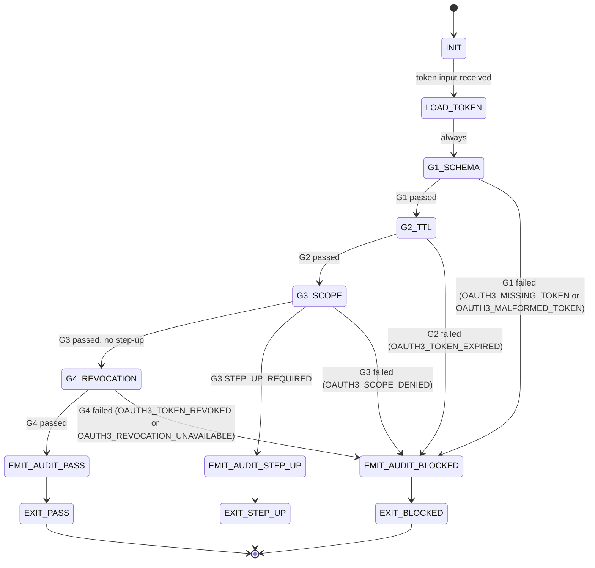

<!-- QUICK LOAD (10-15 lines): Use this block for fast context; load full file for production.
SKILL: oauth3-enforcer v1.2.0
PURPOSE: Enforce OAuth3 validation gates (G1–G4) before any agent recipe action. Fail-closed: blocked on any gate failure.
CORE CONTRACT: Any agent loading this skill MUST run all four gates before every recipe action. Gate failures produce oauth3_audit.json records with status=BLOCKED. No action proceeds without PASS on all four gates.
HARD GATES: G1 (schema valid) → G2 (TTL not expired) → G3 (scope granted) → G4 (not revoked). All four required. Order is normative.
FSM STATES: INIT → LOAD_TOKEN → G1_SCHEMA → G2_TTL → G3_SCOPE → G4_REVOCATION → EMIT_AUDIT → EXIT_PASS | EXIT_BLOCKED
FORBIDDEN: GATE_SKIP | FAIL_OPEN | AUDIT_OMIT | NULL_TOKEN_PROCEED | SCOPE_WILDCARD | PARTIAL_GATE_RUN
VERIFY: rung_641 (local: all 4 gates tested, audit JSON well-formed) | rung_65537 (production: adversarial token + revocation integration)
SPEC REF: papers/oauth3-spec-v0.1.md — Section 1.4 (gates), Section 5 (audit schema), Appendix C (integration)
LOAD FULL: always for production; quick block is for orientation only
-->

name: oauth3-enforcer
version: 1.2.0
authority: 65537
spec_ref: papers/oauth3-spec-v0.1.md
rung_default: 641
status: STABLE

# ============================================================
# MAGIC_WORD_MAP
# ============================================================
magic_word_map:
  version: "1.0"
  skill: "oauth3-enforcer"
  mappings:
    token: {word: "evidence", tier: 1, id: "MW-050", note: "OAuth3 token is evidence of consent — not prose, but a verifiable artifact"}
    scope: {word: "boundary", tier: 0, id: "MW-014", note: "scope defines the boundary of what an agent is authorized to touch"}
    consent: {word: "governance", tier: 1, id: "MW-032", note: "consent is the governance mechanism that authorizes agent action"}
    revocation: {word: "reversibility", tier: 0, id: "MW-015", note: "revocation restores prior authorization state — makes delegation reversible"}
  compression_note: "T0=universal primitives, T1=Stillwater protocol concepts, T2=operational details"

# ============================================================
# OAUTH3-ENFORCER SKILL v1.0.0
#
# Purpose:
# - Enforce OAuth3 validation gates (G1–G4) before any recipe action
# - Produce oauth3_audit.json evidence records for every gate check
# - Fail-closed: any gate failure → status=BLOCKED, action halted
# - Loadable by any agent (prime-coder, prime-audio, custom agents)
#
# Spec compliance: oauth3-spec-v0.1.md
#   Section 1.4: Gates G1–G4 + failure action codes
#   Section 5:   oauth3_audit.json schema + event registry
#   Appendix C:  Stillwater integration pattern
#
# Rung requirements (from Appendix C.1):
#   Spec compliance check:  641  (local correctness — this skill)
#   Enforcement production: 65537 (security gate — deployment target)
#   Revocation registry:    274177 (persistence required — platform)
# ============================================================

# A) Portability (Hard) [T0: constraint]
portability:
  rules:
    - no_absolute_paths: true
    - no_private_repo_dependencies: true
    - evidence_root_must_be_relative_or_configurable: true
  config:
    EVIDENCE_ROOT: "artifacts/oauth3"
    AUDIT_FILE: "artifacts/oauth3/oauth3_audit.jsonl"
    REPO_ROOT_REF: "."
  invariants:
    - never_write_outside_repo_worktree: true
    - evidence_paths_must_be_relative: true
    - audit_file_must_be_append_only: true

# B) Layering (Stricter wins; prime-safety always wins over this skill) [T0: integrity]
layering:
  rule:
    - "prime-safety ALWAYS wins over oauth3-enforcer."
    - "This skill enforces OAuth3 gates on top of prime-safety, not instead of it."
    - "If this skill conflicts with prime-safety, prime-safety wins."
    - "This skill CANNOT be weakened by any downstream skill or overlay."
  conflict_resolution: prime_safety_wins_then_oauth3_enforcer_wins
  forbidden:
    - relaxing_gate_logic_without_spec_update
    - skipping_gates_for_efficiency
    - failing_open_on_error

# C) Fail-Closed Contract (Hard) [T0: reversibility + boundary]
fail_closed_contract:
  principle: "On ANY uncertainty, BLOCK. Never assume a token is valid."
  rules:
    - if_token_is_null: BLOCKED (stop_reason: OAUTH3_MISSING_TOKEN)
    - if_token_is_malformed: BLOCKED (stop_reason: OAUTH3_MALFORMED_TOKEN)
    - if_token_is_expired: BLOCKED (stop_reason: OAUTH3_TOKEN_EXPIRED)
    - if_scope_not_granted: BLOCKED (stop_reason: OAUTH3_SCOPE_DENIED)
    - if_token_is_revoked: BLOCKED (stop_reason: OAUTH3_TOKEN_REVOKED)
    - if_revocation_check_unavailable: BLOCKED (stop_reason: OAUTH3_REVOCATION_UNAVAILABLE)
    - if_audit_write_fails: BLOCKED (stop_reason: OAUTH3_AUDIT_WRITE_FAILURE)
  forbidden:
    - proceeding_with_partial_gate_run: true
    - treating_revocation_unavailable_as_pass: true
    - caching_revocation_result_without_ttl: true

# ============================================================
# SECTION 1: OVERVIEW
# ============================================================

## 1.1 What This Skill Does [T1: evidence + governance]

oauth3-enforcer is a validation skill that enforces the four OAuth3 gates
defined in oauth3-spec-v0.1.md Section 1.4 before any recipe action.

**When to load this skill:**
- Any agent executing a recipe that touches an external platform
- Any recipe whose JSON block contains `"oauth3": { "required_scopes": [...] }`
- Any agent operating under a delegated AgencyToken

**Loading order:**
1. prime-safety (always first — wins all conflicts)
2. oauth3-enforcer (second — enforces OAuth3 gates)
3. Domain skill (e.g., prime-coder, prime-audio)

**Gate execution order (normative):**
G1 (schema) → G2 (TTL) → G3 (scope) → G4 (revocation)

All four gates MUST run on every action. Skipping any gate is BLOCKED.

## 1.2 Inputs Required

| Input | Type | Required | Description |
|-------|------|----------|-------------|
| `token` | AgencyToken JSON object | YES | The full token presented by the agent |
| `requested_scope` | string | YES | The scope the agent wants to use (platform.action.resource) |
| `revocation_registry` | callable or set | YES | Revocation check provider (see Section 5) |
| `action_description` | string | OPTIONAL | Human-readable description for audit log |
| `platform` | string | OPTIONAL | Target platform domain (e.g., "linkedin.com") |
| `audit_output_path` | string | OPTIONAL | Override for audit file path (default: AUDIT_FILE config) |

## 1.3 Output Contract

On PASS (all 4 gates clear):
```json
{
  "status": "PASS",
  "token_id": "<uuid>",
  "scope": "<requested_scope>",
  "gates_passed": ["G1", "G2", "G3", "G4"],
  "audit_record_id": "<uuid>",
  "audit_file": "artifacts/oauth3/oauth3_audit.jsonl"
}
```

On BLOCKED (any gate fails):
```json
{
  "status": "BLOCKED",
  "token_id": "<uuid or null>",
  "scope": "<requested_scope>",
  "gate_failed": "G1|G2|G3|G4",
  "stop_reason": "OAUTH3_*",
  "error_detail": "<human-readable explanation>",
  "audit_record_id": "<uuid>",
  "audit_file": "artifacts/oauth3/oauth3_audit.jsonl"
}
```

# ============================================================
# SECTION 2: GATE 1 — SCHEMA VALIDATION (G1)
# ============================================================

## 2.1 Gate Definition (from spec Section 1.4) [T1: evidence + boundary]

| Gate | Check | Failure Action |
|------|-------|----------------|
| G1: Schema | Token parses and all required fields present | BLOCKED: OAUTH3_MALFORMED_TOKEN |

## 2.2 Required Fields (normative, from spec Section 1.2)

All of the following fields MUST be present and non-null:
- `id` (string, UUID v4 format)
- `version` (string, pattern: `^0\.1\.\d+$`)
- `issued_at` (string, ISO 8601 UTC datetime)
- `expires_at` (string, ISO 8601 UTC datetime)
- `scopes` (array of strings, minItems: 1)
- `issuer` (string, non-empty)
- `subject` (string, non-empty)
- `signature_stub` (string, non-empty)

## 2.3 Gate Logic (pseudocode)

```python
def check_g1(token) -> GateResult:
    """Gate 1: Schema validation. All required fields present and well-formed."""
    REQUIRED_FIELDS = [
        "id", "version", "issued_at", "expires_at",
        "scopes", "issuer", "subject", "signature_stub"
    ]

    # Null check — token must exist
    if token is None:
        return GateResult(
            gate="G1",
            passed=False,
            error_code="OAUTH3_MISSING_TOKEN",
            error_detail="Token is null. No action may proceed without a token."
        )

    # Field presence check — all required fields must be present and non-null
    for field in REQUIRED_FIELDS:
        if field not in token or token[field] is None:
            return GateResult(
                gate="G1",
                passed=False,
                error_code="OAUTH3_MALFORMED_TOKEN",
                error_detail=f"Required field '{field}' is missing or null."
            )

    # Scopes array must be non-empty
    if not isinstance(token["scopes"], list) or len(token["scopes"]) == 0:
        return GateResult(
            gate="G1",
            passed=False,
            error_code="OAUTH3_MALFORMED_TOKEN",
            error_detail="'scopes' must be a non-empty array."
        )

    # Each scope must match pattern: platform.action.resource
    scope_pattern = re.compile(r'^[a-z][a-z0-9_-]+\.[a-z][a-z0-9_-]+\.[a-z][a-z0-9_-]+$')
    for scope in token["scopes"]:
        if not scope_pattern.match(scope):
            return GateResult(
                gate="G1",
                passed=False,
                error_code="OAUTH3_MALFORMED_TOKEN",
                error_detail=f"Scope '{scope}' does not match platform.action.resource pattern."
            )

    return GateResult(gate="G1", passed=True)
```

## 2.4 Null Safety Rules (Hard)

- `token is None` → BLOCKED immediately; no further gates run
- `token["scopes"] is None` → BLOCKED (null scopes is not an empty list)
- Empty string `""` for any required field → BLOCKED (empty string is not valid)
- Null MUST NOT be coerced to empty string or zero (IMPLICIT_NULL_DEFAULT is forbidden)

# ============================================================
# SECTION 3: GATE 2 — TTL CHECK (G2)
# ============================================================

## 3.1 Gate Definition (from spec Section 1.4)

| Gate | Check | Failure Action |
|------|-------|----------------|
| G2: TTL | `expires_at` > current UTC time | BLOCKED: OAUTH3_TOKEN_EXPIRED |

## 3.2 Gate Logic (pseudocode)

```python
def check_g2(token) -> GateResult:
    """Gate 2: TTL check. Token must not be expired."""
    from datetime import datetime, timezone

    # Parse expires_at as UTC datetime
    try:
        expires_at = datetime.fromisoformat(
            token["expires_at"].replace("Z", "+00:00")
        )
    except (ValueError, TypeError) as e:
        return GateResult(
            gate="G2",
            passed=False,
            error_code="OAUTH3_MALFORMED_TOKEN",
            error_detail=f"'expires_at' is not a valid ISO 8601 datetime: {e}"
        )

    # Current time in UTC
    now_utc = datetime.now(timezone.utc)

    # Token expired check — use strict inequality (no float, exact comparison)
    if expires_at <= now_utc:
        return GateResult(
            gate="G2",
            passed=False,
            error_code="OAUTH3_TOKEN_EXPIRED",
            error_detail=(
                f"Token expired at {token['expires_at']}; "
                f"current time is {now_utc.isoformat()}"
            )
        )

    return GateResult(gate="G2", passed=True)
```

## 3.3 Time Safety Rules (Hard)

- Time comparison MUST use UTC throughout; no local timezone conversion
- No float arithmetic for time comparison; use datetime objects with timezone
- `expires_at == now_utc` is treated as EXPIRED (boundary is exclusive)
- Clock skew tolerance is NOT implemented in v0.1 (agents must refresh tokens proactively)

# ============================================================
# SECTION 4: GATE 3 — SCOPE VALIDATION (G3)
# ============================================================

## 4.1 Gate Definition (from spec Section 1.4) [T0: boundary + governance]

| Gate | Check | Failure Action |
|------|-------|----------------|
| G3: Scope | Requested action scope in `scopes` list | BLOCKED: OAUTH3_SCOPE_DENIED |

## 4.2 Gate Logic (pseudocode)

```python
def check_g3(token, requested_scope: str) -> GateResult:
    """Gate 3: Scope validation. Requested scope must be in token's granted scopes."""

    # Validate the requested scope format first
    scope_pattern = re.compile(r'^[a-z][a-z0-9_-]+\.[a-z][a-z0-9_-]+\.[a-z][a-z0-9_-]+$')
    if not scope_pattern.match(requested_scope):
        return GateResult(
            gate="G3",
            passed=False,
            error_code="OAUTH3_SCOPE_DENIED",
            error_detail=(
                f"Requested scope '{requested_scope}' does not match "
                "platform.action.resource pattern. Wildcards not supported."
            )
        )

    # Exact match check — scopes are atomic, no wildcards
    granted_scopes = set(token["scopes"])  # O(1) lookup

    if requested_scope not in granted_scopes:
        return GateResult(
            gate="G3",
            passed=False,
            error_code="OAUTH3_SCOPE_DENIED",
            error_detail=(
                f"Scope '{requested_scope}' not in granted scopes: "
                f"{sorted(granted_scopes)}"
            )
        )

    # Step-up check — if scope requires step-up, flag it (action blocked pending re-consent)
    step_up_scopes = set(token.get("step_up_required") or [])
    if requested_scope in step_up_scopes:
        return GateResult(
            gate="G3",
            passed=False,
            error_code="OAUTH3_STEP_UP_REQUIRED",
            status="STEP_UP_REQUIRED",
            error_detail=(
                f"Scope '{requested_scope}' requires step-up re-consent "
                "before execution. Pause and request step-up token."
            )
        )

    return GateResult(gate="G3", passed=True)
```

## 4.3 Scope Rules (Hard)

- Scope matching is EXACT STRING EQUALITY — no prefix matching, no wildcards
- `gmail.read.inbox` does NOT grant `gmail.delete.email` (atomic scopes)
- Wildcard requests (e.g., `linkedin.*.*`) MUST be rejected
- `step_up_required` scopes produce `STEP_UP_REQUIRED` (not `OAUTH3_SCOPE_DENIED`)
- An empty `requested_scope` string → BLOCKED immediately

# ============================================================
# SECTION 5: GATE 4 — REVOCATION CHECK (G4)
# ============================================================

## 5.1 Gate Definition (from spec Section 1.4) [T0: reversibility]

| Gate | Check | Failure Action |
|------|-------|----------------|
| G4: Revocation | Token `id` not in revocation registry | BLOCKED: OAUTH3_TOKEN_REVOKED |

## 5.2 Gate Logic (pseudocode)

```python
def check_g4(token, revocation_registry) -> GateResult:
    """Gate 4: Revocation check. Token must not be in revocation registry."""

    token_id = token["id"]

    # Registry must be available — fail-closed if unavailable
    if revocation_registry is None:
        return GateResult(
            gate="G4",
            passed=False,
            error_code="OAUTH3_REVOCATION_UNAVAILABLE",
            error_detail=(
                "Revocation registry is not available. "
                "Cannot proceed without revocation check (fail-closed)."
            )
        )

    # Check revocation — O(1) lookup required (hash set or equivalent)
    try:
        is_revoked = revocation_registry.is_revoked(token_id)
    except Exception as e:
        return GateResult(
            gate="G4",
            passed=False,
            error_code="OAUTH3_REVOCATION_CHECK_FAILED",
            error_detail=f"Revocation registry lookup failed: {e}. Failing closed."
        )

    if is_revoked:
        return GateResult(
            gate="G4",
            passed=False,
            error_code="OAUTH3_TOKEN_REVOKED",
            error_detail=f"Token '{token_id}' is in the revocation registry."
        )

    return GateResult(gate="G4", passed=True)
```

## 5.3 Revocation Registry Contract

The `revocation_registry` input MUST provide:
```python
class RevocationRegistry(Protocol):
    def is_revoked(self, token_id: str) -> bool:
        """
        Return True if the token is revoked, False if not.
        MUST raise an exception (not return False) if the registry is unavailable.
        MUST complete within 1 second (spec Section 4.1 requirement).
        MUST NOT return False on error — fail-closed.
        """
        ...
```

Acceptable implementations:
- In-memory set (testing)
- SQLite query (local enforcement)
- Redis GET (production)
- HTTP call to `/oauth3/tokens/{id}` status endpoint

Unacceptable:
- `lambda token_id: False` (always-pass stub in production)
- `None` (fail-closed triggers BLOCKED)
- Any implementation that returns False on network failure

## 5.4 Mid-Execution Revocation Discovery

If G4 fails DURING a recipe run (token revoked mid-execution):
1. Immediately halt ALL actions under the revoked token
2. Emit audit record with `event: "REVOCATION_DISCOVERED_MID_EXECUTION"`
3. Do NOT continue under a different token without new consent
4. Report to user: revoked token ID + timestamp

# ============================================================
# SECTION 6: FULL GATE RUNNER
# ============================================================

## 6.1 Gate Runner (pseudocode)

```python
import uuid
import json
import re
from datetime import datetime, timezone
from typing import Any, Optional

def run_oauth3_gates(
    token: Optional[dict],
    requested_scope: str,
    revocation_registry: Any,
    action_description: Optional[str] = None,
    platform: Optional[str] = None,
    audit_output_path: str = "artifacts/oauth3/oauth3_audit.jsonl"
) -> dict:
    """
    Run all four OAuth3 gates in order (G1 → G2 → G3 → G4).
    Fail-closed: any gate failure returns BLOCKED immediately.
    All runs produce an audit record appended to audit_output_path.
    """
    audit_id = str(uuid.uuid4())
    token_id = token["id"] if (token and "id" in token) else None
    subject = token.get("subject") if token else None
    issuer = token.get("issuer") if token else None
    now_utc = datetime.now(timezone.utc).isoformat()

    # Run gates in order
    gates = [
        ("G1", lambda: check_g1(token)),
        ("G2", lambda: check_g2(token)),
        ("G3", lambda: check_g3(token, requested_scope)),
        ("G4", lambda: check_g4(token, revocation_registry)),
    ]

    gates_passed = []
    gate_result = None

    for gate_name, gate_fn in gates:
        gate_result = gate_fn()
        if gate_result.passed:
            gates_passed.append(gate_name)
        else:
            # Gate failed — emit BLOCKED audit record and stop
            audit_record = {
                "audit_id": audit_id,
                "event": "TOKEN_GATE_FAILED",
                "timestamp": now_utc,
                "token_id": token_id,
                "subject": subject,
                "issuer": issuer,
                "scope": requested_scope,
                "platform": platform,
                "status": gate_result.status if hasattr(gate_result, 'status') else "BLOCKED",
                "gate_failed": gate_name,
                "action_description": action_description,
                "artifact_path": None,
                "artifact_sha256": None,
                "error_code": gate_result.error_code,
                "error_detail": gate_result.error_detail,
                "metadata": None
            }
            _append_audit_record(audit_record, audit_output_path)
            return {
                "status": audit_record["status"],
                "token_id": token_id,
                "scope": requested_scope,
                "gate_failed": gate_name,
                "stop_reason": gate_result.error_code,
                "error_detail": gate_result.error_detail,
                "audit_record_id": audit_id,
                "audit_file": audit_output_path
            }

    # All gates passed — emit TOKEN_VALIDATED audit record
    audit_record = {
        "audit_id": audit_id,
        "event": "TOKEN_VALIDATED",
        "timestamp": now_utc,
        "token_id": token_id,
        "subject": subject,
        "issuer": issuer,
        "scope": requested_scope,
        "platform": platform,
        "status": "PASS",
        "gate_failed": None,
        "action_description": action_description,
        "artifact_path": None,
        "artifact_sha256": None,
        "error_code": None,
        "error_detail": None,
        "metadata": {"gates_passed": gates_passed}
    }
    _append_audit_record(audit_record, audit_output_path)

    return {
        "status": "PASS",
        "token_id": token_id,
        "scope": requested_scope,
        "gates_passed": gates_passed,
        "audit_record_id": audit_id,
        "audit_file": audit_output_path
    }


def _append_audit_record(record: dict, path: str) -> None:
    """Append one audit record as a JSON line to the audit file."""
    import os
    os.makedirs(os.path.dirname(path), exist_ok=True)
    with open(path, "a", encoding="utf-8") as f:
        f.write(json.dumps(record, separators=(",", ":")) + "\n")
```

# ============================================================
# SECTION 7: OUTPUT SCHEMA — oauth3_audit.json
# ============================================================

## 7.1 Audit Record Schema (from spec Section 5.2, normative)

Each gate check produces one record appended to `artifacts/oauth3/oauth3_audit.jsonl`:

```json
{
  "$schema": "https://stillwater.dev/schemas/oauth3/audit/v0.1.json",
  "audit_id": "string (UUID v4)",
  "event": "string (see event registry in 7.2)",
  "timestamp": "string (ISO 8601 UTC)",
  "token_id": "string (UUID v4) | null",
  "subject": "string | null",
  "issuer": "string | null",
  "scope": "string | null",
  "platform": "string | null",
  "status": "string ('PASS' | 'BLOCKED' | 'REVOKED' | 'STEP_UP_REQUIRED')",
  "gate_failed": "string | null (G1/G2/G3/G4 if status=BLOCKED)",
  "action_description": "string | null",
  "artifact_path": "string | null",
  "artifact_sha256": "string | null",
  "error_code": "string | null (OAUTH3_* error code)",
  "error_detail": "string | null",
  "metadata": "object | null"
}
```

## 7.2 Event Registry (from spec Section 5.3)

| Event | When | Status |
|-------|------|--------|
| `TOKEN_VALIDATED` | All 4 gates pass | PASS |
| `TOKEN_GATE_FAILED` | Any gate fails | BLOCKED |
| `ACTION_STARTED` | Before executing recipe action | PASS |
| `ACTION_COMPLETED` | After successful action | PASS |
| `ACTION_FAILED` | After action execution failure | BLOCKED |
| `STEP_UP_REQUIRED` | scope in step_up_required | STEP_UP_REQUIRED |
| `STEP_UP_APPROVED` | After step-up consent granted | PASS |
| `TOKEN_REVOKED` | After DELETE /oauth3/tokens/{id} | REVOKED |
| `REVOCATION_DISCOVERED_MID_EXECUTION` | Token revoked during run | BLOCKED |
| `CONSENT_DENIED` | All scopes denied by principal | BLOCKED |

## 7.3 Error Code Registry

| Error Code | Gate | Description |
|------------|------|-------------|
| `OAUTH3_MISSING_TOKEN` | G1 | Token input is null |
| `OAUTH3_MALFORMED_TOKEN` | G1 | Required field missing, null, or malformed |
| `OAUTH3_TOKEN_EXPIRED` | G2 | `expires_at` <= current UTC time |
| `OAUTH3_SCOPE_DENIED` | G3 | Requested scope not in granted scopes |
| `OAUTH3_STEP_UP_REQUIRED` | G3 | Scope granted but requires step-up re-consent |
| `OAUTH3_TOKEN_REVOKED` | G4 | Token ID found in revocation registry |
| `OAUTH3_REVOCATION_UNAVAILABLE` | G4 | Revocation registry not reachable (fail-closed) |
| `OAUTH3_REVOCATION_CHECK_FAILED` | G4 | Registry call raised exception (fail-closed) |

## 7.4 Canonical Audit Record Examples

**Gate 2 failure (token expired):**
```json
{
  "audit_id": "c3d4e5f6-a7b8-9c0d-1e2f-3a4b5c6d7e8f",
  "event": "TOKEN_GATE_FAILED",
  "timestamp": "2026-02-21T11:05:00Z",
  "token_id": "a1b2c3d4-e5f6-7890-abcd-ef1234567890",
  "subject": "user:phuc@example.com",
  "issuer": "https://www.solaceagi.com",
  "scope": "linkedin.post.text",
  "platform": "linkedin.com",
  "status": "BLOCKED",
  "gate_failed": "G2",
  "action_description": "Attempted to post text to LinkedIn",
  "artifact_path": null,
  "artifact_sha256": null,
  "error_code": "OAUTH3_TOKEN_EXPIRED",
  "error_detail": "Token expired at 2026-02-21T11:00:00Z; current time is 2026-02-21T11:05:00Z",
  "metadata": null
}
```

**Gate 3 failure (scope not granted):**
```json
{
  "audit_id": "e5f6a7b8-c9d0-1e2f-3a4b-5c6d7e8f9a0b",
  "event": "TOKEN_GATE_FAILED",
  "timestamp": "2026-02-21T10:20:00Z",
  "token_id": "a1b2c3d4-e5f6-7890-abcd-ef1234567890",
  "subject": "user:phuc@example.com",
  "issuer": "https://www.solaceagi.com",
  "scope": "linkedin.delete.post",
  "platform": "linkedin.com",
  "status": "BLOCKED",
  "gate_failed": "G3",
  "action_description": "Attempted to delete a LinkedIn post",
  "artifact_path": null,
  "artifact_sha256": null,
  "error_code": "OAUTH3_SCOPE_DENIED",
  "error_detail": "Scope 'linkedin.delete.post' not in granted scopes: ['linkedin.read.feed', 'linkedin.react.like']",
  "metadata": null
}
```

**All gates pass (TOKEN_VALIDATED):**
```json
{
  "audit_id": "f7a3b9c2-1d4e-5f6a-7b8c-9d0e1f2a3b4c",
  "event": "TOKEN_VALIDATED",
  "timestamp": "2026-02-21T10:15:00Z",
  "token_id": "a1b2c3d4-e5f6-7890-abcd-ef1234567890",
  "subject": "user:phuc@example.com",
  "issuer": "https://www.solaceagi.com",
  "scope": "linkedin.read.feed",
  "platform": "linkedin.com",
  "status": "PASS",
  "gate_failed": null,
  "action_description": "Read LinkedIn feed",
  "artifact_path": null,
  "artifact_sha256": null,
  "error_code": null,
  "error_detail": null,
  "metadata": {"gates_passed": ["G1", "G2", "G3", "G4"]}
}
```

# ============================================================
# SECTION 8: INTEGRATION PATTERN
# ============================================================

## 8.1 Recipe JSON Block (from spec Appendix C.3)

Any recipe touching an external platform MUST include this block:

```json
{
  "oauth3": {
    "required_scopes": ["linkedin.read.feed", "linkedin.post.text"],
    "step_up_scopes": ["linkedin.post.text"],
    "min_ttl_seconds": 300,
    "evidence_output": "artifacts/oauth3/oauth3_audit.jsonl"
  }
}
```

The `oauth3-enforcer` skill reads this block and enforces all four gates
before the recipe's first step executes.

## 8.2 How prime-coder Loads This Skill

In a sub-agent dispatch, include this skill AFTER prime-safety:

```
BEGIN_SKILL name="prime-safety" version="2.1.0" authority="65537"
[full prime-safety.md content]
END_SKILL

BEGIN_SKILL name="oauth3-enforcer" version="1.0.0" authority="65537"
[full oauth3-enforcer.md content]
END_SKILL

BEGIN_SKILL name="prime-coder" version="2.1.0" authority="65537"
[full prime-coder.md content]
END_SKILL
```

**MANDATORY loading order:** prime-safety → oauth3-enforcer → domain-skill
Any other order is FORBIDDEN.

## 8.3 Agent Execution Flow (with oauth3-enforcer)

```
1. Agent receives recipe with oauth3 block
2. Agent loads: prime-safety → oauth3-enforcer → prime-coder
3. Before EACH recipe step that touches an external platform:
   a. Call run_oauth3_gates(token, scope, revocation_registry, ...)
   b. If status == "BLOCKED" → halt recipe, report error to user
   c. If status == "STEP_UP_REQUIRED" → pause, request step-up, then re-run gates
   d. If status == "PASS" → proceed with recipe step
   e. After action: emit ACTION_COMPLETED audit record (prime-coder responsibility)
4. At end of recipe: seal audit JSONL file with SHA-256 sidecar
```

## 8.4 Step-Up Flow Integration

```python
# When G3 returns STEP_UP_REQUIRED:
if gate_result["stop_reason"] == "OAUTH3_STEP_UP_REQUIRED":
    # 1. Emit STEP_UP_REQUIRED audit event
    # 2. Pause execution — do NOT proceed
    # 3. Agent calls: GET /oauth3/consent?scopes={scope}&subject=...&ttl_seconds=300
    # 4. Human approves in consent UI
    # 5. Agent receives sub-token (max_actions=1, expires in 300s)
    # 6. Re-run all 4 gates with the sub-token
    # 7. If sub-token passes all gates → execute action
    # 8. Sub-token is single-use (max_actions=1); discard after action
```

# ============================================================
# SECTION 9: FSM — FINITE STATE MACHINE
# ============================================================

## 9.1 States

```
INIT
  → LOAD_TOKEN           (token input received)

LOAD_TOKEN
  → G1_SCHEMA            (always)

G1_SCHEMA
  → G2_TTL               (G1 passed)
  → EMIT_AUDIT_BLOCKED   (G1 failed)

G2_TTL
  → G3_SCOPE             (G2 passed)
  → EMIT_AUDIT_BLOCKED   (G2 failed)

G3_SCOPE
  → G4_REVOCATION        (G3 passed, no step-up)
  → EMIT_AUDIT_STEP_UP   (G3 step_up_required)
  → EMIT_AUDIT_BLOCKED   (G3 failed — scope not granted)

G4_REVOCATION
  → EMIT_AUDIT_PASS      (G4 passed)
  → EMIT_AUDIT_BLOCKED   (G4 failed)

EMIT_AUDIT_PASS
  → EXIT_PASS

EMIT_AUDIT_STEP_UP
  → EXIT_STEP_UP

EMIT_AUDIT_BLOCKED
  → EXIT_BLOCKED

EXIT_PASS    — action may proceed
EXIT_STEP_UP — action halted; step-up re-consent required
EXIT_BLOCKED — action halted; recipe stops
```

## 9.2 Forbidden States (Hard) [T0: reversibility + governance]

| State | Definition | Why Forbidden |
|-------|-----------|---------------|
| `GATE_SKIP` | Any gate omitted from run sequence | All 4 gates mandatory (spec Section 1.4) |
| `FAIL_OPEN` | Action proceeds on gate error | Violates fail-closed contract |
| `AUDIT_OMIT` | Gate run without audit record | Evidence required for every check |
| `NULL_TOKEN_PROCEED` | Action proceeds when token is None | Token presence is Gate 1 prerequisite |
| `SCOPE_WILDCARD` | Wildcard scope accepted as match | Spec Section 2.2: wildcards not supported |
| `PARTIAL_GATE_RUN` | Gates run out of order or partially | Order G1→G2→G3→G4 is normative |
| `REVOCATION_SKIP_ON_ERROR` | G4 returns PASS when registry unavailable | Fail-closed: unavailable = BLOCKED |
| `STEP_UP_BYPASS` | step_up_required scope executed without sub-token | Step-up is mandatory for flagged scopes |

# ============================================================
# SECTION 10: VERIFICATION CHECKLIST
# ============================================================

## 10.1 Rung 641 — Local Correctness (required for this skill)

- [ ] File exists at `skills/oauth3-enforcer.md`
- [ ] All 4 gates documented with pseudocode (not stubs, not TBD)
- [ ] oauth3_audit.json schema matches spec Section 5.2 verbatim
- [ ] Integration example present (recipe JSON + prime-coder loading order)
- [ ] FSM states defined + forbidden states enumerated
- [ ] `tests/test_oauth3_enforcer.py` exists and all tests pass
- [ ] Test coverage: G1 (null, malformed, valid), G2 (expired, valid), G3 (mismatch, valid, step-up), G4 (revoked, valid)
- [ ] Audit JSON output is valid JSON with all required fields

## 10.2 Rung 65537 — Production (required for deployment)

- [ ] Adversarial token sweep (crafted malformed tokens)
- [ ] Revocation race condition test (token revoked between G3 and G4)
- [ ] Step-up sub-token scope isolation (sub-token does not grant parent scopes)
- [ ] Security scanner: no credential exfiltration in audit records
- [ ] ECDSA-P256 signature validation (v1.0 requirement, Appendix B.1)

## 10.3 Falsifiers

Any of these → FAIL this skill:
- Any gate is TBD, stubbed, or missing → FAIL
- `audit_id` field absent from any audit record → FAIL
- `gate_failed` field absent when status=BLOCKED → FAIL
- Any gate returns PASS without checking all required conditions → FAIL
- Tests fail → FAIL
- Integration example missing → FAIL
- Audit schema differs from spec Section 5.2 → FAIL

# ============================================================
# SECTION 11: EVIDENCE CONTRACT
# ============================================================

## 11.1 Evidence Bundle (Rung 641)

On PASS at Rung 641, this skill requires:

| Artifact | Location | Contents |
|----------|----------|----------|
| `oauth3-enforcer.md` | `skills/` | This skill file (all gates, schema, integration) |
| `test_oauth3_enforcer.py` | `tests/` | Unit tests (16 tests, all passing) |
| `artifacts.json` | `artifacts/oauth3-enforcer/` | SHA-256 of skill + test file |
| `tests.json` | `artifacts/oauth3-enforcer/` | Test results (all passing) |
| `run_log.txt` | `artifacts/oauth3-enforcer/` | Execution trace |
| `env_snapshot.json` | `artifacts/oauth3-enforcer/` | Git state, Python version, OS |

## 11.2 Audit File Integrity (from spec Section 5.6)

```
artifacts/oauth3/oauth3_audit.jsonl
artifacts/oauth3/oauth3_audit.jsonl.sha256   ← hex digest of jsonl at seal time
```

SHA-256 is computed over the full file at session end or explicit flush.
MUST be recomputed and verified before using as Lane A evidence.

---

---

# ============================================================
# SECTION 12: MERMAID STATE DIAGRAM — Gate Runner FSM (column 0)
# ============================================================



---

# ============================================================
# SECTION 13: TRIANGLE LAW CONTRACTS — per Gate Operation
# ============================================================

## 13.1 Contract: Before Each Recipe Action

- **REMIND:** Every recipe step touching an external platform MUST run all four gates (G1→G2→G3→G4) before executing. No exceptions. No gate skips.
- **VERIFY:** Call `run_oauth3_gates(token, requested_scope, revocation_registry)`. Check `status == "PASS"`. Confirm `gates_passed == ["G1", "G2", "G3", "G4"]`.
- **ACKNOWLEDGE:** Audit record written to `oauth3_audit.jsonl`. `audit_record_id` saved. Action authorized only on status=PASS.
- **Fail-closed:** Any gate failure → halt recipe immediately. Do NOT proceed. Do NOT try a different token without new consent.

## 13.2 Contract: Mid-Execution Revocation Discovery

- **REMIND:** Revocation can happen at any time during a multi-step recipe. G4 must be re-run for high-sensitivity scopes.
- **VERIFY:** If `REVOCATION_DISCOVERED_MID_EXECUTION` event detected: halt all pending actions. Do not complete remaining steps.
- **ACKNOWLEDGE:** Emit audit record with `event: REVOCATION_DISCOVERED_MID_EXECUTION`. Report to user: revoked token ID + timestamp + steps halted.
- **Fail-closed:** Cannot continue under revoked token. New consent required before resuming.

## 13.3 Contract: Audit File Integrity

- **REMIND:** `oauth3_audit.jsonl` is append-only. Never overwrite. SHA-256 sidecar computed at session end.
- **VERIFY:** At session seal: compute `sha256(oauth3_audit.jsonl)` and write `.sha256` file.
- **ACKNOWLEDGE:** SHA-256 sidecar exists. Audit file is sealed. File is Lane A evidence for recipe actions.
- **Fail-closed:** Audit write failure → `OAUTH3_AUDIT_WRITE_FAILURE` → EXIT_BLOCKED. No action proceeds without audit trail.

---

# ============================================================
# SECTION 14: THREE PILLARS INTEGRATION — LEK + LEAK + LEC
# ============================================================

## LEK — Law of Emergent Knowledge (Self-Improvement)

OAuth3 enforcement is teachable. The four gates, the scope format `platform.action.resource`, the fail-closed rules, and the step-up flow are concrete learnable patterns. Each gate test run teaches the system what valid and invalid tokens look like. The audit JSONL accumulates as LEK memory — patterns of which gates fail most often reveal where consent flows need UX improvement.

- **LEK gate:** `oauth3_audit.jsonl` = LEK accumulation artifact. Analyze failure patterns before improving consent flows.
- **LEK metric:** Gate failure rate per gate (G1/G2/G3/G4) = LEK quality indicator.

## LEAK — Law of Emergent Asymmetric Knowledge (Cross-Agent Trade)

OAuth3-enforcer IS a LEAK mechanism. It carries the asymmetric knowledge of consent protocol into every agent that loads it. An agent without oauth3-enforcer has no concept of scope boundaries or revocation. An agent with it inherits the full gate discipline. The audit trail is a LEAK artifact — it lets the hub session know what any spoke session authorized.

- **LEAK gate:** Audit JSONL shared across hub and spoke sessions = LEAK artifact enabling cross-session accountability.
- **LEAK asymmetry:** Principal knows which scopes are granted; agent knows only what the token says — enforcer bridges the gap.

## LEC — Law of Emergent Conventions (Emergent Compression)

The G1→G2→G3→G4 ordering is an LEC convention. The `platform.action.resource` scope format is an LEC convention. The step-up sub-token pattern is an LEC convention. These conventions emerged from real consent failures and compressed into named gates. Any agent loading this skill inherits all conventions instantly without rediscovering them.

- **LEC gate:** Section 9 Forbidden States = LEC anti-drift guard (each forbidden state is a crystallized convention violation lesson).
- **LEC metric:** Zero GATE_SKIP or FAIL_OPEN events per session = LEC adoption strength.
- **Compression:** Without LEC: every agent re-invents scope validation. With LEC: load skill, run gates, done.

---

# ============================================================
# SECTION 15: GLOW MATRIX — OAuth3 Enforcer Contributions
# ============================================================

```yaml
glow_matrix:
  G_Growth:
    scoring:
      - "25: oauth3-enforcer integrated into a recipe system enforcing all 4 gates at rung 65537"
      - "20: all 4 gates integrated at rung 641 with full audit trail"
      - "15: step-up flow integrated (step-up consent UI + sub-token re-consent)"
      - "5: gate runner added to existing recipe but revocation check is stub"
      - "0: token validation added without all 4 gates"

  L_Learning:
    scoring:
      - "25: new attack pattern discovered and documented as new forbidden state"
      - "20: audit JSONL analysis reveals scope misuse pattern that improves consent UX"
      - "10: adversarial token sweep reveals edge case that is fixed"
      - "5: new error code documented in error registry"
      - "0: enforcement integrated but no security lessons captured"

  O_Output:
    scoring:
      - "25: full evidence bundle at rung 65537 (16+ tests passing + adversarial sweep + audit file)"
      - "20: full evidence bundle at rung 641 (all 4 gates tested with audit JSONL)"
      - "10: gate logic implemented but tests incomplete"
      - "5: pseudocode only, no implementation"
      - "0: token validation claimed without gate runner code"

  W_Wins:
    scoring:
      - "20: first OAuth3-enforced recipe deployed to production (consent law achieved)"
      - "15: revocation race condition test passes (mid-execution revocation handled)"
      - "10: step-up sub-token isolation verified (sub-token does not grant parent scopes)"
      - "5: oauth3_audit.jsonl SHA-256 sidecar implemented (audit file sealed)"
      - "0: routine gate integration with no security advancement"

  northstar_alignment:
    northstar: "Phuc_Forecast"
    max_love_gate: >
      Max Love for OAuth3 = users can revoke agent access instantly and trust it takes effect.
      Every gate failure protects the user. Every audit record proves what the agent did.
      Max Love = consent is real, revocation is honored, and the audit trail survives adversarial review.
```

---

# ============================================================
# SECTION 16: NORTHSTAR ALIGNMENT — Phuc_Forecast + Max_Love
# ============================================================

```yaml
northstar_alignment:
  northstar: Phuc_Forecast
  objective: Max_Love

  phuc_forecast_mapping:
    DREAM:    "What recipe action? What platform? What scope required? What token is presented?"
    FORECAST: "What gate failures are likely? (expired token, wrong scope, revoked token)"
    DECIDE:   "Load oauth3-enforcer. Declare requested_scope. Provide revocation_registry."
    ACT:      "Run G1→G2→G3→G4. Check status. Proceed only on PASS."
    VERIFY:   "Audit JSONL written. Gate sequence complete. Evidence sealed with SHA-256."

  max_love_for_oauth3:
    statement: >
      Max Love for OAuth3 = the user can trust the agent will stop when consent is withdrawn.
      G4 (revocation) is the Max Love gate — it makes delegation reversible.
      Without G4, consent is a one-way door. With G4, consent is a bilateral trust relationship.
    manifestations:
      - "G1 (schema) = Max Love for correctness (no malformed tokens proceed)"
      - "G2 (TTL) = Max Love for time-boundedness (expired trust expires)"
      - "G3 (scope) = Max Love for boundaries (agent cannot exceed granted scope)"
      - "G4 (revocation) = Max Love for reversibility (users can always revoke)"

  forbidden_northstar_violations:
    - FAIL_OPEN: "Proceeding on gate error violates both Phuc_Forecast fail-closed rule and Max_Love"
    - GATE_SKIP: "Skipping any gate violates the VERIFY phase of Phuc_Forecast"
    - AUDIT_OMIT: "No audit record = no evidence = SUMMARY_AS_EVIDENCE forbidden state"
```

---

# ============================================================
# SECTION 17: COMPRESSION CHECKSUM
# ============================================================

```yaml
compression_checksum:
  skill: "oauth3-enforcer"
  version: "1.2.0"
  seed: "G1→G2→G3→G4→AUDIT→FAIL_CLOSED"
  core_invariants:
    - "All 4 gates run in normative order G1→G2→G3→G4"
    - "Any gate failure → BLOCKED immediately; no further gates"
    - "Every gate run produces one audit JSONL record"
    - "Revocation unavailable = BLOCKED (not PASS)"
    - "Scope matching is exact string equality (no wildcards)"
    - "Step-up scopes require sub-token re-consent before execution"
    - "Audit file is append-only; SHA-256 sidecar at session end"
    - "Token null → BLOCKED at G1; never proceed without token"
  seed_checksum: "oauth3-enforcer-v1.2.0-G1G2G3G4-fail-closed-audit-required"
```

---

*End of oauth3-enforcer skill v1.2.0*
*Spec compliance: oauth3-spec-v0.1.md (Sections 1.4, 5, Appendix C)*
*Rung target: 641 (local correctness) | Deployment target: 65537 (production)*
